目标：

- 了解vuex的应用场景
- 掌握vuex的基本使用
- 会用vuex实现vue跨组件之间数据共享

## 复习-组件之间相互通信及数据共享

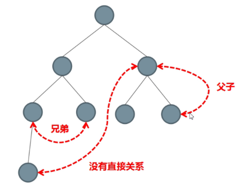

组件之间共享状态的两种典型方式：

- 父子之间 : props + $emit

  - 父传子：props属性绑定

    ```
    <son1 msg="msg"></son1>
    ```

  - 子传父：$emit事件绑定

    ```
    <div>
    	<button @click="$emit('event-name')">通知父组件</button>
    </div>
    ```

- 非父子之间：EventBus(事件总线)

  - $on

  - $emit

    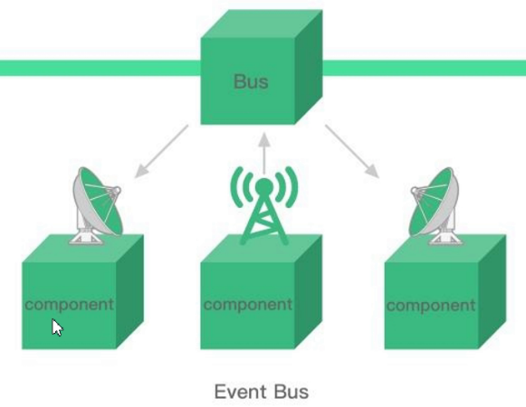


## Vuex概述

作用：多组件间共享响应式数据

要点：

- 它是独立于组件体系而单独存在的，所有的组件都可以把它第三方来操作数据。

- vuex是vue的一个插件（类似于：vue-router也是一个插件）。
- vuex也集成到 Vue 的官方调试工具 [devtools extension](https://github.com/vuejs/vue-devtools)

## 使用步骤

引入vuex

定义store，并注入vue实例

在任意组件中使用（操作）数据

- 获取数据：把vuex中的数据取到组件内来使用

  有两种方式：

  - 方式一：直接使用
  - 方式二：映射使用

- 修改数据：在组件内修改vuex中的数据

  有两种方式：

  - 方式一：commit
  - 方式二：映射使用

## 示例1

引入vuex

```
<script src="https://cdn.jsdelivr.net/npm/vue/dist/vue.js"></script>
<script src="https://unpkg.com/vuex@3.6.0/dist/vuex.js"></script>
```

定义store，并注入vue实例

```javascript
Vue.use(Vuex)
const store = new Vuex.Store({
  state: {
    num: 100
  }
})
new Vue({
  el: "#app",
  store
})
```


在任意组件的内部（无论嵌套级别），可以直接通过vue实例中的$store来访问。

格式：

`this.$store.state.数据名称` 

 示例：

```javascript
# 获取：在代码中：
this.$store.state.count

# 获取：在视图中，可以省略this.
{{$store.state.count}}
```


在任意组件中使用数据，观察调试工具，体验响应式效果


### 完整代码

```html
<!DOCTYPE html>
<html lang="en">
<head>
  <meta charset="UTF-8">
  <meta name="viewport" content="width=device-width, initial-scale=1.0">
  <title>Document</title>
  <head>
    <style>
      #app {
        width: 300px;
        margin: 20px auto;
        border:1px solid #ccc;
        padding:4px;
      }
      .box{
        margin: 1em;
        padding: 1em;
        border: 1px solid #ccc;
      }
      </style>
  </head>
</head>
<body>
  <div id="app">
    <p>根组件</p>
    <input v-model="$store.state.num">
    <com-b></com-b>
  </div>
  <script src="https://cdn.jsdelivr.net/npm/vue/dist/vue.js"></script>
  <script src="https://unpkg.com/vuex@3.6.0/dist/vuex.js"></script>
  <script>
    Vue.component('com-b',{
      template: `
      <div class="box">
        <p>子组件B</p>
        引用公共数据num:{{$store.status.num2}}
      </div>
      `
    })
    Vue.use(Vuex)

    const store = new Vuex.Store({
      state: {
        num: 100
      }
    })
    new Vue({
      el: "#app",
      store
    })
  </script>
</body>
</html>
```


## 示例2：获取数据的map方式

如果子组件内部的数据与vuex中的数据同名了怎么办？

基础用法及格式

```javascript
computed: {
  c1 () {}
  // 组件自己的计算属性
  // 格式一：简单映射
  ...Vuex.mapState(['state中的数据项1', 'state中的数据项2', ....])，
  // 格式二：改名字
  ...Vuex.mapState({'组件内使用的名字':'state中的数据项'})，
  // 格式三：复合使用
  ...Vuex.mapState({
    // 为了能够使用 `this` 获取局部状态，必须使用常规函数
    countPlusLocalState (state) {
      // 通过this可以获取组件内数据
      return state.num + this.a
    }
  })
}
```


### 映射使用

把Vuex中的公共数据引入到组件中，当作**计算属性** 来使用。

步骤：

1. 按需导入mapState函数： `import { mapState } from 'vuex'`
2. 数据映射为**计算属性**： `computed:{ ...mapState(['全局数据名称']) }`

例如：

```
// es6 按需导入
import { mapState } from 'vuex'
// console.log('mapState', mapState)
// mapState就是vuex中的一个函数
// mapState(['msg']): 调用这个函数，传入实参['msg']
// const rs = mapState(['msg'])
// // rs就是一个对象，结构是：
// // {
// //   msg: function (){}
// // }
// console.log('rs',rs)

export default {
  name: 'SubItem',
  // 把mapState([])的结果，就是一个对象 
  // 把这个对象展开，合并到computed这个对象中
  computed: {
    c1: function(){
      return "c1"
    },
    ...mapState(['msg'])
  }
}
</script>
```

注意：

- mapState是vuex中的一个函数；

- vuex是我们安装的包，它是一个对象，有很多的方法，第一句是引入Vuex中的mapState方法。相当于`import Vuex from 'vuex'; const mapState = Vuex.mapState;`

  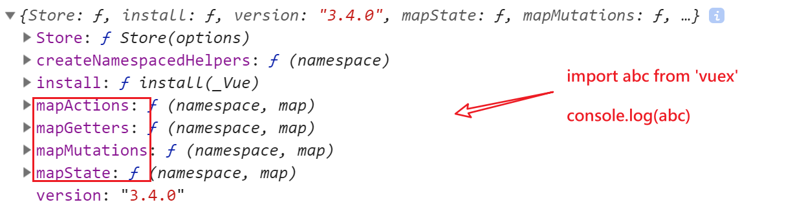

2. mapState(["count"]) 得到的是一个对象,其中有一个方法名是count，这个对象类似于`{count:function(){}}`

   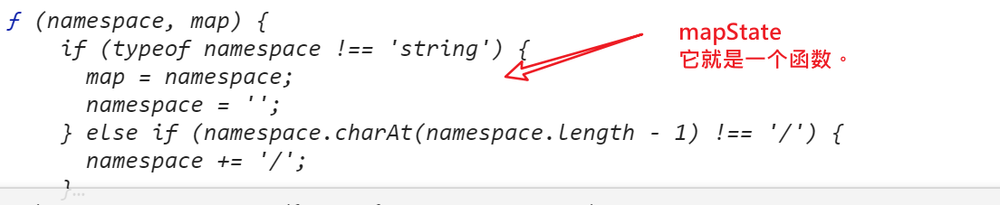

3. `...obj` 是es6新增的扩展运算符，这里用来把mapState(["count"]) 得到的对象合并到computed这个对象中。

整个过程的示意图如下：

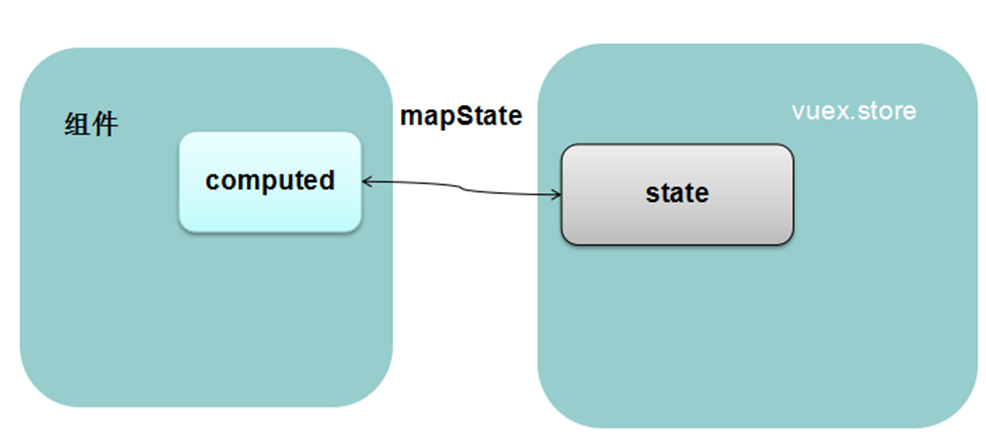


## 在用mutation组件内修改vuex中的数据


> 理解mutation
>
> 1. Vuex是一个整体，它提供接口给外部来操作数据
> 2. mutation定义了一个事件及回调，当这个事件发生时，就执行回调

### 定义mutation

```javascript
const store = new Vuex.Store({
  state: {
    num: 100
  },
  mutations: {
    mutation名1 (state，载荷) {
      // 自定义逻辑来修改state中的数据
    },
    mutation名2 (state，载荷) {
      // 自定义逻辑来修改state中的数据
    },
  }
})
```

其中：

- mutation名可以是任意的合法函数名
- 第一个参数是state，它只是形参名，理论它可以取任意的名字，但由于在执行的过程中，它会指向vuex中的数据项state，所以一般也采用state这个名字
- 第二个参数是可选的


```javascript
const store = new Vuex.Store({
  state: {
    num: 100
  },
  mutations: {
    add10 (state) {
      this.state.num += 10
    },
    addN (state, n) {
      this.state.num += n
    }
  }
})
```

### 调用mutation

在组件内：

```javascript
hSetNum10 () {
  this.$store.commit("add10")
},
hSetNumN () {
  this.$store.commit("addN", 21)
}
```


### mutaion的高级用法

定义

```
mutations: {
  increment (state, payload) {
  // payload: {amount: 10}
  },
  addN (state, n) {
  	this.state.num += n
  }
}
```

调用，如下两种方式执行效果一样的

```
store.commit('increment', {
  amount: 10
})

store.commit({
  type: 'increment',
  amount: 10
})
```


## mapMutation方式


```
methods: {
    ...mapMutations([
      'increment', // 将 `this.increment()` 映射为 `this.$store.commit('increment')`

      // `mapMutations` 也支持载荷：
      'incrementBy' // 将 `this.incrementBy(amount)` 映射为 `this.$store.commit('incrementBy', amount)`
    ]),
    ...mapMutations({
      add: 'increment' // 将 `this.add()` 映射为 `this.$store.commit('increment')`
    })
  }
```


## vuex的要点


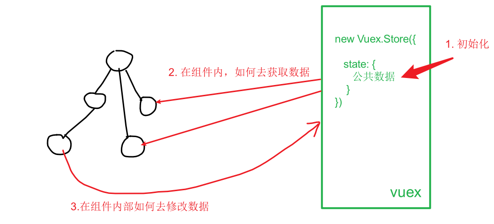


State提供整个项目中唯一的公共数据源，所有共享的数据都要统一放到Store中的state中存储。打开项目中的store.js文件，在state对象中可以添加我们要共享的数据。

- 如何初始化state数据
- 如何在组件中**获取**state数据
- 如何在组件中**修改**state数据

## 初始化state数据

```javascript
// 引入vuex
// 定义store

import Vue from 'vue'
import Vuex from 'vuex'

// 1. 以插件的格式把vuex挂载到Vue上
Vue.use(Vuex)

// 2. 创建Vuex.Store的实例
const store = new Vuex.Store({
  // 各种配置(类似于data,methods,computed....)
  // state就对应理解为组件中data
  // data中能写的数据类型，在state中照样写！
  state: {
    msg: 'hello vuex',
    list: [1,2,3],
    person: {
      name: '张三',
      nickname: '法外狂徒'
    }
  }

})

// 3. 导出store实例
export default store
```

state是固定的名字。它的值是一个对象，用来装所有的公共数据。

> 它的设置方式类似于组件中data数据项的设置方式。

## 在组件中获取state数据  


## 通过mutation在组件中修改state数据

在vue中，**不推荐**直接在组件内部通过`this.$store.state.全局数据名称=新值`来修改vuex数据，而推荐使用mutation来修改。

mutation(变化，变动)

具体在代码中表现为创建Vuex.Store实例时，所传入的参数对象中的mutations项。

### 定义格式

格式如下：

```javascript
new Vuex.Store({
    state:{},
    mutations:{
        // 函数名可以是任意合法的函数名
        // 参数1：表示当前state
        // 参数2：可选。它表示调用函数1时，传入的参数。
        函数名1(参数1,参数2){
            // 在函数内部，修改state中的数据
        }
    }
})
```

说明：

- mutations是固定写法(有一个s)
- mutations定义完成之后，就等待被调用。它的作用是用来修改vuex中的数据。

### 示例：添加mutaions

在定义vuex时，我们在Vuex.Store()中配置一下mutaions属性。把你要修改state数据的代码提前写好！

它有带参数和不参数两种情况，具体如下。

```javascript
import Vue from 'vue';
import Vuex from 'vuex';

Vue.use(Vuex);

export default new Vuex.Store({
    // 各种配置项
    // state 就相当于vue组件中的data。它用来存放整个vue项目中公共的数据
    //       这个数据，在所有的vue组件中都可以访问到
    state: {
        msg: '',
        count: 21.5,
        person: {
            name: '张三'
        }
    },
  	// 变异，变化
  mutations: {
    // 参数1：在这个函数被调用时，会自动传入当前state
    // 参数2：可选的，它表示在调用这个函数时，额外传入的参数
    // 函数名(形参参数1，形参参数2) {
    //   // 在函数体内部，去修改数据项
    // }
    // 更新
    updateMsg (state, newMsg) {
      state.msg = newMsg
    },
    // 清空
    resetMsg (state) {
      state.msg = ''
    }
  }
});
```

- mutations对象中的成员均是函数，并且有自己特定的格式。
- 如上所示的resetMsg函数，它的第一个参数固定表示当前的state的引用，在调用这个resetMsg函数时，你也不需要去设置第一个实参。
- updateMsg的第一个参数不用传入，第二个参数需要传入。


### 使用格式

在组件内部我们要想调用mutations中定义的方法来改变state中的值， 有两种方式：

方式一：直接使用

格式：

	this.$store.commit("mutaions的名字"，参数)

方式二：映射使用

- 映射成组件的methods

### 直接使用

在组件内部，可以通过如下方式来直接调用指定mutations

**格式**

```javascript
this.$store.commit(mutations函数名，参数)
// mutations函数名，就是在定义Vuex.store时，设置的mutations中的方法名；
// 第二个参数是可选的，它表示调用mutations时传入的额外的参数,它可以是任意数据类型。
```

**示例**

AddItem.vue中给按钮添加事件代码如下：

```javascript
<button @click="Add">+1</button>

methods:{
  methods: {
    hClick () {
      // 用户点击，把msg设置成abc
      // this.$store.commit("updateMsg", "abc")
      this.$store.commit("resetMsg")
      // console.log(this.$store.state.msg)
      // this.$store.state.msg = "abc"
    }
  }
}
```

说明：

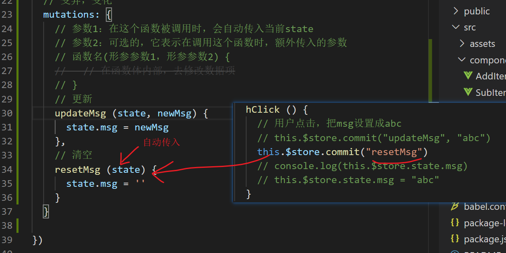


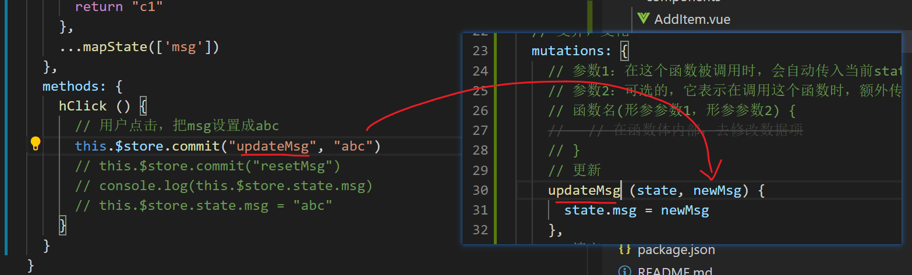

在调试工具中：观察mutations的变化

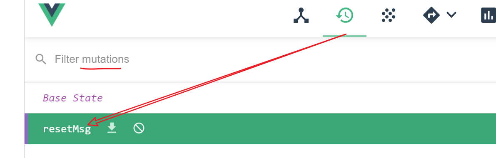

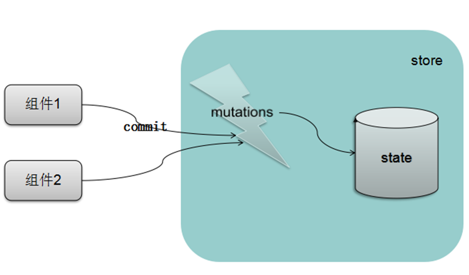

### mapMutations

在组件内部使用vuex中的mutaion的第二种方法，就是把mutations中的属性映射到组件的methods上成为当前组件的方法来使用。

下面是一个使用案例

```javascript
import { mapMutations } from 'vuex'
// console.log(mapMutations)
const rs = mapMutations(['updateMsg'])
console.log(rs)
// rs是一个对象 
// { updateMsg: function (){} }
export default {
  name: 'AddItem',
  methods: {
    hClick () {
      console.log(this)

      // this.updateMsg就是在多个方法之间相互调用
      this.updateMsg('abc')
    },
    // updateMsg () {

    // }
    // 把mapMutations(['updateMsg'])的结果合并到
    // methods对象中，相当于给methods添加了一个方法
    ...mapMutations(['updateMsg'])
  }
}
```

这里的使用与mapState比较像。

## mutation使用的两个细节

- 传参的个数只能是1个
- 映射成methods时可以取别名


**传参的个数只能是1个**

在定义mutation时，只能补充一个参数。下面的代码中，b不能收到值。

```javascript
// 定义
testMutation(state, a, b) {
  console.log('testMutation')
  console.log(state, a, b ) // state, 100, undefined
}

// 调用
this.$store.commit('testMutation',100,200)
```

如果一定要传多个值，可以放在对象中

```
this.$store.commit('testMutation',{a:100,b:200})
```

**映射成methods时可以取别名**

格式：mapMutations({新名字:'原名字'})

示例：

```javascript
// 在映射到methods中时，改下名字。原来在mutations中叫mAddN,到了组件的methods叫newFuncName
    ...mapMutations({newFuncName:'mAddN'}),
    test () {
      // 由于上面的mAdd1并映射成方法，所以这里可以直接加this.来访问。
      // this.mAdd1()
      // this.mAddN({a:100,b:200})
      this.newFuncName({a:100,b:200})
    }
```


## vuex实现-实现跨组件数据共享

解决上面提出的问题，我们思路就非常清晰了。

示意图如下：

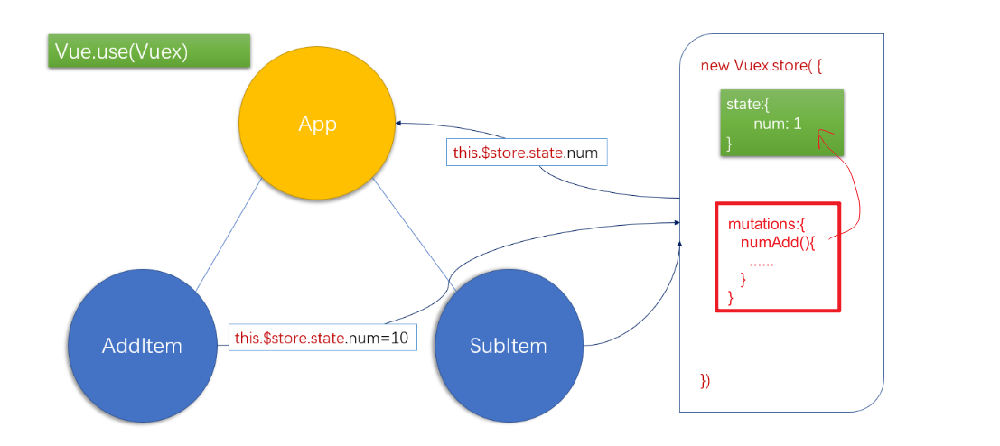

定义vuex

```
// 引入vuex
// 定义store

import Vue from 'vue'
import Vuex from 'vuex'
// 1. 以插件的格式把vuex挂载到Vue上
Vue.use(Vuex)

// 2. 创建Vuex.Store的实例
const store = new Vuex.Store({
  // 各种配置(类似于data,methods,computed....)
  // state就对应理解为组件中data
  // data中能写的数据类型，在state中照样写！
  state: {
    num: 1,
  },
  // 变异，变化
  mutations: {
    numUpDate(state, newNum) {
      state.num = newNum
    },
    numSub1 (state) {
      state.num--
    },
    numAdd1 (state) {
      state.num++
    }
  }

})

// 3. 导出store实例
export default store
```


打开刚刚创建的vuex项目，找到src目录中的App.vue组件，将代码重新修改如下：

- 从data中移除掉数据项。因为我们把状态数据维护到vuex中

- 在视图中直接通过插值表达式中获取数据

  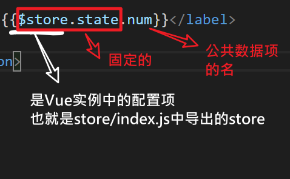

```html
<template>
  <div id="app">
    <h1>根组件</h1>
    <!-- <input @input="value => $store.state.num=value" -->
    <!-- <input type="text" v-model="$store.state.num"> -->
    <input type="text" :value="$store.state.num" @input="hInput">
    <add-item></add-item>
    <hr>
    <sub-item></sub-item>
  </div>
</template>

<script>
import AddItem from './components/AddItem.vue'
import SubItem from './components/SubItem.vue'

export default {
  name: 'app',
  data:function(){
    return {
    }
  },
  components: {
    AddItem,
    SubItem
  },
  created () {
    console.log(this.$store.state.person.nickname)
  },
  methods: {
    hInput (e) {
      console.log(e.target.value)
      this.$store.commit('numUpDate', e.target.value)
    }
  }
}
</script>

<style>
#app {
  width: 300px;
  margin: 20px auto;
  border:1px solid #ccc;
  padding:4px;
}
</style>
```

在components文件夹中创建AddItem.vue组件，代码如下：

```javascript
<template>
  <div class="box">
    <h2>子组件 add</h2>
    从父组件中获取的值:<label for="">{{$store.state.num}}</label>
    <br>
    <button @click="hAdd1">值+1</button>
  </div>
</template>
<style lang="css">
  .box{
    border:1px solid #ccc;
    width:200px;
    padding:5px;
    margin: 20px;
  }
</style>
<script>
export default {
  name: 'AddItem',
  methods: {
    hAdd1 () {
      // this.$store.state.num++
      this.$store.commit('numAdd1')
    },
  }
}
</script>
```

在components文件夹中创建SubItem.vue组件中的代码类似。

## vuex小结

- 作用：当你需要管理组件之间的公共数据时，就可以使用vuex。(例如：当前用户登陆本系统时**用户名**)
- 是vue官方提供的插件（类似于vue-router）专门用来进行公共状态管理。
- 步骤：
  1. 安装。 它是一个独立的npm包，要去下载安装。

  ```
  npm i vuex
  ```

  或者：在通过vuecli脚手架创建项目就去选中vuex。
  2. 创建Vuex.Store的实例，导出。

  ```javascript
  // src/store/index.js
  
  import vue
  import vuex
  vue.use(Vuex)
  const store = new Vuex.Store({
   // 配置项
   state: {
       xxxx :
   }
  }})
  export default store
  ```

  3. 初始化vue 实例时，设置store。

  ```javascript
  // main.js
  import store from './store/index.js'
  new Vue({
  	store,
  })
  ```


- 核心概念：
  - state ： 所有的公共数据放在state中。
    - 获取
      - 直接使用。 this.$store.state.XXX
      - 映射使用。映射成组件内部的计算属性. computed: { ...mapState(['XXXX'])}
    - 设置
      - this.$store.state.XXX = 新值。（不推荐....）
      - **mutations: 更新数据**
        - this.$store.commit(mutation的名字，参数)
        - 映射使用。映射成组件内部的methods. methods: { ...mapMutations(['XXXX'])}
    
    ```
    new Vuex.Store({
    	state: {},
    	mutations: {
    		f1(state) {}, 
    		f2(state,p) {}
    	}
    })
    ```
    

两个特点

- 独立性
  - 数据与项目中的所有组件无关
  - 任意组件中均可以操作数据
- 响应式 
  - 数据变化了，视图也会变化


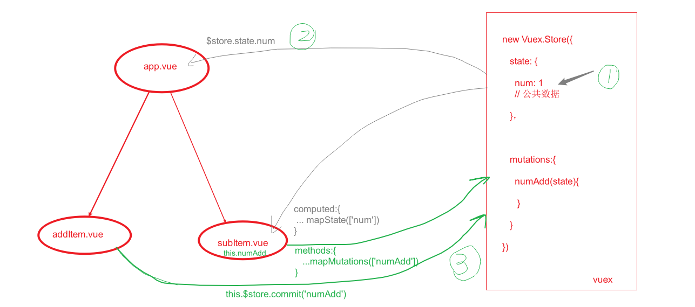


其它内容：

- actions, getters https://vuex.vuejs.org/zh/

