目标：

- 了解项目背景
- 创建项目
- 调整目录结构
- 代码托管
- 引入Vant
- REM适配
- 封装axios


## 项目介绍

- 黑马头条移动端是一个IT资讯移动web应用，有着和**今日头条**类似的资讯浏览体验。

- 主要功能：资讯列表、标签页切换，文章举报，频道管理、离线频道，文章详情、阅读记忆，关注功能、点赞功能、评论功能、回复评论、搜索功能、登录功能、个人中心、编辑资料、小智同学、~~问答功能~~、~~视频功能~~ ...   

- 黑马头条可打包成一款移动APP，后期结合H5+可在Dcloud打包成一款体验较好的手机应用。


## 技术介绍

- 生产依赖

  - vuejs  核心vue
  - vuex  状态管理插件
  - vue-router  路由插件
  - axios  请求插件
  - json-bigint 最大安全数值处理
  - **socket.io**-client  即时通讯库
  - vant 移动组件库
  - amfe-flexible  rem适配
  - vue-lazyload 图片懒加载

- 开发依赖

  - babel  ES转换器
  - less  css预处理器
  - postcss  css后处理器
  - vue-cli  vue项目脚手架

- 打包App

  - DCLOUD 打包

    

## 创建项目

创建项目：

```sh
vue create m-heima
```

采用自定义方式去创建项目：

```
? Please pick a preset:
  normal ([Vue 2] router, vuex, less, babel, eslint)
  lessvuexroutereslint ([Vue 2] router, vuex, less, babel, eslint)
  Default ([Vue 2] babel, eslint)
  Default (Vue 3 Preview) ([Vue 3] babel, eslint)
> Manually select features  
```


- 手动选择特性，要依赖插件：Babel, Router,Vuex,CSS Pre-processors, Linter

  ```
  ? Please pick a preset: Manually select features
  ? Check the features needed for your project:
   (*) Choose Vue version
   (*) Babel
   ( ) TypeScript
   ( ) Progressive Web App (PWA) Support
   (*) Router
   (*) Vuex
  >(*) CSS Pre-processors
   (*) Linter / Formatter
   ( ) Unit Testing
   ( ) E2E Testing  
  ```

- 版本

```
? Choose a version of Vue.js that you want to start the project with (Use arrow keys)
> 2.x
  3.x (Preview) 
```


- 路由是否使用history模式：不采用

- 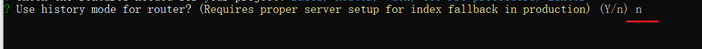

- css 预处理器: 使用less

- 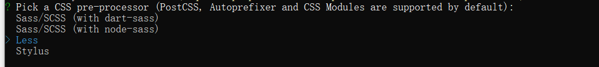

- 语法风格：Standard

- 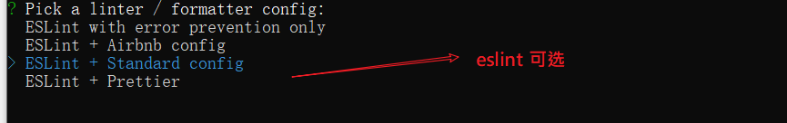

- 检查节点：保存时检查，提交时检查

  

- 存储插件配置位置：单独放在不同的文件中 in dedicated config files。

- 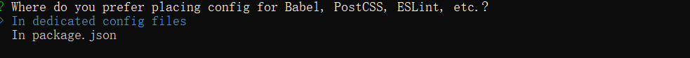

接下来，它会问你是否要保存前面的设置作为预设方案，以便后续创建其它项目时直接使用。你可以选择N。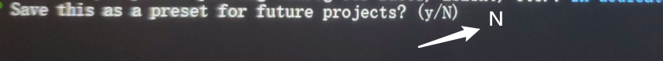


经过长长的等待，创建完毕启动项目


注意：

- 注意选择vue的版本是2.x
- 创建项目时，要选中vuex

##  gitee代码托管

采用vue cli创建完成项目之后，它会自动在本地初始化代码仓库，所以接下来你可以选择把本地仓库链接到gitee远程仓库中去。

自行完成，参考项目1的做法。

>  作业：每个人今天下课之后，都要申请gitee帐号，并把自已的项目代码上传到gitee中去，并以小组为单位，把每个人gitee地址收起来。
>
>  


## 认识并调整目录结构

认识工作目录

默认生成的目录结构不满足我们的开发需求，所以这里需要做一些自定义改动。主要是两个工作：

- 删除初始化的默认文件
- 新增调整我们需要的目录结构

```sh
├── node_modules # 安装的包
├── public	# 静态资源托管目录
│   ├── favicon.ico
│   └── index.html
└── src	# 源码
    ├── api	#请求接口封装模块
    ├── assets	#资源目录
    ├── components	#组件目录
    ├── router	#路由模块
    ├── store	#Vuex容器模块
    ├── styles #样式目录
    ├── utils  #工具模块目录
    ├── views  #视图组件目录
        ├─home  #首页模块
        	├── home.vue
        ├─video #视频模块
        	├── video.vue
        ├─question #问答模块
        	├── question.vue
        ├─search #搜索模块
        	├── search.vue
        ├─user #用户模块
        	├── user.vue
        └─Layout.vue #公用布局组件
    ├── App.vue	#根组件
    └── main.js	#入口文件
├── .browserslistrc # 浏览器的约定
├── .editorconfig #对本项目要用到编辑器的约定
├── .eslintrc.js #eslint
├── .gitignore # git的忽略设置
├── babel.config.js	#babel配置文件
├── package-lock.json	#npm相关文件
├── package.json	#npm相关文件
└── README.md	#项目说明文件
```

### 删除

1. 清空src/views/App.vue中的内容。

```
<template>
  <div id="app">
    <div id="nav">
      黑马头条移动版
    </div>
    <router-view/>
  </div>
</template>
```

2. 删除默认生成的一些文件：

- components/HelloWorld.vue
- views/Home.vue
- views/About.vue

3. 修改一下路由配置

   src\router\index.js

```javascript
import Vue from 'vue'
import VueRouter from 'vue-router'

Vue.use(VueRouter)

const routes = [
  // 注释掉
]

const router = new VueRouter({
  routes
})

export default router
```

删除路由配置。

### 新增

在 src 目录下中补充创建以下目录：

- /api ： 存储请求函数模块
- /styles:样式文件模块
- /utils:工具函数模块


### 效果

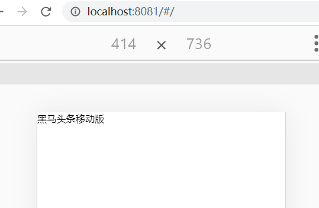

## 引入移动端组件库 Vant


> 参考：https://youzan.github.io/vant/#/zh-CN/quickstart
>

基于 **Vue**.js 的**移动端**组件库有很多，在官方的 [awesome](https://github.com/vuejs/awesome-vue#mobile) 中也推荐了一些：

- vux
- mint(element-ui)
- vant

在我们的项目中使用的是**有赞**开发的 [Vant](https://github.com/youzan/vant)。

操作步骤

### 安装 Vant

与element-ui一致。

```bash
npm i vant
```

### 引入 Vant 组件库

>完整引入 好处：使用方便 缺点：打包体积大
>
>按需引入 好处：打包体积小 缺点：相对于全部引入要稍微麻烦一些
>
>在开发阶段这里直接使用**完整引入方式**，在项目打包时再去做调整。

在src/main.js 中，以vue插件的方式完整引入vant组件

```javascript
import Vue from 'vue'
import Vant from 'vant'
import 'vant/lib/index.css'

Vue.use(Vant)
```

### 测试使用

在任意组件中，以App.vue为例，测试使用

```html
<van-button type="default">默认按钮</van-button>
<van-button type="primary">主要按钮</van-button>
<van-button type="info">信息按钮</van-button>
<van-button type="warning">警告按钮</van-button>
<van-button type="danger">危险按钮</van-button>
```

效果如下：

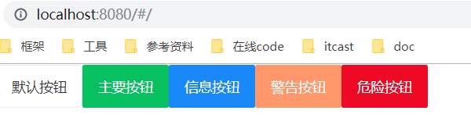

## vscode中的源代码管理器

如果你的项目中用git，再使用vscode打开项目时，就会启动源代码管理器的功能。

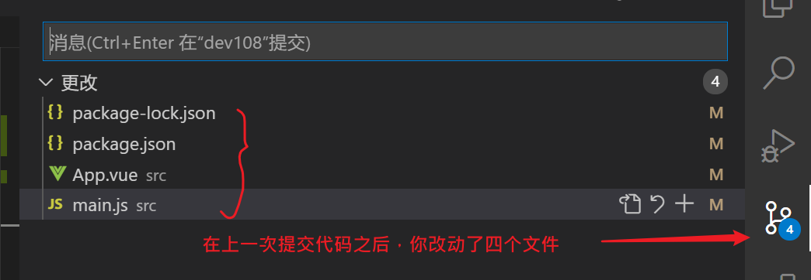

常见的操作有：

1. 提交本次修改

   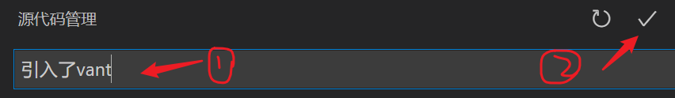

   与 `git add.  git commit -m "xxxx"` 功能一致。

2. 推到远程仓库（不需要在vscode中去配置远程仓库）

   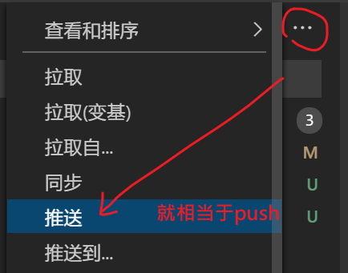

## eslint

eslint的作用是对代码书写进行约束，它是考量一个程序员团队是否有统一的编码规范的重要的依据。

> eslint === 靠谱

- 在创建项目时，选择了约定的代码风格是： ESLint + Standard  config ， 则在保存时，eslint会按约定代码风格对我们写的代码进行检查，如果不符合代码风格，就报错。

> eslint 是一个法官 ， Standard config就是法律

### 典型错误

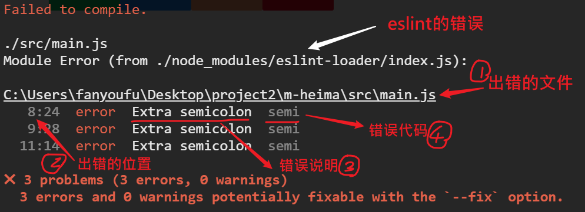

### 解决错误

1.推荐方式（人肉修改）：根据错误提示，找到代码并改正（有助于养成良好的编码习惯）。

2.运行`npm run lint` 自动修正一些错误。

3.在vscode安装eslint拓展

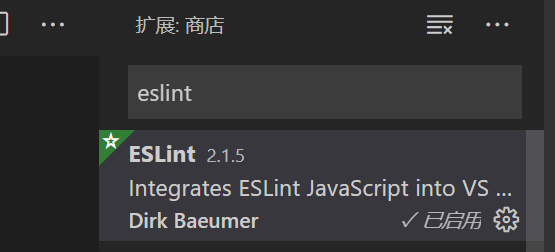

此时，如果你的代码不符合 eslint的要求，就会有波浪线提示！

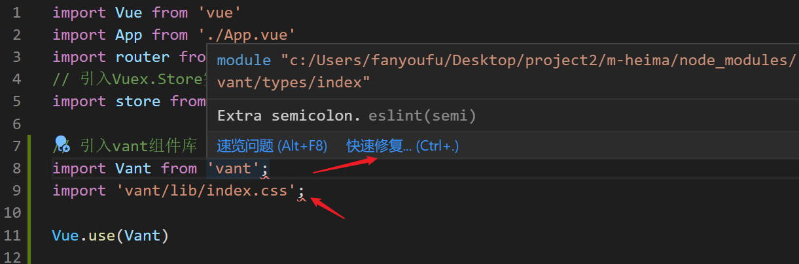

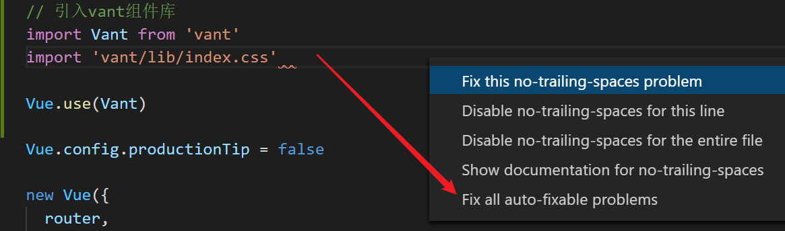

4.直接修改eslint的配置规则，让它不要是**错误**。

eslintrc.js中，在rules下补充一项配置：

 （1） semi: 是eslint规则名字，它是固定写法。你可以在错误提示中找到它。`http://eslint.cn/docs/rules/semi`

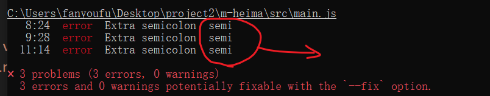

（2） off: 表示关闭这个规则。

```
  rules: {
    'no-console': process.env.NODE_ENV === 'production' ? 'warn' : 'off',
    'no-debugger': process.env.NODE_ENV === 'production' ? 'warn' : 'off',
    'semi': 'off' // 不强求;的写法
    
  }
```

### 异常情况

如果你的vscode中用其它扩展 启用 自动格式化功能，则有可能与eslint的规则冲突！


解决方案：

1. 关闭vscode中的自动格式化
2. 修改自动格式化的配置项，让它格式化之后的格式与eslint的规则一致！


## 用REM解决多屏适配

因为这个项目是移动端，所以，它需要去适配不同的手机屏幕。我们希望实现适配的效果是：与屏幕大小相关。以按钮为例：**在大屏手机，按钮的宽高都大些，在小屏手机上尺寸小些**。

### 分析

Vant 中的样式默认使用`px`作为单位，如果需要使用`rem`单位，推荐使用以下两个工具一起工作，来达到目标。-[官网地址](https://youzan.github.io/vant/#/zh-CN/quickstart#rem-gua-pei)

技术手段：

1. 把所有px单位改成rem ， 用[postcss-pxtorem](https://github.com/cuth/postcss-pxtorem) 来实现，它是一款 postcss 插件，用于将px转化为 rem。

2. 根据不同的手机屏幕的宽度，来动态设置rem的参考值：html标签上的font-size的大小。用[lib-flexible](https://github.com/amfe/lib-flexible) 来实现，用于设置 rem 基准值 

- 它对应的包名不是这个名字，而是amfe-flexible。
- 它需要是生产依赖

### 安装包

这两个包在安装时有一些区别：

```sh
# 后处理器 开发阶段使用
# 作用：把px单位自动转成rem单位
npm i postcss-pxtorem -D

# 修改rem基准值的js插件   需要在打包后需要使用
# 作用: 根据设置屏幕的宽度去调整rem的值（html标签上font-size的大小）
#      它的默认计算方式是屏幕宽度的1/10，默认值是37.5
npm i amfe-flexible
```

### 设置postcss

根目录下创建postcss.config.js文件，内容如下：

```javascript
module.exports = {
  plugins: {
    'postcss-pxtorem': {
      // 能够把所有元素的px单位转成Rem
      // rootValue: 转换px的基准值。
      // 例如一个元素宽是75px，则换成rem之后就是2rem。
      rootValue: 37.5,
      propList: ['*']
    }
  }
}

```

这一步完成之后，通过`npm run serve` 重启一下项目，它会把原来样式中的px单位自动转成rem单位。

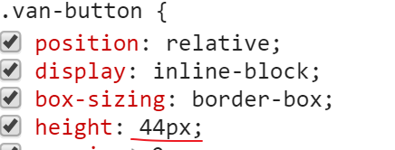

上图是转之前的，下图是转之后的。

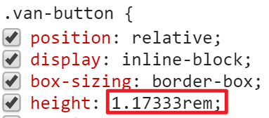

### 引入flexible

最后，入口文件main.js导入 amfe-flexible 

```diff
import Vue from 'vue'
import App from './App.vue'
import router from './router'
import store from './store'

// 引入Vant所有的组件
import Vant from 'vant'
// 用它的样式
import 'vant/lib/index.css'

// 它会根据的手机尺寸来调整rem的基准值：html标签上的font-size。
+ import 'amfe-flexible'
```

最后的效果如下：

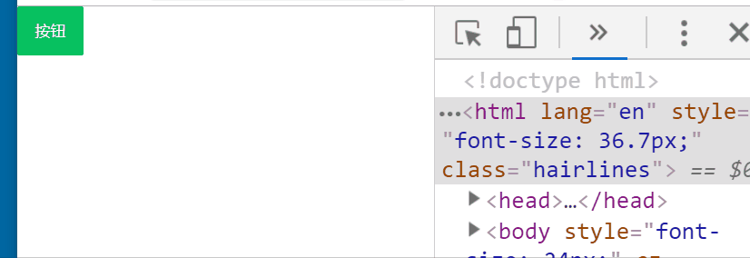


## 封装 axios 请求函数

为了调用ajax方便，这里我们先对 axios进行一次封装，把它封装成一个独立的模块，在需要的时候直接加载使用。

思路：

- 安装aixos包

- 对axios进行二次封装，把基地址提前写好。

### 安装 axios

```bash
npm i axios
```

### 封装

创建 `utils/request.js` ， 开始在这个文件中写代码。


设置接口基地址有些区别。

（1） 直接在axios上设置默认baseURL

```javascript
axios.defaults.baseURL = 'XXX'
```

上面的做法有一个缺点： 如果一个项目中的接口地址分别在多台不同的服务器上，即它们的基地址是不同的，那么上面的做法就不好做了---原因很简单:defaults.baseURL只能写一个。


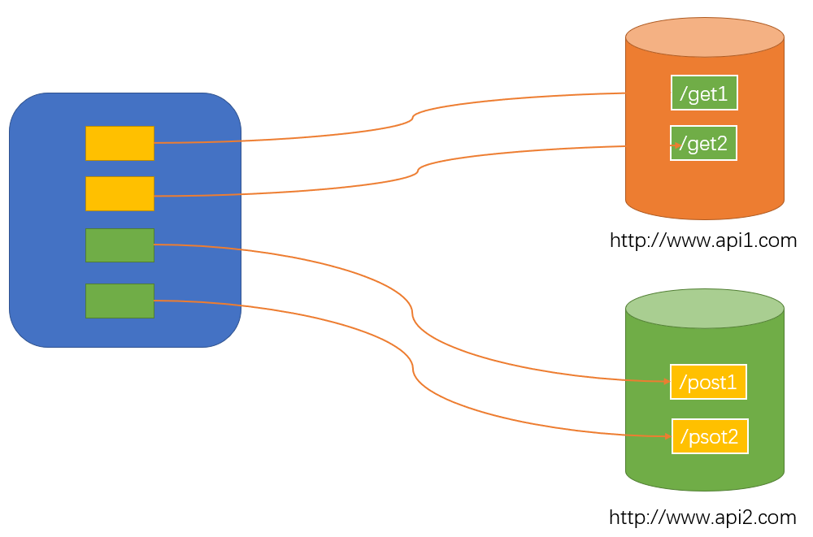


（2）使用[自定义](https://www.npmjs.com/package/axios#axioscreateconfig)的方式创建axios实例

```js
// 对axios进行二次封装
//    axios本身是一个独立的库，是对ajax的封装。为了方便在项目中使用，我们对它再次封装
// (1) 接口基地址
// (2) 请求，响应拦截器

import axios from 'axios'

const instance1 = axios.create({
  // 后端服务器1
  baseURL: 'http://ttapi.research.itcast.cn'
  // baseURL: 'http://api-toutiao-web.itheima.net'
  // timeout: 1000,
  // headers: {'X-Custom-Header': 'foobar'}
})

const instance2 = axios.create({
  // 后端服务器2
  baseURL: 'http://api-toutiao-web.itheima.net'
  // timeout: 1000,
  // headers: {'X-Custom-Header': 'foobar'}
})

export { instance1, instance2 }

// 默认导出intance1
export default instance1
```


### 调用测试

在app.vue组件中去测试一下这个封装的效果。

> 只是测试一下axios的用法代码的效果，后期会删除这些代码的。

```javascript
<template>
  <div id="app">
    <div class="div">
      黑马头条移动版
    </div>
    <van-button type="default" @click="hClick1">请求服务器地址1</van-button>
    <van-button type="primary" @click="hClick2">请求服务器地址2</van-button>
    <van-button type="info"  @click="hClick3">使用默认导入的地址</van-button>
    <van-button type="warning">警告按钮</van-button>
    <van-button type="danger">危险按钮</van-button>

    <router-view/>
  </div>
</template>

<script>
// ajax123456是从request.js中默认导出的内容。它可以重命名
import ajax123456, { instance1, instance2 } from './utils/request'
// import ajax from './utils/request'
export default {
  methods: {
    hClick1 () {
      instance1({
        method: 'GET',
        url: '/app/v1_0/user/channels'
      })
    },
    hClick2 () {
      instance2({
        method: 'GET',
        url: '/app/v1_0/user/channels'
      })
    },
    hClick3 () {
      ajax123456({
        method: 'GET',
        url: '/app/v1_0/user/channels'
      })
    }
  }
}
</script>
<style lang="less" scoped>
  .div{
    width: 75px;
    height: 37.5px;
    background-color: green;
  }
</style>
```

可以在控制台中看到类似如下：


成功了。


## 附：axios关于传参

### Headers参数

```
axios({
    method:'XXX',
    headers:{
        key:value
    }
})
```

### query 参数

```
axios({
    method:'XXX',
    params:{
        key:value
    }
})
```


### body 参数

```
axios({
    method:'XXX',
    data:{
        key:value
    }
})
```


