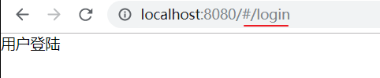
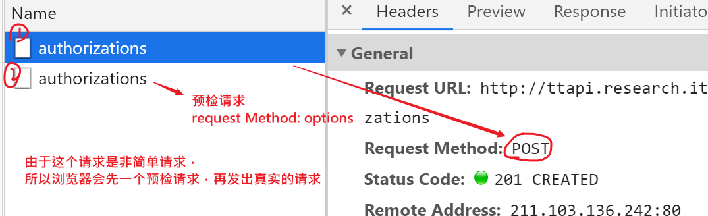
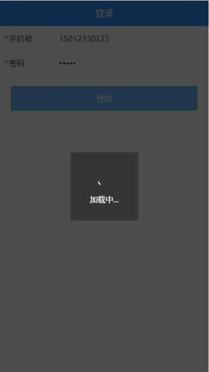

## 登陆效果展示和整体分析


在本项目中, 登陆不是必需的，但是，如果你不登陆的话就是一个普通的游客，不能发布留言。


思路：

- 创建页面级组件并配置路由，能通过路由地址来访问它
- 布局结构，用vant的组件来实现基本布局
- 调整样式，根据需要自已写样式来覆盖vant组件库的样式
- 实现业务功能
  - 数据有效性校验
  - 调用接口，发登陆请求
  - 根据反馈结果，给出提示

## 创建组件并配置路由

这一节的目标是创建一个空的页面，并能通过路由地址来访问。

### 创建组件

 views/login/login.vue

```html
<template>
  <div class="login">
    登录
  </div>
</template>

<script>
export default {
  name: 'Login'
}
</script>

```

组件的布局，在后面来做。

### 配置路由

然后在 `router/index.js` 中配置路由表：

```javascript
{
    path: '/login',
    name: 'login',
    component: () => import('../views/login/login.vue')
    // component: function () {
    //   return import('../views/login/login.vue')
    // }
}
```

### 在根组件app.vue配置路由容器

去掉其它的用于测试按钮组件，只留下router-view：路由的出口。上面写的login页面，就会出现在这里。 

```html
<template>
  <div id="app">
    <!-- 路由出口 -->
    <router-view></router-view>
  </div>
</template>
```


### 测试

最后，访问 `/login` 查看是否能访问到登录页面组件。




### 易错点

router-view不能删除

```
<!-- 路由出口 -->
<router-view/>
```


## 实现布局结构

这一节的目标是使用vant组件库中的组件来“画页面”。

目标效果如下:


这里主要使用到三个 Vant 组件：

- [NavBar 导航栏](https://youzan.github.io/vant/#/zh-CN/nav-bar)
- [Field 输入框](https://youzan.github.io/vant/#/zh-CN/field)
- [Button 按钮](https://youzan.github.io/vant/#/zh-CN/button)

1、将登录页修改为：

login.vue

```html
<template>
  <div class="login">
    <!-- 顶部导航条 -->
    <van-nav-bar
      title="登陆"
    />
    <!-- 表单区域 -->
    <van-cell-group>
      <van-field v-model="mobile" type="tel" label="手机号" />
      <van-field v-model="code" type="password" label="密码" />
    </van-cell-group>

    <!-- 按钮 -->
    <div class="btn-warp">
      <van-button type="info">登陆</van-button>
    </div>
  </div>
</template>
```

要点：

- 在vant官网上复制组件代码

## 样式处理

这一节的目标是通过自已写一点样式来覆盖vant中组件的原有样式，以达到目标效果。

考虑到不同的页面部位的区别，这里的样式写在两个不同的位置。


原则：

- 把设置登录页头部的样式写到全局（全局生效），因为其它页面组件中也要使用。

- 把非公共样式写到页面组件内部，避免和其它组件样式冲突。

下面是具体实现步骤。

### 添加并使用全局样式

希望在其它的页面中的头部的区域的样式也能复用。

1、创建 `styles/index.less` 并写入以下内容：

```less
// 全局样式
.van-nav-bar{
  background-color: #3196fa;
  .van-nav-bar__title {
    color:#fff;
  }
}
```

这一步是用自已写的样式来覆盖vant自带的样式，最后要实现顶部van-nav-bar的样式。

2、在 `main.js` 中加载

```
// ...其它代码
// 全局样式
import '@/styles/index.less'
```

测试查看效果。

### 添加局部样式

接下来，设置登陆按钮的样式，将 `views/login/index.vue` 组件中的 style 修改为：

```css
<style lang="less" scoped>
  // 按钮
  .btn-wrap {
    padding:20px;
    .van-button{
      width: 100%;
      background-color: #6db4fd;
      color:#fff;
    }
  }
</style>
```

### 最终效果

注意：两个地方的颜色写在不同的地方。


## 登陆页-核心功能实现

实现流程：

- 获取表单数据（绑定）
- 注册点击登录的事件
- 表单验证（不能为空）
- 发请求提交
- 根据请求结果做下一步处理

下面是具体的实现过程：

### 数据绑定

1、根据接口要求绑定数据

在登录页面组件的实例选项 data 中添加 `user` 数据字段：

```javascript

import request from '@/utils/request.js'
export default {
  data () {
    return {
      userInfo: {
        mobile: '13912345678',
        code: '246810'
      }
    }
  },
  
}
</script>
```

2、在表单中使用 `v-model` 绑定对应数据：

```html
<van-cell-group>
  <van-field label="手机号" v-model.trim="userInfo.mobile" placeholder="请输入手机号" />
</van-cell-group>
<van-cell-group>
  <van-field label="密码" v-model.trim="userInfo.code" type="password" placeholder="请输入密码" />
</van-cell-group>
```

> .trim修饰符，用来去掉左右的空格。

最后在浏览器使用 VueDevtools 调试工具查看是否绑定成功。


### 登陆提交

1、给登录按钮注册点击事件处理函数

```html
<div class="btn-wrap">
      <van-button type="primary" @click="hLogin" class="btn">登陆</van-button>
</div>
```

2、登录处理函数

```javascript
import request from '@/utils/request'
methods: {
    async hLogin () {
      // 1. 验证数据有效性， TODOS

      // 2. 发请求
      const { mobile, code } = this.userInfo
      try {
        const res = await request({
          method: 'POST',
          url: '/app/v1_0/authorizations',
          data: { mobile, code }
        })
        console.log(res)
        alert('登陆成功，准备跳转')
      } catch (err) {
        console.log(err)
        alert('登陆失败，用户名密码错误')
      }
    }
  }
```

在network查看效果



-  对于跨域的复杂请求（有自己额外的请求头，请求头的content-type是application/json），浏览器会发出一个预检请求，成功之后，再发具体的ajax请求。（------前端不需要任何事----）

下图是后端接口中对参数的要求：


## 登陆页-登录 loading 效果

通过vant中提供的$toast.loading, $toast.success, $toast.fail来提升用户交互体验

- 用vant中的**toast组件**来实现loading的效果。
- 用toast的提示框代替alert




> [toast组件](https://youzan.github.io/vant/#/zh-CN/toast#zu-jian-nei-diao-yong)

加载提示（this.$toast 可以使用，是因为我们全局安装了vant）


### 格式

```javascript
this.$toast.loading({
  duration: 0, // 持续展示 toast,永远不会关闭
  overlay: true, // 整体添加一个遮罩
  message: '加载中...'
})
```

### 参考代码

```javascript
async doLogin () {
      const { mobile, code } = this.userInfo
      // 显示loading
      this.$toast.loading({
        duration: 0, // 持续展示 toast, 不会自已关闭
        overlay: true, // 整体加一个遮罩
        message: '登陆中....'
      })
      try {
        const res = await request({
          method: 'POST',
          url: '/app/v1_0/authorizations',
          data: { mobile, code }
        })
        console.log(res)
        // 给出成功的提示， 它会把前面的loading替换掉
        this.$toast.success('登陆成功')
        // alert('登陆成功，准备跳转')
      } catch (err) {
        console.log(err)
        this.$toast.fail('登陆失败')
        // alert('登陆失败，用户名密码错误')
      }
    },
```

注意：

- this.$toast.loading: 由于我们引入vant，并是完整引入 ，所以vant会在vue的原型上添加$toast方法（这个方法不是vue自带，是vant组件库提供的）

把网络速度调整慢一些可以看到效果。


## 封装axios请求模块

### 原因

下面的代码不友好

```
await ajax({
        method: 'POST',
        url: '/app/v1_0/authorizations',
        data: {
          mobile, code
        }
      })
```


上面的代码中对于ajax请求的做法比较直观：点击按钮就发出请求，请求写出url地址，方法，参数。但是它这样做是有一些问题的：

- 不够语义化（只知道是是发请求，而不知道具体是做什么 ）
- 不方便代码复用。如果在另一个模块中也需要用户登陆功能的话，就需要再写一次了。
- 不方便统一修改url地址。如果要修改url地址，还需要找到这个组件内部才能定位去修改。

考虑到上面的这些问题，我们提前将所有业务操作都封装为一个模块。


### 思路

1. 在一个单独的js文件中创建并导出模块
2. 在.vue文件中使用模块

### 步骤

下面是具体的实现步骤：

#### 建立模块

创建 `api/user.js` 并写入

```javascript

import request from '@/utils/request.js'

export const login = (mobile, code) => {
  return request({
    method: 'POST',
    url: '/app/v1_0/authorizations',
    data: { mobile, code }
  })
}

```

#### 使用模块

然后在登录页面login/index.vue中加载调用：

- 导入上面封装api
- 调用

```javascript
import { login } from '@/api/user.js'

async doLogin () {
  const { mobile, code } = this.userInfo
  // 显示loading
  this.$toast.loading({
    duration: 0, // 持续展示 toast, 不会自已关闭
    overlay: true, // 整体加一个遮罩
    message: '登陆中....'
  })
  try {
    const res = await login(mobile, code)

    console.log(res)
    // 给出成功的提示， 它会把前面的loading替换掉
    this.$toast.success('登陆成功')
    // alert('登陆成功，准备跳转')
  } catch (err) {
    console.log(err)
    this.$toast.fail('登陆失败')
    // alert('登陆失败，用户名密码错误')
  }
}
```

之后项目中所有的涉及接口的请求就都不要直接在组件中直接写了，而是：

1. 先写成模块

2. 再从模块中取出方法来在组件中使用


### 可能的问题

要记得写return,不写return就无法获取返回结果

```
export const login = (mobile, code) => {
  // ajax() 这个函数的返回值是一个promise
  return ajax({
    url: '/app/v1_0/authorizations',
    method: 'POST',
    data: {
      mobile,
      code
    }
  })
}
```


## 作业-登陆页-表单验证