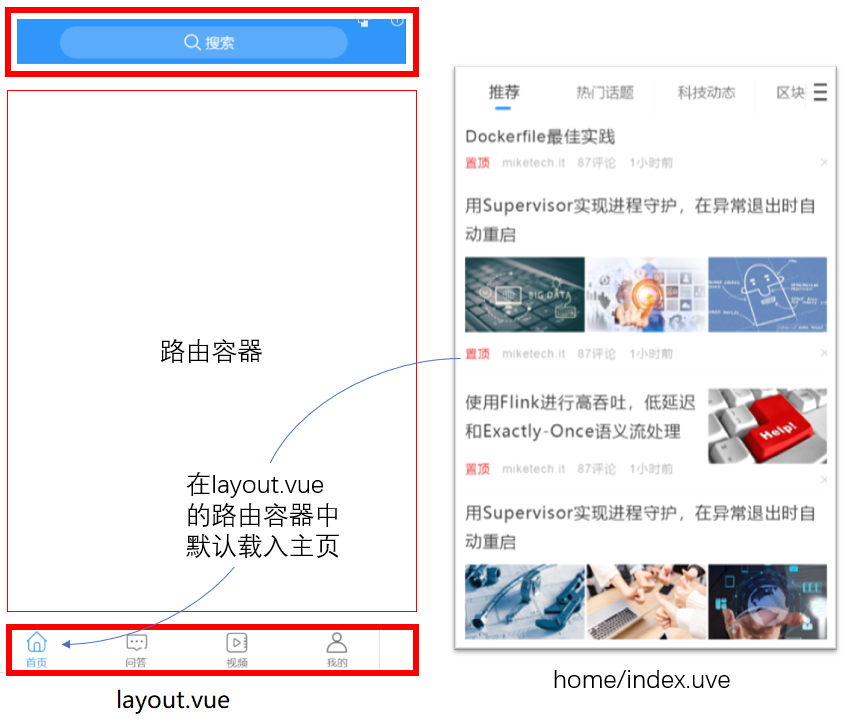
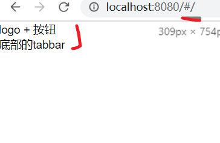
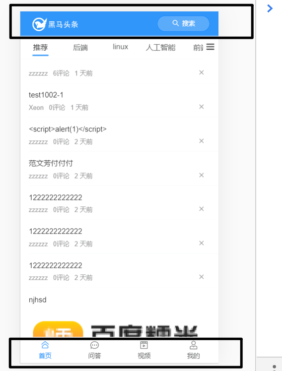
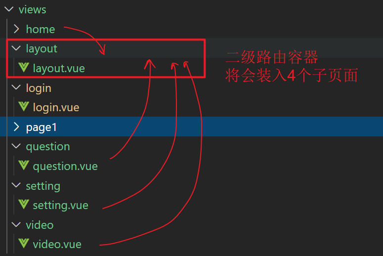

目标

- 完成整体路由规划(要搞清楚要做几个页面，它们分别在哪个路由下面，是怎么跳转的.....)
- 完成Layout布局


## 主页整体结构分析

从login页登陆，成功后进入主页。(当然，用户也可以直接访问主页，只不过此时是未登陆状态。)

主页从上到下由三部分组成：

- 顶部logo导航区
- 中间部分
  - 二级路由的出口
- 底部tabbar
  - 点击不同的图标，会显示不同的内容到中间的二级路由出口。



## layout路由及组件

**创建组件**

src/view/layout/layout.vue

```
<template>
  <div class="container">
    <!-- logo导航 -->
    <div>
      logo + 按钮
    </div>

    <!-- 主体区域 -->
    <router-view></router-view>

    <!-- 底部的tabbar -->
    <div>
      底部的tabbar
    </div>

  </div>
</template>

<script>
export default {

}
</script>

<style lang="scss" scoped>

</style>

```

**路由配置**


```
{
    path: '/login',
    name: 'login',
    component: () => import('../views/login/login.vue')
  },
  {
    path: '/',
    name: 'layout',
    component: () => import('../views/layout/layout.vue')
  },
```


**测试**



## Layout组件布局



- 用到[van-nav-bar](https://youzan.github.io/vant/#/zh-CN/nav-bar#shi-yong-cha-cao) 和[van-tabber](https://youzan.github.io/vant/#/zh-CN/tabbar)


views/layout/index.vue

```html
<template>
  <div class="container">
    <!-- logo导航  logo + 按钮 -->
    <van-nav-bar>
      <!-- 注意插槽的问题 -->
      <div slot="left" class="logo"></div>
      <van-button slot="right"
        round
        type="info"
        size="small"
        icon="search"
      >搜索</van-button>
    </van-nav-bar>

    <!-- 二级路由出口
      1. 首页
      2. 问答
      3. 视频
      4. 我的
    -->
    <router-view></router-view>

    <!-- 底部的tabbar -->
    <!-- 启用路由导航功能
      -route : 启用路由导航
      -to : 导航路由的path
    -->
    <!-- 底部的tabbar -->
    <van-tabbar v-model="active" route>
      <van-tabbar-item icon="home-o" to="/">主页</van-tabbar-item>
      <van-tabbar-item icon="question-o" to="/question">问答</van-tabbar-item>
      <van-tabbar-item icon="video-o" to="/video">视频</van-tabbar-item>
      <van-tabbar-item icon="setting-o" to="/setting">未登陆|我的</van-tabbar-item>
    </van-tabbar>
  </div>
</template>

<script>
export default {

}
</script>

<style lang="less" scoped>
  .logo {
    background: url("../../assets/logo.png") no-repeat;
    background-size: cover;
    width: 100px;
    height: 30px;
  }
  .van-nav-bar .van-icon{
    color: #fff;
  }
</style>

```

- #left 是 slot="left"的简写

- van-tabber的route属性可以开启路由模式，通过to来指定要跳转的路由地址。

## Layout路由配置

```js
{
    path: '/',
    name: 'layout',
    component: () => import('../views/layout/layout.vue'),
    // 二级路由
    children: [
      {
        path: '', // 默认要装入的组件
        name: 'home',
        component: () => import('../views/home/home.vue')
      },
      {
        path: '/question',
        name: 'question',
        component: () => import('../views/question/question.vue')
      },
      {
        path: '/video',
        name: 'video',
        component: () => import('../views/video/video.vue')
      },
      {
        path: 'setting',
        name: 'setting',
        component: () => import('../views/setting/setting.vue')
      }
    ]
  },
```

- 根据约定的路由规则定义。

- 先定义规则对应的组件。

  

## 整体路由设置

把整个项目中的用到的所有的页面的壳子都做出来，把路由规划做出来，产出排期。


排期：工作进度划化表。

- 2020.8.4  - XXX功能
- 2020.8.5  - XXX功能
- 2020.8.6  - XXX功能

前提是：你要对要实现的功能非常了解，才能做精准的判断。

约定路由规则

| path           | 文件                        | 功能                     | 组件名       | 路由级别 |       |
| -------------- | --------------------------- | ------------------------ | ------------ | -------- | ----- |
| /login         | views/login/login.vue       | 登录页                   | Login        | 一级路由 |       |
| /              | views/layout/layout.vue     | 布局                     | Layout       | 一级路由 |       |
| ├─ /           | views/home/home.vue         | 主页（不登陆也能访问的） | Home         | 二级路由 |       |
| ├─ /question   | views/question/question.vue | 问答                     | Question     | 二级路由 | 3天   |
| ├─ /video      | views/video/video.vue       | 视频                     | Video        | 二级路由 | 2天   |
| ├─ /setting    | views/setting/setting.vue   | 个人中心                 | Setting      | 二级路由 | 1.5天 |
| /user/profile  | views/user/profile.vue      | 编辑资料                 | UserProfile  | 一级路由 |       |
| /user/chat     | views/user/chat.vue         | 小智同学                 | UserChat     | 一级路由 |       |
| /search        | views/search/index.vue      | 搜索中心                 | Search       | 一级路由 |       |
| /search/result | views/search/result.vue     | 搜索结果                 | SearchResult | 一级路由 |       |
| /article       | views/article/index.vue     | 文章详情                 | Article      | 一级路由 |       |


