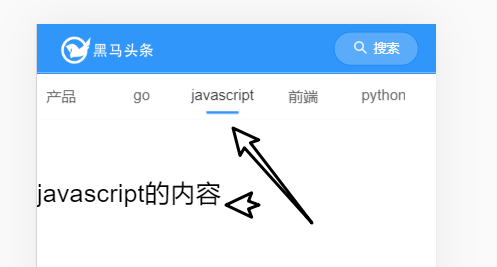
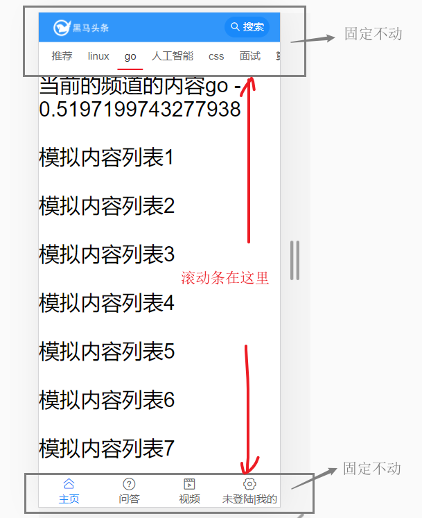
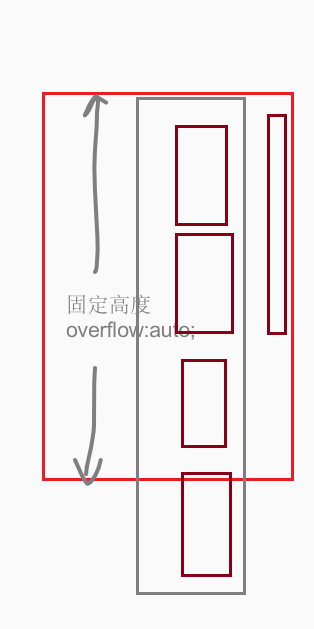

首页之频道列表

目标


功能：调用接口获取频道，并显示在顶部

## 频道列表基本结构

文件：views/home/index

使用[tabs组件](https://youzan.github.io/vant/#/zh-CN/tab#hua-dong-qie-huan) 来放置频道列表。

```html
<!-- 频道列表
https://vant-contrib.gitee.io/vant/#/zh-CN/tab#biao-qian-lan-gun-dong
-->
<template>
  <div>
    <van-tabs v-model="active">
      <van-tab title="标签 1">内容 1</van-tab>
      <van-tab title="标签 2">内容 2</van-tab>
      <van-tab title="标签 3">内容 3</van-tab>
      <van-tab title="标签 4">内容 4</van-tab>
      <van-tab title="标签 5">内容 5</van-tab>
      <van-tab title="标签 6">内容 6</van-tab>
      <van-tab title="标签 7">内容 7</van-tab>
      <van-tab title="标签 8">内容 8</van-tab>
    </van-tabs>
    <!--1. tab -->
    <!--2. list -->

  </div>
</template>

<script>
export default {
  name: 'Index',
  data () {
    return {
      active: 1
    }
  }
}
</script>

```

- 某个频道中真正的内容要放在对应的`van-tab`插槽中。

  

## 频道列表-获取频道并显示

### 封装api

涉及频道的相关操作很多，封装一个模块来统一处理。

新增一个文件： `src/api/channel.js`

```js
import request from '@/utils/request.js'
/**
 * 获取用户频道列表
 */
export const getChannels = () => {
  const t = request({
    method: 'GET',
    url: '/app/v1_0/user/channels'
  })
  return t
}

```

注意：这个版本的接口允许不传入token。

### 调用api获取数据

在views/home/home.vue中：

- 导入接口
- 调用接口，保存获取到的数据
- 数据渲染

导入接口函数

```js
import { getChannels } from '@/api/channel'
```

使用接口函数 

```js
<script>
import { getChannels } from '@/api/channel.js'
export default {
  data () {
    return {
      active: 2, // tabs中的选中项的下标
      channels: [] // 频道列表
    }
  },
  created () {
    this.loadChannels()
  },
  methods: {
    // 加载频道
    async loadChannels () {
      const rs = await getChannels()
      console.log(rs)
      this.channels = rs.data.data.channels
    }
  }
}
</script>
```

### 渲染视图

根据数据项`channels`中的值，通过v-for循环进行渲染

```html
<van-tabs>
  <van-tab
       v-for="channel in channels"
       :title="channel.name"
       :key="channel.id">
    频道内容 {{ channel.name }}
  </van-tab>
</van-tabs>
```

### 检查效果



## 频道列表-频道内容的样式

### 问题产生

多放置一些模拟内容在`<van-tab>`中，会发现这里有一个样式问题：滚动条效果不对。

示例代码如下：

```html
<van-tabs>
  <van-tab
           v-for="channel in channels"
           :title="channel.name"
           :key="channel.id">
    <div class="scroll-wrapper">

      频道内容 {{ channel.name }}
      <p v-for="idx in 20" :key="idx">
        第{{idx}}篇文章
      </p>
    </div>
  </van-tab>
</van-tabs>
```

问题：

滚动条的位置不对。

### 解决的思路

给频道内容添加一个高度固定的且overflow:auto的父容器，这样就可以让滚动条只出现在内容区域。






### 操作

目标：频道列表固定在顶部。

1.去 layout.vue中，给头部的标题加一个fixed,实现固定定位。

```diff
<!-- 顶部logo搜索导航区域 -->
    <van-nav-bar
+      fixed
    >
      <div slot="left" class="logo"></div>
      <van-button
        slot="right"
        class="search-btn"
        round
        type="info"
        size="small"
        icon="search"
        >
        搜索
      </van-button>
    </van-nav-bar>
```

2.在styles/index.less中通过全局样式来覆盖vant库自已的样式。

参考代码如下：

>  核心思路是：给频道内容添加一个高度固定的且overflow:auto的父容器

```css
/** 顶部的导航栏 **/
.van-nav-bar__content {
  background-color:#3196fa;
  .van-nav-bar__title{
    color: #fff;
  }
}

/** 整个应用的容器是百分百布局 **/
#app{
  position: absolute;
  left: 0;
  top: 0;
  overflow: hidden;
  width: 100%;
  height: 100%;
}
/** .container是Layout.vue组件的根元素的类名 **/
.container{
  width: 100%;
  height: 100%;
}
/** .index 是home/home.vue组件的根元素的类名 **/
.index {
  height: 100%;
  // 让出顶部导航条的距离
  // 顶部在导航条是固定定位的
  padding-top: 46px;
  // #app >.container >.index > .van-tabs > van-tabs__wrap + van-tabs__content
  .van-tabs {
    padding-top:50px; 
    display: flex;
    flex-direction: column;
    height: 100%;
    .van-tabs__wrap {
      position:fixed;
      top:46px; /** 跟在顶部固定导航条的下方 **/
      left:0px;
      right:30px; 
      /** 标记当前选中频道的下划线 **/
      .van-tabs__line {
        width: 30px !important;
        background-color: #3296fa;
        bottom: 20px;
      }
    }
    .van-tabs__content {
      flex:1;
      overflow: hidden;
      padding-bottom: 4rem;  /** 能看到文章列表中的loading效果 **/
      .van-tab__pane{ 
        height: 100%;
        /** .scroll-wrapper 是home/ArticleList.vue组件的根元素的类名 **/
        .scroll-wrapper{
          overflow:auto;
          height: 100%;
        }
      }
    }
  }
}
```


