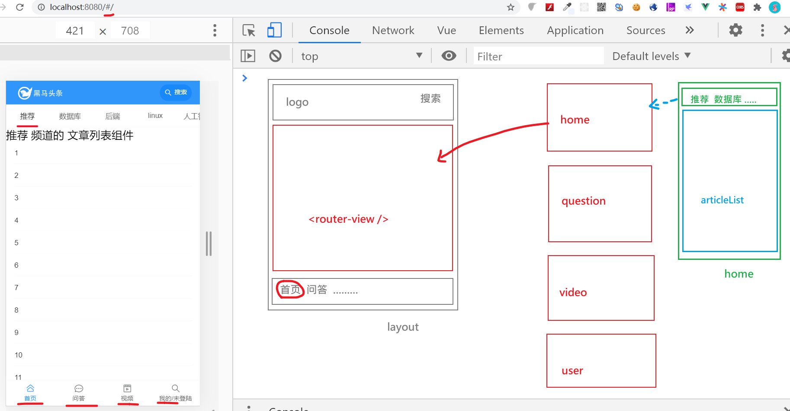
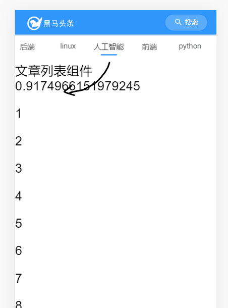
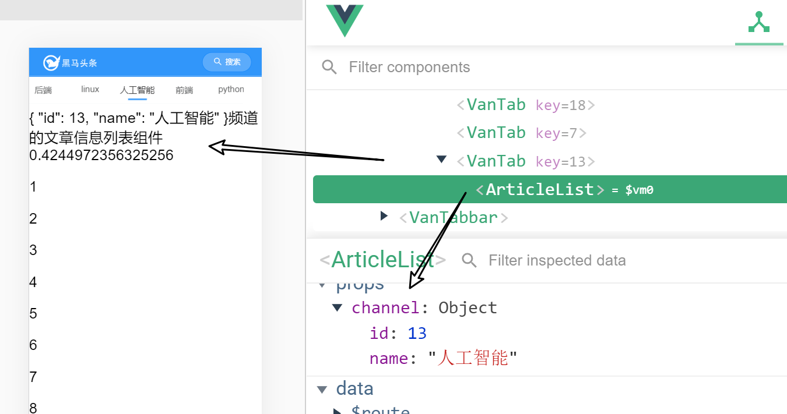
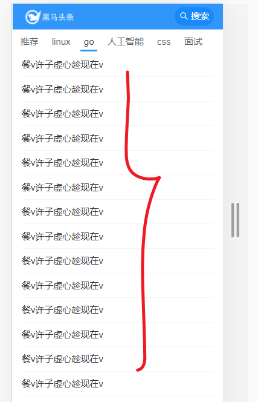
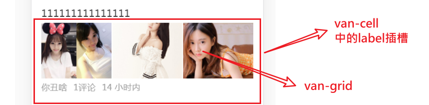
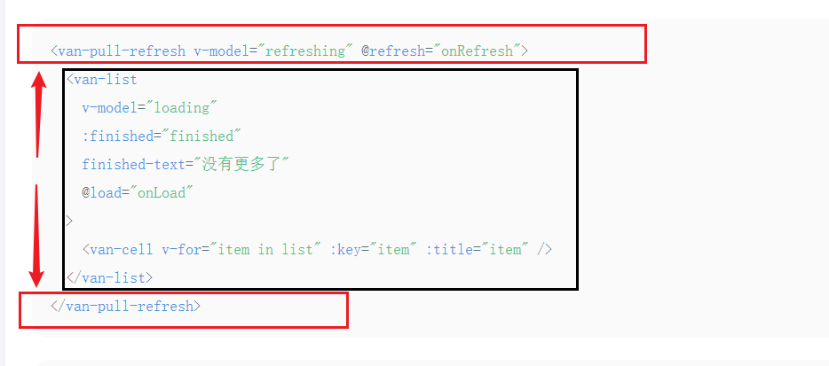
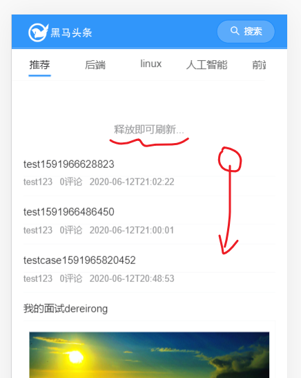
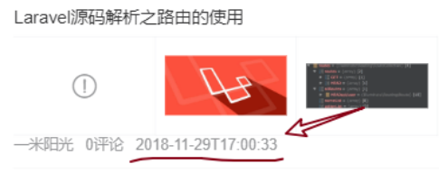
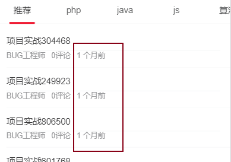

目标


- 数据显示
- 实现文章列表的**上拉加载**（进入主页之后，取出一些文章来，手指向上，相当于是翻页。）
- **下拉刷新**功能

涉及vant组件如下：

- [van-list组件](https://youzan.github.io/vant/#/zh-CN/list#ji-chu-yong-fa): 上拉加载
- [van-pull-refresh](https://youzan.github.io/vant/#/zh-CN/pull-refresh#ji-chu-yong-fa)组件: 下拉刷新
- van-cell
- van-grid
- van-image

要点：

- 要在项目中使用全局过滤器来处理日期时间


## 文章列表-整体分析


整体逻辑




由于这一块的逻辑比较复杂，所以单独抽出来成一个组件来处理。

目录结构：

```
|-views
|--home/articleList.vue
|--home/home.vue
```


## 文章列表-创建组件并导入使用

### 基本结构

创建文件home/articleList.vue，基本内容如下

```html
<template>
  <div class="scroll-wrapper">
    文章列表组件 {{Math.random()}}
    <p v-for="i in 50" :key="i">{{i}}</p>
  </div>
</template>

<script>
export default {
  name: 'ArticleList'
}
</script>

<style scoped lang='less'></style>
```

这个结构只是暂时的，后面再来做扩展。

### 在home.vue中使用

文件：src/views/home/home.vue

步骤：

1. 引入组件

```
import ArticleList from './articleList'
```

2. 注册组件

```javascript
components: {
    ArticleList
},
```

3. 使用组件：

```diff
<template>
  <div class="index">
    <!-- 频道列表
    https://vant-contrib.gitee.io/vant/#/zh-CN/tab#biao-qian-lan-gun-dong
    -->
    <van-tabs>
      <van-tab
        v-for="channel in channels"
        :title="channel.name"
        :key="channel.id">
<!-- 频道与文章列表是一一对应的。每个频道都需要有一个文章列表组件。
article-list写在了v-for中，则每次循环都会生成一个文章列表组件。
van-tab具有类似于 懒加载的效果： 只有激活了当前的tab，才会去创建文章列表组件 -->
+        <article-list ></article-list>

      </van-tab>
    </van-tabs>

    <!-- 文章列表 -->
  </div>
</template>
```

注意事项：

- 每一个频道下，就会有一个articleList
- van-tabs会产生**懒加载**的效果：“只有激活了某个标签，才会去加载ArticleList”


### 验收效果




## 文章列表-频道信息传递（父传子）

### 目标及思路

**目标**：从home.vue组件中把当前频道信息传给articleList.vue，以供在articleList.vue中根据频道信息来获取具体的文章列表内容

**思路：**在**父组件**index.vue把当前的频道传给**子组件**articleList.vue

### 步骤

1. 在父组件中传名为channel的属性给子组件

```diff
<template>
  <div class="index">
    <!-- 频道列表
    https://vant-contrib.gitee.io/vant/#/zh-CN/tab#biao-qian-lan-gun-dong
    -->
    <van-tabs>
      <van-tab
        v-for="channel in channels"
        :title="channel.name"
        :key="channel.id">
<!-- 频道与文章列表是一一对应的。每个频道都需要有一个文章列表组件。
article-list写在了v-for中，则每次循环都会生成一个文章列表组件。
van-tab具有类似于 懒加载的效果： 只有激活了当前的tab，才会去创建文章列表组件 -->

        <!-- 把当前的频道信息传给子组件 -->
+        <article-list :channel="channel"></article-list>

      </van-tab>
    </van-tabs>

    <!-- 文章列表 -->
  </div>
</template>
```

2. 在子组件articleList中接收prop

   props

```
props: {
	channel: {
		type: Object,
		required: true
	}
},
```

​	修改以验收效果

```
<div class="scroll-wrapper">
    {{channel}}频道的文章信息列表组件 {{Math.random()}}
    <p v-for="i in 50" :key="i">{{i}}</p>
  </div>
```


### 效果

使用vue调试工具，检测结果。




## 文章列表-集中学习van-list

### 目标

 引入[van-list组件](https://youzan.github.io/vant/#/zh-CN/list#ji-chu-yong-fa) 来实现上拉加载。

>  这个上拉加载功能在vant的list组件中已经集成了。

在articleList中，要做两个交互:

1. 上拉加载更多。手指向上滑动。（放在底部，类似于分页）
2. 下拉刷新。按下手指向下拉动。（获取最新内容，放在头部）

这两个效果在van-list组件已经实现了，我们只需去学习如何使用就行了。


### 基础结构

下面的基础结构代码是从van-list文档中摘抄回来的

```vue
<div class="scroll-wrapper">
    {{channel}}频道的文章信息列表组件 {{Math.random()}}
    <!--
      van-list自带上拉加载更多 的效果
      原理：
        1）数据项在list中
        2）在显示数据时，如果当前的数据不足一屏，它会 自动调用 onLoad去加载数据
           在onload是要通过ajax取回新数据
           - 把数据追加到list中（list的内容会越来越多）
           - 把loading手动设置为false
           - 判断是否所有的数据已经加载完成，如果是，则把finished设为true
        3) 如果手动向上拉，且finished不为true, 也会去调用onLoad
    -->
    <van-list
      v-model="loading"
      :finished="finished"
      finished-text="没有更多了"
      @load="onLoad"
    >
      <van-cell v-for="item in list" :key="item" :title="item" />
    </van-list>
  </div>
<script>
 data () {
    return {
      list: [], // 数据项
      loading: false, // 是否正在加载...
      finished: false // 是否所有的数据全部加载完成
    }
  },
  created () {
    // 创建组件完成，会自动调用created
    console.log(Date.now(), this.channel)
  },
  methods: {
    onLoad () {
      // 异步更新数据
      // setTimeout 仅做示例，真实场景中一般为 ajax 请求
      setTimeout(() => {
        for (let i = 0; i < 10; i++) {
          this.list.push(this.list.length + 1)
        }

        // 加载状态结束
        this.loading = false

        // 数据全部加载完成
        if (this.list.length >= 40) {
          this.finished = true
        }
      }, 1000)
    }
  }
</script>
```

### 工作原理

list组件的[数据加载机制](https://youzan.github.io/vant/#/zh-CN/list#list-de-yun-xing-ji-zhi-shi-shi-me)：

- 如果当前的内容不够一屏，它会自动调用onLoad事件的回调函数去加载数据，并填入数据。

- `List`有以下三种状态，理解这些状态有助于你正确地使用`List`组件：

  - 非加载中，`loading`为`false`，此时会根据列表滚动位置判断是否触发`load`事件（列表内容不足一屏幕时，会直接触发）
  - 加载中，`loading`为`true`，表示正在发送异步请求，此时不会触发`load`事件
  - 加载完成，`finished`为`true`，此时不会触发`load`事件

  在每次请求完毕后，需要手动将`loading`设置为`false`，表示加载结束

## 文章列表-获取数据并显示

### 接口准备

在src/api目录下创建article.js文件，用来处理与文章相关的操作。

并补充一个方法如下：

```javascript
import request from '@/utils/request.js'

/**
 * 根据频道id和时间戳获取文章列表
 * @param {*} channelId 频道编号
 * @param {*} timestamp 时间戳
 */
export const getArticles = (channelId, timestamp) => {
  const t = request({
    method: 'GET',
    url: '/app/v1_1/articles',
    params: {
      channel_id: channelId,
      timestamp: timestamp, // 时间戳，请求新的推荐数据传当前的时间戳，请求历史推荐传指定的时间戳
      with_top: 1
    }
  })
  console.log('getChannels:', t)
  return t
}
```

说明：

- 接口使用v1_1版本。固定with_top为1。
- 参数说明：
  - channelId: 当前频道编号
  - timestamp: 时间戳。请求新的推荐数据传当前的时间戳，请求历史推荐传指定的时间戳
  - with_top: 1 。固定为1。

- 在使用axios时，如果文档中的要求参数是以query的方式来传，则应该写在params中。

### 导入接口

在article.vue中，应该先去导入这个接口

```
import { getArticles } from '@/api/article.js'
```

### 接口调用


在articleList.vue组件中，当进入页面时，由于不满一屏，所以van-list会自动调用onload方法，因此， 我们可以直接在onload方法去调用getAritcles来加载数据。


```javascript
async onLoad () {
      // 1) 发ajax取数据
      const rs = await getArticles(this.channel.id, Date.now())
      const arr = rs.data.data.results // 本身是一个数组
      // 2) 把arr中的数据追加到list
      this.list.push(...arr)

      // 3) 手动把loading设置为false
      this.loading = false

      // 4) 判断是否加载完成
      if (arr.length === 0) {
        this.finished = true
      }
      // this.finished = arr.length ? false : true
    }
```

注意： 调用时机不是created

### 渲染视图

因为list中的每一项都是一个对象：表示一篇文章，所以，要调整一下v-for指令中的key, title。

具体如下：

```
<van-list
      v-model="loading"
      :finished="finished"
      loading-text="一大波数据正在赶过来"
      finished-text="讨厌，人家被你看完了"
      @load="onLoad"
    >
      <van-cell v-for="article in list"
      :key="article.art_id"
      :title="article.title" />
    </van-list>
```

测试效果




## 文章列表-获取数据补上时间戳

### 目标

确保获取文章列表时，在时间上的连续性（**越向上滑动，得到的文章越旧**），得到类似于分类的上一页，再上一页。

### 思路

根据接口文档的要求，把上一次请求回来的数据中的pre_timestamp保存下来，以便在下一次发请求时带上，如此循环。

### 步骤

1. 补充一个数据项timestamp，初值为当前时间戳
2. 在发请求时带上它
3. 数据回来之后，更新它

```javascript
data () {
    return {
      list: [],
      timestamp: Date.now(),
      loading: false, // 是否正在加载
      finished: false // 是否完成全部的加载
    }
  },
  methods: {
    async onLoad () {
      // 1) 发ajax取数据
      const rs = await getArticles(this.channel.id, this.timestamp)
      //  1. 列表数据
      const arr = rs.data.data.results // 本身是一个数组
      //  2. 时间戳
      this.timestamp = rs.data.data.pre_timestamp
      // 2) 把arr中的数据追加到list
      this.list.push(...arr)

      // 3) 手动把loading设置为false
      this.loading = false

      // 4) 判断是否加载完成
      if (arr.length === 0) {
        this.finished = true
      }
      // this.finished = arr.length ? false : true
    }
  }
```


## 文章列表-文章项布局

### **目标**



知识点：

- van-cell 中的插槽[label](https://youzan.github.io/vant/#/zh-CN/cell#cell-slots)  ： 作用是整体包裹，显示在标题下方。
- van-grid ：宫格图布局。用它可以将一行均分几列
- van-image：用它来显示图片

### 结构代码

```html
<van-cell
      v-for="article in list"
      :key="article.art_id"
      :title="article.title">
        <div slot="label">
          <!-- 图片区域
          column-num： 用来等分几列，有几张图就有几列
          -->
          <van-grid
          :column-num="article.cover.images.length"
          v-if="article.cover.images.length">
            <van-grid-item
              v-for="url in article.cover.images"
              :key="url">
              <van-image :src="url"/>
            </van-grid-item>
          </van-grid>

          <!-- 文字区域 -->
          <div class="meta">
            <span>{{article.aut_name}}</span>
            <span>{{article.comm_count}}评论</span>
            <span>{{article.pubdate}}</span>
          </div>
        </div>
      </van-cell>
```

说明：

- 从后端取出来的每篇文章中，最多有三张图。具体分成如下三种情况：
  - 三图
  - 一图
  - 无图。
- 图片保存在`cover.images`中。


### 样式

让文字区的内容隔开一点

```less
<style scoped lang='less'>
.meta {
  span{
    margin-right: 10px;
  }
}
</style>
```


## 文章列表-实现下拉刷新

### 目标

当用户向下拉动页面时，用**当前的时间戳**去请求接口，以得到最新的数据，再把数据填充到页面的`最上方`，以实现下拉刷新的功能。

### 思路

[van-pull-refresh](https://youzan.github.io/vant/#/zh-CN/pull-refresh#ji-chu-yong-fa)组件已经集成了下拉刷新的这个功能，直接使用即可。

### 基本结构

先来看van-pull-refresh的基本结构，如下

```
<van-pull-refresh>

   你的内容！只要被van-pull-refresh包起来，就具备下拉刷新的效果
  
</van-pull-refresh>
```

示例

```javascript
<van-pull-refresh v-model="isLoading" @refresh="onRefresh">
  <p>刷新次数: {{ count }}</p>
</van-pull-refresh>
import { Toast } from 'vant';

export default {
  data() {
    return {
      count: 0,
      isLoading: false
    }
  },
  methods: {
    onRefresh() {
      setTimeout(() => {
        Toast('刷新成功');
        this.isLoading = false;
        this.count++;
      }, 1000);
    }
  }
}
```

说明：

- 下拉刷新时会触发 `refresh` 事件，在事件的回调函数中可以进行同步或异步操作，操作完成后将 `v-model` 设置为 `false`，表示加载完成。


### 完成结构

按上面对van-pull-refresh的分析，直接在van-list的外面包一个van-pull-refresh即可。



代码如下：

**视图**

```diff
<template>
  <div class="scroll-wrapper">
+    <van-pull-refresh v-model="refreshing" @refresh="onRefresh">
      <van-list>
      	.......
      </van-list>
+    </van-pull-refresh>
  </div>
</template>
```


**数据项**

补充一个isLoadingNew

```
data () {
    return {
      list: [], // 数据,每一项就是一篇文章
      timestamp: null,
+     refreshing: false, // 是否正在下拉刷新
      loading: false, // 是否正在加载
      finished: false // 是否所有的数据全部加载完成
    }
  }
```

**代码**

补充onRefresh函数，以响应refresh事件

```javascript
async onRefresh () {
  // 重新发一次请求，取回最新的数据，把新数据添到list头部

  console.log('重新发一次请求，取回最新的数据，把新数据添到list头部')

  // 1) 发ajax取数据
  const rs = await getArticles(this.channel.id, Date.now())
  const arr = rs.data.data.results // 本身是一个数组

  // 2) 把arr中的数据添加到list的头部（前面）
  this.list.unshift(...arr)
  // 3) 刷新结束
  this.refreshing = false

  // 4). 提示
  this.$toast(`更新${arr.length}条数据`)
}
```

注意：

- 要设置getArticles的第二个参数（timestamp）是**最新的时间戳**。

### 效果




## 文章列表-相对时间处理-目标及思路


### 目标

把如下 时间：



格式成如下：


### 解决方案

- [dayjs](https://day.js.org/zh-CN/) + **vue过滤器**
- 考虑这个功能可能在其它的项目中也会用到，所以，我们封装成一个模块

### 步骤

#### 封装模块

对日期进行格式化是一个非常常见的功能（与axios一样），所以我们进行封装以便在其它项目中也能使用。

封装插件：在src/utils/下创建一个datetime.js。`src/utils/datetime.js`

```javascript

export const relativeTime = timeData => {
  // 对 timeData 进行格式化后，再返回
  console.log(timeData)
  return '1个月前'
}

// export const xxxx = () => {

// }

```

#### 复习全局过滤器

要在项目中使用全局过滤器，这样就可以在所有组件内部来使用了。

**全局过滤器的格式**

定义：

```
Vue.filter('过滤器名'，function(过滤前的值){return 过滤之后的值})
```

使用

```
<template>
   {{val | 过滤器名}}
</template>
```

#### 项目代码

main.js

```diff
import Vue from 'vue'
import App from './App.vue'
import router from './router'
// 脚手架自动创建的vuex.store
import store from './store'
// 引入vant组件库
// 全局导入，全部的vant可以直接使用
import Vant from 'vant'
import 'vant/lib/index.css'

// 它会根据的手机尺寸来调整rem的基准值：html标签上的font-size。
import 'amfe-flexible'

import '@/styles/index.less'

+ import { relativeTime } from '@/utils/datetime.js'

// 注册全局过滤器，对时间进行处理
+ Vue.filter('relativeTime', relativeTime)

Vue.use(Vant)

Vue.config.productionTip = false

new Vue({
  router,
  store,
  render: h => h(App)
}).$mount('#app')

```


#### 在模块中使用

views/home/articleList.vue

前面成功注册了过滤器了，现在就可以直接使用了。

```diff
<div class="meta">
    <span>{{ item.aut_name }}</span>
    <span>{{ item.comm_count }}评论</span>
+    <span>{{ item.pubdate | relativeTime}}</span>
</div>
```

上面的`item.pubdate` 就是我们要处理的时间了。


效果如下：




## 文章列表-相对时间处理-引入dayjs

[dayjs](https://day.js.org/zh-CN/)是一个专门用来处理日期相关需的js库。


### 安装包

[dayjs](https://day.js.org/docs/zh-CN/i18n/changing-locale)

```
npm i dayjs
```

### 引入并使用包的功能

在src/utils/datetime.js中

```javascript
import dayjs from 'dayjs'
import reTime from 'dayjs/plugin/relativeTime'
import 'dayjs/locale/zh-cn'

// var reTime = require('dayjs/plugin/relativeTime')
dayjs.extend(reTime) // 使用插件
// 语言包
// require('dayjs/locale/zh-cn')

dayjs.locale('zh-cn') // 全局使用简体中文

export const relativeTime = val => {
  return dayjs().to(dayjs(val))
}

// export const xxxx = () => {

// }

```

注意：

1. dayjs的官网上写的使用方式用的到的是require（它是nodejs中的模块化），在这里，我们改成import 与es6模块化一致。
2. 使用它的插件和语言包。


## 文章列表-图片懒加载

### 目标

在文章列表中很多文章，每一个文章都有可能有图（1，3张），在加载文章列表时，对其中的图片进行懒加载处理是很有必要的：并不是一开始就加载全部的图片，而当某张图快要进入可见区域时，再去加载。

参考：[图片懒加载](https://youzan.github.io/vant/#/zh-CN/image#tu-pian-lan-jia-zai)

> 图片数据（就是url地址）取回来之后，不是**立刻设置**给image的src属性。
>
> > 只要设置了src 属性，浏览器就会立即去请求src中的那张图。
>
> 而是当这张图片处于可见区域（或者是快了接近）时，就去设置src属性去求图片。

### 操作

在vant中有现成的懒加载指令。

1. 在**main.js**中，引入Lazyload指令

```diff
// 引入Vant所有的组件
// 在vant这模块中如下两种导出模块的方式同时存在:
// export default  默认导出
// export {Lazyload}  普通导出
//
// 在导入的时，XXX ---> Vant
//            Lazyload 就是 普通导出 Lazyload
+ import Vant, { Lazyload } from 'vant'

// ......

// 使用懒加载
+ Vue.use(Lazyload)
```

2. 在 articleList.vue组件中使用

```diff
<van-grid :column-num="item.cover.images.length">
    <van-grid-item v-for="(img,idx) in item.cover.images" :key="idx">
+    <van-image lazy-load :src="img" />
    </van-grid-item>
</van-grid>
```

注意：如果不提前引入Lazyload指令，这里的懒加载将会报错。

