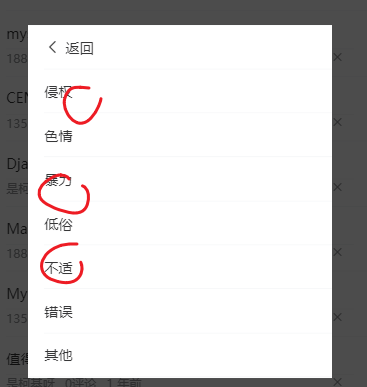

目标：对于已经登陆的用户，可允许他们去关闭某篇文章，或者是反馈内容。

技能点：

- JSONBig
- 父子组件事件通信


## 整体分析

这个部分的功能比较复杂，也单独抽成一个组件。

组件划分：

```
|---home/home.vue
|---home/articleList.vue # 文章列表
|---home/moreAction.vue  # 更多操作
```

嵌套关系:


## 更多操作组件-基本内容

这个组件有两种视图状态：


通过其内部一个bool类型的数据isReport来切换这两种视图。

home/moreAction.vue

```html
<template>
  <div class="more-action">
    <!-- 状态一 -->
    <van-cell-group v-if="!isReport">
      <van-cell>不感兴趣</van-cell>
      <van-cell is-link @click="isReport=true">反馈垃圾内容</van-cell>
      <van-cell>拉黑作者</van-cell>
    </van-cell-group>
    <!-- 状态二 反馈-->
    <van-cell-group v-else>
      <van-cell icon="arrow-left" @click="isReport=false">返回</van-cell>
      <van-cell>侵权</van-cell>
      <van-cell>色情</van-cell>
      <van-cell>暴力</van-cell>
      <van-cell>低俗</van-cell>
      <van-cell>不适</van-cell>
      <van-cell>错误</van-cell>
      <van-cell>其他</van-cell>
    </van-cell-group>
  </div>
</template>

<script>
export default {
  name: 'MoreAction',
  data () {
    return {
      isReport: false // 是否是处于状态二：反馈
    }
  }
}
</script>

<style lang='less' scoped>
.more-action {
  border-radius: 4px;
}
</style>
```


## 更多操作组件-在父组件中使用

### 思路

这个组件放在文章列表中。


articleList.vue中引入moreAction并使用。这里要用到[van-popup](https://youzan.github.io/vant/#/zh-CN/popup)组件来包含内容。

### 步骤

第一步：在index.vue引入组件

```javascript
import MoreAction from './moreAction.vue'
```


第二步：在视图中使用组件

在外层套一个[van-popup](https://youzan.github.io/vant/#/zh-CN/popup)包裹住moreAction，以提供弹层的效果。

src/view/home/articleList.vue

```html
  <van-pull-refresh v-model="refreshing" @refresh="onRefresh">
      <van-list
        v-model="loading"
        :finished="finished"
        finished-text="讨厌，人家被人看完了~~"
        @load="onLoad"
      >
      // 省略...
      </van-list>
    </van-pull-refresh>

    <!-- 更多操作-弹层 -->
    <van-popup v-model="isShowMoreAction" :style="{ width: '80%' }">
      <more-action
      ref="refMoreAction"
      @report="hReport"
      @uninterested="hUninterested"></more-action>
    </van-popup>
```

- 用van-popup来包含内容。

第三步：补充数据项

- 设置一个showMoreAction来控制是否显示popup的显示

  view/home/articleList.vue

```diff
data () {
    return {
+     isShowMoreAction: true, // 是否显示弹层组件
      channels: [] // 频道列表
    }
  }
```


### 测试效果

直接在vue调试工具中通过修改isShowMoreAction


## 更多操作组件-在articlelist中激活

### 目标

允许用户的交互操作来显示moreAction组件


对于登陆用户（不登陆则不会显示关闭按钮），在文章列表中的每篇文章后，附一个**关闭**按钮,用户点击之后，弹出moreAction组件。

### 思路

- 修改aticleList视图。如果是登录用户，则额外提供一个关闭按钮。可以根据vuex来判断。

  

### aticleList 修改视图， 补充关闭按钮

如果是登录用户，则额外提供一个关闭按钮

```diff
<!-- 文字说明 -->
            <div class="meta">
              <span>{{item.aut_name}}</span>
              <span>{{item.comm_count}}评论</span>
              <!-- 使用过滤器 -->
              <span>{{item.pubdate | relativeTime}}</span>

              <!-- 如果是登陆用户(有没有token)，则显示x按钮 -->
+             <span class="close" v-if="$store.state.tokenInfo.token">
+                 <van-icon name="cross"></van-icon>
+             </span>

            </div>
```

样式：把X按钮放在最右边。

```
.meta {
  span {
    margin-right:10px;
  }
  display:flex;
  .close{
    // 让它在最右边
    // 它的父级容器是flex的，给当前元素设置左外边距为auto，会让这个元素在父级容器
    // 的最右边
    margin-left:auto;
  }
}
```


### aticleList.vue 添加点击事件回调

在x按钮上添加点击事件，在回调函数中做两件事：

- 显示弹层

- 保存当前文章编号

  

视图

```diff
<!-- 如果登陆用户，则显示x按钮
如何知道当前用户是否登陆？ 去vuex中查看，是否有token
@click="hClose": 用来向父组件发布事件
-->
<span 
+  @click.stop="hCloseBtn(article)" 
 class="close" v-if="$store.state.tokenInfo.token">
                <van-icon name="cross"></van-icon>
              </span>
```

方法

```javascript
// 用户点击了关闭按钮
hCloseBtn (article) {
  this.isShowMoreAction = true
}
```

### 效果


## 更多操作组件-文章编号之大数处理


在获取文章编号进行传递时，先要做大数处理： 因为后端接口返回的文章编号数值超过js中最大安全整数，所以导致数据精度的丢失。因此，这里要先用json-big做处理。

### 大数值处理

安装json-bigint包

```
npm i json-bigint
```

关键字：

- JSONBig
- axios的transformResponse

后端回传的真实id是19位的数值，超过了js能表达的最大安全整数，所以要引入一个额外的包JSONBig来处理这个问题。


在src/utils/request.js中

```diff
// 在一个普通的模块中去获取vuex中的值
// 直接import
import store from '@/store/index.js'

+ import JSONBig from 'json-bigint' // 引入大数字包

const instance = axios.create({
  baseURL: 'http://ttapi.research.itcast.cn',
  // baseURL: 'http://api-toutiao-web.itheima.net',
+  transformResponse: [function (data) {
    // 由于后端返回的数据有出现大数问题（文章编号）,这里使用json-bigint处理一下
    // 优先使用JSONBig转一下
+    try {
+      return JSONBig.parse(data)
+    } catch (err) {
+      return data
+    }
+  }]
})

// ...
```

- transformResponse发生在axios 的响应拦截器之前。
- JSONBig.parse()用来处理大数。


### 获取文章编号

**代码**

```
// 用户点击了关闭按钮
hCloseBtn (article) {
  this.isShowMoreAction = true
  this.articleId = article.art_id.toString()
  console.log('当前要删除的文章是', this.articleId)
}
```


## 更多操作-实现“不感兴趣”-基本思路

### 思路分析

在弹出的moreAction组件中，点击 `不感兴趣`，要做如下三件事：

1. **去调用接口**。让服务器之后不要再推类似的文章给我了。

2. 退出弹层

3. 把我点击的文章删除掉。

   A:在后端服务器上删除这个文章（错误）

   B:在当前articleList组件中删除文章（正解）

以上三件事，是在aritcleList.vue组件中来做的。


## 更多操作-实现“不感兴趣”-事件传递

事件的子传父

### 示意图


### 代码

第一步：在子组件moreAction.vue中抛出事件

```html
<!-- 直接抛出事件，具体功能由父组件index.vue去做 -->
<van-cell @click="$emit('uninterested')">不感兴趣</van-cell>
```

第二步：在父组件articleList.vue中监听事件

```diff
<!-- 文章--更多操作 -->
    <!-- 1. 在子组件监听不感兴趣 -->
    <van-popup v-model="showMoreAction" :style="{ width: '80%' }">
      <more-action 
+      @uninterested="hUninterested"
      ></more-action>
    </van-popup>
```

第三步：在父组件articleList.vue写回调

```javascript
async hUninterested () {
  try {
    // 1. 调用接口，传文章编号

    // 2. 关闭弹层
    this.isShowMoreAction = false
    // 3. 删除文章

    this.$toast.success('操作成功')
  } catch (err) {
    this.$toast.fail('操作失败')
  }
}
```

后面，再来写具体的另外两件事：

- 发请求
- 在页面上删除文章

**效果**


## 更多操作-实现“不感兴趣”-封装并调用接口

### 封装

在src/api/article.js中添加一个方法，调用接口

```
/**
 * 用户不感兴趣某个文章
 * @param {*} articleID 文章编号
 */
export const disLike = articleID => {
  return ajax({
    method: 'POST',
    url: '/app/v1_0/article/dislikes',
    data: {
      target: articleID
    }
  })
}
```

通过阅读接口文档，分析出要传入的参数。

注意：url地址中不要有多余的空格！


### 调用

articleList.vue中引入封装的方法

```
import { dislike } from '@/api/article.js'
```

调用方法

```javascript
async hUninterested () {
      try {
        // 1. 调用接口，传文章编号
        const res = await dislike(this.articleId)
        console.log(res)
        // 2. 关闭弹层
        this.isShowMoreAction = false
        // 3. 删除文章

        this.$toast.success('操作成功')
      } catch (err) {
        this.$toast.fail('操作失败')
      }
    }
```


接下来实现删除那个被点击的文章。


## 更多操作-实现“不感兴趣”-本地数据删除

>  问：删除是否需要从数据库中删除？
>
>  答：不是对后端数据的删除（别人可能还要看），只是在本地删除。

### 分析


### 封装一个方法来实现这个删除的动作

封装一个方法来实现这个删除的动作

```javascript
// 用户点击了不感兴趣
async hUninterested () {
  try {
    // 1. 调用接口，传文章编号
    const res = await dislike(this.articleId)
    console.log(res)
    // 2. 关闭弹层
    this.isShowMoreAction = false
    // 3. 通知所有的文章列表去删除这个文章
    this.removeArticle(this.articleId)
    this.$toast.success('操作成功')
  } catch (err) {
    this.$toast.fail('操作失败')
  }
},
  // 在当前的list中去删除这个articleId的文章
  removeArticle (articleId) {
    // 1. 找这个文章在list中的下标
    // findIndex:如果找到就返回下标，如果找不到，就返回-1
    const idx = this.list.findIndex(article => article.art_id.toString() === articleId)
    if (idx === -1) {
      // 找不到
      return
    }
    // 2. 删除它
    this.list.splice(idx, 1)
  }
```


## 更多操作-状态切换-重置

在moreAction中，如果是在这种状态退出的，则下次再打开时，它也是这个状态。原因是isReport被设置成了true。


思路：

- 只要点击了x ,就把moreAction中的isReport设置为false

知识点：

- 如何在父组件中去修改子组件的数据？`this.$refs.refMoreAction.isReport = false`-
- 步骤：
  - 1. 给子组件添加引用。它子组件补充一个 ref.
    2. 通过this.$refs.子组件引用.子组件数据=新值。
  - 注意：一定要确保这个子组件已经被创建出来了。

视图：

```diff
<!-- 文章--更多操作 -->
<!-- 1. 在子组件监听 不感兴趣 -->
<!-- 2. 在子组件监听 举报文章 -->
<!-- 添加ref属性是为了能够在父组件index.vue中通过this.$refs.refMoreAction
来获取more-action组件的引用 -->
<!-- moreAction组件只有当van-popup显示时，才会去创建 -->
<van-popup v-model="showMoreAction" :style="{ width: '80%' }">
    <more-action
+                ref="refMoreAction"
                 @report="hReport"
                 @dislike="hDislike">
    </more-action>
</van-popup>
```

代码

在index.vue中，在收到用户点击x时，对isReport进行重置

```diff
// 父组件收到了子组件中 有人点击关闭按钮 的事件
    // 1. 显示弹层
    // 2. 确保moreAction中的isReport是false
    // 3. 保存要处理的文章的编号
    hCloseBtnClick (articleId) {
      this.isShowMoreAction = true
      // console.log('收到从子组件中传过来的文章编号', articleId)
      // 2. 确保moreAction中的isReport是false
      // 如何在父组件中操作子组件中的数据？
      // console.log(this.$refs.refMoreAction)
      if (this.$refs.refMoreAction) {
        this.$refs.refMoreAction.isReport = false
      }
      this.articleId = articleId
    },
```


在父组件中通过对子组件的引用，获取子组件，并修改子组件的数据

## 更多操作-实现举报文章-基本分析



目标：与不感兴趣类似，提供更具体的举报功能。

## 更多操作-实现举报文章-举报类型封装

### 抽出常量

通过阅读**接口文档**


把后端需要的举报类型方案抽出来，封装成一个常量数组

创建src/constant/reports.js

```
// 以模块的方式导出 举报文章 时，后端接口约定的举报类型
const reports = [
  {
    value: 0,
    label: '其它问题'
  },
  {
    value: 1,
    label: '标题夸张'
  },
  {
    value: 2,
    label: '低俗色情'
  },
  {
    value: 3,
    label: '错别字多'
  },
  {
    value: 4,
    label: '旧闻重复'
  },
  {
    value: 6,
    label: '内容不实'
  },
  {
    value: 8,
    label: '侵权'
  },
  {
    value: 5,
    label: '广告软文'
  },
  {
    value: 7,
    label: '涉嫌违法犯罪'
  }
]
export default reports

```

这个模块就可以在视图中引入并渲染了。

### 页面渲染

在moreAction.vue中，引入上面封装的常量 ，并循环输出来。

数据：

```
// 从常量模块中导入
import reportTypeList from '@/constant/report.js'
console.log(reportTypeList)
export default {
  name: 'MoreAction',
  data () {
    return {
      // reportTypeList: reportTypeList,
      reportTypeList,
      isReport: false // 是否是处于状态二：反馈
    }
  }
}
```

视图

```html
<!-- 状态二 反馈-->
    <van-cell-group v-else>
      <van-cell icon="arrow-left" @click="isReport=false">返回</van-cell>
      <van-cell v-for="item in reportTypeList" :key="item.value">
        {{item.label}}
      </van-cell>
    </van-cell-group>
```

### 效果：


## 更多操作-实现举报文章-事件传递

- 子组件抛出事件
- 父组件调用接口

### 在子组件抛出事件

```diff

<!--
@click="$emit('report', item.value)"
向父组件抛出事件，传递举报的具体类型（数值）
-->
<van-cell
          v-for="item in reportTypeList"
          :key="item.value"
+          @click="$emit('report', item.value)"
          >
  {{item.label}}
</van-cell>

```

要做的三件事，也是应该放在父组件index.vue中去做

- 抛出事件给父组件(index.vue)：`@click="$emit('report', item.value)"`

### 在父组件监听report事件

在home/articleList.vue中监听事件。

```diff
<van-popup v-model="isShowMoreAction" :style="{ width: '80%' }">
      <more-action
+      @report="hReport"
      @uninterested="hUninterested"></more-action>
    </van-popup>
```

补充一个hReport方法：

```
// 用户举报文章
    async hReport (typeId) {
      try {
        // 1. 调用接口，传文章编号
        
        // 2. 关闭弹层
        this.isShowMoreAction = false
        // 3. 删除这个文章
        this.removeArticle (this.articleId)

        this.$toast.success('举报成功')
      } catch (err) {
        this.$toast.fail('举报失败')
      }
    }
```


## 更多操作-实现举报文章-封装api

查询接口文档，分析参数，然后在src/api/article.js中补充一个方法

```

/**
 * 举报文章
 * @param {*} articleId  文章编号
 * @param {*} reportType 举报类型
 */
export const report = (articleId, reportType) => {
  return request({
    method: 'POST',
    url: '/app/v1_0/article/reports',
    data: {
      target: articleId,
      type: reportType
    }
  })
}
```

### 调用api

在父组件src/home/index.vue中,引入api

```javascript
import { dislike, report } from '@/api/article.js'
```

使用

```javascript
// 用户举报文章
    async hReport (typeId) {
      try {
        // 1. 调用接口，传文章编号
        const res = await report(this.articleId, typeId)
        console.log(res)
        // 2. 关闭弹层
        this.isShowMoreAction = false
        // 3. 删除这个文章
        this.removeArticle (this.articleId)

        this.$toast.success('举报成功')
      } catch (err) {
        this.$toast.fail('举报失败')
      }
    }
```


