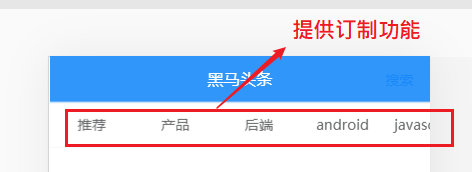
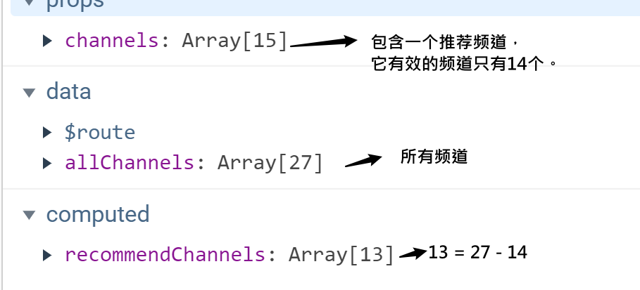
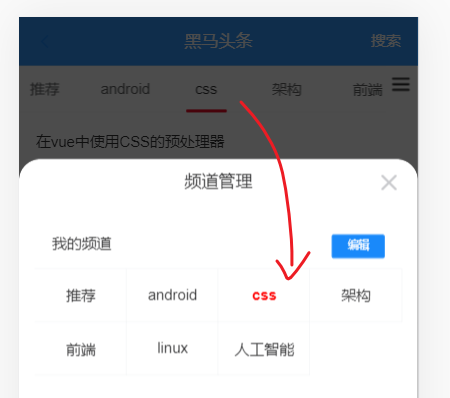
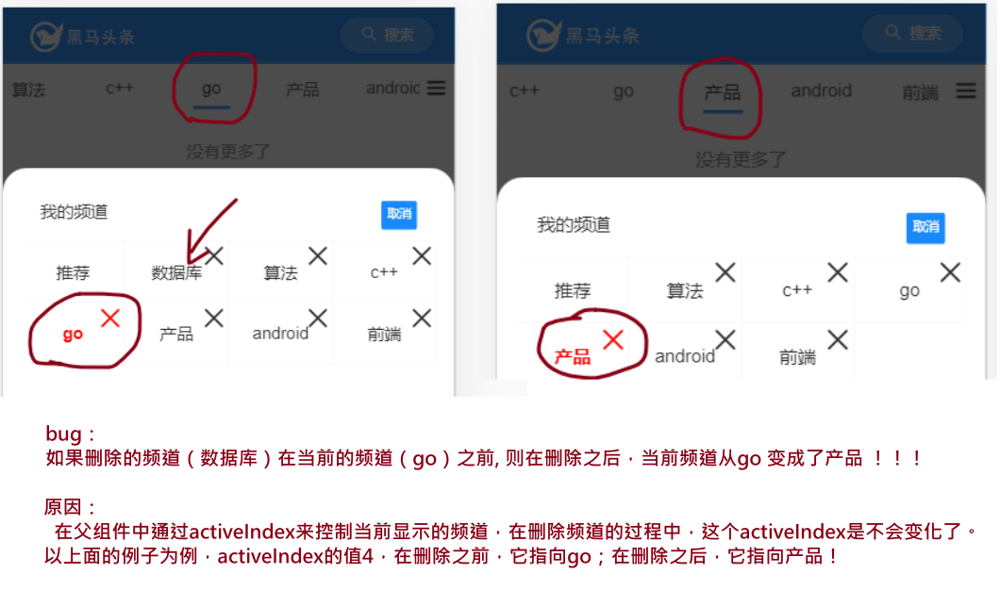

频道管理

在主页中，通过按钮点击，呼出频道管理页，它是以弹出组件来展示的。


目标：

- 让登陆用户可以添加或者删除自已订阅的频道

  


## 基本布局

- 添加一个按钮
- 添加一个弹层
  - 在其中包含channelEdit.vue组件

### 添加频道激活按钮和弹层

在频道列表的右侧，放一个按钮，点击这个按钮就可以弹层，在弹层上面对频道进行编辑。


在 `views/home/index.vue` 中添加按钮和弹层：

```html

<div class='index'>
    <!-- v-model 双向绑定：哪一个下标的频道处于活动状态 -->
    <van-tabs v-model="activeIndex">
      .......
    </van-tabs>

    <!-- 频道列表 开关 通过定位 通过它打开频道管理的弹层 -->
    <div class="bar-btn" @click="isShowChannelEdit=true">
        <van-icon name="wap-nav"/>
    </div>

    <!-- 文章--更多操作 -->
    
  
    <!-- https://vant-contrib.gitee.io/vant/#/zh-CN/action-sheet -->
    <van-action-sheet v-model="isShowChannelEdit" title="标题">
      <p>频道管理</p>
      <p>频道管理</p>
      <p>频道管理</p>
    </van-action-sheet>
  </div>
</div>
```


补充一个控制频道编辑 显示的数据项

```diff
    return {
			// .... 
+     isShowChannelEdit: false, // 是否显示频道编辑弹层
     
    }
```


给它设置一下样式，定位到右侧不动：

styles/index.less

1. 给这个按钮添加样式

```diff
// 频道管理的开关按钮
  .bar-btn {
    position: fixed;
    right: 5px;
    top: 57px;
    display: flex;
    align-items: center;
    background-color: #fff;
    opacity: 0.8;
    z-index:1;
    .van-icon-wap-nav{
      font-size: 20px;
    }
  }
```

测试查看结果。


## 添加channelEdit.vue组件

在首页中添加弹层组件用来展示频道管理，由于功能比较复杂，我们补充一个组件channelEdit.vue

```diff
home/index.uve
home/articleList.vue
home/moreAction.vue
+ home/channelEdit.vue
```

home/channelEdit.vue的内容如下：

```diff
<template>
  <div class="channel-edit">
    <!-- 当前登陆用户已经订阅的频道 -->
    <div class="channel">
      <van-cell title="我的频道" :border="false">
          <van-button  size="mini" type="info">编辑</van-button>
      </van-cell>
      <van-grid>
        <van-grid-item v-for="index in 8" :key="index">
          <span>频道{{index}}</span>
          <van-icon name="cross" class="btn"></van-icon>
        </van-grid-item>
      </van-grid>
    </div>
     <!-- 当前登陆用户没有订阅的频道 -->
    <div class="channel">
      <van-cell title="可选频道" :border="false"></van-cell>
      <van-grid>
        <van-grid-item v-for="index in 8" :key="index">
          <span>频道{{index}}</span>
        </van-grid-item>
      </van-grid>
    </div>
  </div>
</template>

<script>
export default {
  name: 'ChannelEdit',
  data () {
    return {

    }
  }
}
</script>

<style lang="less" scoped>
  .channel{
    padding:15px;
    font-size:14px;
  }
  .btn {
    position: absolute;
    top: 0;
    right: 0;
    font-size: 24px;
}
</style>

```


### 在index.vue中使用组件

引入组件

```diff
import ArticleList from './articleList'
import MoreAction from './moreAction'
+ import ChannelEdit from './channelEdit'
```

注册

```diff
components: {
    ArticleList,
    MoreAction,
+   ChannelEdit
  }
```


视图：

在index.vue，用[van-action-sheet](https://youzan.github.io/vant/#/zh-CN/action-sheet#zi-ding-yi-mian-ban)组件包住channelEdit.vue来做弹层效果

```diff
<!-- 频道管理 -->
<van-action-sheet v-model="showChannelEdit" title="频道管理">
	<channel-edit></channel-edit>
</van-action-sheet>
```


测试查看结果。


## 绑定数据

- 我的频道 :   有现成接口，并且在父组件home.vue中已经获取过的。
- 推荐(可选)频道 ： 所有频道列表 - 我的频道 = 推荐频道

### 我的频道

这里的数据在home.vue中的频道列表中就已经获取过的。 可以从

home/home.vue ---> home/channelEdit.vue （典型的组件父传子）

步骤：

- 在子组件中定义属性(channelEdit.vue)
- 在父组件中给属性传值(index.vue)


#### 在父组件index.vue

向子组件传递属性值

```diff
<!-- https://vant-contrib.gitee.io/vant/#/zh-CN/action-sheet -->
<van-action-sheet v-model="showChannelEdit" title="频道管理">
	<!-- 1. 父传子。把当前订阅频道传给 频道编辑组件 -->
+	<channel-edit :channels="channels"></channel-edit>
</van-action-sheet>
```


#### 在子组件channelEdit.vue

定义props，接收从父组件传过来的数据

```javascript
props: {
    channels: {
      type: Array,
      required: true
    }
  }
```

#### 数据渲染

```html
<!-- 当前登陆用户已经订阅的频道 -->
    <div class="channel">
      <van-cell title="我的频道" :border="false">
        <van-button  size="mini" type="info">编辑</van-button>
      </van-cell>
      <van-grid>
        <van-grid-item v-for="channel in channels" :key="channel.id">
          <span>{{channel.name}}</span>
          <van-icon name="cross" class="btn"></van-icon>
        </van-grid-item>
      </van-grid>
    </div>
```


#### 效果


### 可选频道(就是当前用户没有订阅的)

当前的接口中没有现成的接口可以拿到可选（推荐）频道。但是我们可以使用公式: `系统中所有频道列表 - 我的频道（已经订阅的） = 可选频道`来获取。

实现过程分成两步：

- 获取系统中所有频道，这个是有接口的。
- 计算：
  - 获取我的频道的数据，这个是有接口的，我们在前面已经调用过了。
  - 做`减法`。这个动作使用计算属性来完成。

#### 获取所有频道

1. 添加获取所有频道的接口

在 `api/channel.js` 中新增一个接口

```
/**
 * 获取系统中所有的频道
 */
export const getAllChannels = () => {
  return ajax({
    method: 'GET',
    url: '/app/v1_0/channels'
  })
}

```

2、在子组件channelEdit.vue中加载调用

**导入**

```
import { getAllChannels } from '@/api/channel.js'
```

**调用**

```
<script>
import { getAllChannels } from '@/api/channel.js'
export default {
  name: 'ChannelEdit',
  props: {
    channels: {
      type: Array
    }
  },
  data () {
    return {
      allChannels: []
    }
  },
  created () {
    this.loadAllChannels()
  },
  methods: {
    async loadAllChannels () {
      const res = await getAllChannels()
      this.allChannels = res.data.data.channels
    }
  }
}
</script>
```

效果如下：


#### 计算可选频道

计算属性：可选频道 = 所有频道     -    已订阅的频道

```javascript
// 根据已有数据生成新的数据 ---- 计算属性
    recommendChannels () {
      // 已有频道： [{id:1,name:'a'}]
      // 所有频道： [{id:1,name:'a'},{id:2,name:'b'},{id:3,name:'c'}]

      // 推荐频道： 所有频道 - 已有频道  ===> [{id:2,name:'b'},{id:3,name:'c'}]

      // 对所有频道的数据进行过滤：
      //   保存数据的条件是：当前这个频道没有在已有频道中出现
      const arr = this.allChannels.filter(channel => {
        const idx = this.channels.findIndex(item => item.id === channel.id)
        if (idx === -1) {
          return true
        } else {
          return false
        }
      })
      return arr
      // return this.allChannels - this.channels
    }
```

最后回到浏览器中测试结果。



#### 模板绑定进行展示

获取到了数据之后，再来显示就容易了。

```html
<!-- 当前登陆用户没有订阅的频道 -->
    <div class="channel">
      <van-cell title="可选频道" :border="false"></van-cell>
      <van-grid>
        <van-grid-item v-for="channel in recommendChannels" :key="channel.id">
          <span>{{channel.name}}</span>
        </van-grid-item>
      </van-grid>
    </div>
```

## 频道跳转


目标：当用户在我的频道上点击时：

- 关闭弹窗
- 切换到当前点击的频道上去

思路：

- 子传父，用$emit

步骤：

- 给频道项添加点击事件
- 在点击事件处理函数内，抛出自定义事件给父组件index.vue
- 在父组件中
  - 关闭弹窗
  - 切换到当前点击的频道上去

### channelEdit组件

在channelEdit组件中，给频道项添加点击事件

```diff
<!-- 当前登陆用户已经订阅的频道 -->
    <div class="channel">
      <van-cell title="我的频道" :border="false">
        <van-button  size="mini" type="info">编辑</van-button>
      </van-cell>
      <van-grid>
        <van-grid-item
        v-for="(channel, idx) in channels"
        :key="channel.id"
+        @click="hClickMyChannel(idx)">
          <span>{{channel.name}}</span>
          <!-- <van-icon name="cross" class="btn"></van-icon> -->
        </van-grid-item>
      </van-grid>
    </div>
```

**注意：传下标**

处理点击事件

```javascript
// 用户点击了我的频道，要做频道跳转，通知父组件
hClickMyChannel (idx) {
  // 告诉父组件，当前被前点击的是第几个频道
  this.$emit('update-cur-index', idx)
}
```

### 父组件index.vue

在父组件index.vue中监听事件

```diff
<!-- https://vant-contrib.gitee.io/vant/#/zh-CN/action-sheet -->
    <van-action-sheet v-model="showChannelEdit" title="频道管理">
      <!--
        1. 父传子。把当前订阅频道传给 频道编辑组件
        2. 监听子组件回传的事件
      -->
      <channel-edit
        :channels="channels"
+        @update-cur-index="hUpdateCurIndex"
      ></channel-edit>
    </van-action-sheet>
```


补充方法：

```javascript
// 处理子组件channelEdit中用户在我的频道上点击的动作
    hUpdateCurChannel (idx) {
      console.log('响应 频道管理子组件', idx)
      // 1. 切换 频道
      this.curIndex = idx
      // 2. 关闭弹层
      this.isShowChannelEdit = false
    },
```

**完成！**


## 高亮显示当前频道


要点:

​	哪一个频道处于激活状态是由home.vue组件中active决定的。所以，只需把这个值传给子组件即可。

思路:

- 从父组件传入prop，表示当前是哪个频道，在子组件中接收prop，并设置特殊的类来标识这个当前频道。

### 在父组件index.vue

```diff
<!-- 频道管理的弹层 -->
    <!-- curIndex: 表示当前处于激活的tab的下标 -->
    <van-action-sheet v-model="isShowChannelEdit">
      <channel-edit
      @update-cur-index="hUpdateCurIndex"
+      :curIndex="active"
      :channels="channels"/>
    </van-action-sheet>
```

### 在子组件channelEdit.vue

补充一个channelId属性

```diff
props: {
    // 已经订阅的频道
    channels: {
      type: Array,
      required: true
    },
    // 当前选中的频道的下标
+    curIndex: {
+      type: Number,
+      require: true
+    }
  },
```

修改视图

```diff
<van-grid>
        <!--
          如果是下标与curIndex相同，就有一个类，名为cur；
          :class="布尔值 ？ 类名1 ：类名2"
          :class="{类名1：布尔值1， 类名2：布尔值2 .......}"
           - 如果 布尔值1 为true,就有 类名1
        -->
        <van-grid-item
          v-for="(channel,idx) in channels"
          :key="channel.id"
          @click="hClickMyChannel(idx)"
+          :class="{cur:idx===curIndex}"
          >
          <span>{{channel.name}}</span>
          <!-- <van-icon name="cross" class="btn"></van-icon> -->
        </van-grid-item>
      </van-grid>
```

:class="{'cur':idx===curIndex}":    如果idx===curIndex为true，就会多一个cur类。

补充类：

```
  // 高亮显示
  .cur{
    color:red;
    font-weight:bold;
  }
```

### 效果




## 添加我的频道


目标：

登陆用户在在可选频道区域中，点击了某一个频道，相当于是就是用户要订阅这个频道，即要把这个频道添加到**我的频道**中。

步骤：

- 准备接口
- 调用接口

### 封装接口

没有**直接**提供一个添加频道的接口，这里采用另一个间接的方式来实现。

>  接口：批量修改用户频道列表（重置式）
>
> 它的接口参数是[{id:1,sql:1},{id:12,sql:2},{id:13,sql:5}]这种格式
>
> 不要传入推荐频道的数据

src/api/channels

```

/**
 * 间接实现添加频道功能。把当前用户选中的所有的频道全部传入（不是只传入新增的, 不要把 推荐 频道也传入）
 * channels: [{ id: 频道id1, seq:1 },{ id: 频道id2, seq:2 },....,{ id: 频道idn, seq:n }]
 */
export const addChannel = (channels) => {
  return ajax({
    method: 'PUT',
    url: '/app/v1_0/user/channels',
    data: {
      channels: channels
    }
  })
}

```

### 修改视图

 给推荐频道中的频道注册点击事件

```diff
<!-- 当前登陆用户没有订阅的频道 -->
<div class="channel">
      <van-cell title="可选频道" :border="false"></van-cell>
      <van-grid>
        <van-grid-item v-for="channel in recommandChannels"
        :key="channel.id"
+        @click="hClickRecommandChannel(channel)">
          <span>{{channel.name}}</span>
        </van-grid-item>
      </van-grid>
    </div>
```

### 在添加频道事件处理函数中

**完成核心功能**

```
// 用户在 推荐频道 上点击了某一项, 做订阅频道
    async hClickRecommendChannels (curChannel) {
      try {
        // channels: [ {id: 频道的id, seq: 顺序序号 }， {id: 频道的id, seq: 顺序序号}]
        // const channels = 之前订阅频道 + 当前被点击那个频道
        // 要注意：id为0那个频道（推荐频道）不能向后传。
        const channels = [...this.channels, curChannel].map((item, idx) => {
          return {
            id: item.id,
            seq: idx
          }
        }).filter(item => item.id !== 0)

        // 1. 发请求
        await addChannel(channels)
        // 2. 把当前频道添加到 已订阅的频道列表中
        this.channels.push(curChannel)
        // 1) 由于修改了channels会导致计算属性重新计算： 让可选频道中会少1项
        // 2) channels是从父组件传入的属性，由于它是一个引用数据类型（数组），在子组件中添加
        //    了一个元素，就相当于在父组件中channels也多了一个元素
        // 3. 提示用户
        this.$toast.success('订阅频道成功')
      } catch (err) {
        this.$toast.fail('订阅频道失败')
      }
    }
```


**完成视图上的更新**

`this.channels.push(channel)`

注意：这个添加动作看起来是添加了一条数据到我的频道中，而效果是 与此同时 推荐频道的数据也少了一份。

原因是按公式: `推荐频道 = 所有频道  - 我的频道` 。 当`我的频道`变化时(加了一项)，`推荐频道`也会随之变化(少了一项)，这一点是由计算属性的特点保障的。也这就是我们使用 计算属性 来保存`推荐频道`的好处。

所以，相当于是一处修改，两处变化。两个数据变化了，当然对应的视图也跟着变化了。 


同时，直接导致父组件中的频道列表多出一项。


### 在子组件中修改父组件传递的prop

父组件

```
<template>
  <div>
    question/index.vue
    <son :arr="arr" :msg="msg"></son>
  </div>
</template>

<script>
import Son from './son.vue'
export default {
  name: 'parent',
  data () {
    return {
      arr: [1, 2, 3],
      msg: 'ok'
    }
  },
  components: {
    Son
  }
}
</script>

```


子组件

```
<template>
  <div>
    <h1>子组件</h1>
    <p>msg:{{msg}}</p> <button @click="hClickMsg">修改属性msg</button>
    <div>arr: {{arr}}</div> <button @click="hClickArr">修改属性arr</button>
  </div>
</template>

<script>
export default {
  name: 'son',
  props: ['msg', 'arr'],
  methods: {
    hClickMsg () {
      // 会报错：不能修改父组件传入的prop
      this.msg = 'new msg'
    },
    hClickArr () {
      // 向数组中添加----- 间接修改了prop。操作是成功的，同时也修改了父组件中的数据
      // this.arr.push('abc')

      // 直接赋值，这样也不对！
      this.arr = [1, 2, 3, 'arr']
    }
    // 结论：如果从父组件中传入的props是引用数据类型(数组，对象),则在子组件中可以通过数组提供的api(push,slice......)
    // 来间接修改props
  }
}
</script>
```


> 结论：如果从父组件中传入的props是引用数据类型(数组，对象),则在子组件中可以通过数组提供的api(push,slice......) 来间接修改props


## 删除我的频道

目标：

​	用户点击"编辑"，在我的频道上，出现X，再点X，就可以删除指定的频道了。

步骤：

- 添加editing数据项，实现视图
- 准备接口
- 调用接口

### 添加editing数据项，实现视图

添加一个数据项

```diff
data () {
	return {
+     editing: false, // 是否处于编辑状态
      allChannels: [] // 所有的频道
    }
  }
```

修改视图

```diff
<!-- 当前登陆用户已经订阅的频道 -->
    <!-- 当前登陆用户已经订阅的频道
    点击就会执行： 把右边的值赋值给左边的变量。
    相当于每点一次，就取反一次。效果就是一个开关true ->false -> true.....
    @click="isEdit=!isEdit"
    -->
    <div class="channel">
      <van-cell title="我的频道" :border="false">
        <van-button
        size="mini"
        type="info"
        @click="isEdit=!isEdit">{{isEdit ? '取消':'编辑'}}</van-button>
      </van-cell>
      <van-grid>
         <!--
           :class="{cur:idx===curIndex}"
            动态绑定class
            {"cur": idx===curIndex} : 如果idx===curIndex成立，则会多一个名为cur的类。
         -->
        <van-grid-item
        v-for="(channel, idx) in channels"
        :key="channel.id"
        @click="hClickMyChannel(idx)"
        :class="{cur:idx===curIndex}">
          <span>{{channel.name}}</span>
          <!--
            我的频道上的x按钮
            1. 只有在编辑状态时，才可见
            2. 推荐频道始终是不能删除的，它不应该显示x
               推荐频道的id一直是0
          -->
          <van-icon v-show="isEdit && idx!=0" name="cross" class="btn"></van-icon>
        </van-grid-item>
      </van-grid>
    </div>
```


补充编辑按钮的样式：

```
.editBtn {
    color: rgb(229, 97, 91) !important;
    margin-right:10px;
    padding:0 10px;
    border-color: rgb(229, 97, 91);
  }
```

效果：


### 准备接口

在src\api\channel.js补充一个接口：

```
/**
 * 删除订阅频道
 * @param {*} channelId  要删除频道的id
 */
export const delChannel = channelId => {
  return ajax({
    method: 'DELETE',
    url: '/app/v1_0/user/channels',
    data: {
      channels: [channelId]
    }
  })
}
```

### 添加点击事件处理

```javascript
// 用户点击了我的频道
    // 有两种情况：
    // 1. 普通状态
    //   要做频道跳转，通知父组件
    // 2. 编辑状态
    //   删除频道
    async hClickMyChannel (idx) {
      // 告诉父组件，当前被前点击的是第几个频道
      if (this.isEdit) {
        // 推荐频道不能删除
        if (idx === 0) {
          return
        }
        // 1. 频道删除
        // alert(idx)
        const res = await delChannel(this.channels[idx].id)
        console.log(res)
        // 2.更新视图
        this.channels.splice(idx, 1)
        this.$toast.success('删除频道成功')
      } else {
        // 2. 频道切换
        this.$emit('updateCurChannel', idx)
      }
    }
```

### 效果


## bug修复

问题描述：



如果删除的频道在当前频道**之前**，则删除频道之后，会导致当前频道的索引值变化，最终导致显示错误。

解决思路：

在删除频道 时，如果下标在当前频道之前，则去更新父组组件的中acitiveIndex

### channelEdit.vue

抛出事件

```diff
async hClickMyChannel (idx) {
      // 告诉父组件，当前被前点击的是第几个频道
      if (this.isEdit) {
        // 推荐频道不能删除
        if (idx === 0) {
          return
        }
        // 1. 频道删除
        // alert(idx)
        const res = await delChannel(this.channels[idx].id)
        console.log(res)
        // 2.更新视图
        this.channels.splice(idx, 1)

        // 3. 修复bug：如果当前删除的频道在当前频道之前，
        //  则要去通知父组件去更新选中的频道下标: -1
        if (idx < this.curIndex) {
+          this.$emit('updateCurrentIndex', this.curIndex - 1)
        }
        
        this.$toast.success('删除频道成功')
      } else {
        // 2. 频道切换
        this.$emit('updateCurChannel', idx)
      }
    }
```

### index.vue

在父组件中去监听这个事件 

```diff
    <van-action-sheet v-model="isShowChannelEdit" title="频道管理">
      <!--
        1. 父传子
          把当前订阅频道传给 频道编辑组件
          把当前用户选择的频道的下标传给 频道编辑组件
        2. 监听事件updateCurChannel
          跳转频道
      -->
      <channel-edit
+     @updateCurrentIndex="hUpdateCurrentIndex"
      @updateCurChannel="hUpdateCurChannel"
      :channels="channels"
      :curIndex="curIndex"></channel-edit>
    </van-action-sheet>
```

补充：hUpdateCurIndex

```
// 解决删除我的频道时，出现的小bug
// 更新当前选中的频道的下标
    hUpdateCurrentIndex (idx) {
      this.curIndex = idx
    }
```


## 补充：props的定义

之前的定义：

```
props: ['channels', 'activeIndex']
```

这种写法是对两个prop不做任何限制：

- 不限类型。无论父组件传什么类型的数据都可以。
- 不限是否传入。父组件传入也行，不传也行。


由于props 从组件之外获取的数据（类似于一个函数的参数），上面的写法比较随意，不严谨，可以换一种格式，对传入的数据做一些限制：

```
// props: ['channels', 'activeIndex'], // 接收父组件传入的已经订阅的频道, 当前活动的下标
  props: {
    // propName: {
    //   type: Number, // 支持从父组件传入时，它的类型
    //   required: true, // 是否是必须要传入的
    //   default: 0, // 默认值, 如果required是true，则default无效。
    //   validator (val) { // 自定义的校验函数
    //     val 就是从父组件中传入的值
    //     如果返回true,表示prop 值合法的；如果返回false,就会在控制台给出提示
    //     console.log(val)
    //     if (val > 3) {
    //       return true
    //     } else {
    //       return false
    //     }
    //   }
    // }
    channels: {
      type: Array,
      required: true
    },
    activeIndex: {
      type: Number,
      required: true
    }
  }
```


好处在于，会根据条件来做检查：类型，是否传入...


## 根据token状态来决定是否显示不同的内容

### layout/index.vue


```diff
<van-tabbar route>
      <van-tabbar-item to="/" icon="home-o">
        首页
      </van-tabbar-item>
      <van-tabbar-item to="/question" icon="chat-o">
        问答
      </van-tabbar-item>
      <van-tabbar-item to="/video" icon="video-o">
        视频
      </van-tabbar-item>
      <van-tabbar-item to="/user" icon="search">
+        {{$store.state.tokenInfo.token ? '我的' : '未登陆' }}
      </van-tabbar-item>
    </van-tabbar>
```

### 频道列表编辑开关


home/index.vue

```
<!-- 频道列表 开关 通过定位 -->
    <div v-if="$store.state.tokenInfo.token" class="bar-btn" @click="showChannelEdit=true">
        <van-icon name="wap-nav"/>
    </div>
```


## vuex-getters

它是属于vuex中的一部分。

它就是state的**计算属性**。

### 定义

```
import Vue from 'vue'
import Vuex from 'vuex'
import { setItem, getItem } from '@/utils/storage.js'
Vue.use(Vuex)

export default new Vuex.Store({
  // 保存公共数据
  state: {
    // tokenInfo的值是先从本地存储中取，取不到就用{}
    tokenInfo: getItem('tokenInfo') || {}
  }
  // 它相当于计算属性
  // 基于state中的数据产生新的数据项
  // 它就是一个函数，它会接收state 作为第一个参数
  getters: {
    // 是否登陆了
    // 
    isLogin (state) {
      if (state.tokenInfo.token) {
        return true
      } else {
        return false
      }
    }
  }
})

```

### 使用

在组件中的使用方法有两种：

方法一： this.$store.getters.XXX

```
<!-- 频道列表 开关 通过定位 -->
    <div v-if="$store.getters.isLogin" class="bar-btn" @click="showChannelEdit=true">
        <van-icon name="wap-nav"/>
    </div>
```

方法二：map成组件的计算属性

```
import { mapGetters } from 'vuex'

computed: {
    ...mapGetters(['isLogin'])
  },
```

在视图中：

```
<!-- 如果是登陆用户(有没有token)，则显示x按钮 -->
<!-- <span class="close" @click="hClose(item)" v-if="$store.state.tokenInfo.token"> -->
	<span class="close" @click="hClose(item)" v-if="isLogin">
	<van-icon name="cross"></van-icon>
</span>
```

