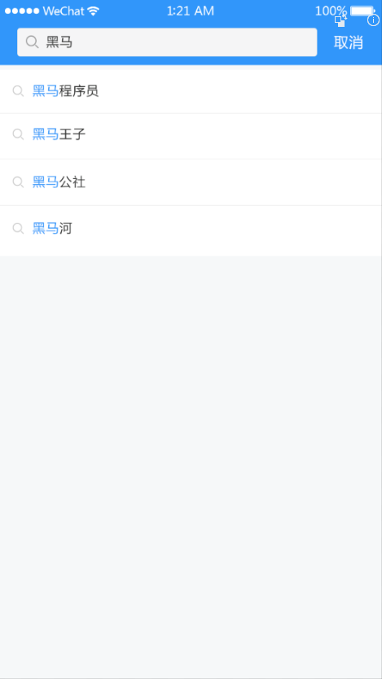

**文章搜索模块**


目标：

- 提供搜索的入口，实现搜索功能
- 在用户搜索时提供智能提示
- 保存用户的搜索记录



## 路由跳转

### 补充路由配置

补充路由配置,src/router/index.js

```
  import Search from '@/views/search' // index.vue是可以省略的
  
  const routes = [
  {
    path: '/login',
    name: 'login',
    component: Login
  },
  {
    path: '/',
    name: 'layout',
    component: Layout,
    children: [
      { path: '', component: Home }, // 默认显示的子路由
      { path: '/video', component: Video },
      { path: '/question', component: Question },
      { path: '/user', component: User }
    ]
  },
  {
    path: '/search',
    name: 'search',
    component: Search
  }
  ]
```

### 创建组件文件

新添加两个文件

```
src/page/search/index.vue
src/page/search/result.vue
```

目前的内容随意填写，只是测试使用。

### 测试路由

- 直接在地址栏中测试

http://localhost:8080/#/search

http://localhost:8080/#/search/result

- 路由跳转

在src\views\layout\index.vue中

```diff
<!-- 顶部logo搜索导航区域 -->
    <van-nav-bar
      fixed
    >
      <div slot="left" class="logo"></div>
      <van-button
        slot="right"
        class="search-btn"
        round
        type="info"
        size="small"
        icon="search"
+        @click="$router.push('/search')"
        >
        搜索
      </van-button>
    </van-nav-bar>
```


## 搜索页面布局


>  views/search/index.vue

从上到下，页面结构可以分成三部分

- 输入区。 
  - 使用[search组件](https://youzan.github.io/vant/#/zh-CN/search#zi-ding-yi-an-niu)
- 智能提示区。联想建议
  - 使用[cell组件]( https://youzan.github.io/vant/#/zh-CN/cell#zhan-shi-tu-biao )
- 搜索历史记录区。


涉及vant中的组件

- [search组件]( https://youzan.github.io/vant/#/zh-CN/search#zi-ding-yi-an-niu )  https://youzan.github.io/vant/#/zh-CN/search#zi-ding-yi-an-niu

  

在view/search/index.vue文件中

```html
<template>
  <div>
    <!-- nav-bar
      this.$router.push() : 路由跳转
      this.$router.back() : 路由后退  ===== 页面中的后退按钮
    -->
    <van-nav-bar title="搜索中心" left-arrow @click-left="$router.back()"></van-nav-bar>
    <!-- 1. 搜索区域 输入框 -->
    <van-search
      v-model.trim="keyword"
      show-action
      placeholder="请输入搜索关键词"
    >
    <!-- #action  ==== slot="action" -->
      <!-- <template slot="action">
        <div>搜索</div>
      </template> -->
      <div slot="action">搜索</div>
    </van-search>

    <!-- 2. 搜索建议 -->
    <van-cell-group>
      <van-cell title="单元格" icon="search"/>
      <van-cell title="单元格" icon="search"/>
      <van-cell title="单元格" icon="search"/>
    </van-cell-group>

    <!-- 3. 历史记录 -->
    <van-cell-group>
      <van-cell title="历史记录"/>

      <van-cell title="单元格">
        <van-icon name="close"></van-icon>
      </van-cell>

      <van-cell title="单元格">
        <van-icon name="close"></van-icon>
      </van-cell>
    </van-cell-group>
  </div>
</template>

<script>
export default {
  name: 'Search',
  data () {
    return {
      keyword: ''
    }
  }
}
</script>
```


## 搜索联想建议

目标：

- 在输入框中写入内容
- 发请求到后端，根据这个内容给出建议，显示在联想建议区


步骤：

- 封装请求函数
- 当搜索输入变化的时候（search组件已经封装），请求加载联想建议的数据
- 将请求得到的结果绑定到模板中

### 封装数据接口

创建 `api/search.js` 并写入

```js
import request from '@/utils/request.js'

/**
 * 获取搜索建议
 * @param {*} keyword 关键字
 */
export const getSuggetion = (keyword) => {
  return request({
    method: 'GET',
    url: '/app/v1_0/suggestion',
    params: {
      q: keyword
    }
  })
}

```

### 当搜索内容变化时请求获取数据

在 `search/index.vue` 中请求获取数据。

当搜索输入变化的时候（ van-search组件已经封装好，只需要加对@input的事件响应即可），请求加载联想建议的数据

步骤：

- 在模板中添加事件响应

- 在响应函数中调用接口

- 添加数据项，以保存搜索结果

  

#### 模板中添加事件响应

```html
<!-- 1. 搜索区域 输入框 -->
    <van-search
      @input="hInput"
      v-model.trim="keyword"
      show-action
      placeholder="请输入搜索关键词"
    >
```

@input是由van-search组件提供的。

#### 引入api

```
import { getSuggestion } from '@/api/search.js'
```

#### 补充数据项

```
    return {
+     suggestion: []
      keyword: '' // 搜索关键字
    }
```


#### 在响应函数中调用接口

```js
// 当用户输入内容变化时，就会执行
async hInput () {
      // 没有关键字
      if (!this.keyword) {
        this.suggestion = []
        return
      }
      const res = await getSuggetion(this.keyword)
      console.log(res)
      this.suggestion = res.data.data.options
    }
```


### 显示建议结果

只需要修改模板即可

```html
<!-- 2. 搜索建议
     根据你在上面输入的关键字，后端会返回建议
    -->
    <van-cell-group>
      <van-cell
      v-for="(item,idx) in suggestion"
      :key="idx"
      :title="item"
      icon="search"/>
    </van-cell-group>
```

### 效果


## 高亮搜索关键字

目标：在显示结果中把关键字高亮显示


### 思路

要在一段字符串中把其中一部分高亮，可需要做**替换**即可。例如，如果你需要把"我爱我家"中的`我`字高亮,相当于是把“我”改在一小段特殊的字符串，如下：

```
我爱我家 
----> 
<span style="color:red">我</span>爱<span style="color:red">我</span>家
```

### 原理：字符串替换

所以，基本想法就是字符串替换。

现在的问题简化成了：如何把一段字符串中的指定的内容替换成另一个内容：（replace）

```
var str = "abcdefgbefab"
// 目标: 把str中的b全部换成<span>b</span>
// 普通字符串替换：str.replace(目标字符串，要替换的字符串)，它的返回值是替换之后的字符串，注意它不会修改原字符串。
// 它的问题是，它只能替换一次。如上，我们有两个b需要替换，那又该怎么办呢？
// - 循环
// - 正则
```

突破难点

- 正则
- str.replace(正则，函数)

```javascript
<!DOCTYPE html>
<html lang="en">
<head>
  <meta charset="UTF-8">
  <meta name="viewport" content="width=device-width, initial-scale=1.0">
  <title>Document</title>
</head>
<body>
  <div>我爱我家</div>
   <!-- 要求：把 我 这个字，高亮显示（突出显示） -->
  <div><span style="color:red">我</span>爱我家</div>

  <script>
    var keyword = "A"
    // var reg = /家/g
    // 1. 定义一个正则
    var reg = new RegExp(keyword,'ig')
    
    console.log(reg)
    var str = "我a爱我家"
    // 2. 调用replace
    // str = str.replace(reg, `<span style="color:red">${keyword}</span>`)

    str = str.replace(reg, function(substr) {
      // console.log(substr)
      return `<span style="color:red">${substr}</span>`
    })

    // 不能全局替换
    // str = str.replace("我", '<span style="color:red">我</span>')
    console.log(str)


  </script>
</body>
</html>
```


### 实现

- 使用一个**计算属性**来保存高亮之后的值
  - 原来直接获取的数据要做一次加工：用正则+replace对内容进行高亮处理---字符串替换
- 用v-html显示数据


计算属性

```javascript
computed: {
    // 根据keyword来把suggestion中的内容高亮
    cHightLight () {
      // g: 全局匹配
      // i: 忽略大小写（大写，小写都可以匹配）
      const reg = new RegExp(this.keyword, 'gi')
      return this.suggestion.map(item => {
        return item.replace(reg, function (val) {
          return `<span style="color:red">${val}</span>`
        })
      })
    }
  },
```

结构

```html
<!-- 2. 搜索建议
     根据你在上面输入的关键字，后端会返回建议
    -->
    <van-cell-group>
      <van-cell
      v-for="(item,idx) in cHightLight"
      :key="idx"
      icon="search">
      <div v-html="item"></div>
      </van-cell>
    </van-cell-group>
```


注意

- v-html的用法
- str.replace(正则，函数)

### 效果


## 搜索历史记录

百度搜索

JD买商品

......

### 历史记录的意义

用户点击搜索有两种情况：

- 在搜索框上的按钮上点击。
- 在系统给出的建议搜索项上点击。


这两种情况下，都应该去进行搜索操作：跳入具体的搜索页面。但在此之前，可以把它们搜索的内容添加到历史记录中，以便下次快速搜索。

### 历史搜索记录的保存方式及格式

保存格式：把**搜索结果放在一个数组**中。

- 最近的搜索结果在最前面
- 搜索历史中不要有重复的项

```
['a','手机','javascript']
```

### 补充一个数据项

```diff
data () {
    return {
      keyword: '',
+      history: ['天津', '万达'],
      suggestion: []
    }
  },
```

### 封装一个添加历史记录的方法

```
// 添加一条历史
    // 1. 不能有重复项
    // 2. 后加入要放在数组的最前面
    addHistory (str) {
      this.history.push(str)
    },
```

上面这个方法在后面还要改进的。


### 在两种情况下去调用这个方法


点击 搜索按钮

```diff
// 情况1：用户点击了搜索
    hSearch () {
      // 1. 添加一条历史
      this.addHistory(this.keyword)
      // 2. 跳转到搜索结果页
    },
```

搜索内容的第二种方式： 点击联想建议 

```diff
<van-cell-group>
      <van-cell
        v-for="(item,idx) in cHightLight"
        :key="idx"
        icon="search"
        @click="hClickSuggetion(idx)"
      >
        <div v-html="item"></div>
      </van-cell>
    </van-cell-group>

```

下面是对应的两个方法:

```javascript
// 情况1：用户点击了搜索
    hSearch () {
      // 1. 添加一条历史
      this.addHistory(this.keyword)
      // 2. 跳转到搜索结果页
    },
    //  情况2： 用户点击了搜索建议
    hClickSuggetion (idx) {
      // 1. 添加一条历史
      this.addHistory(this.suggestion[idx])
      // 2. 跳转到搜索结果页
    }
```


### 显示历史记录

只需修改视图，在searchSuggestion中循环显示即可。

```
<!-- 搜索历史记录 -->
    <van-cell-group>
      <van-cell title="历史记录"></van-cell>
      <van-cell v-for="(item,idx) in history"
        :key="idx"
        :title="item">
         <van-icon name="close" />
      </van-cell>
    </van-cell-group>
    <!-- /搜索历史记录 -->
```


### 效果


### 改进添加历史记录的方法

```
// 添加一条历史
    // 1. 不能有重复项
    // 2. 后加入要放在数组的最前面
    addHistory (str) {
      // (1) 找一下，是否有重复，如果有，就是删除
      const idx = this.history.findIndex(item => item === str)
      if (idx > -1) {
        this.history.splice(idx, 1)
      }
      // (2) 加在数组的前面
      this.history.unshift(str)
    },
```


### 删除历史记录

给X添加点击事件

```html
<!-- 搜索历史记录 -->
    <van-cell-group>
      <van-cell title="历史记录"></van-cell>
      <van-cell v-for="(item,idx) in history"
        :key="idx"
        :title="item">
+         <van-icon name="close" @click="hDelHistory(idx)"/>
      </van-cell>
    </van-cell-group>
    <!-- /搜索历史记录 -->
```

添加一个方法hDeleteSearchHistory

```
// 用户点击了删除历史记录
    hDelHistory (idx) {
      this.history.splice(idx, 1)
    }
```


### 保存搜索历史记录到本地

目标：

​	不要在刷新页面时就不见了（和前面的vux一样，要做持久化）。刷新，退出系统这个搜索历史应该一直存在。

思路：

- 封装一个用来持久化历史记录的模块
- 当搜索历史变化 (添加，删除)时保存一次
-  在初始时使用引入本地数据

步骤：

1. 创建utils/storageHistory.js

```
// 消除魔术字符串
const HISTORY_STR = 'HistoryInfo'

export const getHistory = () => {
  return JSON.parse(localStorage.getItem(HISTORY_STR))
}

export const setHistory = HistoryInfo => {
  localStorage.setItem(HISTORY_STR, JSON.stringify(HistoryInfo))
}

export const removeHistory = () => {
  localStorage.removeItem(HISTORY_STR)
}

```

2. 引入

   `import { setHistory, getHistory } from '@/utils/storageHistory.js'`

3. 初始化

```
data () {
    return {
      keyword: '', // 搜索关键字
      // 初始化，先从本地存储中取值，取不到，则用[]
      history: getHistory()  || [], // 保存历史记录  ['正则', 'javascript']
      suggestion: [] // 当前的搜索建议
    }
  }
```

3. 保存到本地

​	在添加和删除历史记录时均做一次保存

```diff
// 添加一条历史
    // 1. 不能有重复项
    // 2. 后加入要放在数组的最前面
    // 3. 持久化
    addHistory (str) {
      // (1) 找一下，是否有重复，如果有，就是删除
      const idx = this.history.findIndex(item => item === str)
      if (idx > -1) {
        this.history.splice(idx, 1)
      }
      // (2) 加在数组的前面
      this.history.unshift(str)

      // (3) 持久化
      setHistory(this.history)
    },
// 用户点击了删除历史记录
    hDelHistory (idx) {
      this.history.splice(idx, 1)
      // 持久化
      setHistory(this.history)
    }
```


### 联想建议和历史记录的切换显示

联想建议 和 搜索历史 这两个区域是互斥的：

- 如果当前开始去搜索内容，则不显示搜索历史，而显示联想建议。 
- 如果当前并没有搜索内容，则显示搜索搜索历史，不显示联想建议。

```html
<!-- 联想建议
    v-html来正常显示html字符串效果-->
<!-- 2. 搜索建议
     根据你在上面输入的关键字，后端会返回建议

     v-if="suggestion.length"：如果有搜索建议
    -->
<van-cell-group v-if="suggestion.length">
    ... 
</van-cell-group>
<!-- /联想建议 -->

<!-- 搜索历史记录 -->
<van-cell-group v-else>
    ... 
</van-cell-group>
<!-- /搜索历史记录 -->
```

补充一下v-if,v-else即可。

##  搜索优化

现状：

   在输入框中字符变化会立刻去发请求获取搜索建议。


这个搜索的频率太高了（太灵敏，它对用户来说，是好的，因为可以及时收到搜索建议（要费流量），对服务器有坏处，调用这个接口的频率太高了，给服务器添加了负担。同时用户不会得到更多的好处：在搜索的过程，你录入的单词并没有写完，你得到的搜索建议多半是无用）。


解决思路：

- **降**低发请求的**频**率。

方案：

- 防抖
- 节流

### 防抖（debounce）处理

防抖：抖:高频的运动。不要让你抖，抖也没有用。

思路（以10秒为例）：
     当这个函数被调用时，不立刻执行，而是延迟10秒执行。
    如果在这10秒内再次调用了这个函数，则从当前被调用的时间开始算，
      再延迟10秒。 (整个10秒内，不能被打断,一旦打断，就要重新计时)。
    如果在这10秒内没有再次调用这个函数，10秒后执行代码。

> 生活中例子：等电梯


```
<van-search
      show-action
      placeholder="请输入搜索关键词"
      shape="round"
      v-model.trim="keyword"
+     @input="hInput_debounce"
      >
      <div slot="action" @click="hSearch">搜索</div>
    </van-search>
```

代码：

```
    async f () {
      // 没有关键字
      if (!this.keyword) {
        this.suggestion = []
        return
      }
      const res = await getSuggetion(this.keyword)
      console.log(res)
      this.suggestion = res.data.data.options
    },
    
// 只要用户在录入内容就会触发inpput，从而执行这个函数
    hInput_debounce () {
      // 对f进行0.4秒防抖处理。
      // 目标：如果0.4秒内没有再次调用它，则顺利执行这个函数，否则，再等0.4s。
      if (this.timer) {
        clearTimeout(this.timer)
      }
      this.timer = setTimeout(() => {
        this.f()
      }, 0.4 * 1000)
    },
```

### 节流（throttle）处理

节流：水龙头。把水龙头关到最小，让它一滴一滴向下滴水。效果就是降低了水流的频率。

节流（10秒）: 目标就是降频。一件事如果执行的频率非常快，节流就是把频率降至**指定的值**
思路：
    当这个函数被调用时，不是立即执行的时，而是检查本次执行距离上一次执行中间是否相隔10秒。
    如果相隔时间不足10s，则不执行；否则就执行


> 生活中： 你女朋友每小时都要你发定位；节流处理（5小时）：如果早上8点发了定位，则下一次发定位时间是：下午1点。中间其它时间不发定位。


    // 游戏中： 射击游戏，点一次鼠标发一颗子弹，你是否可能按下鼠标不放，就不间断发子弹？


```
hInput_throttle () {
      console.log('hInput_throttle.....')
      // 对f进行0.4秒节流处理。
      // 目标：如果0.4秒内没有再次调用它，则顺利执行这个函数，否则，再等0.4s。
      if (Date.now() - this.lastCallTimestamp >= 0.4 * 1000) {
        this.f()
        this.lastCallTimestamp = Date.now()
      } else {
        console.log('没有间隔0.4s,不能调用f()')
      }
    },
```


### 对比

采用上面的两种优化方案和不做优化的方案，按下键盘上的1，保持不动，观察network的结果如下：


防抖：可能就执行第一次调用和最后一次调用（防抖的策略有很多种）

。

节流：会执行多次，只是频率降低了。


关键字搜索：建议采用**节流**的方式来做优化。一方向减少服务器压力（请求次数变少了），用户体验要比防抖要一些。


前端界面上的常见的高频操作（事件会触发多次）：

- 鼠标移动。
- 窗口缩放。
- **input。文本框输入。**
- scroll。

业务：

- 不能频繁发验证码请求
- 不能不停地登陆
- .......


参考： 


debounce防抖: https://www.lodashjs.com/docs/latest#_debouncefunc-wait0-options

throttle:节流：https://www.lodashjs.com/docs/latest#_throttlefunc-wait0-options


### 经验值扩展：在vue中使用lodash提供的防抖和节流

第一步：安装lodash

```
npm i lodash
```

第二步：引入lodash

```
import  _  from 'lodash'
```

第三步：调用lodash的方法进行节流或防抖处理

```javascript
methods:{
   hInput_debounce_with_lodash: _.debounce(function () {
      this.f()
    }, 0.3 * 1000),
    hInput_throttle_with_lodash: _.throttle(function () {
      this.f()
    }, 0.3 * 1000)
}
```


```javascript
<van-search
      show-action
      placeholder="请输入搜索关键词"
      shape="round"
      v-model.trim="keyword"
      @input="hGetSuggestion_with_debounce"
      >
      <div slot="action" @click="hSearch">搜索</div>
    </van-search>
```


小结： 在使用第三方库时，要评估一下，是否划算！


## 搜索结果页

搜索结果是单独在另一个页面显示的，其基本思路是传入你要搜索的关键字，调接口，取回查询结果，并显示。

步骤：

- 注册搜索表单的提交事件处理函数
- 跳转到搜索结果页
  - 根据搜索关键字获取搜索结果
  - 展示到列表中


### 页面布局

views/search/result.vue的结构

```html
<template>
  <div class="serach-result">
    <!-- 导航栏 -->
    <van-nav-bar
      title="xxx 的搜索结果"
      left-arrow
      fixed
      @click-left="$router.back()"
    />
    <!-- /导航栏 -->

    <!-- 文章列表 -->
    <van-list
      class="article-list"
      v-model="loading"
      :finished="finished"
      finished-text="没有更多了"
      @load="onLoad"
     >
      <van-cell
        v-for="item in list"
        :key="item"
        :title="item"
      />
    </van-list>
    <!-- /文章列表 -->
  </div>
</template>

<script>
export default {
  name: 'SearchResult',
  data () {
    return {
      list: [],
      loading: false,
      finished: false
    }
  },

  methods: {
    onLoad () {
      // 异步更新数据
      setTimeout(() => {
        for (let i = 0; i < 10; i++) {
          this.list.push(this.list.length + 1)
        }
        // 加载状态结束
        this.loading = false

        // 数据全部加载完成
        if (this.list.length >= 40) {
          this.finished = true
        }
      }, 500)
    }
  }
}
</script>

<style lang="less" scoped>
.serach-result {
  height: 100%;
  overflow: auto;
  .article-list {
    margin-top: 39px;
  }
}
</style>
```

路由

```
{
    path: '/searchResult',
    name: 'searchResult',
    component: () => import('../views/search/searchResult.vue')
  },
```


### 路由跳转传参

采用地址传参：this.$router.push('/searchResult?keyword=xxxxx')

#### 测试结果


#### 添加跳转

有三个地方要跳入结果页，并传参:


在 `views/search/index.vue` 中：

**历史记录**

```diff
<!-- 3. 历史记录 -->
    <van-cell-group v-else>
      <van-cell title="历史记录"/>
      <van-cell
      v-for="(item,idx) in history"
      :key="idx"
      :title="item"
+      @click="$router.push('/searchResult?keyword=' + item)"
      >
        <van-icon name="close" @click="hDelHistory(idx)"></van-icon>
      </van-cell>
    </van-cell-group>
```

```diff
// 情况1：用户点击了搜索
    hSearch () {
      if (this.keyword === '') {
        return
      }
      // 1. 添加一条历史
      this.addHistory(this.keyword)
      // 2. 跳转到搜索结果页
+      this.$router.push('/searchResult?keyword=' + this.keyword)
    },
    //  情况2： 用户点击了搜索建议
    hClickSuggetion (idx) {
      // 1. 添加一条历史
      this.addHistory(this.suggestion[idx])
      // 2. 跳转到搜索结果页
+      this.$router.push('/searchResult?keyword=' + this.suggestion[idx])
    },
```


路由跳转，并传入query来携带参数：两种方式：

    this.$router.push('/searchResult?keyword=' + this.keyword)
    
    this.$router.push({
    	path: '/searchResult',
    	query: {
    		keyword: this.keyword,
    		a: 1,
    		b: 2
    	}
    })


### 在result.vue获取参数

获取参数：

在vue的调试工具中去查看：


```
this.$route.query.keyword
```


步骤：

- 封装接口
- 发请求，获取结果
- 模板绑定

search/result.vue

在页面内部，我们可以通过this.$route.query.keyword来获取传入的查询关键字

```javascript
created () {
    var keyword = this.$route.query.keyword
    alert(keyword)
}
```


### 封装接口

在 `api/serach.js` 封装请求方法

```js
/**
 * 获取查询结果
 * @param {*} keyword 关键字
 * @param {*} page 页码
 */
export const getSearchResult = (keyword, page) => {
  return request({
    method: 'GET',
    url: '/app/v1_0/search',
    params: {
      q: keyword,
      page: page
    }
  })
}

```

### 调用接口获取数据

然后在 `views/search/searchResult.vue` 中

```js
import { getSearchResult } from '@/api/search.js'
export default {
  name: 'SearchResult',
  data () {
    return {
      list: [],
      page: 1, // 当前的页码
      loading: false,
      finished: false
    }
  }
// ---
async onLoad () {
      console.log(this.$route.query.keyword)
      // 1. 发请求
      const res = await getSearchResult(this.$route.query.keyword, this.page)
      const arr = res.data.data.results
      // 2. 数据回来之后，填充到list中
      this.list.push(...arr)
      // 3. 手动结束加载状态
      this.loading = false
      // 4. 判断是否还有更多数据
      this.finished = !arr.length
      // 5. 页码+1
      this.page++
    }
```

### 数据渲染

模板绑定

```html
<!-- 文章列表 -->
    <van-list
      class="article-list"
      v-model="loading"
      :finished="finished"
      finished-text="没有更多了"
      @load="onLoad"
     >
      <van-cell
        v-for="article in list"
        :key="article.art_id.toString()"
        :title="article.title"
      />
    </van-list>
    <!-- /文章列表 -->
```


