**文章评论组件**

目标：


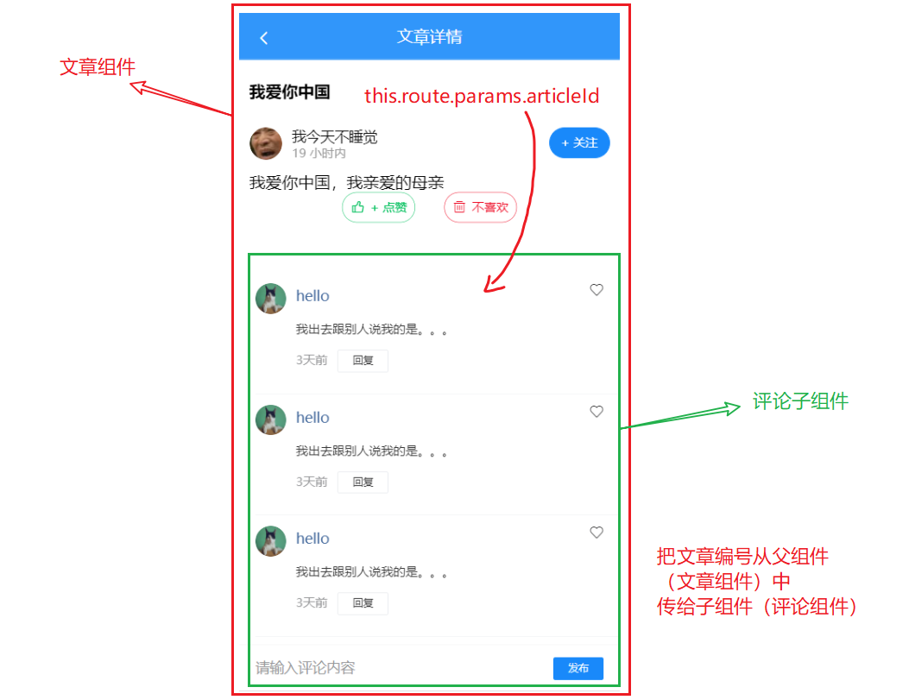

## 文章评论组件

这个部分的功能比较复杂，这里补充一个组件来完成。

```
|-article/article.vue
|-article/comment.vue # 添加一个组件来完成评论列表功能
```


- 创建评论组件comment.vue，并快速设置页页结构模板；
- 在父组件index.vue中使用,并传入articleId；

### 评论组件的内容

创建 `views/article/comment.vue` 并写入以下内容：

```html
<template>
  <div class="article-comments">
    <!-- 评论列表 -->
    <van-list
      v-model="loading"
      :finished="finished"
      finished-text="没有更多了"
      @load="onLoad"
    >
      <van-cell
        v-for="item in list"
        :key="item"
        :title="item"
      >
        <van-image
          slot="icon"
          round
          width="30"
          height="30"
          style="margin-right: 10px;"
          src="https://img.yzcdn.cn/vant/cat.jpeg"
        />
        <span style="color: #466b9d;" slot="title">hello</span>
        <div slot="label">
          <p style="color: #363636;">我出去跟别人说我的是。。。</p>
          <p>
            <span style="margin-right: 10px;">3天前</span>
            <van-button size="mini" type="default">回复</van-button>
          </p>
        </div>
        <van-icon slot="right-icon" name="like-o" />
      </van-cell>
    </van-list>
    <!-- 评论列表 -->

    <!-- 发布评论 -->
    <van-cell-group class="publish-wrap">
      <van-field
        clearable
        placeholder="请输入评论内容"
      >
        <van-button slot="button" size="mini" type="info">发布</van-button>
      </van-field>
    </van-cell-group>
    <!-- /发布评论 -->
  </div>
</template>

<script>
export default {
  name: 'ArticleComment',
  props: {},
  data () {
    return {
      list: [], // 评论列表
      loading: false, // 上拉加载更多的 loading
      finished: false // 是否加载结束
    }
  },

  methods: {
    onLoad () {
      // 异步更新数据
      setTimeout(() => {
        for (let i = 0; i < 10; i++) {
          this.list.push(this.list.length + 1)
        }
        // 加载状态结束
        this.loading = false

        // 数据全部加载完成
        if (this.list.length >= 40) {
          this.finished = true
        }
      }, 500)
    }
  }
}
</script>

<style scoped lang='less'>
// 发表评论的区域是固定在下端的
.publish-wrap {
  position: fixed;
  left: 0;
  bottom: 0;
  width: 100%;
}
// 给发表评论区空出地方
.van-list {
  margin-bottom: 45px;
}
</style>

```

### 注册并引入

在文章详情页面src\views\article\index.vue中加载注册文章评论子组件：

```js
import ArticleComment from './comment'

export default {
  ...
  components: {
    ArticleComment
  }
}
```

在文章详情页面中使用文章评论子组件

```html
<div class="article-container">
	...  	
    <!-- 文章评论 -->
    <article-comment></article-comment>
    <!-- 文章评论 -->
</div>
```


### 效果

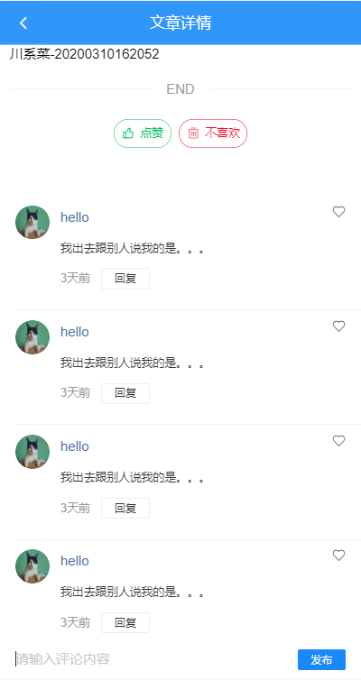

## 发布文章评论

步骤：

- 封装接口
- 注册发布处理函数
- 根据响应结果进行后续处理

实现：

### 封装接口

> 在封装接口时，你就可以了解当前需要传递什么参数，叫什么名字。

创建 `api/comment.js` 中添加封装数据接口

```js
import request from '@/utils/request.js'

/**
 * 添加文章评论
 * @param {*} articleId
 * @param {*} content
 */
export const addComment = (articleId, content) => {
  return request({
    method: 'POST',
    url: '/app/v1_0/comments',
    data: {
      target: articleId,
      content
    }
  })
}

```


### 在父组件中传入文章id

经过分析，添加功能需要知道文章id，所以这里选择从父组件中传递。

index.vue

```
<!-- 文章评论 -->
    <article-comment :articleId="articleId"/>
<!-- 文章评论 -->
```


```diff
data () {
    return {
+      articleId: '',
      is404: false, // 这篇是否是 不存在 的
      loading: true, // 控制加载中的 loading 状态
      article: { }
    }
  },
  created () {
+    this.articleId = this.$route.params.id
    this.loadDetail()
  },
```


### 在子组件comment.vue

准备数据项，添加点击事件，调用接口

接收父组件的参数

```
props: {
    articleId: {
      type: String,
      required: true
    }
  }
```

准备数据项：

```
data () {
    return {
+     content: '', // 评论的内容
      list: [], // 评论列表
      loading: false, // 上拉加载更多的 loading
      finished: false // 是否加载结束
    }
  },
```


在 `comment.vue` 组件中

- 双向绑定v-model
- 添加点击事件

```html
<!-- 发布评论 -->
    <van-cell-group class="publish-wrap">
      <van-field
        clearable
        placeholder="请输入评论内容"
        v-model.trim="content"
      >
        <van-button slot="button" size="mini" type="info" @click="hAddComment">发布</van-button>
      </van-field>
    </van-cell-group>
    <!-- /发布评论 -->
```

hAddComment

```
async hAddComment () {
      if (this.content === '') {
        return
      }
      try {
        // const res = await addComment (文章的id，评论内容)
        const res = await addComment(this.articleId, this.content)
        console.log(res)
        // 如果顺利，则返回结果已经保存本次添加的评论信息，在new_obj
        this.list.unshift(res.data.data.new_obj)
      } catch (err) {
        console.log(err)
      }
    },
```


**效果：**

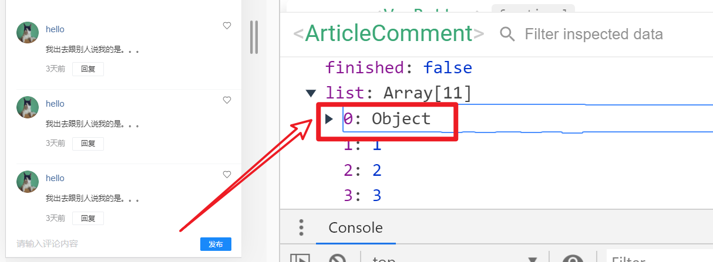

## 获取文章评论数据并显示

步骤：

- 封装接口
- 请求获取数据
- 处理模板

实现：

### 封装请求方法

1、在 `api/comment.js` 中封装请求方法

```js

/**
 * 获取评论
 * @param {*} articleId
 * @param {*} offset
 */
export const getComment = (articleId, offset) => {
  return request({
    method: 'GET',
    url: '/app/v1_0/comments',
    params: {
      type: 'a',
      source: articleId,
      offset
    }
  })
}
```

有一个**offset**参数要注意一下。

### 加载获取数据

在 `views/article/comment.vue` 组件中加载获取数据

```js
import { getComments } from '@/api/comment'

// 数据项
data () {
    return {
+     offset: null, // 获取评论数据的偏移量，值为评论id，表示从此id的数据向后取，不传表示从第一页开始读取数据
      content: '', // 当前的评论内容
      list: [], // 评论列表
      loading: false, // 上拉加载更多的 loading
      finished: false // 是否加载结束
    }
  }

  async onLoad () {
      try {
        // 1. 发请求
        const res = await getComment(this.articleId, this.offset)
        console.log(res)
        // 2. 把请求的结果追加到list
        const arr = res.data.data.results
        this.list.push(...arr)
        // 3. 手动取消loading
        this.loading = false
        // 4. 判断是否全部加载完成 finished
        this.finished = !arr.length
        // 5. 更新offset
        this.offset = res.data.data.last_id
      } catch (error) {
        this.$toast('获取评论失败')
        this.loading = false
      }
    }

```

### 模板绑定

```html
<van-cell
        v-for="item in list"
        :key="item.com_id.toString()"
        >
        <van-image
          slot="icon"
          round
          width="30"
          height="30"
          style="margin-right: 10px;"
          :src="item.aut_photo"
        />
        <span style="color: #466b9d;" slot="title">{{item.aut_name}}</span>
        <div slot="label">
          <p style="color: #363636;">{{item.content}}</p>
          <p>
            <span style="margin-right: 10px;">{{item.pubdate | relativeTime }}</span>
            <van-button size="mini" type="default">回复</van-button>
          </p>
        </div>
        <van-icon slot="right-icon" name="like-o" />
      </van-cell>
```

## 评论点赞

### 目标

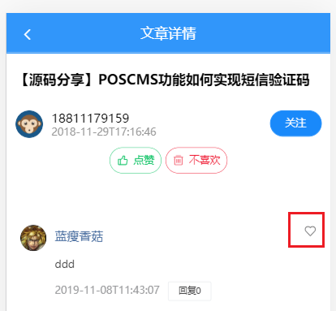


### 思路

**关键点**

在后端接口取出回来的数据中，有一个特殊的字段`is_liking`表示当前用户对当前评论是否喜欢。

1. 从接口中取出数据之后，根据is_liking这个字段来来更新视图
2. 用户点击之后，调用接口去修改is_liking这个字段在服务器上的值，并更新视图。

### 封装接口

在 `api/comment.js` 中添加两个方法

```js

/**
 * 对文章评论进行点赞
 * @param {*} commentId 评论id
 */
export const addCommentLike = commentId => {
  return ajax({
    method: 'POST',
    url: '/app/v1_0/comment/likings',
    data: {
      target: commentId
    }
  })
}

/**
 * 取消文章评论的点赞
 * @param {*} commentId 评论id
 */
export const deleteCommentLike = commentId => {
  return ajax({
    method: 'DELETE',
    url: '/app/v1_0/comment/likings/' + commentId
  })
}
```

### 修改视图

在 `views/article/comment.vue` 组件中：

1. 添加@click
2. 根据不同的值显示不同的图标

```html
<van-icon
       slot="right-icon"
       :name="item.is_liking ? 'like' : 'like-o'"
       @click="hSwitchLike(item)"
/>
```

### 代码

```
<script>
import {
  getComments,
  addComment,
+  addCommentLike,
+  deleteCommentLike
} from '@/api/comment'

export default {
  methods: {
    // 切换点赞状态
    async hSwitchLike (comment) {
      try {
        const commentId = comment.com_id.toString()
        // 根据不同的状态来调用不同的api
        if (comment.is_liking) {
          // 目前是点赞， 点击按钮时，应该要做取消点赞
          await deleteCommentLike(commentId)
          // 并不关心这个操作接口的返回值，因为：只要是操作成功，它不报错，我们就可以去认为这个状态
          // 已经切过来了，后面直接修改本地数据即可
        } else {
          await addCommentLike(commentId)
        }
        // 更新视图，修改本地数据
        comment.is_liking = !comment.is_liking

        this.$toast.success('操作成功')
      } catch {
        this.$toast.fail('操作失败')
      }
    }
  }
}
</script>
```


## 评论回复

> 示例：小张写了文章 ，小李在下面写了评论1，而小王对这个评论1进行了回复。

**目标**

- 用户对文章的某条评论进行回复

**交互方式**

- 点击某条评论上的回复按钮
- 从页面底部弹出[popup组件](https://youzan.github.io/vant/#/zh-CN/popup#yuan-jiao-dan-chuang)，其中包含：
  - 当前评论的内容
  - 已有回复
  - 添加回复的input框

- 输入回复内容，点击确认回复。


由于评论回复这个功能比较复杂，所以单独创建一个组件commentReply来完成。

```javascript
|--article
|--article/article.vue
|--article/comment.vue
|--article/commentReply.vue #评论回复
```


### 创建并使用组件

#### 创建

创建 `views/article/commentReply.vue` 并写入基本结构如下：

```html
<template>
<div class="article-comments">
    <!-- 导航栏 -->
    <van-nav-bar title="1条回复">
      <van-icon slot="left" name="cross" />
    </van-nav-bar>
    <!-- /导航栏 -->

    <!-- 当前评论 -->
    <van-cell title="当前评论">
      <van-image
        slot="icon"
        round
        width="30"
        height="30"
        style="margin-right: 10px;"
        src="https://img.yzcdn.cn/vant/cat.jpeg"
      />
      <span style="color: #466b9d;" slot="title">hello</span>
      <div slot="label">
        <p style="color: #363636;">评论内容</p>
        <p>
          <span style="margin-right: 10px;">几天前</span>
          <van-button
            size="mini"
            type="default"
          >回复 10</van-button>
        </p>
      </div>
      <van-icon slot="right-icon" />
    </van-cell>
    <!-- /当前评论 -->
    <van-divider>全部回复</van-divider>

    <!-- 对当前评论 回复列表 -->
    <van-list
      v-model="loading"
      :finished="finished"
      finished-text="没有更多了"
      @load="onLoad"
     >
      <van-cell
        v-for="(item, index) in list"
        :key="index"
        :title="item"
      >
        <van-image
          slot="icon"
          round
          width="30"
          height="30"
          style="margin-right: 10px;"
          src="https://img.yzcdn.cn/vant/cat.jpeg"
        />
        <span style="color: #466b9d;" slot="title">hello</span>
        <div slot="label">
          <p style="color: #363636;">内容</p>
          <p>
            <span style="margin-right: 10px;">时间</span>
          </p>
        </div>
      </van-cell>
    </van-list>
    <!-- 回复列表 -->

    <!-- 发布回复 -->
    <van-cell-group class="publish-wrap">
      <van-field
        clearable
        placeholder="请输入回复内容"
      >
        <van-button
          slot="button"
          size="mini"
          type="info"
        >发布</van-button>
      </van-field>
    </van-cell-group>
    <!-- /发布回复 -->
</div>

</template>
<script>
export default {
  name: 'CommentReply',
  data () {
    return {
      list: [], // 评论列表
      loading: false, // 上拉加载更多的 loading
      finished: false // 是否加载结束
    }
  },
  methods: {
    onLoad () {
      // 异步更新数据
      setTimeout(() => {
        for (let i = 0; i < 10; i++) {
          this.list.push(this.list.length + 1)
        }
        // 加载状态结束
        this.loading = false

        // 数据全部加载完成
        if (this.list.length >= 40) {
          this.finished = true
        }
      }, 500)
    }
  }
}
</script>
<style lang="less" scoped>
// 发表评论的区域是固定在下端的
.publish-wrap {
  position: fixed;
  left: 0;
  bottom: 0;
  width: 100%;
}
// 给发表评论区空出地方
.van-list {
  margin-bottom: 45px;
}
</style>

```


效果：

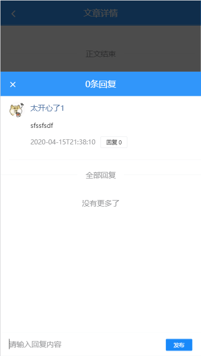

#### 使用组件


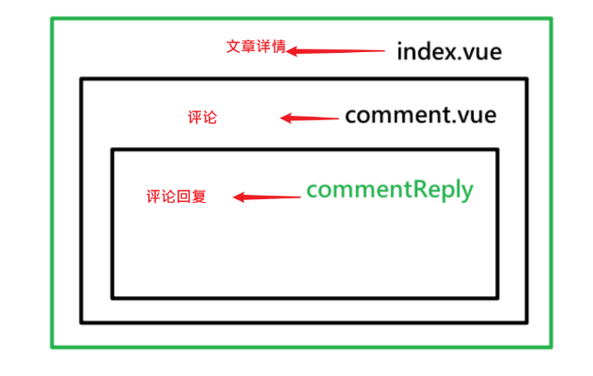

在 `views/article/comment.vue` 组件中：

- 加载使用，外层包一个van-popup
- 补充一个数据项：isReplyShow，控制是否显示弹层组件
- 给列表中的回复按钮添加click，来设置isReplyShow为true。


结构

src\views\article\comment.vue

```html
<template>
    <!-- 评论列表 -->
    <!-- 评论列表 -->

    <!-- 发布评论 -->
    <!-- /发布评论 -->
    
    <!-- 评论回复
       vant弹层组件包含回复组件
    -->
    <van-popup
      v-model="isReplyShow"
      round
      position="bottom"
      :style="{ height: '85%' }">
        <comment-reply></comment-reply>
    </van-popup>
    <!-- 评论回复 -->

  </div>
</template>

<script>

+ import CommentReply from './comment-reply'
  data () {
    return {
+     isReplyShow: true,
      offset: null, // 获取评论数据的偏移量，值为评论id，表示从此id的数据向后取，不传表示从第一页开始读取数据
      content: '', // 评论的内容
      list: [], // 评论列表
      loading: false, // 上拉加载更多的 loading
      finished: false // 是否加载结束
    }
  },
+  components: {
+    CommentReply
+   }
```

控制显示回复

```
<van-button size="mini" type="default" @click="hClickReply">回复</van-button>
```


```
hClickReply () {
  this.isReplyShow = true
},
```

#### 效果

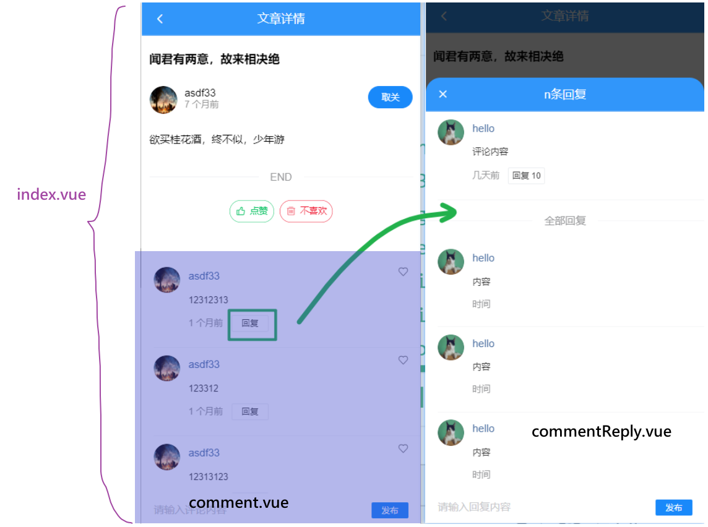

### 在评论回复组件中展示当前评论

#### **目标**

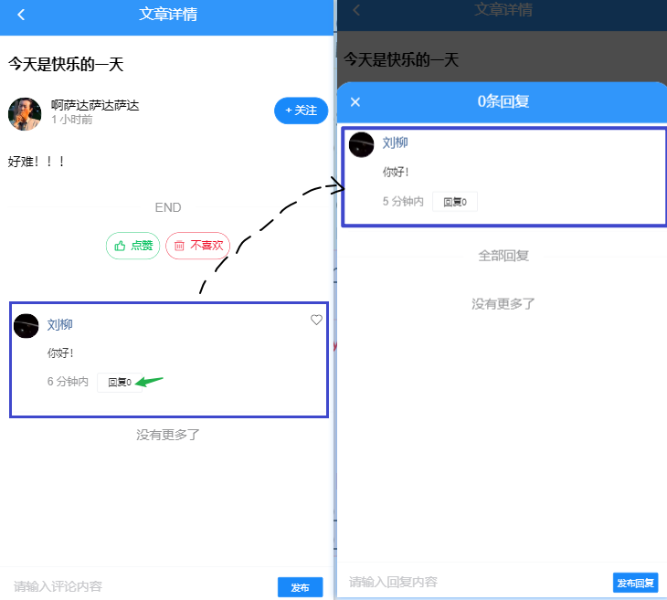


#### **思路**

典型父传子。把当前的评论数据从comment.vue传给commentReply.vue。

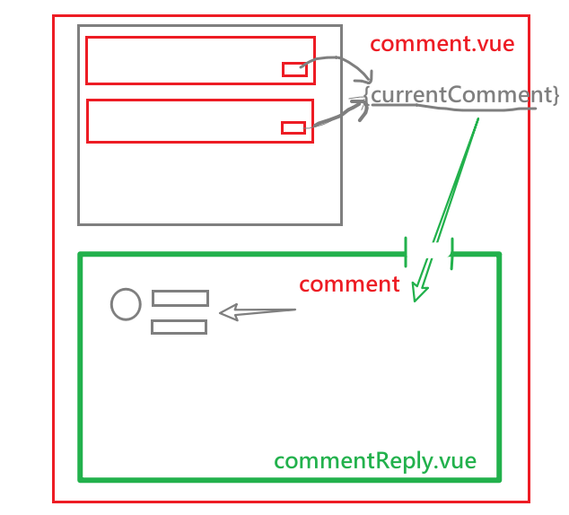

#### **步骤**

父组件：comment.vue

	预置一个数据项：currentComment
	点击回复按钮时就修改数据项

子组件：comment-reply.vue

- 属性 comment。用来接收currentComment的值。


#### 父组件comment.vue

补充一个数据项

```diff
data () {
	return {
+   currentComment: {}, // 表示当前的评论回复组件 要 回复的评论
		isReplyShow: false, // 是否显示评论回复
		offset: null, // 获取评论数据的偏移量，值为评论id，表示从此id的数据向后取....
		content: '', // 当前的评论内容
		list: [], // 评论列表
		loading: false, // 上拉加载更多的 loading
		finished: false // 是否加载结束
	}
}
```

点击回复，要更新这个数据项：

视图

```diff
<van-button size="mini" type="default" 
+ @click="hClickReply(item)"
>回复</van-button>

```

代码

```
// 用户点击了 回复
    // 会从底部升起 评论回复组件，此时需要把当前的被点击的那个评论传给子组件上显示
    hClickReply (item) {
      // 更新当前的评论
      this.currentComment = item
      // 显示弹层
      this.isReplyShow = true
    }
```

把这个数据项传给子组件

```
 <!-- 评论回复 -->
    <van-popup
      v-model="isReplyShow"
      round position="bottom"
      :style="{ height: '85%' }"
      >
      <!-- 向子组件传递当要评论的 那条数据 -->
        <comment-reply :comment="currentComment"></comment-reply>
    </van-popup>
    <!-- 评论回复 -->
```

#### 子组件:commentReply

在子组件commentReply.vue中接收

**定义prop**

```
props: {
  comment: {
  	type: Object,
  	required: true
  }
},
```

更新视图

```diff
<template>
  <!-- 导航栏 -->
    <van-nav-bar :title="comment.reply_count + '条回复'">
      <van-icon slot="left" name="cross" />
    </van-nav-bar>
    <!-- /导航栏 -->

    <!-- 当前评论 -->
    <van-cell title="当前评论">
      <van-image
        slot="icon"
        round
        width="30"
        height="30"
        style="margin-right: 10px;"
+        :src="comment.aut_photo"
      />
+      <span style="color: #466b9d;" slot="title">{{comment.aut_name}}</span>
      <div slot="label">
+        <p style="color: #363636;">{{comment.content}}</p>
        <p>
+          <span style="margin-right: 10px;">{{comment.pubdate | relativeTime}}</span>
          <van-button
            size="mini"
            type="default"
+          >回复{{comment.reply_count}}</van-button>
        </p>
      </div>
      <van-icon slot="right-icon" />
    </van-cell>
```

效果：

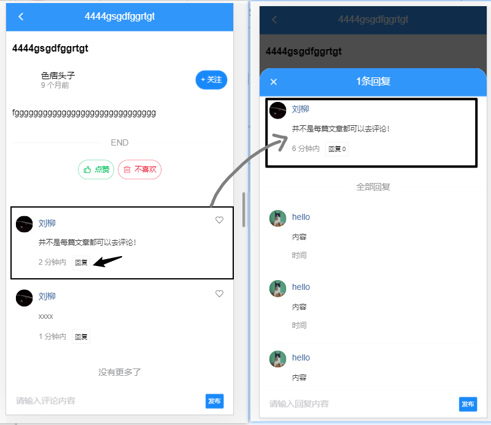


### 展示评论回复列表

#### **目标**

把本条评论下的所有回复取回来并显示。

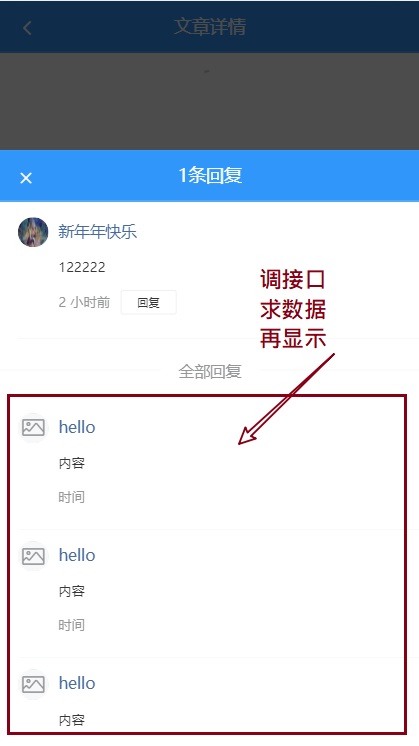

#### 思路

发请求，获取回数据，通过van-list进行渲染。

#### 步骤

定义接口(与获取文章的评论是一个接口地址，只是传参不同)；

将评论回复组件中请求获取评论列表的参数稍加修改就可以获取回复列表了（同一个数据接口）

```

/**
 * 获取评论的回复
 * @param {*} commentId
 * @param {*} offset
 */
export const getCommentReply = (commentId, offset) => {
  return request({
    method: 'GET',
    url: '/app/v1_0/comments',
    params: {
      type: 'c',
      source: commentId,
      offset
    }
  })
}

```

调用接口，获取数据

```js
import { getCommentReply } from '@/api/comment'

  data () {
	return {
      offset: null, // 评论数据的偏移量，值为评论id，表示从此id的数据向后取，不传表示从第一页开始读取数据
      list: [], // 评论列表
      loading: false, // 上拉加载更多的 loading
      finished: false // 是否加载结束
    }
  },
   async onLoad () {
      try {
        // 1. 发请求
        const res = await getCommentReply(this.comment.com_id.toString(), this.offset)
        console.log(res)
        // 2. 把请求的结果追加到list
        const arr = res.data.data.results
        this.list.push(...arr)
        // 3. 手动取消loading
        this.loading = false
        // 4. 判断是否全部加载完成 finished
        this.finished = !arr.length
        // 5. 更新offset
        this.offset = res.data.data.last_id
      } catch (error) {
        this.$toast('获取评论回复失败')
        this.loading = false
      }
    }

```

页面数据绑定

```html
<!-- 对当前评论 回复列表 -->
    <van-list
      v-model="loading"
      :finished="finished"
      finished-text="没有更多了"
      @load="onLoad"
     >
      <van-cell
        v-for="(item, index) in list"
        :key="index"
      >
        <van-image
          slot="icon"
          round
          width="30"
          height="30"
          style="margin-right: 10px;"
          :src="item.aut_photo"
        />
        <span style="color: #466b9d;" slot="title">{{item.aut_name}}</span>
        <div slot="label">
          <p style="color: #363636;">{{item.content}}</p>
          <p>
            <span style="margin-right: 10px;">{{item.pubdate | relativeTime }}</span>
          </p>
        </div>
      </van-cell>
    </van-list>
    <!-- 回复列表 -->
```


### 发布评论回复

#### 目标

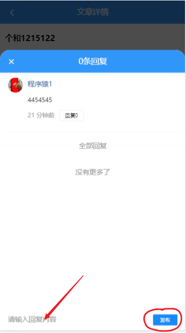

#### 思路

普通发请求，添加数据；

添加成功之后进行本地更新；

#### 步骤

##### 封装接口

```

/**
* 添加文章评论回复
* @param {*} commentId  评论id
* @param {*} articleId  文章id
* @param {*} content 回复的内容
*/
export const addCommentReply = (commentId, articleId, content) => {
  return request({
    method: 'POST',
    url: '/app/v1_0/comments',
    data: {
      target: commentId,
      art_id: articleId,
      content
    }
  })
}

```

##### 参数传递

由于这里还需要一个文章的编号，有两种解决思路：

1. 直接从路由中取`this.$route.params.id`

   路由对象的参数是可以跨组件层级来访问的。

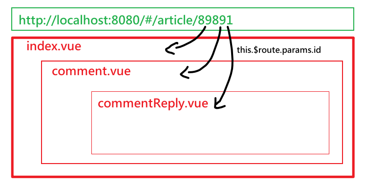

2. 在父组件中传入

   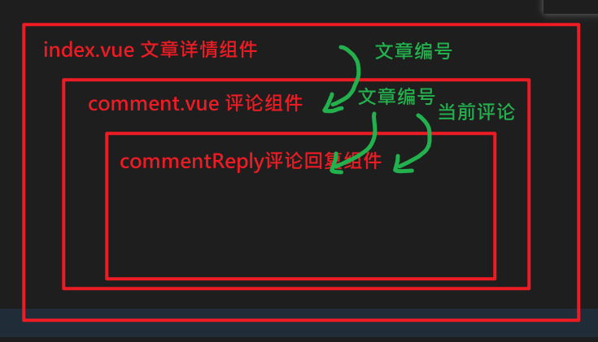

建议采用组件之间层层传递的方式（不在超过三层的情况下），优点在于，你可以很清晰地知道数据的流转的方向。

**在父组件中传入文章的编号**

父组件comment.vue

向子组件传递参数

```
<van-popup
      v-model="isReplyShow"
      round
      position="bottom"
      :style="{ height: '85%' }">
        <comment-reply :comment="currentComment" :articleId="articleId"></comment-reply>
    </van-popup>
    <!-- 评论回复 -->
```

**在子组件commentReply.vue**

补充props获取从父组件中传递的参数

```
props: {
    comment: {
      type: Object,
      required: true
    },
+    articleId: {
      type: String,
      required: true
    }
  }
```


##### 补充数据项

在子组件中

```
return {
+     content: '', // 回复的内容
      offset: null, // 获取评论数据的偏移量,null不会在axios中传出去，表示从第一页开始读取数据
      list: [], // 评论列表
      loading: false, // 上拉加载更多的 loading
      finished: false // 是否加载结束
    }
```

##### 添加事件

```diff
<!-- 发布回复 -->
  <van-cell-group class="publish-wrap">
    <van-field
      clearable
      placeholder="请输入回复内容"
+     v-model.trim="content"
    >
      <van-button
        slot="button"
        size="mini"
        type="info"
+        @click="hAddReply"
      >发布回复</van-button>
    </van-field>
  </van-cell-group>
  <!-- /发布回复 -->
```


##### 具体的添加功能

```js
async hAddReply () {
      if (this.content === '') {
        return
      }
      try {
        const res = await addCommentReply(this.comment.com_id.toString(), this.articleId, this.content)
        console.log(res)
        this.list.unshift(res.data.data.new_obj)
        // 更新回复的条数
        this.comment.reply_count++
      } catch (err) {
        console.log(err)
      }
    }
```


### 在评论回复组件中关闭弹层

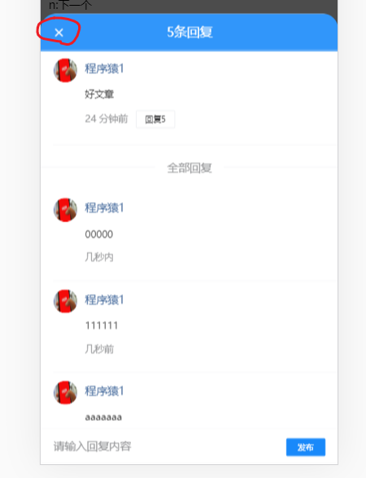

在子组件中向父组件传递信息，以达到修改父组件数据的目的（相应地也就修改了父组件的视图）

- 在子组件发布一个自定义事件
- 在父组件中监听处理这个事件

1、在评论回复组件commentReply.vue中发布一个自定义事件

```html
<!-- 导航栏 -->
    <van-nav-bar :title="comment.reply_count + '条回复'">
      <!-- 通知父组件去关闭弹层 -->
+      <van-icon @click="$emit('close')" slot="left" name="cross" />
    </van-nav-bar>
    <!-- /导航栏 -->

```

2、在文章评论组件comment.vue中监听处理

```html
<!-- 评论回复 -->
    <van-popup
      v-model="isReplyShow"
      round position="bottom"
      :style="{ height: '85%' }"
      >
      <!--  :comment="currentComment" 向子组件传递当要评论的 那条数据 -->
      <!--  @close="isReplyShow=false"  收到子组件传递消息，关闭弹层 -->
        <comment-reply
+        @close="isReplyShow=false"
        :comment="currentComment"
        :article_id="article_id"></comment-reply>
    </van-popup>
    <!-- 评论回复 -->
```


## bug修复

现状： 对于commentReply组件，由于请求回复列表的动作只在第一次创建这个组件时执行，所以导致第二次点击某个评论的回复时，还是显示第一次点击回复时取回来的回复列表。


解决思路：

​	每次点击回复时，都去创建一个新commentReply组件。

具体做法

​	补充一个v-if来控制动态创建组件。`v-if="isReplyShow"`

```diff
<!-- 评论回复
       vant弹层组件包含回复组件
       @close="isReplyShow=false" : 当子组件抛出名为close事件时，把弹层关闭掉
    -->
    <van-popup
      v-model="isReplyShow"
      round
      position="bottom"
      :style="{ height: '85%' }">
        <comment-reply
+       v-if="isReplyShow"
        @close="isReplyShow=false"
        :comment="currentComment"
        :articleId="articleId"></comment-reply>
    </van-popup>
    <!-- 评论回复 -->
```

