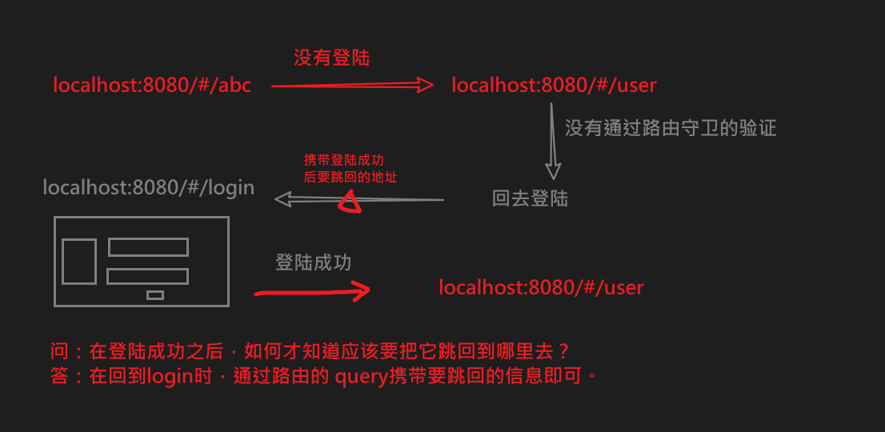
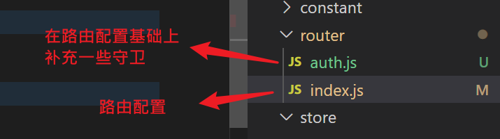
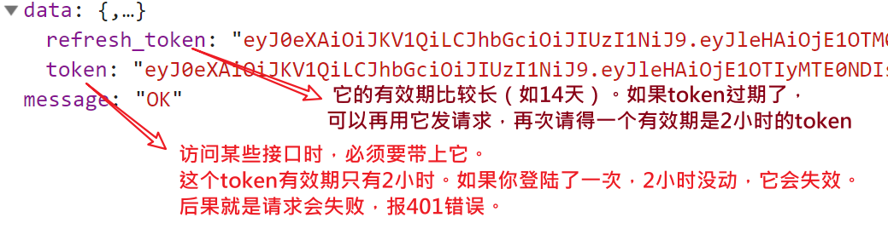
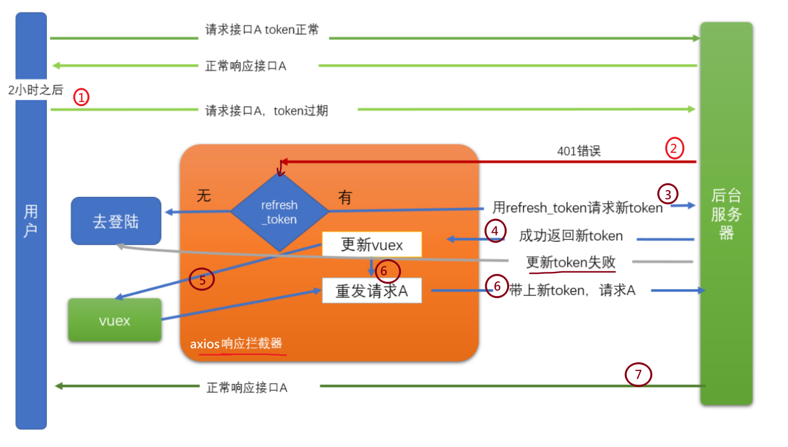
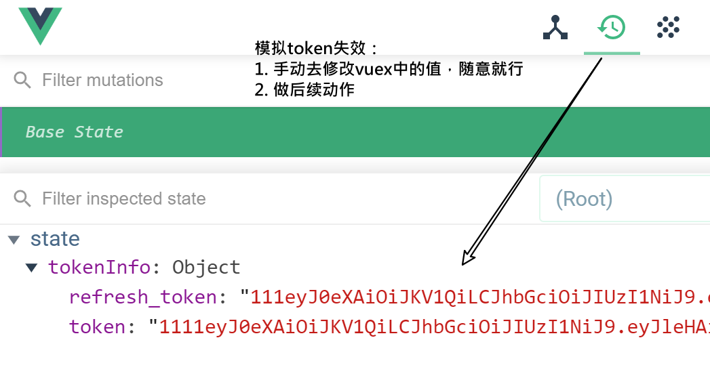

一个项目有很多个页面，有些页面是需要有**权限**的用户才有访问的。例如：修改密码这个页面，肯定只能是登陆用户才能访问。


当我们发现一个没有登陆的用户试图去访问一个需权根的页面时，我们应该把它引导到登陆界面，当用户完成登陆操作之后，再跳回到他之前访问的页面。


## 路由守卫

### 问题及导入

如何阻止非登陆用户去访问用户中心

### 路由守卫

路由守卫: 是一个函数。在路由切换时，会经过它（它会被调用），它就可以用来去检查凭证。


#### 格式

```
router.beforeEach(function (to, from, next) {
  console.log('路由变化了', to, from, next)
  if () {
      next()
    } 
  else {
      next('/login?backto=' + to.fullPath)
    }

})
```

- to     ，表示在当前路由变化时，你进入哪个路由。
- from，表示在当前路由变化时，你要离开哪个路由。
- next。必须要调用这个next()来结束对当前的动作的处置。不管你决定这个路由跳转应该如何处理，但一定要给一个处理结果。（这个过程就像是express框架中的res.end()一样）
  - next() // 放行
  - next(false) // 不让跳，回到from
  - next(路由) 进入指定路由
    - next({path:, name:, ....})

#### 使用

在router/index.js中补充一个前置路由守卫

```javascript
router.beforeEach(function (to, from, next) {
  console.log('这里发生了路由跳转', to, from)
  // 没有登陆
  if (!store.state.tokenInfo.token) {
    // if (!store.getters || !store.getters.isLogin) {
    // 要去的页面是敏感页面
    if (pageList.includes(to.path)) {
      next('/login')
    } else {
      next()
    }
  } else {
    next()
  }
  // if (没有登陆 并且 访问敏感页面) {
  //   回去登陆
  // } else {
  //   正常放行
  // }
})
```


#### 改进



```
next('/login?backto=' + encodeURIComponent(to.fullPath))
```


在login/index.vue 中要改进一下跳转的目标

```
// 用户跳转
// 根据当前路由参数，决定跳到哪里去
const backto = this.$route.query.backto || '/'
this.$router.push(backto)
```

#### 代码结构调整




index.js

正常写路由的配置

```
import Vue from 'vue'
import VueRouter from 'vue-router'
Vue.use(VueRouter)

const routes = [
....
]

const router = new VueRouter({
  routes
})

export default router

```

auth.js

引入路由配置，补充守卫

```
import router from './index.js'

import store from '@/store/index.js'
const pageList = ['/setting', '/profile']
router.beforeEach(function (to, from, next) {
  console.log('这里发生了路由跳转', to, from)
  // 没有登陆
  if (!store.state.tokenInfo.token) {
    // if (!store.getters || !store.getters.isLogin) {
    // 要去的页面是敏感页面
    if (pageList.includes(to.path)) {
      // fullPath 比path多查询字符串
      next('/login?backto=' + encodeURIComponent(to.fullPath))
    } else {
      next()
    }
  } else {
    next()
  }
  // if (没有登陆 并且 访问敏感页面) {
  //   回去登陆
  // } else {
  //   正常放行
  // }
})

export default router

```

> to.fullPath 相比 to.path它多了查询字符串

main.js

```diff
- import router from './router'
+ import router from './router/auth.js'
```


## token过期处理

### 目标

解决如下两个问题：

1. 通过axios响应拦截器来处理token过期的问题，让整个过程，用户无感（用户根本就不会感知到token失效的问题）。

2. 未登陆用户，在一些需登陆之后才能做的操作时，会报出401错误，此时应该让用户跳回登陆页。（你没有登陆，就在taobao买东西，直接点击付款时，会让你回到登陆去做登陆！）

### token过期

你登陆成功之后，接口会返回一个token值，这个值在后续请求时带上（就像是开门钥匙）。但是，这个值一般会有**有效期**（具体是多长，是由后端决定），在我们的项目中，这个有效期是2小时。

如果，上午8点登陆成功，到了10：01分，则token就会失效，再去发请求时，就会报**401**错误。


### 思路

当用户登陆成功之后，返回的token中有两个值，说明如下：



- token:
  - 作用：在访问一些接口时，需要传入token，就是它。
  - 有效期：2小时（安全）。

- refresh_token
  - 作用:  当token的有效期过了之后，可以使用它去请求一个特殊接口（这个接口也是后端指定的，明确需要传入refresh_token），并返回一个新的token回来（有效期还是2小时），以替换过期的那个token。
  - 有效期：14天。（最理想的情况下，一次登陆可以持续14天。）

---



request的[响应拦截器](https://www.npmjs.com/package/axios#interceptors)中：

- 对于某次请求A，如果是401错误 （2）
  - 有refresh_token，用refresh_token去请求回新的token （3）
    - 新token请求成功 （4）
      - 更新本地token （5）
      - 再发一次请求A   （6）
    - 新token请求失败
      - 携带请求地址，跳转到登陆页
  - 没有refresh_token
    - 携带请求地址，跳转到登陆页


### 代码

在src\utils\request.js中，补充响应拦截器

```javascript
import router from '../router/auth.js'

// 添加响应拦截器
instance1.interceptors.response.use(function (response) {
  return response
}, async function (error) {
  // 如果发生了错误，判断是否是401
  console.dir(error)
  // 开始处理
  if (error.response.status === 401) {
    const refreshToken = store.state.tokenInfo.refresh_token
    if (refreshToken) {
      try {
        const res = await axios({
          method: 'PUT',
          url: 'http://ttapi.research.itcast.cn/app/v1_0/authorizations',
          headers: {
            Authorization: `Bearer ${refreshToken}`
          }
        })
        const newToken = res.data.data.token
        // 把新token保存到vuex
        console.log('5. 把新token保存到vuex')
        store.commit('mSetTokenInfo', {
          token: newToken, // 变化了
          refresh_token: refreshToken // 没有变化
        })
        // instance1重发请求，它会自动去vuex中带上最新的token(没过期的，新的)
        return instance1(error.config)
      } catch (err) {
        // 1. 清空token
        store.commit('mSetTokenInfo', {})
        // 2. 回去登陆
        router.push('/login?backto=' + router.currentRoute.fullPath)
        // 3. 返回错误信息
        return Promise.reject(new Error('请求新token失败'))
      }
    } else {
      // 1. 清空token
      store.commit('mSetTokenInfo', {})
      // 2. 回去登陆, 带上要返回的地址
      router.push('/login?backto=' + router.currentRoute.fullPath)
      // 3. 返回错误信息
      return Promise.reject(new Error('refresh_token不存在'))
    }
  }
  return Promise.reject(error)
})
```

注意：

1. 响应拦截器要加在axios实例 instance1上。
2. 用refresh_token请求新token时，要用axios，不要用实例instance1
3. 得到新token之后，再发请求时，要用 instance1实例

### 调试技巧

手动修改vuex中的token,模拟过期效果



## 特殊跳转处理-bug

### 背景&问题

1. 用户在没有登录的情况下，查看某个文章详情页

2. 在详情页中点击**关注**，会出401错误，被拦截器处理，回到登录页

3. 在登陆页正常登陆，成功之后，会再次进入详情页。


如果此时点击详情页中后页按钮，则会回到登陆页，而再次从登陆页登陆时，又跳回到了详情页。如此反复，无法回到主页！


解决方案：准则是：如果你已经登陆了，就不能再访问login页面，只要你访问，跳转到主页

代码：router/auth.js中,添加对应的逻辑

```javascript
import router from './index.js'

import store from '@/store/index.js'

// 下面的页面是需要权限才能访问的
const pageList = ['/setting', '/profile']

router.beforeEach(function (to, from, next) {
  console.log('这里发生了路由跳转', to, from)
  // 没有登陆
  if (!store.state.tokenInfo.token) {
    // if (!store.getters || !store.getters.isLogin) {
    // 要去的页面是敏感页面
    // to.path: 路由跳转时要去的目的
    if (pageList.includes(to.path)) {
      // to.fullPath 比 to.path多查询字符串

      // next('/login?backto=' + to.fullPath)
      // encodeURIComponent 对url中的特殊的字符进行转义
      next('/login?backto=' + encodeURIComponent(to.fullPath))
    } else {
      next()
    }
  } else {
    // 已经登陆，就不能访问login,
    if (to.path === '/login') {
      console.log('已经登陆，就不能访问login,回去主页')
      next('/')
    } else {
      next()
    }
  }
  // if (没有登陆 并且 访问敏感页面) {
  //   回去登陆
  // } else {
  //   正常放行
  // }
})

export default router

```
