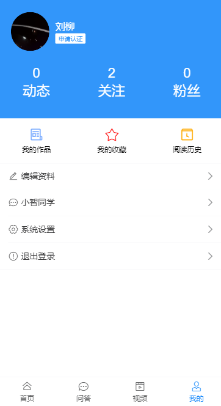
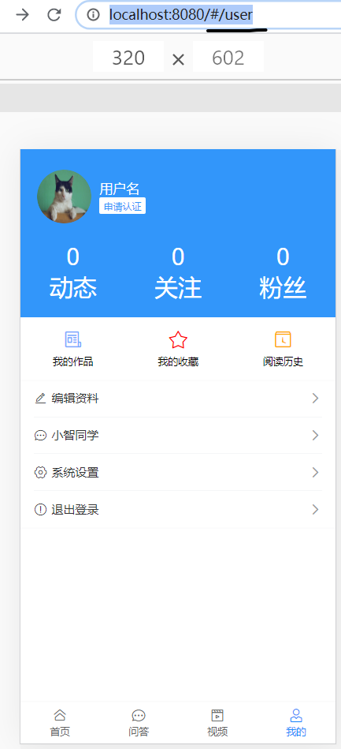
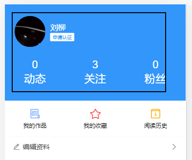
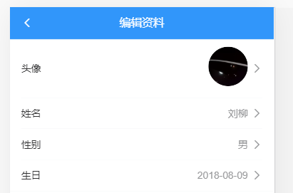
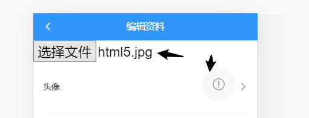
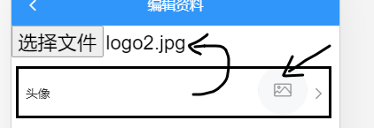

个人中心



## 基础布局

src/views/setting/setting.vue

### 结构

```html
<template>
  <div class="container">
    <!-- 用户个人资料 -->
    <div class="user-profile">
      <div class="info">
        <van-image round src="https://img.yzcdn.cn/vant/cat.jpeg" />
        <h3 class="name">
          用户名
          <br />
          <van-tag size="mini">申请认证</van-tag>
        </h3>
      </div>
      <van-row>
        <van-col span="8">
          <p>0</p>
          <p>动态</p>
        </van-col>
        <van-col span="8">
          <p>0</p>
          <p>关注</p>
        </van-col>
        <van-col span="8">
          <p>0</p>
          <p>粉丝</p>
        </van-col>
      </van-row>
    </div>

    <!-- 操作链接 -->
    <van-row class="user-links">
      <van-col span="8">
        <van-icon name="newspaper-o" color="#7af" />我的作品
      </van-col>
      <van-col span="8">
        <van-icon name="star-o" color="#f00" />我的收藏
      </van-col>
      <van-col span="8">
        <van-icon name="tosend" color="#fa0" />阅读历史
      </van-col>
    </van-row>

    <!-- 编辑入口
      is-link: 产生一个向右的箭头
      to: 用来做路由的跳转
    -->
    <van-cell-group class="user-group">
      <van-cell icon="edit" title="编辑资料" to="/user/profile" is-link />
      <van-cell icon="chat-o" title="小智同学" to="/user/chat" is-link />
      <van-cell icon="setting-o" title="系统设置" />
      <van-cell icon="warning-o" title="退出登录" to="/login" is-link />
    </van-cell-group>
  </div>
</template>

<script>
export default {
  name: 'UserIndex',
  data () {
    return {

    }
  }
}
</script>

<style lang="less" scoped>
.user {
  &-profile {
    width: 100%;
    height: 200px;
    display: block;
    background: #3296fa;
    color: #fff;
    .info {
      display: flex;
      padding: 20px;
      align-items: center;
      .van-image{
        width: 64px;
        height: 64px;
      }
      .name {
        font-size: 16px;
        font-weight: normal;
        margin-left: 10px;
      }
      .van-tag {
        background: #fff;
        color: #3296fa;
      }
    }
    p{
      margin: 0;
      text-align: center;
    }
  }
  &-group {
    margin-bottom: 15px;
  }
  &-links {
    padding: 15px 0;
    font-size: 12px;
    text-align: center;
    background-color: #fff;
    .van-icon {
      display: block;
      font-size: 24px;
      padding-bottom: 5px;
    }
  }
}
</style>

```

### 修改layout.vue,隐藏顶部的搜索导航

修改layout.vue中的nav-bar的显示 ： 如果在/user页面中， 则隐藏顶部的搜索导航区域。

```
<!-- 顶部logo搜索导航区域
    如果当前是在"我的" 页面，则不要出现搜索导航区域
    只有当前页面不是“我的”，它才显示出来
    -->
    <van-nav-bar
      fixed
      v-show="$route.path !== '/user'"
     >
```

或者补充计算属性

```
computed: {
    cVisible () {
      return this.$route.path !== '/user'
    }
  }
```


### 测试效果



## 数据渲染

### 目标

从接口中取出数据来，显示在页面上。

### 步骤

- 封装接口方法

- 调用 方法

- 数据绑定

  

定义API `src/api/user.js`

```js
/**
 * 获取用户自已的信息
 */
export const getInfo = () => {
  return ajax({
    method: 'GET',
    url: '/app/v1_0/user'
  })
}

```

**调用 方法获取个人信息**

src\views\user\index.vue中

- 引入方法
- 定义数据项
- 在created时，调用方法，保存数据

```js
import { getInfo } from '@/api/user.js'

data () {
    return {
      user: {}
    }
  },
  created () {
    this.loadUserInfo()
  },
  methods: {
    async loadUserInfo () {
      const result = await getInfo()
      console.log(result)
      this.user = result.data.data
    }
  }
```

渲染组件：

```html
<!-- 用户个人资料 -->
<div class="user-profile">
      <div class="info">
        <van-image round :src="user.photo" />
        <h3 class="name">
          {{user.name}}
          <br />
          <van-tag size="mini">申请认证</van-tag>
        </h3>
      </div>
      <van-row>
        <van-col span="8">
          <p>{{user.art_count}}</p>
          <p>动态</p>
        </van-col>
        <van-col span="8">
          <p>{{user.follow_count}}</p>
          <p>关注</p>
        </van-col>
        <van-col span="8">
          <p>{{user.fans_count}}</p>
          <p>粉丝</p>
        </van-col>
      </van-row>
    </div>
```

### 效果



## 退出登录

### 目标

退出登录状态

- 回到登陆页
- 清空本地登陆信息

### 步骤

**补充vuex中的mutation**

在src\store\index.js中, 添加一个mutations

```
import { setItem, getItem, removeItem } from '@/utils/storage.js'

mClearTokenInfo (state) {
     // 1. 保存到vuex
     state.tokenInfo = {}
     // 2. 做持久化 -- 保存到localstorage
     removeItem('tokenInfo')
}
```

**在视图上绑定事件**

```html
 <!-- 你再玩一会吧，大爷-->
 <van-cell icon="warning-o" title="退出登录" @click="hQuit" is-link />
```

**在组件view/user/index.vue中**

通过map的方式来调用mutation。

```js
import { mapMutations } from 'vuex'
```

```js
methods: {
    ...mapMutations(['mClearTokenInfo']),
    hQuit () {
      // 全局安装了vant。则自动会有这个$dialog
      this.$dialog.confirm({
        title: '系统提示',
        message: '你长的这么好看，不多呆一会吗？'
      })
        .then(() => {
          // 1. 清空token
          // this.$store.commit('mClearTokenInfo')
          this.mClearTokenInfo()
          // 2. 跳回login
          this.$router.push('/login')
        })
        .catch(() => {
        // on cancel
        // 不要删除，因为取消时要到这里来。如果删除了，就会在点击取消时，报错
        })
    }
  }
```


## 编辑个人资料-创建组件并配置路由

由于需要编辑的内容比较多，页面较大，所以单独补充设置一个页面级的组件，这也是一个新的一级路由组件。

```
setting/setting.vue
+ setting/profile.vue #个人资料
```

### 创建组件

src/views/setting/profile.vue

基础布局结构：

```html
<template>
  <div class="container">
    <!-- 导航条 -->
    <van-nav-bar
      left-arrow
      @click-left="$router.back()"
      title="编辑资料">
    </van-nav-bar>

    <!-- 编辑区 -->
    <van-cell-group>
      <van-cell is-link title="头像"  center>
        <van-image
          slot="default"
          width="1.5rem"
          height="1.5rem"
          fit="cover"
          round
          :src="user.photo"
        />
      </van-cell>
        <!-- value： 设置右侧显示的文字 -->
      <van-cell is-link title="姓名" :value="user.name" @click="isShowName=true"/>

      <van-cell is-link title="性别" :value="user.gender === 1?'男':'女'" @click="isShowGender=true"/>

      <van-cell is-link title="生日" :value="user.birthday" @click="isShowBirthday=true"/>
    </van-cell-group>
  </div>
</template>

<script>
export default {
  name: 'userProfile',
  data () {
    return {
      // 控制弹层
      isShowName: false,
      isShowGender: false,
      isShowBirthday: false,

      // 当前用户的信息
      user: { name: '张三' },

      // 修改后的新名字
      newName: '',
      // 修改后新生日
      newDate: new Date(),
      minDate: new Date(1965, 0, 10), // dateTime-picker中最小时间
      maxDate: new Date() // 当前时间
    }
  }
}
</script>

```


### 添加路由

```
  {
    path: '/user/profile',
    name: 'userProfile',
    component: () => import('@/views/user/profile.vue')
  }
```


### 测试效果


### 数据并渲染

获取用户档案的这个操作在login.vue中已经做过了，当时也保存到vuex中，在这里直接获取并显示

渲染数据

从vuex中取出数据到计算属性

```

import { mapState } from 'vuex'
export default {
  name: 'userProfile',
  data () {
    return {
      // 控制弹层
      isShowName: false,
      isShowGender: false,
      isShowBirthday: false,

      // 修改后的新名字
      newName: '',
      // 修改后新生日
      newDate: new Date(),
      minDate: new Date(1965, 0, 10), // dateTime-picker中最小时间
      maxDate: new Date() // 当前时间
    }
  },
  computed: {
    ...mapState(['userInfo'])
  }
}
```


```
<van-cell-group>
      <van-cell is-link title="头像"  center>
        <van-image
          slot="default"
          width="1.5rem"
          height="1.5rem"
          fit="cover"
          round
          :src="user.photo"
        />
      </van-cell>

      <van-cell is-link title="名称" :value="user.name" @click="showName=true"/>

      <van-cell is-link title="性别" :value="user.gender === 1?'男':'女'" @click="showGender=true"/>

      <van-cell is-link title="生日" :value="user.birthday" @click="showBirthday=true"/>
    </van-cell-group>
```

### 效果



## 编辑个人资料-姓名


### 思路

在点击了名字项后，在van-dialog弹层出来，进行修改。

### 添加弹层结构

- 添加popup
- 添加数据项控制弹层显示
- 添加click，实现基本效果

```html
<!-- 修改名字  -->
      <van-dialog
        v-model="showName"
        title="修改名字"
        show-cancel-button
        @confirm="hSaveName">
        <van-field v-model.trim="newName" />
      </van-dialog>
    </van-cell-group>
```


### 准备api

api/user.js,添加接口

```javascript

/**
 * 修改个人的三项基本信息
 * @param {*} obj 要修改的内容
 * obj {
 *  name: 姓名,
 *  gender: 性别：男(0) ,女(1)
 *  birthday: 2010-12-20
 * }
 */
export const updateUserInfo = obj => {
  return ajax({
    method: 'PATCH',
    url: '/app/v1_0/user/profile',
    data: obj
  })
}

```

### 调用

在view/user/profile.vue中，调用上面的接口，实现功能。

引入方法 

```
import { getInfo, updateUserInfo } from '@/api/user'
```

完成确认修改的函数

```javascript
// 修改名字
async hSaveName () {
      if (this.newName === '') {
        return
      }
      try {
        const result = await updateUserInfo({ name: this.newName })
        console.log(result)
        // 在本地更新vuex
        this.$store.commit('mUpdateName', this.newName)
        this.$toast.success('操作成功')
      } catch (err) {
        console.log(err)
        this.$toast.fail('操作失败')
      }
    }
```


## 编辑个人资料-性别

### 思路

在点击了性别项后，在van-dialog弹层出来，进行修改。

### 结构

弹层

```html
<!-- 修改性别 -->
      <van-popup v-model="showGender" position="bottom">
        <van-nav-bar title="修改性别" left-text="取消" @click-left="showGender=false">
        </van-nav-bar>
        <van-cell title="男" @click="hSaveGender(0)" is-link></van-cell>
        <van-cell title="女" @click="hSaveGender(1)" is-link></van-cell>
      </van-popup>
```

> 后端的接口有问题，在修改性别时，它不能正确保存

### 调用

```javascript
async hSaveGender (gender) {
      try {
        const result = await updateUserInfo({ gender })
        console.log(result)
        // 在本地更新vuex
        this.$store.commit('mUpdateGender', gender)
        this.$toast.success('操作成功')
      } catch (err) {
        console.log(err)
        this.$toast.fail('操作失败')
      }
    }
```


## 编辑个人资料-生日

### 目标

- 使用datetime-picker组件完成个人生日信息的编辑

### 步骤

1. 采用popup弹层组件包裹datetime-picker组件来提供日期选择
2. 用dayjs来做格式化


### 要点

1. 使用[datetime-picker](https://youzan.github.io/vant/#/zh-CN/datetime-picker#xuan-ze-ri-qi-nian-yue)组件来提供用户选择新的日期时间。

```
@cancel="isShowBirthday=false"
@confirm="hChangeBirthday"
```

2. 日期组件中的格式是日期格式的，而接口中要的日期格式是字符串格式的'YYYY-MM-DD'，可以引入dayjs 来做格式化。


准备数据项

```
return {
      ....
      // 修改后新生日
      newDate: new Date(),
      minDate: new Date(2000, 0, 10), // dateTime-picker中最小时间: 2000年1月10号
      maxDate: new Date() // 当前时间
    }
```

视图

```
<!-- 修改生日 -->
      <van-popup v-model="showBirthday" position="bottom">
        <van-nav-bar title="修改生日">
        </van-nav-bar>
        <van-datetime-picker
          v-model="newDate"
          type="date"
          title="选择年月日"
          @cancel="showBirthday=false"
          @confirm="hSaveBirthday"
          :min-date="minDate"
          :max-date="maxDate"
        />
      </van-popup>
```

代码

- 引入dayjs来做格式化。

  `import dayjs from 'dayjs'`

```
async hSaveBirthday () {
      // https://day.js.org/docs/zh-CN/display/format
      const birthday = dayjs(this.newDate).format('YYYY-MM-DD')
      // console.log(this.newDate, birthday)
      try {
        const result = await updateUserInfo({ birthday })
        console.log(result)
        // 在本地更新vuex
        this.$store.commit('mUpdateBirthday', birthday)
        this.$toast.success('操作成功')
      } catch (err) {
        console.log(err)
        this.$toast.fail('操作失败')
      }

      this.isShowBirthday = false
    }
```

注意：

- 如果你的生日的格式不是后端要求的`2020-01-12`,则ajax会报错！
- dayjs().format可以做格式化


## 编辑个人资料-头像

### 目标

编辑个人头像，本质就是从本地上传一张新的图片到服务器，以替换之前头像文件。

### 步骤

调用接口，上传文件

### 思路

- 移花接木。创建一个隐藏的文件域： input type="file"  hidden 。当用户点击图像时，主动去调用文件域的click，呼出选择文件的对话框。
- 创建接口，注意接口的格式是formData。


### 结构

放一个input type=file

```
 <van-cell-group>
+      <input type="file" @change="hPhotoChange" ref="refPhoto"/>
      <van-cell is-link title="头像"  center>
        <van-image
          slot="default"
          width="1.5rem"
          height="1.5rem"
          fit="cover"
          round
          :src="user.photo"
        />
      </van-cell>
```


### 封装API

查询接口文档(编辑用户照片资料（头像、身份证照片）)，在 src/api/user.js中添加接口：

```js
/**
 * 修改用户头像
 *
 * obj： 以formData格式保存参数
 */
export const updatePhoto = obj => {
  return ajax({
    method: 'PATCH',
    url: '/app/v1_0/user/photo',
    data: obj
    // data: {
    //   photo: xxxx
    // }
  })
}
```

**它是上传文件**

### 代码

- input type="file" 去监听change事件

  `<input type="file" @change="hChangeImage" ref="refFile"/>`

- 在回调中去上传头像

  ```
  async hChangeImage () {
        // 获取用户选中的文件
        console.dir(this.$refs.refFile)
        // this.$refs.refFile 获取对input type="file" 的引用
        // 用户选中文件之后，它会自动放在 files 集合中
        // files[0] : 是用户选中的第一个文件
        const file = this.$refs.refFile.files[0]
        // console.log('file')
        // console.dir(file)
        if (!file) {
          return
        }
        try {
          // 上传文件
          const fd = new FormData()
          fd.append('photo', file) // photo是接口需要的参数名，file是文件
  
          const result = await updatePhoto(fd)
          // console.log(result)
          // 调用接口，上传这个文件
          this.$store.commit('mUpdatePhoto', result.data.data.photo)
          this.$toast.success('操作成功')
        } catch (err) {
          console.log(err)
          this.$toast.fail('操作失败')
        }
      }
  ```


效果：




### 优化：隐藏文件域

在头像点击时，去模拟input type="file" 的点击，补充一个`input type="file"`,让它隐藏起来。

1. 添加hidden

```
<!-- 当用户在文件域中进行选择时，会触发change事件
       hidden: 隐藏。它用来隐藏input元素。元素将不可见，也不占用页面的空间
       ref="refPhoto": 添加ref为了通过引用来访问这个dom元素  -->

+      <input type="file" hidden @change="hChangeImage" ref="refFile"/>
```

2. 移花接木

   

```
<van-cell is-link title="头像"  center @click="hShowSelectImage">
```

```javascript
// 用户在头像上点击，希望也弹出文件选择框
// 移花接木
hShowSelectImage () {
      // 用户点击了头像区域，相当于去点击文件域
      this.$refs.refFile.click()
    },
```
