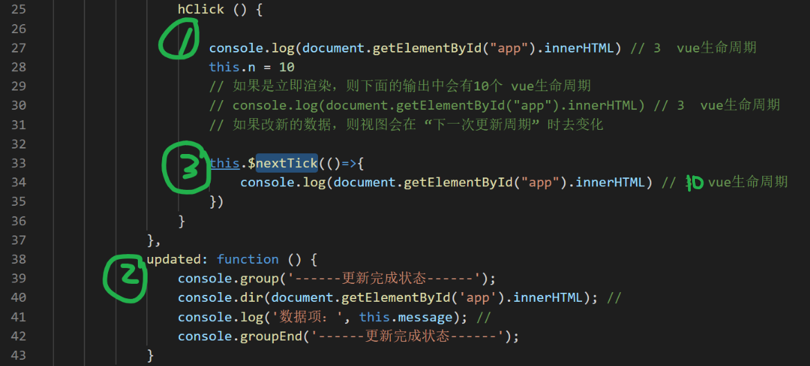
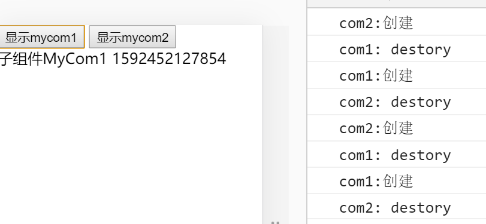
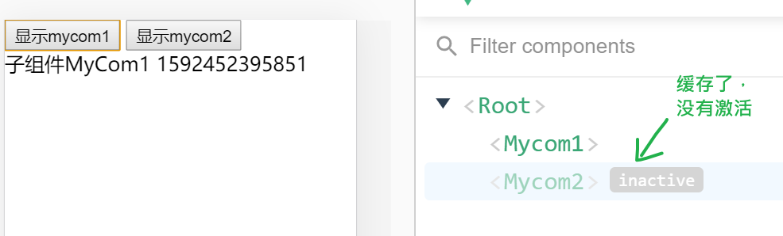

## 生命周期

created () {}

### 理解钩子函数


vue实例的整个一生中的某些个关键节点被调用的函数。

demo

```
<script>
        function Baby(option) {
            setTimeout(()=>{

                option.wine0 && option.wine0()
            },10)

            setTimeout(()=>{
                option.money18 && option.money18()
            },18*1000)
        }
        new Baby({
            wine0 () {
                console.log('你刚出生，给你埋了10件茅台')
            },
            money18 () {
                console.log('你长大了，给你一笔钱出去看看吧')
            }
        })
    </script>
```


### vue实例的生命周期

按顺序有如下8个

```
1. beforeCreate: 视图及数据均不可用。
2. created:视图不用可，数据可访问。
3. beforeMount: 视图并没有渲染，数据可访问。
4. mounted: 视图渲染，数据可访问。
----如果有更新数据----
5. beforeUpdate：此时可以获取到更新的数据，但是，视图并没有重新渲染。你可以在此进一步更改状态
6. updated：组件DOM已经更新，你现在可以执行依赖于DOM的操作
----如果实例被删除 vm.$destory() 或者v-if的值是false-----
7. beforeDestroy：
8. destroyed:实例销毁后调用。调用后，Vue实例指示的所有东西都会解绑定，所有的事件监听器会被移除，所有的子实例也会被销毁。视图还在，实例对象还在,就是失去了活性。
```

实践：

​	created:  发ajax， 事件监听， 连接websocket

​    mounted: 也可以去发ajax，但是，在created中发有一个好处：更早把ajax发出来了。

​	destroyed： 收回资源，销毁定时器，关闭websocket连接.....

demo

```
<!DOCTYPE html>
<html lang="en">
<head>
    <meta charset="UTF-8">
    <meta name="viewport" content="width=device-width, initial-scale=1.0">
    <title>Document</title>
</head>
<body>
    <div id="app">
        <div v-for="item in n">
            {{message}}
        </div>
    </div>
    <script src="https://cdn.jsdelivr.net/npm/vue/dist/vue.js"></script>
    <script>
        
        var vm = new Vue({
            el: '#app',
            data: {
                message: 'vue生命周期',
                n: 3
            },
            beforeCreate: function () {
                console.group('------beforeCreate创建前状态------');
                console.log('视图：', document.getElementById('app').innerHTML); // 仍是模板
                console.log('数据项', this.message); //  不可访问
                console.groupEnd('------beforeCreate创建前状态------');
            },
            created: function () {
                console.group('------created创建完毕状态------');
                console.log('视图：', document.getElementById('app').innerHTML); // 仍是模板
                console.log('数据项', this.message); //  可以访问
                console.groupEnd('------created创建完毕状态------');
            },
            beforeMount: function () {
                console.group('------beforeMount挂载前状态------');
                console.log('视图：', document.getElementById('app').innerHTML); //已被初始化
                console.log('数据项', this.message); // 可以访问 
                console.groupEnd('------beforeMount挂载前状态------');
            },
            mounted: function () {
                console.group('------mounted 挂载结束状态------');
                console.log('视图：', document.getElementById('app').innerHTML); // 可以去访问dom结构了
                console.log('数据项', this.message); //  
                console.groupEnd('------mounted 挂载结束状态------');
    
            },
            beforeUpdate: function () {
                console.group('------beforeUpdate 更新前状态------');
                console.dir('视图'); //
                console.dir(document.getElementById('app').innerHTML); //
                console.log('数据项：', this.message); //  
                console.groupEnd('------beforeUpdate 更新前状态------');
                // this.message = "hahahha"
            },
            updated: function () {
                console.group('------更新完成状态------');
                console.dir(document.getElementById('app').innerHTML); //
                console.log('数据项：', this.message); //  
                console.groupEnd('------更新完成状态------');
            },
            beforeDestroy: function () {
                console.group('------beforeDestroy 销毁前状态------');
                console.dir(document.getElementById('app').innerHTML); //
                console.log('数据项', this.message); //  
                console.groupEnd('------beforeDestroy 销毁前状态------');
                this.message="我就要死了"
            },
            destroyed: function () {
                console.group('------销毁完成状态------');
                console.log('视图：', document.getElementById('app').innerHTML); //
                console.log('数据项', this.message); //
                console.groupEnd('------销毁完成状态------');
                this.message="我已经死了"
            }
        })
    </script>
</body>
</html>
```


- 钩子函数并不是都需要用到
- created: 发ajax拿数据
- mounted：发ajax拿数据 ， **才能正确获取dom结构**


## 理解异步更新dom

> Vue 异步执行 DOM 更新。只要观察到数据变化，Vue 将开启一个队列，并缓冲在同一事件循环中发生的所有数据改变。如果同一个 watcher 被多次触发，只会被推入到队列中一次。这种在缓冲时去除重复数据对于避免不必要的计算和 DOM 操作上非常重要。然后，在下一个的事件循环“tick”中，Vue 刷新队列并执行实际 (已去重的) 工作。

> 例如，当你设置`vm.someData = 'new value'`，该组件不会立即重新渲染。当刷新队列时，组件会在事件循环队列清空时的下一个“tick”更新。多数情况我们不需要关心这个过程，但是如果你想在 DOM 状态更新后做点什么，这就可能会有些棘手。虽然 Vue.js 通常鼓励开发人员沿着“数据驱动”的方式思考，避免直接接触 DOM，但是有时我们确实要这么做。为了在数据变化之后等待 Vue 完成更新 DOM ，可以在数据变化之后立即使用`Vue.nextTick(callback)` 。这样回调函数在 DOM 更新完成后就会调用。


数据修改了，视图**不会立即生效**！ 在大多数情况下，对我们的开发没有影响，但是：如果你希望根据最新的dom结构来做操作，则这里就会有问题！

还以上面的demo为例，我们希望更改n的数值 ，以得到更多次数的循环效果。

```
<!DOCTYPE html>
<html lang="en">
<head>
    <meta charset="UTF-8">
    <meta name="viewport" content="width=device-width, initial-scale=1.0">
    <title>Document</title>
</head>
<body>
    <div id="app">
        <div v-for="item in n">
            {{message}}
        </div>
        <button @click="hClick">把n改成10</button>
    </div>
    <script src="https://cdn.jsdelivr.net/npm/vue/dist/vue.js"></script>
    <script>
        
        var vm = new Vue({
            el: '#app',
            data: {
                message: 'vue生命周期',
                n: 3
            },
            methods: {
                hClick () {
                    console.log(document.getElementById("app").innerHTML) // 3  vue生命周期
                    this.n = 10
                    // 如果是立即渲染，则下面的输出中会有10个 vue生命周期
                    // console.log(document.getElementById("app").innerHTML) // 3  vue生命周期
                    // 如果改新的数据，则视图会在 “下一次更新周期” 时去变化

                    this.$nextTick(()=>{
                        // 函数中的代码不是立即执行的，
                        // 而是当vue对视图的更新完成之后再做
                        // 就是在 updated 之后执行
                        console.log(document.getElementById("app").innerHTML) // 3  vue生命周期
                    })
                }
            },
            updated: function () {
                console.group('------更新完成状态------');
                console.dir(document.getElementById('app').innerHTML); //
                console.log('数据项：', this.message); //  
                console.groupEnd('------更新完成状态------');
            }
        })
    </script>
</body>
</html>
```




## 父子组件的生命周期

```
<!DOCTYPE html>
<html lang="en">

<head>
    <meta charset="UTF-8">
    <meta name="viewport" content="width=device-width, initial-scale=1.0">
    <title>Document</title>
</head>

<body>
    <div id="app">
        <my-com v-if="isShow" ref="mycom1" :prop1="p"></my-com>
    </div>
    <script src="https://cdn.jsdelivr.net/npm/vue/dist/vue.js"></script>
    <script>

        var vm = new Vue({
            el: '#app',
            data: {
                p: 'abc',
                isShow: true
            },
            components: {
                'MyCom' :{
                    template: `<div> 子组件：
                        内容是:{{message}} ：prop: {{prop1}}
                    </div>`,
                    props:['prop1'],
                    data() {
                        return {
                            message: 'abc'
                        }
                    },
                    beforeCreate: function () {
                        console.info('MyCom------beforeCreate 销毁前状态------');
                    },
                    created: function () {
                        console.info('MyCom------created创建完毕状态------');
                    
                    },
                    beforeMount: function () {
                        console.info('MyCom------beforeMount挂载前状态------');
                    },
                    mounted: function () {
                        console.info('MyCom------mounted 挂载结束状态------');
                    
                    },
                    beforeUpdate: function () {
                        console.info('MyCom---beforeUpdate 更新前状态===============》');
                    
                    },
                    updated: function () {
                        console.info('MyCom---updated 更新完成状态===============》');
                    
                    },
                    beforeDestroy: function () {
                        console.info('MyCom---beforeDestroy 销毁前状态===============》');
                    
                    },
                    destroyed: function () {
                        console.info('MyCom---destroyed 销毁完成状态===============》');
                    }
                }
            },
            beforeCreate: function () {
                console.group('------beforeCreate创建前状态------');
                console.groupEnd('------beforeCreate创建前状态------');
            },
            created: function () {
                console.group('------created创建完毕状态------');
                console.groupEnd('------created创建完毕状态------');
            },
            beforeMount: function () {
                console.info('------beforeMount挂载前状态------');
              
            },
            mounted: function () {
                console.info('------mounted 挂载结束状态------');
              
            },
            beforeUpdate: function () {
                console.info('beforeUpdate 更新前状态===============》');
              
            },
            updated: function () {
                console.info('updated 更新完成状态===============》');
              
            },
            beforeDestroy: function () {
                console.info('beforeDestroy 销毁前状态===============》');
              
            },
            destroyed: function () {
                console.info('destroyed 销毁完成状态===============》');
            }
        })
    </script>
</body>

</html>
```


通过局部定义组件的方式在vue实例中去定义并使用子组件；

通过 **v-if来控制子组件的创建和销毁**；

通过prop传入属性并更新prop的值帮助理解updated的过程

- 先父组件的beforeUpdate
- 再来是子组件的更新
- 后是父组件的updated


## 动态组件和keep-alive

### 动态组件

component是vue中动态组件：

- 它是一个容器，自已是没有内容，你可以在其中放入任意的组件 
- 它有一个属性名：is ,值是一个字符串，就是当前注册的组件的名字

```
<div id="app">
        <button @click="comName='mycom1'">显示mycom1</button>
        <button  @click="comName='mycom2'">显示mycom2</button>

        <!-- commponent是vue中动态组件：它是一个容器，自已是没有内容，你可以在其中放入任意的组件 
        它有一个属性名：is ,值是一个字符串，就是当前注册的组件的名字
        -->

        <component :is="comName"></component>
    </div>
    <script src="https://cdn.jsdelivr.net/npm/vue/dist/vue.js"></script>
    <script>
        var vm = new Vue({
            el: '#app',
            components: {
                mycom1: {
                    template: `<div> 子组件MyCom1 {{d}}</div>`,
                    data(){return {d: Date.now()}},
                    created() {
                        console.log('com1:创建')
                    },
                    destroyed() {
                        console.log('com1: destory')
                    }
                },
                mycom2: {
                    template: `<div> 子组件MyCom2</div>`,
                    created() {
                        console.log('com2:创建')
                    },
                    destroyed() {
                        console.log('com2: destory')
                    }
                },
            },
            data: {
                comName: 'mycom1'
            }
        })
    </script>
```

它在切换显示组件时，会不停地销毁和创建。这种销毁和创建性能太差。




### keep-alive

什么是**`组件缓存`**? 如果对组件进行了缓存， 就是 **`一旦组件被创建`**, 那么**`就不会在切换组件时被销毁`**。

格式：

```
<keep-alive>
	要缓存的内容
</keep-alive>
```

一般在动态组件和路由组件时使用。

```
<div id="app">
        <button @click="comName='mycom1'">显示mycom1</button>
        <button  @click="comName='mycom2'">显示mycom2</button>

        <!-- commponent是vue中动态组件：它是一个容器，自已是没有内容，你可以在其中放入任意的组件 
        它有一个属性名：is ,值是一个字符串，就是当前注册的组件的名字
        -->
        <keep-alive>
            <component :is="comName"></component>
        </keep-alive>
    </div>
    <script src="https://cdn.jsdelivr.net/npm/vue/dist/vue.js"></script>
    <script>
        var vm = new Vue({
            el: '#app',
            components: {
                mycom1: {
                    template: `<div> 子组件MyCom1 {{d}}</div>`,
                    data(){return {d: Date.now()}},
                    created() {
                        console.log('com1:创建')
                    },
                    destroyed() {
                        console.log('com1: destory')
                    }
                },
                mycom2: {
                    template: `<div> 子组件MyCom2</div>`,
                    created() {
                        console.log('com2:创建')
                    },
                    destroyed() {
                        console.log('com2: destory')
                    }
                },
            },
            data: {
                comName: 'mycom1'
            }
        })
    </script>
```




### activated和deactivated

对于组件如果采用了keep-alive，则组件会多出两个钩子函数(理解为多出两个生命周期钩子函数):

- activated:  组件激活

- deactivated:组件失活

下面是示例代码：

```
<div id="app">
        <button @click="comName='mycom1'">显示mycom1</button>
        <button  @click="comName='mycom2'">显示mycom2</button>

        <!-- commponent是vue中动态组件：它是一个容器，自已是没有内容，你可以在其中放入任意的组件 
        它有一个属性名：is ,值是一个字符串，就是当前注册的组件的名字

        keep-alive： 用来对组件进行缓存。
        缓存之后：
          1. 组件的切换就不会再去执行销毁和创建了。只需创建一次。
          2. 组件多出两个钩子函数：
             activated和deactivated,分别表示组件处于激活和失活状态
        
        主要应用场景，有两个：
        （1）里面放动态组件
            <keep-alive>
                <component :is="comName"></component>
            </keep-alive>
        （2）里面放路由出口
            <keep-alive>
                <router-view></router-view>
            </keep-alive>
        -->
        <keep-alive>
            <component :is="comName"></component>
        </keep-alive>
    </div>
    <script src="https://cdn.jsdelivr.net/npm/vue/dist/vue.js"></script>
    <script>
        var vm = new Vue({
            el: '#app',
            components: {
                mycom1: {
                    template: `<div> 子组件MyCom1 {{d}}</div>`,
                    data(){return {d: Date.now()}},
                    activated(){
                        console.log('com1处于激活状态')
                    },
                    deactivated () {
                        console.log('com1处于失活状态')
                    },
                    created() {
                        console.log('com1:创建')
                    },
                    destroyed() {
                        console.log('com1: destory')
                    }
                },
                mycom2: {
                    template: `<div> 子组件MyCom2</div>`,
                    created() {
                        console.log('com2:创建')
                    },
                    destroyed() {
                        console.log('com2: destory')
                    },
                    activated(){
                        console.log('com2处于激活状态')
                    },
                    deactivated () {
                        console.log('com2处于失活状态')
                    },
                },
            },
            data: {
                comName: 'mycom1'
            }
        })
    </script>
```


