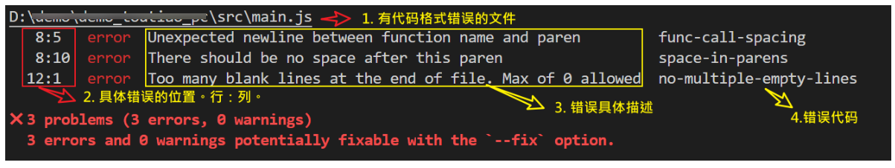
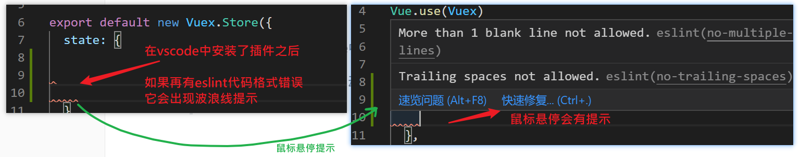

# hmtt_web

在master分支中，只有基础代码，你需要切换到对应的分支去查看相关的代码。基础代码采用`vue create http_web`命令创建而来。

## 具体参数

1. @vue/cli 的版本是4.4.6

```
Vue -v
> @vue/cli 4.4.6
```

2. 创建项目时，采用的配置项是：

   - 手动选择特性，具体有：Babel, Router,Vuex,CSS Pre-processors, Linter

     ```
     ? Check the features needed for your project:
      (*) Babel
      ( ) TypeScript
      ( ) Progressive Web App (PWA) Support
      (*) Router
      (*) Vuex
      (*) CSS Pre-processors
      (*) Linter / Formatter
      ( ) Unit Testing
      ( ) E2E Testing
     ```

     > 方向键移动选择项，空格键 确定/取消 选择

   - 路由是否使用history模式：不采用

     ```
     ? Use history mode for router?(Requires proper server setup for index fallback in production) (Y/n) n
     ```

   - css 预处理器: 选用less

     ```
     ? Pick a CSS pre-processor (PostCSS, Autoprefixer and CSS Modules are supported by default):
      Sass/SCSS (with dart-sass)
      Sass/SCSS (with node-sass)
      Less (选中)
      Stylus
     ```

   - 语法风格：Standard

     ```
     ? Pick a linter / formatter config:
       ESLint with error prevention only
       ESLint + Airbnb config
       ESLint + Standard config（选中）
       ESLint + Prettier
      
     ```

   - Eslint的额外设置：保存时检查，提交时检查

     ```
     ? Pick additional lint features:
     (*) Lint on save
     (*) Lint and fix on commit
     ```

   - 存储插件配置位置：单独放在不同的文件中 in dedicated config files。

     ```
     where do you prefer placing config for Babel, PostCSS, ESLint, etc. ?
     > In dedicated config files (选中)
     > In package.json
     ```

   选择完成之后，开始创建。

## 克隆指定分支

格式:

```
git clone -b 分支名 https://gitee.com/fanyoufu2/hmtt_web.git
```

示例：

​	目标：从本仓库中克隆出名为dev106的分支。

​	命令：git clone -b dev108 https://gitee.com/fanyoufu2/hmtt_web.git

## 代码运行

当代码克隆完成之后：1） 进入目录， 2） 安装依赖  3）启动项目

```bash
## 0）克隆指定仓库
git clone -b dev106 https://gitee.com/fanyoufu2/hmtt_web.git
## 1） 进入目录
cd http_web
## 2） 安装依赖
npm i 
## 3）启动项目
npm run serve
```


## ESlint代码规范

代码规范：一套写代码的约定规则。例如：赋值符号的左右是否需要空格？一句结束是否是要加;？...

> 没有规矩不成方圆。

ESLint:是一个代码检查工具，用来检查你的代码是否符合指定的规则(你和你的团队可以自行约定一套规则)。在创建项目时，我们使用的是 [JavaScript Standard Style](https://standardjs.com/readme-zhcn.html) 代码风格的规则。

> ```
> eslint是法官，Standard config是法律
> ```

### JavaScript Standard Style 规范说明

建议把：https://standardjs.com/rules-zhcn.html 看一遍，然后在写的时候遇到错误就查询解决。下面是这份规则中的一小部分：

- *字符串使用单引号* – 需要转义的地方除外

- *无分号* 

- *关键字后加空格* `if (condition) { ... }`

- *函数名后加空格* `function name (arg) { ... }`

- 坚持使用全等 `===` 摒弃 `==` 一但在需要检查 `null || undefined` 时可以使用 `obj == null`

- ......

  

### 代码规范错误

如果你的代码不符合standard的要求，eslint会跳出来刀子嘴，豆腐心地提示你。下面我们在main.js中随意做一些改动：添加一些空行，空格。


按下保存代码之后：

你将会看在控制台中输出如下错误：



> eslint 是来帮助你的。心态要好，有错，就改。

### 修正错误

有三种方法来修正错误：

- 手动修正:人肉修改
- 命令修正：npm run lint
- 插件修正: 配合vscode 中的eslint插件

#### 手动修正

根据错误提示来一项一项手动修正。

如果你不认识命令行中的语法报错是什么意思，你可以根据错误代码（func-call-spacing, space-in-parens,.....）去 ESLint 规则列表中查找其具体含义。

它的网官在[这里](https://cn.eslint.org/docs/rules/) 打开 [ESLint 规则表](https://cn.eslint.org/docs/rules/)，使用页面搜索（Ctrl + F）这个代码，查找对该规则的一个释义。

建议大家手动去修改错误，帮助养成良好的编码习惯，更加专业！！


#### 用vuecli提供的命令来自动修正

vuecli提供了自动修复功能（有些复杂的错误还是要手动来改正），具体做法是: 运行命令

```
npm run lint
```

#### 通过vscode中的eslint插件来实现自动修正

在vscode中安装 ESlint扩展并启用，此时，它会



可选。[自行学习](http://www.fanyoufu.com/article/1586268774544)

> 注意：建议关闭vscode中自动保存格式化的功能
>
> 如果你的vscode中的自动格式化工具与eslint的格式不一样，则会出现很多的格式错误: eslint眼中的错误。


### 自定义规则

在项目的根目录下，有一个名为.eslintrc.js的文件，它就是专门用来对eslint进行设置的文件。这个文件会导出一个对象，这个对象有一个名为rules的属性，它专门用来设置自定义代码规则的。

```
module.exports = {
  root: true,
  env: {
    node: true
  },
  extends: [
    'plugin:vue/essential',
    '@vue/standard'
  ],
  parserOptions: {
    parser: 'babel-eslint'
  },
  // 这里可以进行自定义规则配置
  // key：规则代号
  // value：具体的限定方式
  //   "off" or 0 - 关闭规则
  //   "warn" or 1 - 将规则视为一个警告（不会影响退出码）,只警告，不会退出程序
  //   "error" or 2 - 将规则视为一个错误 (退出码为1)，报错并退出程序
  // rules: {
  //   "no-console": process.env.NODE_ENV === "production" ? "error" : "off",
  //   "no-debugger": process.env.NODE_ENV === "production" ? "error" : "off",
  //   "space-before-function-paren": [
  //     "error",
  //     {
  //       anonymous: "never",
  //       named: "never",
  //       asyncArrow: "never"
  //     }
  //   ]
  //   // 'semi': ['error', 'always']
  // },
  rules: {
    'no-console': process.env.NODE_ENV === 'production' ? 'warn' : 'off',
    'no-debugger': process.env.NODE_ENV === 'production' ? 'warn' : 'off',
    'no-multiple-empty-lines': 'off'
  }
}
```

rules是一个对象，以键值对的格式来约定规则：

- 键名是规则名
- 值是这条规则的具体说明。最常见的有off,warn,error。