目标：

- 了解vuex的应用场景
- 实现vue跨组件之间数据共享
- 掌握vuex的基本使用

## 回顾-组件之间共享状态

>  状态 ==== 数据

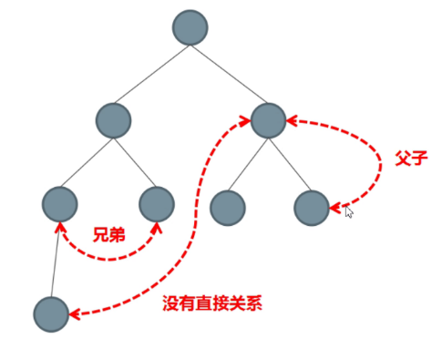

组件之间共享状态的两种典型方式：

- 父子之间 : props + $emit

  - 父传子：props属性绑定

    ```
    <son1 msg="msg"></son1>
    ```

  - 子传父：$emit事件绑定

    ```
    <div>
    	<button @click="$emit('event-name')">通知父组件</button>
    </div>
    ```

- 非父子之间：EventBus(事件总线)

  - $on

  - $emit

    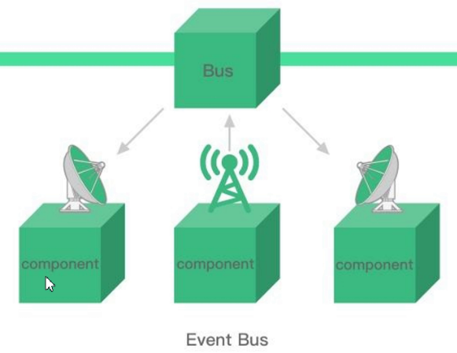

如果某个状态需要在很多个组件来使用，或者要实现**多个组件共同维护一份数据**又应该怎么做呢？

这里就要引入Vuex了。


 要点：

- 组件之间数据通信有如下三种典型的情况及解决方案

  1. 父子组件

     **prop + $emit**

  2. 非父子组件

     **eventBus**

     **Vuex** : 具备响应式的特点

## Vuex概述

- [vuex](https://vuex.vuejs.org/zh/) 是vue官方专为 Vue.js 应用程序开发的一种**状态管理模式**。它采用**集中**式存储管理应用的**所有组件**的状态，并以相应的规则保证状态以一种可预测的方式发生变化。

  ```
  data () {
   return {
      xxxxx // 状态
   }
  }
  ```

  

- vuex是vue的一个插件（vue-router也是一个插件）。它提供多组件之间共享数据的解决方案。

  ```
  Vue.use(vueRouter) // vue在使用它的插件时，都是Vue.use(插件)
  如果你要给Vue提供一个插件，则它的使用方式一定是Vue.use()
  ```

- vuex 也集成到 Vue 的官方调试工具 [devtools extension](https://github.com/vuejs/vue-devtools)，提供了诸如零配置的 time-travel 调试、状态快照导入导出等高级调试功能。

### 它是渐进式的重要支撑

渐进式：vue是一个渐进式的框架。

- 它的核心很简单
- 通过引入插件的方式，给它补充新的功能、使用它的新功能...

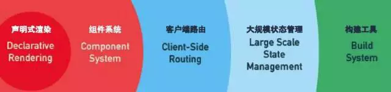

上图中的大规模状态管理就是vuex。

### 应用场景：多组件共享状态

 vuex的作用是解决**多组件状态共享**的问题。

- 它是独立于组件而单独存在的，所有的组件都可以把它当作一座桥梁来进行通讯。
- 与事件总线（EventBus）相比，它具备额外的特点：
  - **响应式**
  - 操作更简洁

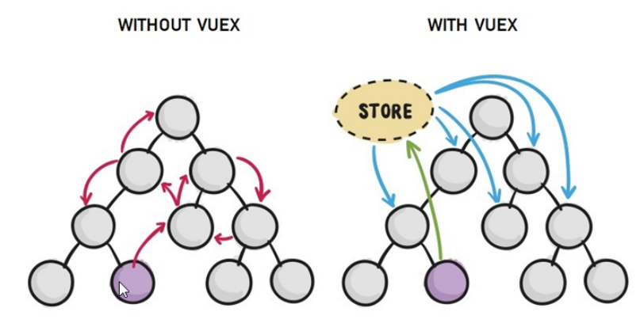

### 什么数据适合存储在vuex中

一般情况下，只有**多个组件均需要共享的数据**，才有必要存储在vuex中，对于某个组件中的私有数据，依旧存储在组件自身的data中。

例如：

- 对于所有组件而言，当前登陆的用户名是需要在全体组件之间共享的，则它可以放在vuex中

- 对于文章详情页组件来说，当前的用户浏览的文章数据则应该属于这个组件的私有数据，应该要放在这个组件的data中。


结论： 不要把全部的数据放在vuex中, 除非要在多个组件之间共享。


### 小结

是官方提供的插件，解决多组件之间状态（数据）共享

与eventBus的相同点：

	- 独立于组件体系

不同点

 - 具有数据响应式的特点

   

## 需求-多组件共享数据

### 需求描述

对于如下三个组件（一个父组件，两个子组件），要求的

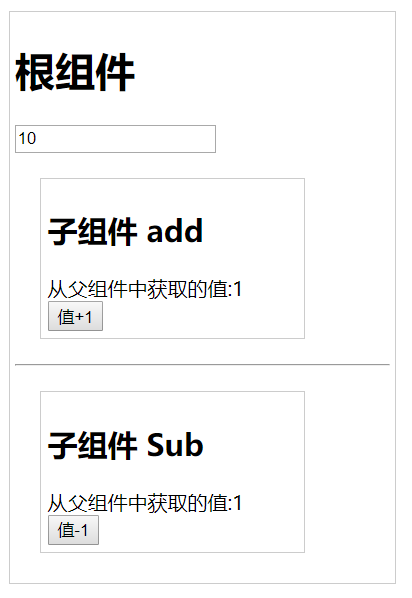


效果是三个组件共享一份数据:

- 任意一个组件都可以修改数据
- 三个组件的数据是同步的

### 基础代码

使用`vue create vuex-demo` 命令新创建一个空的，最简单的vue项目。

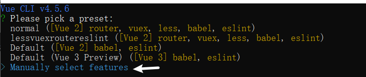

只选择Babel

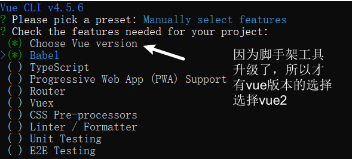

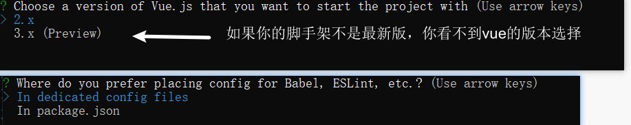


并设置如下三个组件, 目录如下：

```bash
|-components
|--AddItem.vue
|--SubItem.vue
|-App.vue
```

下面来看具体的代码。

#### App.vue

在入口组件中引入AddItem和SubItem这两个子组件

```javascript
<template>
  <div id="app">
    <h1>根组件</h1>
    <input type="text" v-model="num">
    <add-item></add-item>
    <hr>
    <sub-item></sub-item>
  </div>
</template>

<script>
import AddItem from './components/AddItem.vue'
import SubItem from './components/SubItem.vue'

export default {
  name: 'app',
  data:function(){
    return {
      num:1
    }
  },
  components: {
    AddItem,
    SubItem
  },
}
</script>

<style>
#app {
  width: 300px;
  margin: 20px auto;
  border:1px solid #ccc;
  padding:4px;
}
</style>
```


#### SubItem.vue

```javascript
<template>
  <div class="box">
    <h2>子组件 sub</h2>
    从父组件中获取的值:<label for=""></label>
    <br>
    <button >值-1</button>
  </div>
</template>
<style lang="css">
  .box{
    border:1px solid #ccc;
    width:200px;
    padding:5px;
    margin: 20px;
  }
</style>
<script>
export default {
  name: 'SubItem'
}
</script>
```

#### AddItem.vue

```javascript
<template>
  <div class="box">
    <h2>子组件 add</h2>
    从父组件中获取的值:<label for=""></label>
    <br>
    <button >值+1</button>
  </div>
</template>
<style lang="css">
  .box{
    border:1px solid #ccc;
    width:200px;
    padding:5px;
    margin: 20px;
  }
</style>
<script>
export default {
  name: 'AddItem'
}
</script>
```


好的，上面已经实现了基本的组件结构，其显示效果如下：

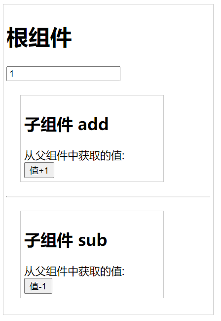


下面来讨论实现方式。

- 非vuex实现。


## 常规实现-多组件共享数据

由于这里涉及的组件只有两级，就是父子，所以不考虑引入EventBus，我们的实现思路是：

- 数据项num定义在父组件中。通过v-model传递给子组件。
- 在子组件内部
  - 通过input事件来间接修改父组件中的num的值。

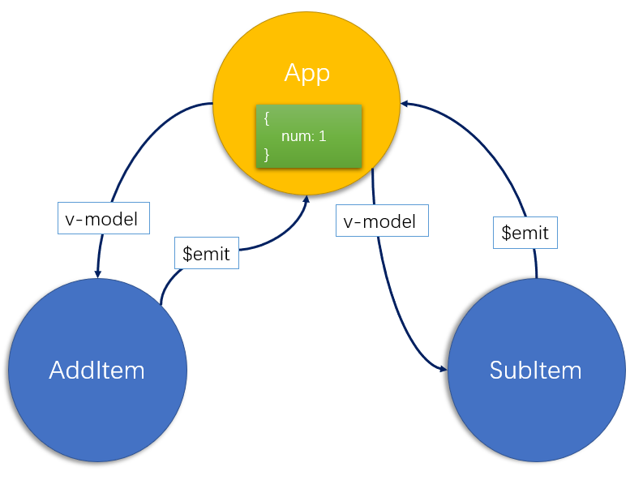


### 父组件 app.vue

给两个子组件设置v-model.

```javascript
<template>
  <div id="app">
    <h1>根组件</h1>
    <input type="text" v-model="num">
+    <add-item v-model="num"></add-item>
    <hr>
+    <sub-item v-model="num"></sub-item>
  </div>
</template>

<script>
import AddItem from './components/AddItem.vue'
import SubItem from './components/SubItem.vue'

export default {
  name: 'app',
  data:function(){
    return {
      num:1
    }
  },
  components: {
    AddItem,
    SubItem
  },
}
</script>

<style>
#app {
  width: 300px;
  margin: 20px auto;
  border:1px solid #ccc;
  padding:4px;
}
</style>
```


### 子组件AddItem.vue

```javascript
<template>
  <div class="box">
    <h2>子组件 add</h2>
    从父组件中获取的值:<label for="">{{value}}</label>
    <br>
    <button @click="add">值+1</button>
  </div>
</template>
<style lang="css">
  .box{
    border:1px solid #ccc;
    width:200px;
    padding:5px;
    margin: 20px;
  }
</style>
<script>
export default {
  name: 'AddItem',
  // 接收父组件中的v-model
  props: ['value'],
  methods: {
      add () {
        // 将v-model 中的值 +1

        // this.value*1 是把字符串转数值
        this.$emit('input', this.value*1 + 1) 
      }
  }
}
</script>
```

说明：

- 在父组件中，通过v-model把数据传给子组件 
- 在子组件内：
  - 定义 名为value的属性来接收数据
  - 通过$emit('input'，新数据)来更新父组件中的数据


与AddItem类似去实现SubItem组件。

### 子组件SubItem.vue

```
<template>
  <div class="box">
    <h2>子组件 sub</h2>
    从父组件中获取的值:<label for="">{{value}}</label>
    <br>
    <button @click="sub">值-1</button>
  </div>
</template>
<style lang="css">
  .box{
    border:1px solid #ccc;
    width:200px;
    padding:5px;
    margin: 20px;
  }
</style>
<script>
export default {
  name: 'SubItem',
  // 接收父组组中的v-model
  props: ['value'],
  methods: {
    sub () {
      // 将v-model 中的值 -1

      // this.value*1 是把字符串转数值
      this.$emit('input', this.value*1 - 1) 
    }
  }
}
</script>
```


## vuex实现-多组件共享数据

当你的项目中要用到vuex时，那你的项目肯定不是小项目了，应该也是用vue cli创建的项目了，所以，你只需要用`npm install vuex`来补充安装即可。

>  如果你现在正在打算重新创建一个新的vue项目，也可以在创建项目之初就选择在项目中使用vuex，这样就不需要再去额外安装vuex了。

### 基本步骤

> 创建vue项目的命令： `vue create demo_vuex`

上面已经做过了，这里省略。

#### 准备vue项目，安装 vuex

与vue-router类似，vuex是一个独立存在的插件，初始并没有集成在vue中，要额外来安装。vuex必须使用生产依赖（项目上线之后，还需要用到它）来安装。

```bash
npm install vuex
-------------------------
+ vuex@3.5.1
added 1 package from 1 contributor in 18.905s

38 packages are looking for funding
  run `npm fund` for details
```

#### 准备vuex

- 单独找个文件来放置vuex的代码
- 在主入口文件main.js中引入

为了维护项目目录的整洁，在src目录下新建一个store目录其下放置一个index.js文件。当然， 这个步骤并不是必需的。

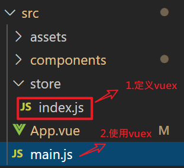


src/store/index.js中的内容如下：

```javascript
// 用来创建vuex的地方

import Vue from 'vue'

import Vuex from 'vuex'
// 由于Vuex是vue插件，还要以vue插件的方式挂载在vue上
// 1. 以插件的方式挂载在vue上
//    Vue.use(vue的插件)  ---- Vue.use(vueRouter)
Vue.use(Vuex)

// 2. 创建Vuex.Store的实例
// Vuex是一个对象，其中有一个属性名是Store.
// Vuex.Store在这里当作构造器
const store = new Vuex.Store({
  // 各种配置项
  //  state就是数据。用它来保存当前整个vue项目中，所有
  //  需要在组件之间共享的数据。这个数据，在所有的组件中
  //  都可以访问到.

  //  --- 对比理解vue组件中的data
  state: {
    num: 1,
    msg: 'hello,vuex'
  }
})

// 3. 导出store
export default store

```

说明：

- export default 是es 模块化的写法。用来设置默认导出的内容。

- new Vuex.Store() 是使用构造器来创建一个对象。

  - 这个构造器的参数是一个对象，其中的state中用来保存本项目中要用到的公共数据

- 上面的写法与使用vue-router非常类似。(如下代码是使用vue-router的情况)

  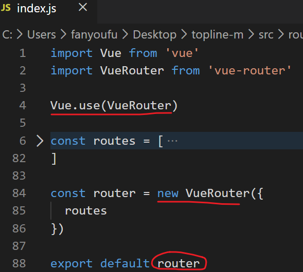

#### 挂载到vue实例

接下来，在main.js中来引入上面定义好的vuex。

main.js

```diff
import Vue from 'vue'
import App from './App.vue'
// 1. 用es6模块化引入vuex中的store
import store from './store/index.js'
Vue.config.productionTip = false

// 2. 给Vue配置项中添加一个特殊的配置，
// 名是：store,值是上面的引入的 store
new Vue({
  store, // store: store
  render: h => h(App),
}).$mount('#app')

```

请再次回顾一下vue-router的用法，是不是很像？

#### 在调试工具中查看

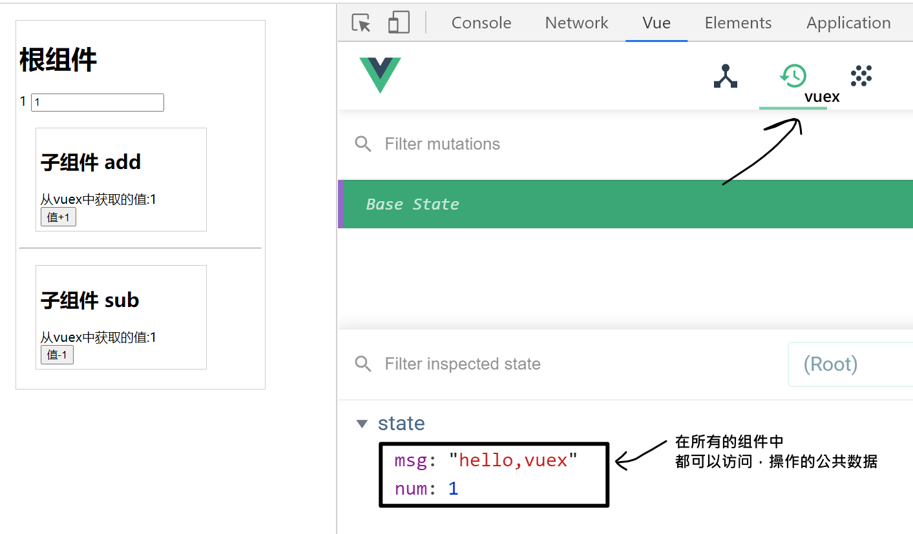


### 实现跨组件数据共享

解决上面提出的问题，我们思路就非常清晰了。

示意图如下：

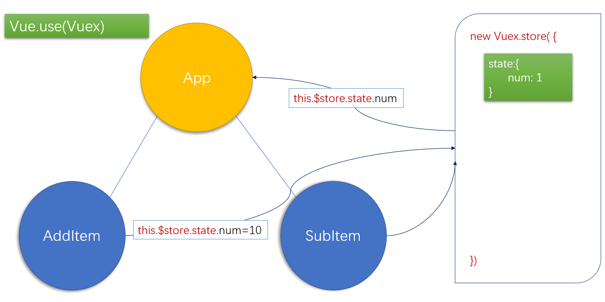

打开刚刚创建的vuex项目，找到src目录中的App.vue组件，将代码重新编写如下：

- 不需要数据项。因为我们把状态维护到vuex中。

- 对于vuex中store的数据， 我们可以直接在插值表达式中获取

  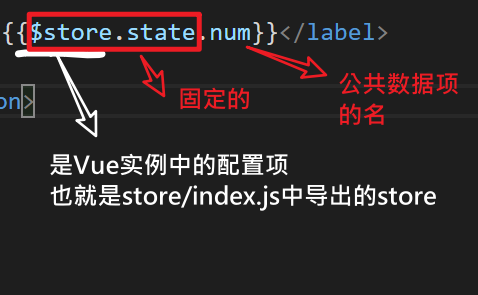

```html
<template>
  <div id="app">
    <h1>根组件</h1> {{$store.state.num}}
    <input type="text" v-model="$store.state.num">
    <add-item></add-item>
    <hr>
    <sub-item></sub-item>
  </div>
</template>

<script>
import AddItem from './components/AddItem.vue'
import SubItem from './components/SubItem.vue'

export default {
  name: 'app',
  components: {
    AddItem,
    SubItem
  },
}
</script>

<style>
#app {
  width: 300px;
  margin: 20px auto;
  border:1px solid #ccc;
  padding:4px;
}
</style>
```

在components文件夹中创建AddItem.vue组件，代码如下：

```javascript
<template>
  <div class="box">
    <h2>子组件 add</h2>
    从父组件中获取的值:<label for="">{{$store.state.num}}</label>
    <br>
    <button @click="add">值+1</button>
  </div>
</template>
<style lang="css">
  .box{
    border:1px solid #ccc;
    width:200px;
    padding:5px;
    margin: 20px;
  }
</style>
<script>
export default {
  name: 'AddItem',
  methods: {
    add () {
      this.$store.state.num++
    }
  }
}
</script>
```

在components文件夹中创建SubItem.vue组件中的代码类似。


## 核心概念-state

State提供唯一的公共数据源，所有共享的数据都要统一放到Store中的State中存储。打开项目中的store.js文件，在state对象中可以添加我们要共享的数据。

### 在vuex中设置

```javascript
// 用来创建vuex的地方

import Vue from 'vue'

import Vuex from 'vuex'
// 由于Vuex是vue插件，还要以vue插件的方式挂载在vue上
// 1. 以插件的方式挂载在vue上
//    Vue.use(vue的插件)  ---- Vue.use(vueRouter)
Vue.use(Vuex)

// 2. 创建Vuex.Store的实例
// Vuex是一个对象，其中有一个属性名是Store.
// Vuex.Store在这里当作构造器
const store = new Vuex.Store({
  // 各种配置项
  //  state就是数据。用它来保存当前整个vue项目中，所有
  //  需要在组件之间共享的数据。这个数据，在所有的组件中
  //  都可以访问到.

  //  --- 对比理解vue组件中的data
  //  state的定义， state的定义
  state: {
    num: 1,
    msg: 'hello,vuex'
  }
})

// 3. 导出store
export default store

```

state是固定的名字。它的值是一个对象，用来装所有的公共数据。

> 它的设置方式类似于组件中data数据项的设置方式。

### 在组件内使用state    

如何在组件中去使用state中定义的公共的数据项？

有两种方法：

- 方法一：直接使用
  - 语法：`this.$store.state.全局数据名称`
  - 应用场景：获取数据，**修改数据（不要直接去改）**
- 方法二：映射使用
  - 语法：mapState
  - 应用场景：获取数据，不能修改

#### 直接使用

在任意组件的内部（无论嵌套级别），可以直接通过vue实例中的$store来访问。

格式：

`this.$store.state.全局数据名称` 

 示例：

```javascript
# 获取：在代码中：
this.$store.state.count

# 获取：在视图中，可以省略this.
{{$store.state.count}}


# 修改：
# 不要直接去改
this.$store.state.count = "新值"
```


#### 映射使用

把Vuex中的公共数据引入到组件中，当作**计算属性** 来使用。

步骤：

1. 按需导入mapState函数： `import { mapState } from 'vuex'`
2. 数据映射为**计算属性**： `computed:{ ...mapState(['全局数据名称']) }`

例如：

```
// 通过映射的方式来使用vuex.store中的数据
// 1. 导入vuex中定义工具函数 mapState 
//    es6中的按需导入
import { mapState } from 'vuex'
// mapState是vuex中定义一个函数
// mapState(['count']) : 执行一个函数，并传入参数。
//      参数是一个数组，其中有一个元素,这个传参的格式是 mapState要求的。
//      它的返回值是：一个对象，格式是{count:function(){}}

//  在如下代码中，调用 mapState这个函数，把得到的对象合并到当前的外层对象中。
//  {
//      f: function(){ },
//      ...mapState(['count'])
//  }    

console.log(mapState(['count']))

export default {
  name: 'app',
  components: {
    AddItem,
    SubItem
  },
  // 下面的代码中有几个计算属性？
  // 2个。
  // 名字分别是： cA,count
  computed: {
    // 定义App.vue自已的计算属性
    cA () {
      return 100
    },
    // 调用 mapState这个函数，把得到的对象合并到当前的外层对象computed中
    ...mapState(['count'])
  }
}
```

注意：

- mapState是vuex中的一个函数；

- vuex是我们安装的包，它是一个对象，有很多的方法，第一句是引入Vuex中的mapState方法。相当于`import Vuex from 'vuex'; const mapState = Vuex.mapState;`

  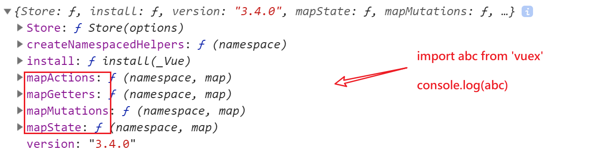

2. mapState(["count"]) 得到的是一个对象,其中有一个方法名是count，这个对象类似于`{count:function(){}}`

   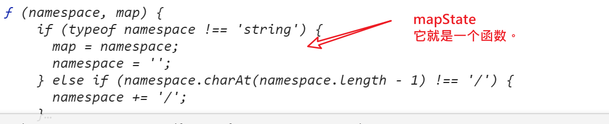

3. `...obj` 是es6新增的扩展运算符，这里用来把mapState(["count"]) 得到的对象合并到computed这个对象中。

整个过程的示意图如下：

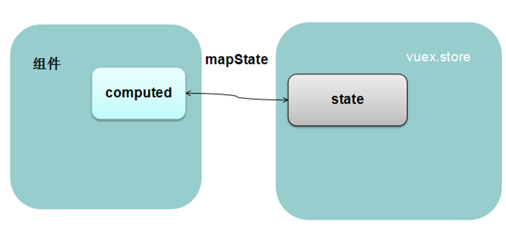


## 核心概念-mutation

### 作用

在vue中，**不推荐**直接在组件内部通过`this.$store.state.全局数据名称=新值`来修改vuex数据，而推荐使用mutation来修改。

### 定义格式

mutation(变化，变动)具体在代码中表现为创建Vuex.Store实例时，所传入的参数对象中的mutations项，具体格式如下：

```javascript
new Vuex.Store({
    state:{},
    mutations:{
        // 函数名可以是任意合法的函数名
        // 参数1：表示当前state
        // 参数2：可选。它表示调用函数1时，传入的参数。
        函数名1(参数1,参数2){
            // 在函数内部，修改state中的数据
        }
    }
})
```

说明：

- mutations是固定写法(有一个s)
- mutations定义完成之后，就等待被调用。它的作用是用来修改vuex中的数据。

### 添加mutaions

在定义vuex时，我们在Vuex.Store()中配置一下mutaions属性。把你要修改state数据的代码提前写好！

它有带参数和不参数两种情况，具体如下。

```javascript
import Vue from 'vue';
import Vuex from 'vuex';

Vue.use(Vuex);

export default new Vuex.Store({
    // 各种配置项
    // state 就相当于vue组件中的data。它用来存放整个vue项目中公共的数据
    //       这个数据，在所有的vue组件中都可以访问到
    state: {
        num: 101,
        count: 21.5,
        person: {
            name: '张三'
        }
    },
  	mutations: {
        // 下面定义mutation。本质就是一个函数
        // 特殊之处：在定义函数时，第一个参数就表示当前vuex中的state
        //          直接在此函数内部去修改state.
        //          在调用这个函数时，第一个参数不要传入。
        // 1.不带参数的mutation
        mAdd1(state){
            // 这个mutation的作用就是让state中的num加1
            state.num++
        },
        // 2. 带参数的mutation
        mAddN(state, n){
            // 这个mutation的作用就是让state中的num加 n
            // 这个n是需要额外传入的
            state.num = state.num + n
        }
    }
});
```

- mutations对象中的成员均是函数，并且有自己特定的格式。
- 如上所示的mAdd1函数，它的第一个参数固定表示当前的state的引用，在调用这个mAdd1函数时，你也不需要去设置第一个实参。
- mAddN的第一个参数不用传入，第二个参数需要传入。


### 使用mutations

在组件内部我们要想调用mutations中定义的方法来改变state中的值， 有两种方法：

方式一：直接使用

	this.$store.commit("mutaions的名字"，参数)

方式二：映射使用

- 映射成组件的methods

#### 直接使用

在组件内部，可以通过如下方式来直接调用指定mutations

**格式**

```javascript
this.$store.commit(mutations函数名，参数)
// mutations函数名，就是在定义Vuex.store时，设置的mutations中的方法名；
// 第二个参数是可选的，它表示调用mutations时传入的额外的参数,它可以是任意数据类型。
```

**示例**

AddItem.vue中给按钮添加事件代码如下：

```javascript
<button @click="Add">+1</button>

methods:{
  methods: {
    add () {
      // 直接修改state，不推荐
      // this.$store.state.num++

      // 调用了Vuex.store配置项中的mutations对象中的名为mAdd1的方法。
      // 不需要传入任何参数。
      this.$store.commit("mAdd1")
    }，
    addN () {
      // 调用一个带参数的mutation
      this.$store.commit('mAddN', 10)
    }
  }
}
```

说明：

- commit('mAdd')相于调用了mutations中的`mAdd1(state)`

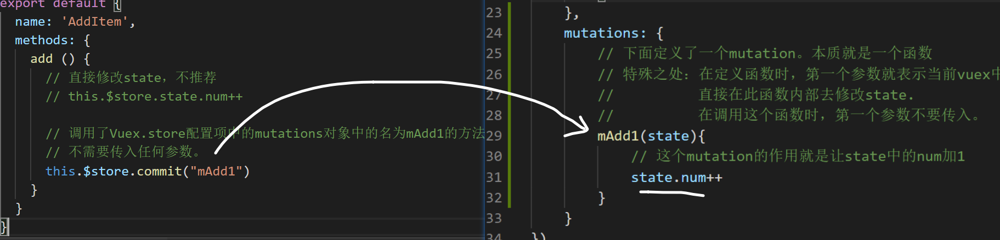

- this.$store.commit('mAddN', 10)

示意图

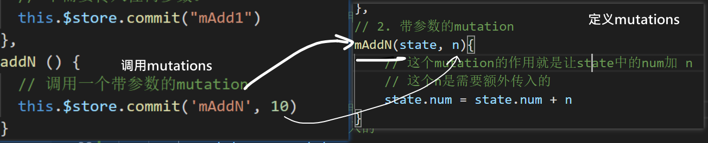

在调试工具中：

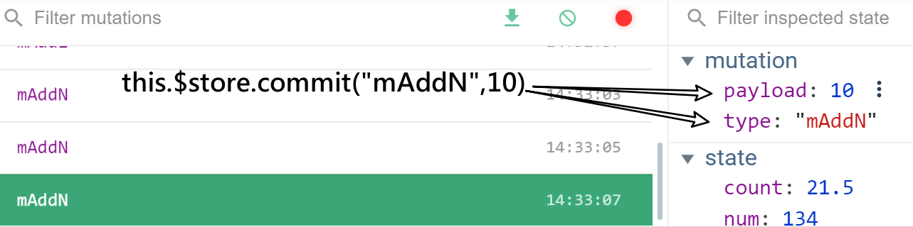

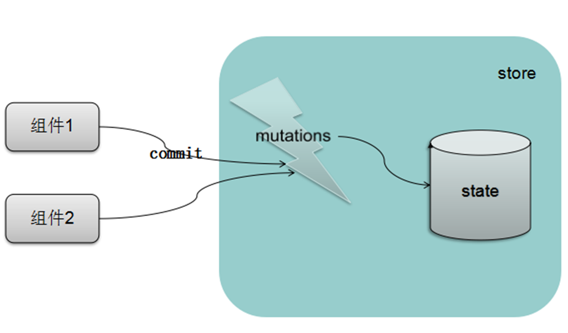

#### mapMutations

在组件内部使用vuex中的mutaion的第二种方法，就是把mutations中的属性映射到组件的methods上成为当前组件的方法来使用。

下面是一个使用案例

```javascript
<script>
// 在组件中通过映射的方式来使用vuex中的mutations
// 1. 引入工具函数
import { mapMutations } from 'vuex'
// mapMutations 是一个函数，在vuex中定义的。
// mapMutations(['mAdd1', 'mAddN'])的返回值是一个对象
//       这个对象类似于{mAdd1:function(){}, mAddN:function(){}}
// 2. 在methods中 插入 映射函数的结果

export default {
  name: 'SubItem',
  // 下面的代码中，相当于methods中定义了 4个方法 
  // sub,mAdd1,mAddN, test
  methods: {
    sub () {
      this.$store.state.num--
    },
    ...mapMutations(['mAdd1', 'mAddN']),
    test () {
      // 由于上面的mAdd1并映射成方法，所以这里可以直接加this.来访问。
      // this.mAdd1()
      this.mAddN(100)
    }
  }
}
</script>
```

示意图：

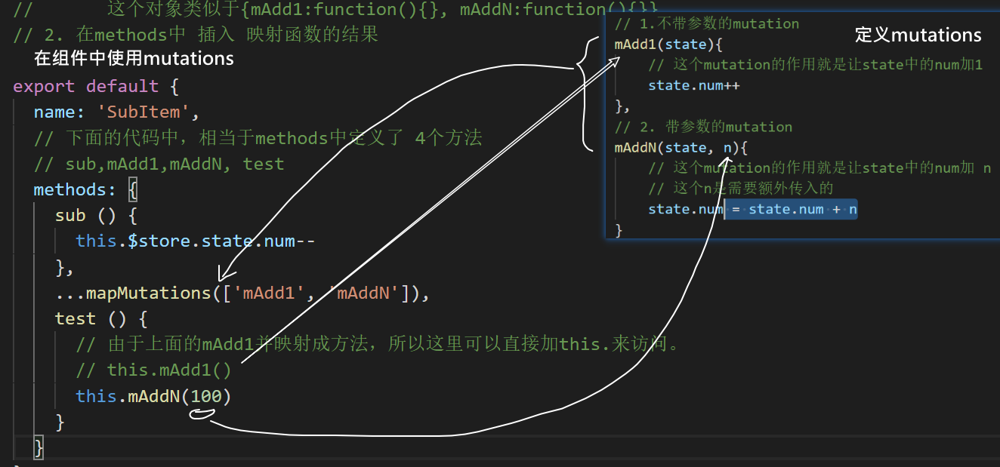


### 两个细节

**传参的个数只能是1个**

在定义mutation时，只能补充一个参数。下面的代码中，m不能收到值。

```javascript
// 定义
mAddN(state, n,m){
}

// 调用
this.$store.commit('mAddN',100,200)
```

如果一定要传多个值，可以放在对象中

```
this.$store.commit('mAddN',{n:100,m:200})
```

**映射成methods时可以取别名**

```javascript
// 在映射到methods中时，改下名字。原来在mutations中叫mAddN,到了组件的methods叫newFuncName
    ...mapMutations({newFuncName:'mAddN'}),
    test () {
      // 由于上面的mAdd1并映射成方法，所以这里可以直接加this.来访问。
      // this.mAdd1()
      // this.mAddN({a:100,b:200})
      this.newFuncName({a:100,b:200})
    }
```


## vuex小结

- 作用：当你需要管理组件之间的公共数据时，就可以使用vuex。(例如：当前用户登陆本系统时**用户名**)
- 是：vue官方提供的插件，类似于vue-router，专门用来进行公共状态管理。
- 步骤：
  - 1. 安装。 它是一个独立的npm包，要去下载安装。
  
       ```
       npm i vuex
       ```
  
       或者：在通过脚手架工具创建项目就去选中vuex。
  - 2. 创建Vuex.Store的实例，导出。
  
       ```
       # src/store/index.js
       
       import vue
       import vuex
       vue.use(Vuex)
       const store = new Vuex.store({
        // 配置项
        state: {
            xxxx :
        }
       }})
       export default store
       ```
  
  - 3. 初始化vue 实例时，设置store。
  
       ```
       # main.js
       import store from './store/index.js'
       new Vue({
       	store,
       })
       ```


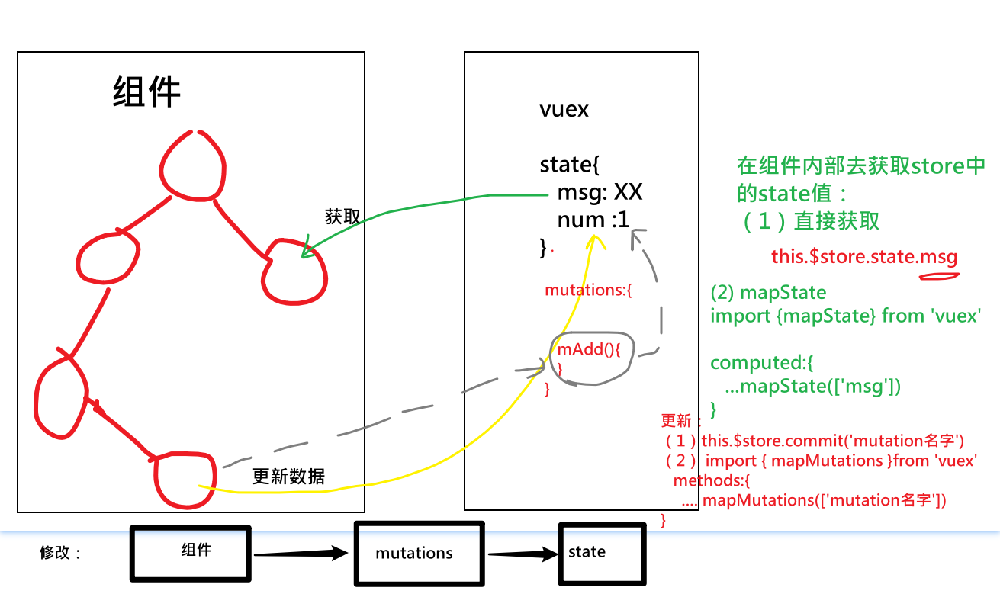


- 核心概念：
  - state ： 所有的公共数据放在state中。
    - 获取
      - 直接使用。 this.$store.state.XXX
      - 映射使用。映射成组件内部的计算属性. computed: { ...mapState(['XXXX'])}
    - 设置
      - this.$store.state.XXX = 新值。（不推荐....）
      
      - **mutations: 更新数据**
    
    ```
    new Vuex.Store({
    	state: {},
    	mutations: {
    		f1(state) {}, 
    		f2(state,p) {}
    	}
    })
    ```
    
    

### 定义数据 

作用：定义全局数据。类似data。

定义方式：

```javascript
new Vuex.Store({
    state:{
        name:'小王',
    	age:30
    }
})
```

### 获取数据

state

- 在template中用插值的方式`{{$store.state.age}}`
- 在js代码中直接使用:  this.$store.state.num
- map使用:  computed:{ ...mapState(['num']) }

### 修改数据

**不推荐**直接使用:  this.$store.state.num = 新值

通过**mutations**，有两种方式去激活mutation:

- 直接使用： this.$store.commit('mutation名-字符串'，实参);

- map使用：methods:{ ...mapMutations(['mutation名'])}

### 两个特点

- 独立性
  - 数据与项目中的所有组件无关
  - 任意组件中均可以操作数据
- 响应式 
  - 数据变化了，视图也会变化

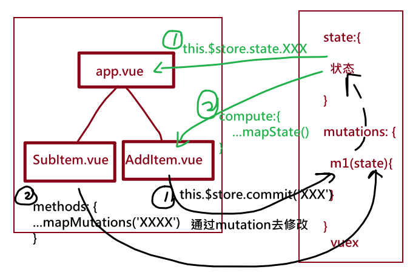

其它内容：

- actions, getters https://vuex.vuejs.org/zh/

