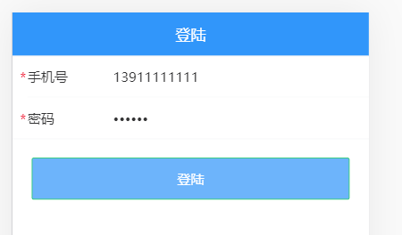
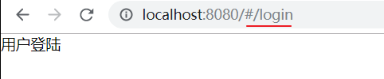
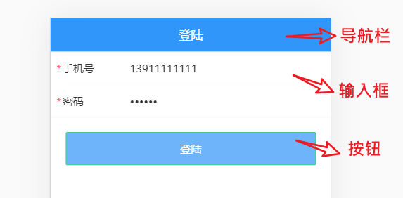
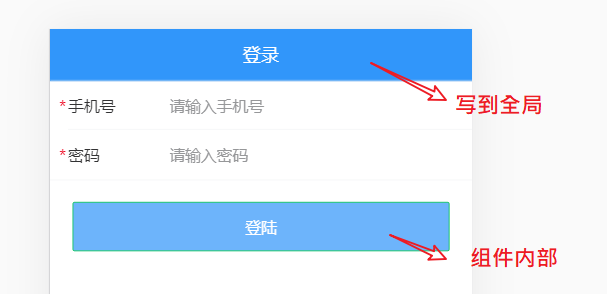
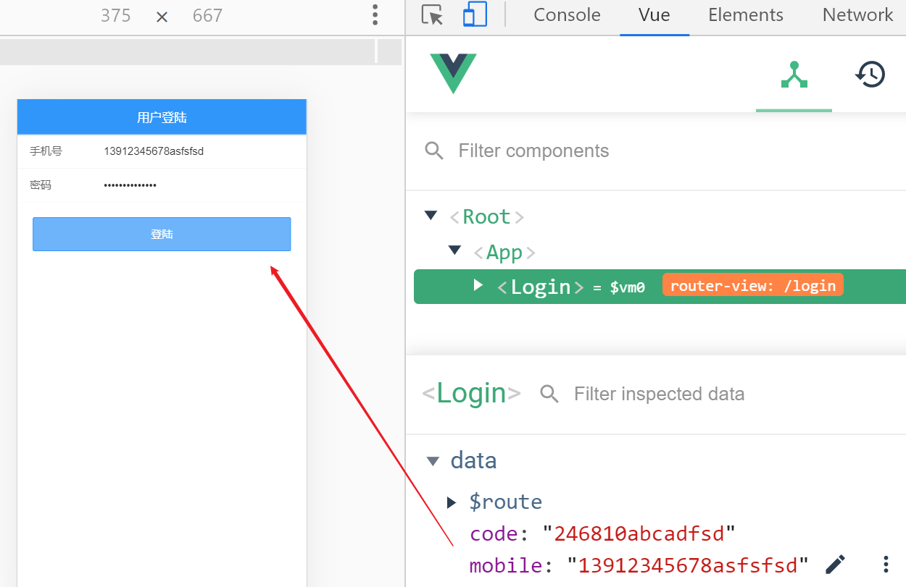
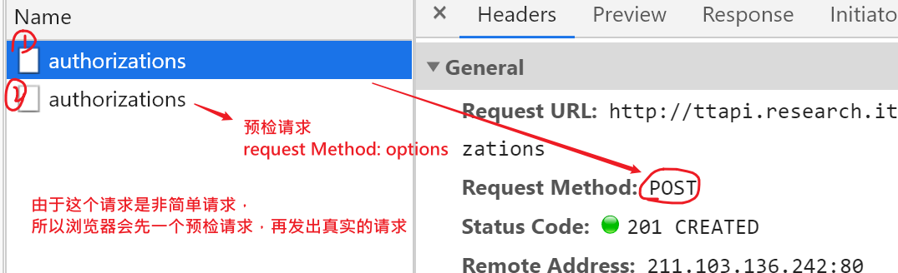
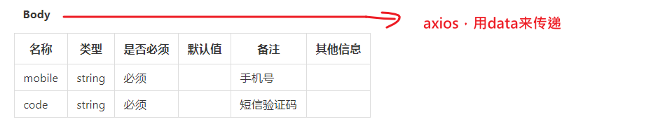
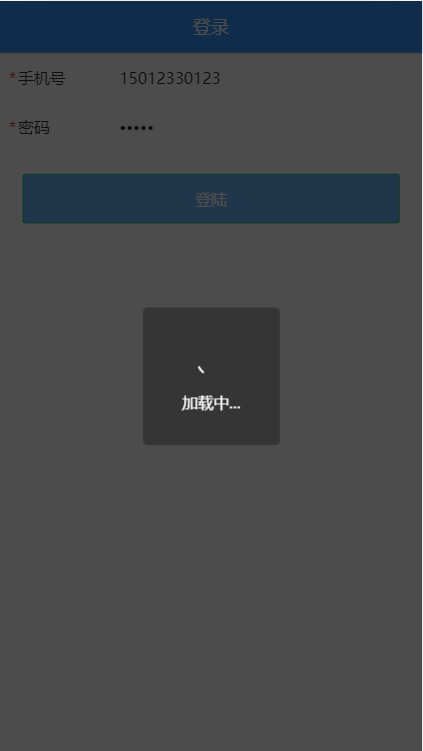
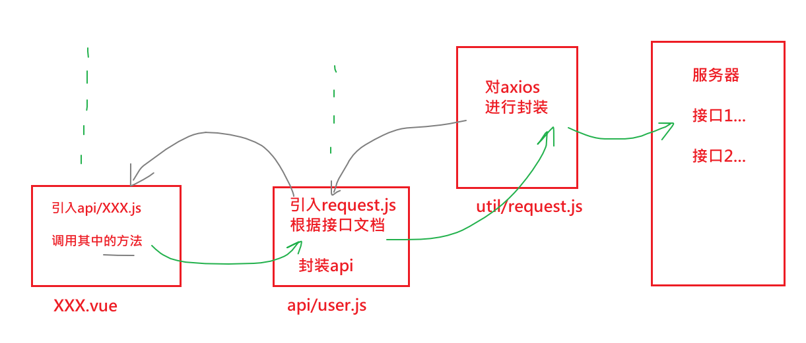

登陆页目标：

- 完成登陆功能
- 熟悉vant组件库中的
  - input组件
  - 导航栏
  - 按钮

## 效果及思路



思路：

- 创建组件
- 配置路由
- 布局结构
- 调整样式
- 实现业务功能
  - 数据有效性校验
  - 调用接口

## 创建组件并配置路由

### 创建组件

 views/login/index.vue

```javascript
<template>
  <div class="login">
    登录
  </div>
</template>

<script>
export default {
  name: 'Login'
}
</script>

```

组件的布局，在后面来做。

### 配置路由

然后在 `router/index.js` 中配置路由表：

```javascript
import Vue from 'vue'
import VueRouter from 'vue-router'
import Login from '@/views/login' // /index.vue是可以省略的
Vue.use(VueRouter)

const routes = [
  // 用户登陆
  {
    path: '/login',
    name: 'Login',
    component: Login
  }
]

const router = new VueRouter({
  routes
})

export default router
```

### 在根组件app.vue配置路由容器

去掉其它的用于测试按钮组件，只留下router-view： 路由的出口。上面写的login页面，就会出现在这里。 

```html
<template>
  <div id="app">
    <!-- 路由出口 -->
    <router-view></router-view>
  </div>
</template>
```


### 测试

最后，访问 `/login` 查看是否能访问到登录页面组件。




## 实现布局结构

这里主要使用到三个 Vant 组件：



- [NavBar 导航栏](https://youzan.github.io/vant/#/zh-CN/nav-bar)
- [Field 输入框](https://youzan.github.io/vant/#/zh-CN/field)
- [Button 按钮](https://youzan.github.io/vant/#/zh-CN/button)

1、将登录页修改为：

```html
<div class='login'>
    <!-- 导航栏 -->
    <van-nav-bar
      title="黑马头条-登陆"
    />

    <!-- 表单部分 -->
    <van-cell-group>
      <van-field
        v-model="username"
        required
        label="手机号"
        placeholder="请输入手机号"
      />
      <van-field
        v-model="phone"
        required
        label="密码"
        placeholder="请输入密码号"
        error-message="密码格式错误"
      />
    </van-cell-group>

    <!-- 登陆按钮 -->
    <div class="btn-wrap">
      <van-button type="info" class="btn">登陆</van-button>
    </div>
  </div>
```

要点：

- 在官网上复制组件代码

## 样式处理

原则：

- 把设置登录页头部的样式写到全局（全局生效），因为其它页面组件中也要使用。

- 把非公共样式写到页面组件内部，避免和其它组件样式冲突。

下面是具体实现步骤。

### 添加并使用全局样式

希望在其它的页面中的头部的区域的样式也能复用。

1、创建 `styles/index.less` 并写入以下内容：

```less
// 全局样式
.van-nav-bar{
  background-color: #3196fa;
  .van-nav-bar__title {
    color:#fff;
  }
}
```

这一步是要实现顶部van-nav-bar的样式。

2、在 `main.js` 中加载

```
// ...其它代码
// 全局样式
import '@/styles/index.less'
```

测试查看效果。

### 添加局部样式

将 `views/login/index.vue` 组件中的 style 修改为：

```css
<style lang="less" scoped>
  .login {
    .btn-wrap {
      padding: 20px;
      .btn {
        width: 100%;
        background-color: #6db4fd;
        color:#fff;
      }
    }
  }
</style>
```

### 最终效果

两个地方的颜色写在不同的地方。



## 功能实现

实现流程：

- 获取表单数据（绑定）
- 注册点击登录的事件
- 表单验证（不能为空）
- 发请求提交
- 根据请求结果做下一步处理

下面是具体的实现过程：

### 数据绑定

1、根据接口要求绑定数据

在登录页面组件的实例选项 data 中添加 `user` 数据字段：

```javascript
...
data () {
    // 登陆必须要调用接口，并要传入参数,由于后端接口中需要参数名是mobile，code
    // 所以，我们这里也写一样的名字。
    return {
      mobile: '13912345678',
      code: '246810'
    }
    
}
```

2、在表单中使用 `v-model` 绑定对应数据：

```diff
<van-cell-group>
      <van-field label="手机号" v-model.trim="mobile" placeholder="请输入手机号" />
    </van-cell-group>
    <van-cell-group>
      <van-field label="密码" v-model.trim="code" type="password" placeholder="请输入密码" />
    </van-cell-group>
```

> .trim修饰符，用来去掉左右的空格。

最后在浏览器使用 VueDevtools 调试工具查看是否绑定成功。



### 登陆提交

1、给登录按钮注册点击事件处理函数

```html
<div class="btn-wrap">
      <van-button type="primary" @click="hLogin" class="btn">登陆</van-button>
</div>
```

2、登录处理函数

```javascript
import ajax from '@/utils/request'

hLogin () {
      console.log(this.mobile, this.code)
      // 1. 检验
      // 2. 发请求.根据接口文档说明
      ajax({
        method: 'POST', // 接口请求的方式
        url: '/app/v1_0/authorizations', // 接口的地址
        data: { // 如果接口约定是 Body传参-- 请求体， 要通过data去写数据
          mobile: this.mobile,
          code: this.code
        }
      })
      
      // ajax.post('/app/v1_0/authorizations', {
      //   mobile: this.mobile,
      //   code: this.code
      // })

      // 3. 根据请求结果，做下一步处理
      //     登陆失败；
      //     登陆成功，跳转
    }

```

在network查看效果



 下图是后端接口中对参数的要求：



### 表单验证

有两种策略：

- 直接去用ui组件中[form验证](https://youzan.github.io/vant/#/zh-CN/form#xiao-yan-gui-ze) （作业）
- 收集到数据之后，自行验证

步骤

- 添加数据项

- 设置van-field组件中errormessage属性

- 抽出一个独立的方法来做验证

```diff
data () {
    return {
      mobile: '13912345678',
      code: '246810',

 +     mobile_errmsg: '', // 错误提示
 +     code_errmsg: ''
    }
  }
```

视图

```
<!-- 输入框 -->
    <van-cell-group>
      <van-field
      label="手机号"
      required
      :error-message="mobile_errmsg"
      v-model.trim="mobile"
      placeholder="请输入手机号" />
    </van-cell-group>
    <van-cell-group>
      <van-field
      label="密码"
      required
      :error-message="code_errmsg"
      v-model.trim="code"
      type="password"
      placeholder="请输入密码" />
    </van-cell-group>
```

抽出一方法，在点击登陆时去调用

```javascript
check () {
      // 如果验证不通过，返回false
      // 规则：不能为空
      this.mobile_errmsg = this.mobile === '' ? '大姐，手机号要写对' : ''
      this.code_errmsg = this.code === '' ? '大姐，您没有收到密码吗？' : ''

      if (this.mobile === '') {
        return false
      }

      if (this.code === '') {
        return false
      }

      return true
    },
        
    hLogin () {
      console.log(this.mobile, this.code)
      // 1. 检验
      // 验证用户输入数据的有效性。
      //  (1) 自己写判断
      if (!this.check()) {
        console.log('没有通过验证')
        return
      }
      //  (2) 可以采用vant中的form组件，自带的检验（作业）
      //   参考：https://vant-contrib.gitee.io/vant/#/zh-CN/form#xiao-yan-gui-ze

      // 2. 发请求.根据接口文档说明
      ajax({
        method: 'POST', // 接口请求的方式
        url: '/app/v1_0/authorizations', // 接口的地址
        data: { // 如果接口约定是 Body传参-- 请求体， 要通过data去写数据
          mobile: this.mobile,
          code: this.code
        }
      })
      // ajax.post('/app/v1_0/authorizations', {
      //   mobile: this.mobile,
      //   code: this.code
      // })

      // 3. 根据请求结果，做下一步处理
      //     登陆失败；
      //     登陆成功，跳转
    }
```


### 登录 loading 效果



可以使用vant中的**toast组件**来实现loading的效果。

> [toast组件](https://youzan.github.io/vant/#/zh-CN/toast#zu-jian-nei-diao-yong)

加载提示（this.$toast 可以使用，是因为我们全局安装了vant）

```javascript
this.$toast.loading({
  duration: 0, // 持续展示 toast,永远不会关闭
  mask: true, // 整体添加一个遮罩
  message: '加载中...'
})
```

代码

```javascript
async hLogin () {
      console.log(this.mobile, this.code)
      // 1. 检验
      // 验证用户输入数据的有效性。
      //  (1) 自己写判断
      if (!this.check()) {
        console.log('没有通过验证')
        return
      }
      //  (2) 可以采用vant中的form组件，自带的检验（作业）
      //   参考：https://vant-contrib.gitee.io/vant/#/zh-CN/form#xiao-yan-gui-ze

      // 提示登陆中
      this.$toast.loading({
        duration: 0, // 永远不会关闭
        mask: true,
        message: '登陆中....'
      });
      // 2. 发请求.根据接口文档说明
      try {
        await ajax({
          method: 'POST', // 接口请求的方式
          url: '/app/v1_0/authorizations', // 接口的地址
          data: { // 如果接口约定是 Body传参-- 请求体， 要通过data去写数据
            mobile: this.mobile,
            code: this.code
          }
        })
        // 覆盖上一个toast提示
        this.$toast.success('登陆成功')
        // todo 登陆成功，跳转
      } catch (err) {
        console.log(err)
        this.$toast.fail('登陆失败')
      }

      // ajax.post('/app/v1_0/authorizations', {
      //   mobile: this.mobile,
      //   code: this.code
      // })
    }
```

注意：

- this.$toast.loading: 由于我们引入vant，并是完整引入 ，所以vant会在vue的原型上添加$toast方法（这个方法不是vue自带，是vant组件库提供的）

把网络速度调整慢一些可以看到效果。


## 封装 api 请求模块

### 原因

下面的代码不友好

```
await ajax({
        method: 'POST',
        url: '/app/v1_0/authorizations',
        data: {
          mobile, code
        }
      })
```


上面的代码中对于ajax请求的做法比较直观：点击按钮就发出请求，请求写出url地址，方法，参数。但是它这样做是有一些问题的：

- 不够语义化（只知道是是发请求，而不知道具体是做什么 ）
- 不方便代码复用。如果在另一个模块中也需要用户登陆功能的话，就需要再写一次了。
- 不方便统一修改url地址。如果要修改url地址，还需要找到这个组件内部才能定位去修改。

考虑到上面两个问题，我们提前将所有业务操作都封装为一个模块。





### 思路

1. 在一个单独的js文件中创建并导出模块
2. 在.vue文件中使用模块

### 步骤

下面是具体的实现步骤：

#### 建立模块

创建 `api/user.js` 并写入

```javascript
// 封装与用户相差的操作
import ajax from '@/utils/request'

/**
 * 登陆
 * @param {*} mobile 手机号
 * @param {*} code 密码
 */
export const login = (mobile, code) => {
  return ajax({
    method: 'POST', // 接口请求的方式
    url: '/app/v1_0/authorizations', // 接口的地址
    data: { // 如果接口约定是 Body传参-- 请求体， 要通过data去写数据
      mobile: mobile,
      code: code
    }
  })
}

```

#### 使用模块

然后在登录页面login/index.vue中加载调用：

- 导入上面封装api
- 调用

```javascript
import { login } from '@/api/user'
async hLogin () {
      console.log(this.mobile, this.code)
      // 1. 检验
      // 验证用户输入数据的有效性。
      //  (1) 自己写判断
      if (!this.check()) {
        console.log('没有通过验证')
        return
      }
      //  (2) 可以采用vant中的form组件，自带的检验（作业）
      //   参考：https://vant-contrib.gitee.io/vant/#/zh-CN/form#xiao-yan-gui-ze

      // 提示登陆中
      this.$toast.loading({
        duration: 0, // 永远不会关闭
        mask: true,
        message: '登陆中....'
      });
      // 2. 发请求.根据接口文档说明
      try {
        const result = await login(this.mobile, this.code)
        console.log(result)
        // 覆盖上一个toast提示
        // 会在3s之后关闭
        this.$toast.success('登陆成功')
        // todo 登陆成功，跳转
      } catch (err) {
        console.log(err)
        this.$toast.fail('登陆失败')
      }
    }
```

之后项目中所有的涉及接口的请求就都不要直接在组件中直接写了，而是：

1. 先写成模块

2. 再从模块中取出方法来在组件中使用


## 作业

1. 使用vant form组件自带的验证功能来做表单验证。