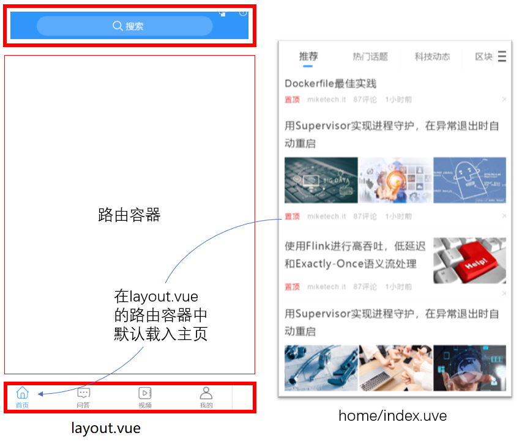
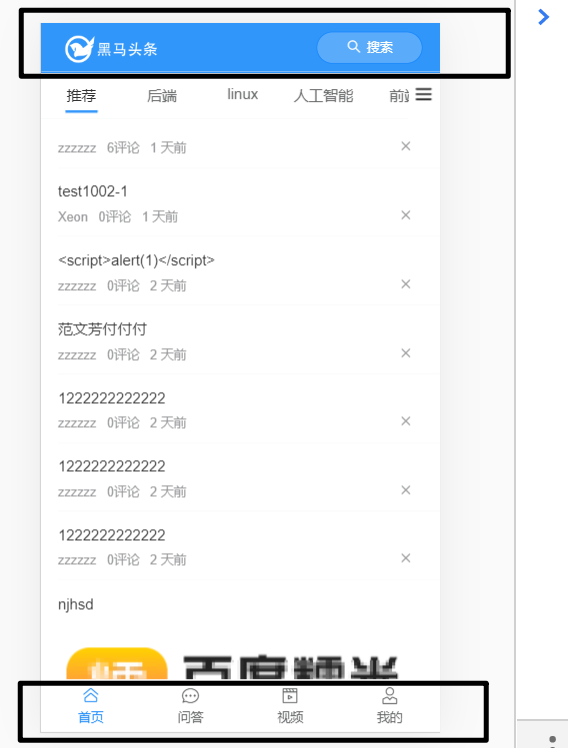

目标

- 完成整体路由规划(要搞清楚要做几个页面，它们分别在哪个路由下面，是怎么跳转的.....)
- 完成Layout布局


## 主页整体结构分析

从login页登陆，成功后进入主页。

当然，用户也可以直接访问主页，只不过此时是未登陆状态。

主页从上到下由三部分组成：

- 顶部logo导航区
- 中间部分
  - 二级路由的出口
- 底部tabbar
  - 点击不同的图标，会显示不同的内容到中间的二级路由出口。




## Layout组件布局



- 用到[van-nav-bar](https://youzan.github.io/vant/#/zh-CN/nav-bar#shi-yong-cha-cao) 和[van-tabber](https://youzan.github.io/vant/#/zh-CN/tabbar)


views/layout/index.vue

```html
<template>
  <div class='container'>
    <!-- 顶部logo搜索导航区域 -->
    <van-nav-bar>
      <div slot="left" class="logo">logo</div>
      <van-button
        slot="right"
        class="search-btn"
        round
        type="info"
        size="small"
        icon="search"
        >
        圆形按钮
      </van-button>
    </van-nav-bar>

    <!-- 二级路由出口
      1. 首页
      2. 问答
      3. 视频
      4. 我的
    -->
    <router-view></router-view>

    <!-- 底部：导航工具条 -->
    <!--
      开启路由模式：route
      to: 类似于router-link
    -->
    <van-tabbar route>
      <van-tabbar-item icon="home-o" to='/'>首页</van-tabbar-item>
      <van-tabbar-item icon="chat-o" to='/question'>问答</van-tabbar-item>
      <van-tabbar-item icon="video-o" to='/video'>视频</van-tabbar-item>
      <van-tabbar-item icon="user-o" to='/user'>
        我的/未登陆
      </van-tabbar-item>
    </van-tabbar>
  </div>
</template>

<script>
export default {
  name: 'Layout'
}
</script>

<style scoped lang='less'>
.logo {
    background: url("../assets/logo.png") no-repeat;
    background-size: cover;
    width: 100px;
    height: 30px;
  }
  // 搜索按钮
  .search-btn {
    background-color: #5babfb;
    width: 80px;
  }
</style>
```

- #left 是 slot="left"的简写

- van-tabber的route属性可以开启路由模式，通过to来指定要跳转的路由地址。

## Layout路由配置

```js
import Vue from 'vue'
import VueRouter from 'vue-router'
import Login from '@/views/login' // /index.vue是可以省略的
import LayoutIndex from '@/views/layout' // /index.vue是可以省略的
import HomeIndex from '@/views/home'
import VideoIndex from '@/views/video'
Vue.use(VueRouter)

const routes = [
  // 用户登陆
  { path: '/login', component: Login },
  // 主页
  {
    path: '/',
    component: LayoutIndex,
    // 嵌套路由
    // 当访问http://localhost:8080/#/user 时
    //   把UserIndex组件放在 LayoutIndex组中的router-view中去
    children: [
      { path: '', component: HomeIndex },
      { path: '/user', component: () => import('@/views/user/index') },
      { path: '/video', component: VideoIndex }
    ]
  },
  // 路由懒加载
  { path: '/search', component: () => import('@/views/search/index') }
]

const router = new VueRouter({
  routes
})

export default router

```

- 根据约定的路由规则定义。
- 且先定义规则对应的组件。

## 整体路由设置

### 约定路由规则

| path           | 文件                     | 功能                     | 组件名       | 路由级别 |
| -------------- | ------------------------ | ------------------------ | ------------ | -------- |
| /login         | views/login/index.vue    | 登录页                   | Login        | 一级路由 |
| /              | views/layout/index.vue   | 布局                     | Layout       | 一级路由 |
| ├─ /           | views/home/index.vue     | 主页（不登陆也能访问的） | Home         | 二级路由 |
| ├─ /question   | views/question/index.vue | 问答                     | Question     | 二级路由 |
| ├─ /video      | views/video/index.vue    | 视频                     | Video        | 二级路由 |
| ├─ /user       | views/user/index.vue     | 个人中心                 | User         | 二级路由 |
| /user/profile  | views/user/profile.vue   | 编辑资料                 | UserProfile  | 一级路由 |
| /user/chat     | views/user/chat.vue      | 小智同学                 | UserChat     | 一级路由 |
| /search        | views/search/index.vue   | 搜索中心                 | Search       | 一级路由 |
| /search/result | views/search/result.vue  | 搜索结果                 | SearchResult | 一级路由 |
| /article       | views/article/index.vue  | 文章详情                 | Article      | 一级路由 |


## 功能组件的基本架子

下面的组件内容只是基本架子，后面在具体做页面功能时，都会重写的。

views/home/index.vue 组件

```vue
<template>
  <div class='container'>Home</div>
</template>

<script>
export default {
  name: 'home-index'
}
</script>

<style scoped lang='less'></style>
```

question/index 组件

```vue
<template>
  <div class='container'>
    <van-skeleton title :row="3" />
    <van-skeleton title :row="3" />
    <van-skeleton title :row="3" />
  </div>
</template>

<script>
export default {
  name: 'question-index'
}
</script>

<style scoped lang='less'>
.van-skeleton{
  margin-top: 10px;
}
</style>
```

video/index 组件

```vue
<template>
  <div class='container'>
    <van-skeleton title avatar :row="3" />
    <van-skeleton title avatar :row="3" />
    <van-skeleton title avatar :row="3" />
  </div>
</template>

<script>
export default {
  name: 'video-index'
}
</script>

<style scoped lang='less'>
.van-skeleton{
  margin-top: 10px;
}
</style>
```

user/index 组件

```vue
<template>
  <div class='container'>User</div>
</template>

<script>
export default {
  name: 'user-index'
}
</script>

<style scoped lang='less'></style>
```

search-index 组件

```vue
<template>
  <div class="container">
    <van-nav-bar title="搜索中心" left-arrow @click-left="$router.back()" />
  </div>
</template>

<script>
export default {
  name: 'search-index'
}
</script>

<style scoped lang='less'></style>
```

search/result 组件

```html
<template>
  <div class='container'>
    <van-nav-bar title="搜索结果" left-arrow @click-left="$router.back()" />
  </div>
</template>

<script>
export default {
  name: 'search-result'
}
</script>

<style scoped lang='less'></style>
```

user/profile 组件

```vue
<template>
  <div class="page-user-profile">
    <van-nav-bar left-arrow @click-left="$router.back()" title="编辑资料" right-text="保存" @click-right="save()"></van-nav-bar>
  </div>
</template>

<script>
export default {
  name:'user-profile'
  methods: {
    save () {
      this.$toast.success('保存成功')
    }
  }
}
</script>

<style scoped lang='less'></style>
```

user/chat 组件

```vue
<template>
  <div class="page-user-chat">
    <van-nav-bar fixed left-arrow @click-left="$router.back()" title="小智同学"></van-nav-bar>
  </div>
</template>

<script>
export default {
  name: 'user-chat'
}
</script>

<style scoped lang='less'></style>

```

user/login 组件

```vue
<template>
  <div class="page-user-chat">
    <van-nav-bar left-arrow @click-left="$router.back()" title="登录"></van-nav-bar>
  </div>
</template>

<script>
export default {
  name: 'user-chat'
}
</script>

<style scoped lang='less'></style>

```

article.vue  详情组件

```html
<template>
  <div class='container'>
    <van-nav-bar fixed left-arrow @click-left="$router.back()" title="文章详情"></van-nav-bar>
  </div>
</template>

<script>
export default {
  name: 'article'
}
</script>

<style scoped lang='less'></style>

```

## 全局样式

```

全局样式
此处是可选的，后面再回来写也是可以的。

src/styles/index.less

// 项目的公共的样式
// 覆盖vant自带导航栏的样式
.van-nav-bar {
  background-color: #3196fa;
  .van-nav-bar__title, .van-icon{
    color: #fff;
  }
}
#app{
  position: absolute;
  left: 0;
  top: 0;
  overflow: hidden;
  width: 100%;
  height: 100%;
}
// .container是Layout.vue组件的根元素的类名
.container{
  width: 100%;
  height: 100%;
  // logo区域
  .logo {
    background: url("../assets/logo.png") no-repeat;
    background-size: cover;
    width: 100px;
    height: 30px;
  }
  // 搜索按钮
  .search-btn {
    background-color: #5babfb;
    width: 80px;
  }
}
// .index 是home/index.vue组件的根元素的类名
.index {
  height: 100%;
  // 让出顶部导航条的距离
  // 顶部在导航条是固定定位的
  padding-top:46px;
​
  // #app >.container >.index > .van-tabs > van-tabs__wrap + van-tabs__content
  .van-tabs {
    padding-top:50px; 
    display: flex;
    flex-direction: column;
    height: 100%;
    .van-tabs__wrap {
      position:fixed;
      top:46px; // 跟在顶部固定导航条的下方
      left:0px;
      right:30px; 
      // 标记当前选中频道的下划线
      .van-tabs__line {
        width: 30px !important;
        background-color: #3296fa;
        bottom: 20px;
      }
    }
    
    .van-tabs__content {
      flex:1;
      overflow: hidden;
      
      padding-bottom: 4rem;  // 能看到文章列表中的loading效果
      .van-tab__pane{ 
        height: 100%;
        // .scroll-wrapper 是home/ArticleList.vue组件的根元素的类名
        .scroll-wrapper{
          overflow:auto;
          height: 100%;
        }
      }
    }
  }
​
  // 频道管理的开关按钮
  .bar-btn {
    position: fixed;
    right: 5px;
    top: 57px;
    display: flex;
    align-items: center;
    background-color: #fff;
    opacity: 0.8;
    z-index:1;
    .van-icon-wap-nav{
      font-size: 20px;
    }
  }
}

```


## 测试