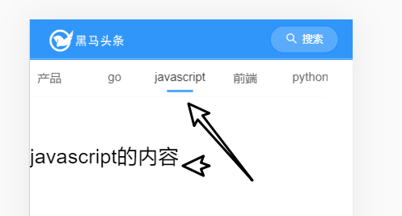

首页之频道列表

目标


功能：

- 调用接口获取频道，并显示在顶部

## 频道列表基本结构

在views/home/index

使用[tabs组件](https://youzan.github.io/vant/#/zh-CN/tab#hua-dong-qie-huan) 来放置频道列表。

```html

    <!-- 频道列表
    https://vant-contrib.gitee.io/vant/#/zh-CN/tab#biao-qian-lan-gun-dong
    -->
<template>
  <div>
    <van-tabs v-model="active">
      <van-tab title="标签 1">内容 1</van-tab>
      <van-tab title="标签 2">内容 2</van-tab>
      <van-tab title="标签 3">内容 3</van-tab>
      <van-tab title="标签 4">内容 4</van-tab>
      <van-tab title="标签 5">内容 5</van-tab>
      <van-tab title="标签 6">内容 6</van-tab>
      <van-tab title="标签 7">内容 7</van-tab>
      <van-tab title="标签 8">内容 8</van-tab>
    </van-tabs>
    <!--1. tab -->
    <!--2. list -->

  </div>
</template>

<script>
export default {
  name: 'Index',
  data () {
    return {
      active: 1
    }
  }
}
</script>

```

- 某个频道中真正的内容要放在对应的`van-tab`中。
- scroll-wrapper 


## 封装api

涉及频道的相关操作很多，封装一个模块来统一处理。

新增一个文件： `src/api/channel.js`

```js
// 封装与频道相关的操作
import ajax from '@/utils/request'

/**
 * 获取用户频道列表
 */
export const getChannels = () => {
  return ajax({
    method: 'GET',
    url: '/app/v1_0/user/channels'
  })
}

// export const getChannels = () => {
//   return ajax({
//     method: ,
//     url,
//     参数.....
//   })
// }

```

注意：这个版本的接口允许不传入token。

## 调用api获取数据

- 导入接口
- 调用接口

在views/home/index.vue中导入接口函数

```js
import { getChannels } from '@/api/channel'
```

使用接口函数 

```js
import { getChannels } from '@/api/channel.js'
export default {
  name: 'Index',
  data () {
    return {
      channels: [],
      active: 1
    }
  },
  created () {
    this.loadChannel()
  },
  methods: {
    async loadChannel () {
      const result = await getChannels()
      console.log(result)
      this.channels = result.data.data.channels
    }
  }
}
</script>
```

## 渲染组件

根据channels中的值，通过v-for循环进行渲染

```html
<van-tabs>
      <van-tab
        v-for="channel in channels"
        :title="channel.name"
        :key="channel.id">
        频道内容 {{ channel.name }}
      </van-tab>
    </van-tabs>
```

效果：



## 样式

目标：能固定在顶部。

1.去 layout.vue中，给头部的标题加一个fixed,实现固定定位。

```diff
<!-- 顶部logo搜索导航区域 -->
    <van-nav-bar
+      fixed
    >
      <div slot="left" class="logo"></div>
      <van-button
        slot="right"
        class="search-btn"
        round
        type="info"
        size="small"
        icon="search"
        >
        搜索
      </van-button>
    </van-nav-bar>
```

2.在styles/index.less中通过全局样式来覆盖vant库自已的样式。

参考 "[05_整体路由及layout布局.md]()"中的样式设置。


