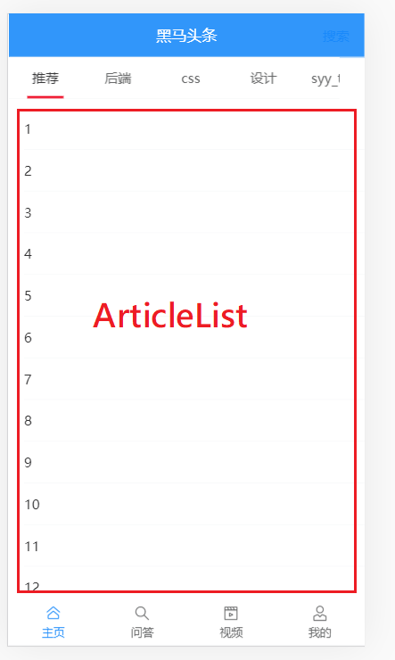
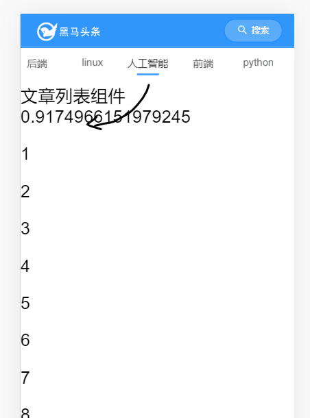
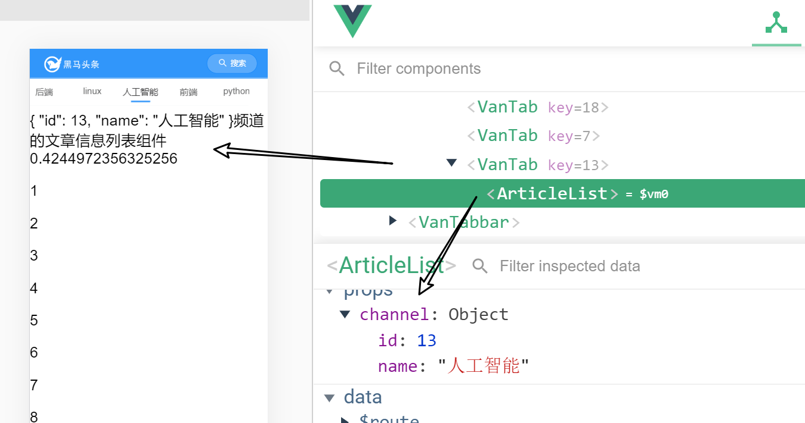
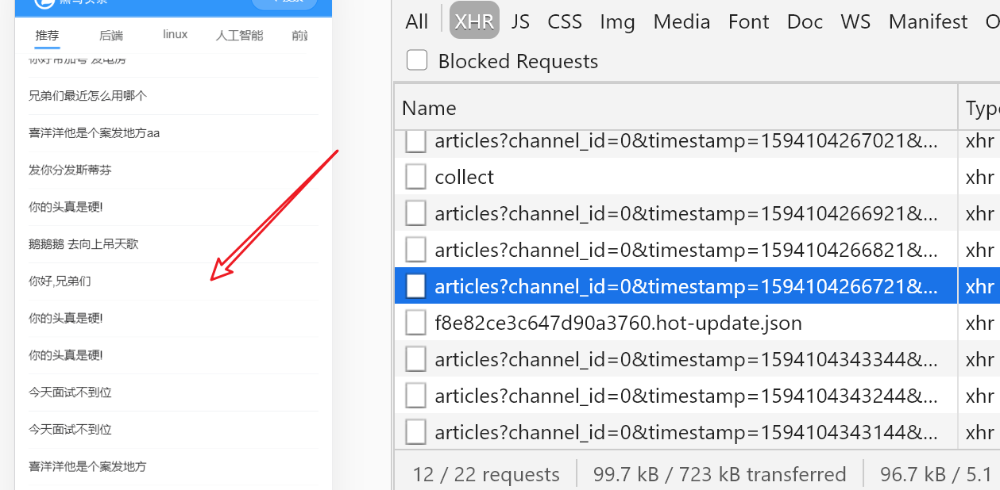
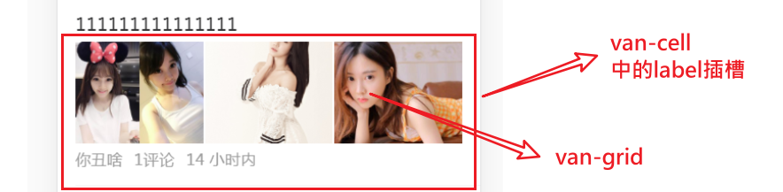
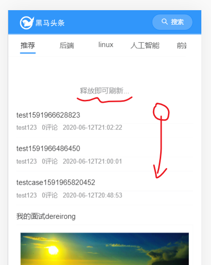
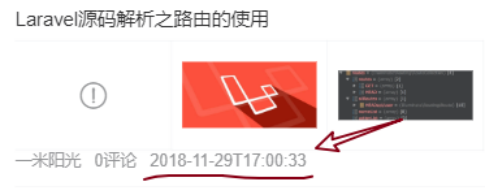
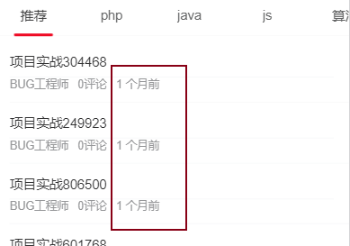

目标

- 实现文章列表的**上拉加载**（进入主页之后，取出一些文章来，手指向上，相当于是翻页。）
- **下拉刷新**功能

涉及vant组件如下：

- [van-list组件](https://youzan.github.io/vant/#/zh-CN/list#ji-chu-yong-fa): 上拉加载
- [van-pull-refresh](https://youzan.github.io/vant/#/zh-CN/pull-refresh#ji-chu-yong-fa)组件: 下拉刷新
- van-cell
- van-grid 
- van-image

要点：

- 要在项目中使用全局过滤器来处理日期时间

由于这一块的逻辑比较复杂，所以单独抽出来成一个组件来处理。

```
|-views
|--home/articleList.vue
|--home/index.vue
```

然后在index.vue中引入articleList.vue组件。


## articleList.vue的基本结构

创建文件home/articleList.vue，基本内容如下

```html
<template>
  <div class="scroll-wrapper">
    文章列表组件 {{Math.random()}}
    <p v-for="i in 50" :key="i">{{i}}</p>
  </div>
</template>

<script>
export default {
  name: 'ArticleList',
  created () {
    console.log('articleList被创建了', Date.now())
  }
}
</script>

<style scoped lang='less'></style>
```


## 在index中使用articleList组件

home/index.vue

引入组件

```
import ArticleList from './articleList'
```

注册组件

```javascript
components: {
    ArticleList
},
```

使用组件：

```
<div class="index">
    <van-tabs>
      <van-tab v-for="(item,idx) in channels" :key="idx" :title="item.name">
        <!-- van-tab是使用v-for循环的，每一个van-tab下都会有一个article-list
        并且，它有类似于懒加载的效果： 只有当前的van-tab 被激活之后，才会
        去加载(创建)它对应的article-list -->
        <article-list></article-list>
      </van-tab>
    </van-tabs>
  </div>
```

- 每一个分类下，就会有一个articleList
- van-tabs会产生懒加载的效果：“只有激活了某个标签，才会去加载ArticleList”


效果




## 从index.vue把当前频道传给articleList

父传子。

在**父组件**index.vue把当前的频道传给articleList

```diff
<van-tab
        v-for="channel in channels"
        :key="channel.id"
        :title="channel.name">
        <!--
          van-tab是使用v-for循环的，每一个van-tab下都会有一个article-list
          并且，它有类似于懒加载的效果： 只有当前的van-tab 被激活之后，才会
          去加载它对应的article-list

          把当前的频道传给子组件
        -->
+        <article-list :channel="channel"></article-list>
      </van-tab>
```

在子组件articleList中接收prop

```
props: ['channel'],
```

视图

```
<div class="scroll-wrapper">
    {{channel}}频道的文章信息列表组件 {{Math.random()}}
    <p v-for="i in 50" :key="i">{{i}}</p>
  </div>
```


效果




## articleList基本效果

引入[van-list组件](https://youzan.github.io/vant/#/zh-CN/list#ji-chu-yong-fa) 来实现上拉加载。这个上拉加载功能在vant的list组件中已经集成了。

下面是基础结构

```html
<div class="scroll-wrapper">
    {{channel}}频道的文章信息列表组件 {{Math.random()}}
    <!--
      van-list自带上拉加载更多 的效果
      原理：
        1）数据项在list中
        2）在显示数据时，如果当前的数据不足一屏，它会 自动调用 onLoad去加载数据
           在onload是要通过ajax取回新数据
           - 把数据追加到list中（list的内容会越来越多）
           - 把loading手动设置为false
           - 判断是否所有的数据已经加载完成，如果是，则把finished设为true
        3) 如果手动向上拉，且finished不为true, 也会去调用onLoad
    -->
    <van-list
      v-model="loading"
      :finished="finished"
      finished-text="没有更多了"
      @load="onLoad"
    >
      <van-cell v-for="item in list" :key="item" :title="item" />
    </van-list>
  </div>


data () {
    return {
      list: [],
      loading: false,
      finished: false
    }
  },
  computed: { },
  created () {
    // 创建组件完成，会自动调用created
    console.log(Date.now(), this.channel)
  },
  methods: {
    onLoad () {
      // 异步更新数据
      // setTimeout 仅做示例，真实场景中一般为 ajax 请求
      setTimeout(() => {
        for (let i = 0; i < 10; i++) {
          this.list.push(this.list.length + 1)
        }

        // 加载状态结束
        this.loading = false

        // 数据全部加载完成
        if (this.list.length >= 40) {
          this.finished = true
        }
      }, 1000)
    }
  }
```


通过`loading`和`finished`两个变量控制加载状态：

当组件滚动到底部时，会触发`load`事件并将`loading`设置成`true`。此时可以发起异步操作并更新数据，数据更新完毕后，将`loading`设置成`false`即可。若数据已全部加载完毕，则直接将`finished`设置成`true`即可。


list组件的[数据加载机制](https://youzan.github.io/vant/#/zh-CN/list#list-de-yun-xing-ji-zhi-shi-shi-me)：

- 如果当前的内容不够一屏，它会自动调用onLoad去加载数据。

- `List`有以下三种状态，理解这些状态有助于你正确地使用`List`组件：

  - 非加载中，`loading`为`false`，此时会根据列表滚动位置判断是否触发`load`事件（列表内容不足一屏幕时，会直接触发）
  - 加载中，`loading`为`true`，表示正在发送异步请求，此时不会触发`load`事件
  - 加载完成，`finished`为`true`，此时不会触发`load`事件

  在每次请求完毕后，需要手动将`loading`设置为`false`，表示加载结束

## 准备接口

在src/api目录下补充一个article.js模块来获取文章数据

```javascript
// 文章相关的操作全封装在这里

import ajax from '@/utils/request'

// axios的参数有两处写法：
// - data : 参数会在在请求体中传递。
// - params：参数会在请求行中传递。类似于查询字符串的结构.
//          如果接口文档中是用query来说明参数，则用params

/**
 * 获取某个频道下的文章列表
 * @param {*} channelId 频道id
 * @param {*} timestamp 时间戳，请求新的推荐数据传当前的时间戳，请求历史推荐传指定的时间戳
 */
export const getArticles = (channelId, timestamp) => {
  return ajax({
    method: 'GET',
    url: '/app/v1_1/articles',
    params: {
      channel_id: channelId,
      timestamp: timestamp, // 时间戳整数 单位毫秒
      with_top: 1
    }
  })
}
```

说明：

- 接口使用v1_1的。固定with_top为1。
- 参数说明：
  - channelId: 当前频道编号
  - timestamp: 时间戳。请求新的推荐数据传当前的时间戳，请求历史推荐传指定的时间戳
  - with_top: 1 。固定为1。

- 在使用axios时，如果文档中的要求参数是以query的方式来传，则应该写在params中。

## 接口调用

在articleList.vue组件中，当进入页面时，由于不满一屏，所以，van-list会自动调用onload方法，因此， 我们可以直接在onload方法去调用getAritcles来加载数据。


```javascript
import { getArticles } from '@/api/article.js'
export default {
  name: 'ArticleList',
  props: ['channel'],
  components: { },
  data () {
    return {
      list: [], // 数据项
      timestamp: null, // 时间戳
      loading: false,
      finished: false
    }
  },
  computed: { },
  created () {
    // 创建组件完成，会自动调用created
    console.log(Date.now(), this.channel)
  },
  methods: {
    async onLoad () {
      // 异步更新数据
      if (!this.timestamp) {
        this.timestamp = Date.now()
      }
      const result = await getArticles(this.channel.id, this.timestamp)
      console.log(result)
      // 保存本次请求回来的数据中的时间戳，以便下次传入
      this.timestamp = result.data.data.pre_timestamp
      // 1. - 把数据追加到list中（list的内容会越来越多）
      const arr = result.data.data.results
      // arr就是本次取回来的数据，就是一个数组，其中每一个元素都是一个对象，表示一篇文章。
      this.list = this.list.concat(arr)
      // 2. - 把loading手动设置为false
      this.loading = false
      // 3. - 判断是否所有的数据已经加载完成，如果是，则把finished设为true
      if (arr.length === 0) {
        this.finished = true
      }
    }
  }
}
```

调整视图

因为list中的每一项都是一个对象，它表示一篇文章，所以，要调整一下key,title。

```
<van-list
     v-model="loading"
     :finished="finished"
     finished-text="没有更多了"
     @load="onLoad"
>
    <van-cell v-for="(item,idx) in list" :key="idx" :title="item.title" />
</van-list>
```




## 文章列表布局



知识点：

- van-cell 中的插槽[label](https://youzan.github.io/vant/#/zh-CN/cell#cell-slots)  ： 作用是整体包裹，显示在标题下方。
  
- van-grid ：宫格图布局

- van-image
  

```html
<van-list
      v-model="loading"
      :finished="finished"
      finished-text="没有更多了"
      @load="onLoad"
    >
      <van-cell v-for="(item,idx) in list" :key="idx" :title="item.title">
        <div slot="label">
          <!-- 图片 当前文章有几张图 就用几个宫格 -->
          <van-grid :column-num="item.cover.images.length">
            <van-grid-item v-for="(img,idx) in item.cover.images" :key="idx">
              <van-image :src="img" />
            </van-grid-item>
          </van-grid>

          <!-- 文字说明 -->
          <div class="meta">
            <span>{{item.aut_name}}</span>
            <span>{{item.comm_count}}评论</span>
            <span>{{item.pubdate}}</span>
          </div>

        </div>
      </van-cell>
    </van-list>
```

说明：

- 从后端取出来的每篇文章中，最多有三张图。具体分成如下三种情况：
  - 三图
  - 一图
  - 无图。
- 图片保存在`cover.images`中。


样式：让文字区的内容隔开一点

```less
<style scoped lang='less'>
.meta {
  span{
    margin-right: 10px;
  }
}
</style>
```


## 实现下拉刷新

当用户向下拉动页面时，用当前的时间戳去请求接口（求最新的数据），把数据填充到页面的`最上方`，以实现下拉刷新的功能。

### 基本结构

[van-pull-refresh](https://youzan.github.io/vant/#/zh-CN/pull-refresh#ji-chu-yong-fa)组件已经集成了下拉刷新的这个功能，直接使用即可。先来看van-pull-refresh的基本结构。

基本结构

```
<van-pull-refresh>

   你的内容！只要被van-pull-refresh包起来，就具体下拉刷新的效果
  
</van-pull-refresh>
```

示例

```javascript
<van-pull-refresh v-model="isLoading" @refresh="onRefresh">
  <p>刷新次数: {{ count }}</p>
</van-pull-refresh>
import { Toast } from 'vant';

export default {
  data() {
    return {
      count: 0,
      isLoading: false
    }
  },
  methods: {
    onRefresh() {
      setTimeout(() => {
        Toast('刷新成功');
        this.isLoading = false;
        this.count++;
      }, 1000);
    }
  }
}
```

说明：

- 下拉刷新时会触发 `refresh` 事件，在事件的回调函数中可以进行同步或异步操作，操作完成后将 `v-model` 设置为 `false`，表示加载完成。


### 完成结构

按上面对van-pull-refresh的分析，直接在van-list的外面包一个van-pull-refresh即可。

```diff
<template>
  <div class="scroll-wrapper">
+    <van-pull-refresh v-model="isLoadingNew" @refresh="onRefresh">
      <van-list>
      	.......
      </van-list>
+    </van-pull-refresh>
  </div>
</template>
```


补充一个数据项

```
isLoadingNew: false // 是否下拉刷新加载更多
```


代码

```javascript
async onRefresh () {
    // 在van-pull-refresh组件中，下拉时，它就会执行。
    // 1. 去取回最新的文章, 传入最新的时间戳。
    const result = await getArticles(this.channel.id, Date.now())
    const arr = result.data.data.results
    // 2. 把文章追加到list的 头部
    this.list = arr.concat(this.list)
    // 3. 提示更新结果
    this.$toast.success('刷新成功' + arr.length + '条')
    // 4. 结束loadin状态
    this.isLoadingNew = false
}
```

- 要设置timestamp是**最新的时间戳**。

效果




## 相对时间处理

### 目标

把如下 时间：



格式成如下：


解决方案

- dayjs + **vue过滤器**
- 考虑这个功能可能在其它的项目中也会用到，所以，我们封装成一个模块

### 思路

- 安装包dayjs
  - dayjs: [安装](https://day.js.org/zh-CN/)
  - 相对时间插件：[relativeTime](https://day.js.org/docs/zh-CN/plugin/relative-time)
- 封装插件
- 注入插件
- 在组件中使用


### 步骤

#### 安装包

```
npm i dayjs
```

#### 封装模块

对日期进行格式化是一个非常常见的功能（与axios一样），所以我们进行封装以便在其它项目中也能使用。

封装插件：在src/utils/下创建一个date-time.js。`src/utils/date-time.js`

```javascript
// 引入dayjs 封装一些功能
import dayjs from 'dayjs'

// 加载 中文 语言包
import 'dayjs/locale/zh-cn' // ES 2015
dayjs.locale('zh-cn') // 全局使用

// 引入一个插件。在npm i dayjs 时，就已经把这个插件下载到了本地
// 引入它， 以增强dayjs的能力---计算相对时间。
var rTime = require('dayjs/plugin/relativeTime')
dayjs.extend(rTime)

export const formatTime = (val) => {
  return dayjs(val).format('YYYY/MM/DD')
}

export const relativeTime = yourTime => {
  // 用dayjs提供的api对yourTime进行格式化，以获取一个相对时间
  return dayjs().to(dayjs(yourTime))
}
```

注意：

1. dayjs的官网上写的使用方式用的到的是require（它是nodejs中的模块化），在这里，我们改成import 与es6模块化一致。
2. 使用它的插件和语言包。

#### 测试模块

在任意位置：

```
import { formateTime, relativeTime } from '@/utils/date-time.js'

console.log(formateTime(Date.now()))
console.log(relativeTime(Date.now()))
```


#### 在main.js中以全局过滤器的方式引入

要在项目中使用全局过滤器，这样就可以在所有组件内部来使用了。

**全局过滤器的格式**

定义：

```
Vue.filter('过滤器名'，function(过滤前的值){return 过滤之后的值})
```

使用

```
<template>
   {{val | 过滤器名}}
</template>
```

项目代码

main.js

```diff
import Vue from 'vue'
import App from './App.vue'
import router from './router'
// 引入Vuex.Store实例
import store from './store'

+ import { relativeTime } from '@/utils/date-time'
// 引入vant组件库
import Vant from 'vant'
import 'vant/lib/index.css'

// 引入自定义的样式
import '@/styles/index.less'

// 它会自动引入一个.js文件，帮助我们针对不同的手机屏幕来设置不同的html上的font-size大小
// 找到这个包，并执行其中的代码
import 'amfe-flexible'

console.log(relativeTime('2020-06-20T23:11:59'))

// 定义一个全局过滤器，对时间进行相对计算
+ Vue.filter('relativeTime', relativeTime)
// 注册插件
Vue.use(Vant)

Vue.config.productionTip = false

new Vue({
  router,
  store,
  render: h => h(App)
}).$mount('#app')

```


#### 在模块中使用

views/home/articleList.vue

前面成功注册了过滤器了，现在就可以直接使用了。

```diff
<div class="meta">
    <span>{{ item.aut_name }}</span>
    <span>{{ item.comm_count }}评论</span>
+    <span>{{ item.pubdate | relativeTime}}</span>
</div>
```

上面的`item.pubdate` 就是我们要处理的时间了。


效果如下：




## 图片懒加载

目标：在文章列表中很多文章，每一个文章都有可能有图（1，3张），在加载文章列表时，对其中的图片进行懒加载处理：并不是一开始就加载全部的图片，而当某张图快要进入可见区域时，再去加载。

参考：[图片懒加载](https://youzan.github.io/vant/#/zh-CN/image#tu-pian-lan-jia-zai)

> 图片数据（就是url地址）取回来之后，不是**立刻设置**给image的src属性。
>
> > 只要设置了src 属性，浏览器就会立即去请求src中的那张图。
>
> 只要当这张图片处于可见区域（或者是快了接近）时，就去设置src属性去求图片。

在main.js中，引入Lazyload指令

```javascript
// 引入Vant所有的组件
// 在vant这模块中如下两种导出模块的方式同时存在:
// export default  默认导出
// export {Lazyload}  普通导出
//
// 在导入的时，XXX ---> Vant
//            Lazyload 就是 普通导出 Lazyload
import Vant, { Lazyload } from 'vant'

// ......

// 使用懒加载
Vue.use(Lazyload)
```

在 articleList.vue组件中使用

```diff
<van-grid :column-num="item.cover.images.length">
    <van-grid-item v-for="(img,idx) in item.cover.images" :key="idx">
+    <van-image lazy-load :src="img" />
    </van-grid-item>
</van-grid>
```

>  如果不提前引入Lazyload指令，这里的懒加载将会报错。

