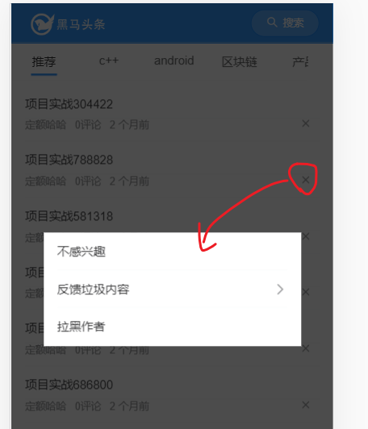

目标：对于已经登陆的用户，可允许他们去关闭某篇文章，或者是反馈内容。

技能点：

- JSONBig
- eventBus
- 父子组件事件通信


## 整体分析

这个部分的功能比较复杂，也单独抽成一个组件。

组件划分：

```
|---home/index.vue
|---home/articleList.vue # 文章列表
|---home/moreAction.vue  # 更多操作
```

在index.vue中包含它们这两个组件。


## moreAction组件-基本内容

这个组件有两种视图状态：


通过其内部一个bool类型的数据isReport来切换这两种视图。

home/moreAction.vue

```html
<template>
  <div class="more-action">
    <!-- 状态一 -->
    <van-cell-group v-if="!isReport">
      <van-cell>不感兴趣</van-cell>
      <van-cell is-link @click="isReport=true">反馈垃圾内容</van-cell>
      <van-cell>拉黑作者</van-cell>
    </van-cell-group>
    <!-- 状态二 反馈-->
    <van-cell-group v-else>
      <van-cell icon="arrow-left" @click="isReport=false">返回</van-cell>
      <van-cell>侵权</van-cell>
      <van-cell>色情</van-cell>
      <van-cell>暴力</van-cell>
      <van-cell>低俗</van-cell>
      <van-cell>不适</van-cell>
      <van-cell>错误</van-cell>
      <van-cell>其他</van-cell>
    </van-cell-group>
  </div>
</template>

<script>
export default {
  name: 'MoreAction',
  data () {
    return {
      isReport: false // 是否是处于状态二：反馈
    }
  }
}
</script>

<style lang='less' scoped>
.more-action {
  border-radius: 4px;
}
</style>
```


## moreAction组件-在父组件中使用

要注意：这个组件并不是放在文章列表中的，而与之同级，放在index.vue组件中。**所有的频道的文章列表共用一个moreAction组件**。


index.vue中引入moreAction并使用。这里要用到[van-popup](https://youzan.github.io/vant/#/zh-CN/popup)组件来包含内容。

第一步：在index.vue引入组件

```javascript
import MoreAction from './moreAction.vue'
```


第二步：在视图中使用组件

在外层套一个[van-popup](https://youzan.github.io/vant/#/zh-CN/popup), 以提供弹层的效果。

src/view/home/index.vue

```diff
<template>
  <div class="index">
    <!-- 频道列表
    https://vant-contrib.gitee.io/vant/#/zh-CN/tab#biao-qian-lan-gun-dong
    -->
    <van-tabs>
      <van-tab
        v-for="channel in channels"
        :title="channel.name"
        :key="channel.id">
        <!-- 频道与文章列表是一一对应的。每个频道都需要有一个文章列表组件。
          article-list写在了v-for中，则每次循环都会生成一个文章列表组件。
          van-tab具有类似于 懒加载的效果： 只有激活了当前的tab，才会去创建文章列表组件
        -->

        <!-- 把当前的频道信息传给子组件 -->
        <!-- 文章列表 -->
        <article-list :channel="channel"></article-list>
      </van-tab>
    </van-tabs>

    <!-- 文章---更多操作 -->
+    <van-popup  v-model="showMoreAction" :style="{ width: '80%' }">
+      <more-action></more-action>
+    </van-popup>
  </div>
</template>
```

- 用van-popup来包含内容。

- 设置一个showMoreAction来控制是否显示popup的显示

  view/home/index.vue

```diff
data () {
    return {
+     showMoreAction: true, // 是否显示更多操作弹层
      channels: [] // 频道列表
    }
  }
```

### 效果


## moreAction组件-在articlelist中激活


效果：

对于登陆用户（不登陆则不会显示关闭按钮），在文章列表中的每篇文章后，附一个**关闭**按钮,用户点击之后，弹出moreAction组件。


步骤：

- 修改aticleList视图。如果是登录用户，则额外提供一个关闭按钮。可以根据vuex来判断。
- 给按钮添加事件，emit事件到父组件index.vue
- 在父组件index.vue中监听事件，并在响应函数中去显示moreAction。


### aticleList 修改视图， 补充关闭按钮

如果是登录用户，则额外提供一个关闭按钮

```diff
<!-- 文字说明 -->
            <div class="meta">
              <span>{{item.aut_name}}</span>
              <span>{{item.comm_count}}评论</span>
              <!-- 使用过滤器 -->
              <span>{{item.pubdate | relativeTime}}</span>

              <!-- 如果是登陆用户(有没有token)，则显示x按钮 -->
+             <span class="close" v-if="$store.state.tokenInfo.token">
+                 <van-icon name="cross"></van-icon>
+             </span>
            </div>
```

样式：把X按钮放在最右边。

```
.meta {
  display:flex;
  span {
    margin-right:10px;
  }
  .close{
    // 让它在最右边
    // 它的父级容器是flex的，给当前元素设置左外边距为auto，会让这个元素在父级容器
    // 的最右边
    margin-left:auto;
  }
}
```


#### 效果


### aticleList.vue 添加方法，通知父组件去弹窗

在x按钮上添加点击事件：

视图

```diff
<!-- 如果登陆用户，则显示x按钮
如何知道当前用户是否登陆？ 去vuex中查看，是否有token

@click="hClose": 用来向父组件发布事件
-->
<span class="close"
+ @click="hClose"
v-if="$store.state.tokenInfo.token">
<van-icon name="cross"></van-icon>
</span>
```

方法

```
// 用户点击了关闭按钮
    hClose () {
      // 通知父组件index.vue去显示弹层
      this.$emit('showMoreAction')
    },
```


### 在父组件index.vue中显示moreAction

- 监听articleList中的事件

index.vue

```diff
<!--
   van-tab是使用v-for循环的，每一个van-tab下都会有一个article-list
   并且，它有类似于懒加载的效果： 只有当前的van-tab 被激活之后，才会
   去加载它对应的article-list

   (1) 把当前的频道传给子组件article-list
   (2) 监听子组件article-list传出来的showMoreAction事件
-->
 <article-list
  :channel="channel"
+ @showMoreAction="hShowMoreAction"
></article-list>
```

补充方法hShowMoreAction

```javascript
// 处理子组件中抛出的：显示更多操作 的弹层
hShowMoreAction () {
   this.showMoreAction = true
}
```

### 效果




## 数据传递分析

以"不感兴趣"为例，分析数据传递的过程。

当点击弹层中的"不感兴趣"菜单时，会调用后端的接口，并传入当时点击的文章编号


整个操作流程：

1. 在articleList中某个文章上点击了删除按钮，向父组件传递点击的文章的编号；
2. 通知父组件显示弹层，同时，保存当前的文章编号；
3. 弹层显示之后，用户点击 “不感兴趣”：
   1. 父组件收到这个消息，调用接口
   2. 通知articleList:用户不喜欢这个文章，**要删除掉**


## 传递文章编号

目标：在ariticleList组件中，当点击**关闭按钮**时，要把当前的**文章编号**传回给父组件index.vue，以备使用。

思路:  $emit 。在点击时，会向父组件发布一个事件，从而达到调用父组件中的方法的目的。考虑到后续的操作都需要文章编号做为参数，所以，这里还需要在articleList组件中把用户当前点击关闭的文章编号传出来。


在获取文章编号进行传递时，先要做大数处理： 因为后端接口返回的文章编号数值超过js中最大安全整数，所以导致数据精度的丢失。因此，这里要先用json-big做处理。

### 大数值处理

安装json-bigint包

```
npm i json-bigint
```


关键字：

- JSONBig
- axios的transformResponse

后端回传的真实id是19位的数值，超过了js能表达的最大安全整数，所以要引入一个额外的包JSONBig来处理这个问题。


在src/utils/request.js中

```diff
// 在一个普通的模块中去获取vuex中的值
// 直接import
import store from '@/store/index.js'

+ import JSONBig from 'json-bigint' // 引入大数字包

const instance = axios.create({
  baseURL: 'http://ttapi.research.itcast.cn',
  // baseURL: 'http://api-toutiao-web.itheima.net',
+  transformResponse: [function (data) {
    // 由于后端返回的数据有出现大数问题（文章编号）,这里使用json-bigint处理一下
    // 优先使用JSONBig转一下
+    try {
      return JSONBig.parse(data)
+    } catch (err) {
+      return data
+    }
+  }]
})

// ...
```

- transformResponse发生在axios 的响应拦截器之前。
- JSONBig.parse()用来处理大数。


### 在子组件articleList内获取并传文章编号

视图

**传递当前的文章对象**

```html
<!-- 如果登陆用户，则显示x按钮
如何知道当前用户是否登陆？ 去vuex中查看，是否有token

@click="hClose": 用来向父组件发布事件,传入当前的文章
-->
<span class="close" @click="hClose(item)" v-if="$store.state.tokenInfo.token">
    <van-icon name="cross"></van-icon>
</span>
```

**代码**

```
// 用户点击了关闭按钮
    hClose (article) {
      // 向父组件传递文章编号. 我们通过 大数处理，把文章编号转成了对象，这里要通过toString()恢复
      const articleId = article.art_id.toString()
      // 通知父组件index.vue去显示弹层
      this.$emit('showMoreAction', articleId)
    },
```

article.art_id.toString() : 把BIGNumber 转成字符串：以字符串格式保存大数。

**效果**


### 在父组件index.vue组件中，保存子组件中传递的id

在父组件index.vue

添加一个数据项

```
data () {
	return {
+     articleId: null, // 当前要执行更多操作的 文章编号
      channels: [],
      showMoreAction: false // 默认不展示更多操作的弹层
    }
  }
```

修改处理方法

```
// 处理子组件articleLise中抛出的：关闭按钮
    hShowMoreAction (articleId) {
      console.log('收到从子组件中传递的文章编号', articleId)
      // 保存文章编号
      this.articleId = articleId
      // 显示弹层
      this.showMoreAction = true
    }
```

效果：

在不同的文章上点击x时，home中articleId值变化。


## 实现“不感兴趣”

### 思路分析


目标：在弹出的moreAction组件中，点击 `不感兴趣`，要做如下三件事：

1. **去调用接口**。让服务器之后不要再推类似的文章给我了。

2. 退出弹层

3. 把我点击的文章删除掉。

   A:在后端服务器上删除这个文章（错误）

   B:在当前articleList组件中删除文章（正解）

以上三件事，是在index.vue组件中来做的。


### 在moreAction组件中抛出事件

在子组件moreAction.vue中抛出事件

```html
<!-- 直接抛出事件，具体功能由父组件index.vue去做 -->
<van-cell @click="$emit('dislike')">不感兴趣</van-cell>
```

在父组件index.vue中监听事件

```diff
<!-- 文章--更多操作 -->
    <!-- 1. 在子组件监听不感兴趣 -->
    <van-popup v-model="showMoreAction" :style="{ width: '80%' }">
      <more-action
+        @dislike="hDislike">
      </more-action>
    </van-popup>
```

代码

index.vue

```javascript
// 处理用户在弹层中选择的 不感兴趣
hDislike () {
    console.log('用户点击了， 不感兴趣,当前要操作的文章编号是：', this.articleId)
    // 1. 调用后端接口

    // 2. 退出弹层
    this.showMoreAction = false

    // 3. 把用户点击的那个文章删除掉
}
```

后面，再来写具体的另外两件事：

- 发请求
- 在页面上删除文章

**效果**


### 准备接口

在src/api/article.js中添加一个方法，调用接口

```

/**
 * 对指定的id的文章 不感兴趣
 * @param {*} articleId 文章编号
 */
export const dislikeArticle = articleId => {
  return ajax({
    method: 'POST',
    url: '/app/v1_0/article/dislikes',
    data: {
      target: articleId
    }
  })
}
```

通过阅读接口文档，分析出要传入的参数。

注意：url地址中不要有多余的空格！


### 调用接口

index.vue中引入封装的方法

```
import { dislikeArticle } from '@/api/article.js'
```

调用方法

```javascript
async hDislike () {
      console.log('从子组件收到，不感兴趣！此时要操作的文章编号是', this.articleId)

      // 1. 调用后端接口
      const result = await dislikeArticle(this.articleId)
      console.log(result)
      // 2. 退出弹层
      this.showMoreAction = false
      // 3. 通知文章列表去删除那个被点击的文章
    },
```


接下来实现删除那个被点击的文章。


### 实现对数据的删除

>  不是对后端数据的删除（别人可能还要看），只是在本地删除。

分析：


目标：

​	要实现在**父组件index.vue**中去**删除子组件articleList中的数据**。


难点：

- 父组件index.vue中引入了多个articleList组件
- 数据是维护在子组件articleList组件内部的

思路：

- 引入事件总线(eventBus)来解决。
  - 在父组件index.vue中去发布事件delArticle，同时传参数
  - 在所有的articleList组件中去监听这个事件，当这个事件发生时，去自已的list中去删除指定文章


步骤：

- 注册事件总线
- 在index.vue中发布要删除数据的事件 ($emit)
- 在aritcleList.vue中**监听（$on）删除数据的事件**，如果收到事件，则执行删除数据的动作。

#### 引入eventBus实现跨组件消息传递

添加src/utils/eventBus.j

```javascript
// 用Vue的实例来充当事件总线
import Vue from 'vue'
export default new Vue()
```


在main.js中，引入

```diff
// 导入事件总线
import EventBus from './utils/eventbus'
// 把事件总线挂在原型对象上
// 则在组件内部，可以直接通过this.$eventBus来访问这个事件总线对象
Vue.prototype.$eventBus = EventBus
```

把$eventBus挂载在Vue的原型对象上，则所有的组件内部都可以通过this.$eventBus来访问。


#### 在父组件index.vue中发布事件

发布事件，名为`delArticle`，参数是一个对象，其中包含：当前的频道编号，当前的文章编号。

> 为什么要传入频道编号？ 
>
> 由于“推荐”频道和其它频道中的文章极有可能重复，所以光传一个文章编号不能唯一确定要删除的文章。


为了获取当前的频道编号，要绑定v-model给van-tabs

```diff
<!-- v-model 双向绑定：哪一个下标的频道处于活动状态  -->
+ <van-tabs v-model="activeIndex">
```

v-model是 van-tabs自带的。

补充一个数据项：activeIndex。

```diff
data () {
    return {
+      activeIndex: 0, // 当前tabs中，处于活动状态的是哪一个下标
      articleId: null, // 当前要执行更多操作的 文章编号
      channels: [],
      showMoreAction: false // 默认不展示更多操作的弹层
    }
  }
```

修改代码：

```diff
async hDislike () {
      console.log('从子组件收到，不感兴趣！此时要操作的文章编号是', this.articleId)

      // 1. 调用后端接口
      const result = await dislikeArticle(this.articleId)
      console.log(result)
      // 2. 退出弹层
      this.showMoreAction = false
      // 3. 通知文章列表去删除那个被点击的文章
      const obj = {
        articleId: this.articleId, // 当前的文章编号
        channelId: -1 // 当前频道id
      }
      this.$eventBus.$emit('delArticle', obj)
    },
```

$emit是事件总线(Vue实例)提供的方法 ，用来发布事件。格式：`$emit('事件名', 参数)`

#### 在子组件articleList中监听事件

> 由于articleList组件是嵌套在vant的tabs组件中，对于tabs来说，它有`懒加载`的效果，在不点击标签时，articleList组件是不会创建的。

在创建组件时，开启监听事件总线上的'delArticle'事件。

```diff
created () {
    console.log(this.channel, 'created,启动了监听')
    this.$eventBus.$on('delArticle', (obj) => {
      console.log('我这里是', this.channel, '收到了事件qhjpl', obj)
      // todo: 是否需要在本文章列表中去删除对应的数据
    })
  },
```


#### 效果


### 删除文章的逻辑

执行逻辑如下：

收到事件时，判断是否是当前频道

- 是：找到文章并删除。
- 否：不作处理。

```javascript
created () {
    console.log('articleList被创建了', Date.now())
    // 创建 组件完成之后，开始监听 事件总线上的 delArticle事件。
    this.$eventBus.$on('delArticle', obj => {
      console.log('我是频道', this.channel, '收到delArticle事件', obj)
      const { channelId, articleId } = obj
      // 是否是当前频道：
      //   是： 在list中找到文章编号是obj.article的数据，并删除
      //   否： 不处理
      if (channelId !== this.channel.id) {
        console.log('与我无关')
        return
      }

      console.log('在list中，找出文章id为articleId的元素,并删除', articleId)
      // 在数组list找到某个项，它的art_id 与 articleId，并删除它。
      // 1. 找出下标来
      // 2. 删除它 splice(idx, 1)
      const idx = this.list.findIndex(article => article.art_id.toString() === articleId)
      // findIndex 找到元素的下标，找不到，就会返回-1
      if (idx !== -1) {
        // 找到了下标, 删除它。
        // 如何在数组中，删除指定下标元素？
        this.list.splice(idx, 1)
      }
    })
  }
```

效果


### 小结


## 实现举报文章


目标：与不感兴趣类似，提供更具体的举报功能。

### 抽出常量

通过阅读接口文档


把后端需要的举报类型方案抽出来，封装成一个常量数组

创建src/constant/reports.js

```
// 以模块的方式导出 举报文章 时，后端接口约定的举报类型
const reports = [
  {
    value: 0,
    label: '其它问题'
  },
  {
    value: 1,
    label: '标题夸张'
  },
  {
    value: 2,
    label: '低俗色情'
  },
  {
    value: 3,
    label: '错别字多'
  },
  {
    value: 4,
    label: '旧闻重复'
  },
  {
    value: 6,
    label: '内容不实'
  },
  {
    value: 8,
    label: '侵权'
  },
  {
    value: 5,
    label: '广告软文'
  },
  {
    value: 7,
    label: '涉嫌违法犯罪'
  }
]
export default reports

```

这个模块就可以在视图中引入并渲染了。

### 页面渲染

在moreAction.vue中，引入上面封装的常量 ，并循环输出来。

数据：

```
// 从常量模块中导入
import reportTypeList from '@/constant/report.js'
// console.log(reportTypeList)
export default {
  data () {
    return {
      // 定义了数据项，才能用v-for
      list: reportTypeList,
      isReport: false
    }
  }
}
</script>
```

视图

```html
<!-- 状态二 反馈-->
    <van-cell-group v-else>
      <van-cell icon="arrow-left" @click="isReport=false">返回</van-cell>
      <!-- <van-cell>侵权</van-cell>
      <van-cell>色情</van-cell>
      <van-cell>暴力</van-cell>
      <van-cell>低俗</van-cell>
      <van-cell>不适</van-cell>
      <van-cell>错误</van-cell>
      <van-cell>其他</van-cell> -->
      <van-cell v-for="item in reportTypeList" :key="item.value">
        {{item.label}}
      </van-cell>
    </van-cell-group>
```

效果：


### 在子组件中抛出事件

```
<!-- 状态二 反馈-->
    <van-cell-group v-else>
      <van-cell icon="arrow-left" @click="isReport=false">返回</van-cell>

      <!-- 直接抛出事件，具体功能由父组件index.vue去做 -->
      <van-cell v-for="item in reportTypeList"
      :key="item.value"
      @click="$emit('report',item.value)"
      >
        {{item.label}}
      </van-cell>
    </van-cell-group>
```

要做的三件事，也是应该放在父组件index.vue中去做

- 抛出事件给父组件(index.vue)：`@click="$emit('report', item.value)"`

### 在父组件index.vue监听report事件

在home/index.vue中监听事件。

```diff
<!-- 文章--更多操作 -->
    <!-- 1. 在子组件监听 不感兴趣 -->
    <!-- 2. 在子组件监听 举报文章 -->
    <van-popup v-model="showMoreAction" :style="{ width: '80%' }">
      <more-action
+        @report="hReport"
        @dislike="hDislike">
      </more-action>
    </van-popup>
```

补充一个hReport方法：

```
// 处理用户在弹层中选择的 举报文章
    hReport (reportTypeId) {
      console.log(reportTypeId)
      // 1. 调用接口

      // 2. 关闭弹层
      this.showMoreAction = false
      // 3. 删除文章
    }
```


### 封装api

查询接口文档，分析参数，然后在src/api/article.js中补充一个方法

```
/**
 * 举报文章
 * @param {*} articleId 文章编号
 * @param {*} type 举报类型编号
 */
export const reportArticle = (articleId, type) => {
  return ajax({
    method: 'POST',
    url: '/app/v1_0/article/reports',
    data: {
      target: articleId,
      type
    }
  })
}

```

### 调用api

在父组件src/home/index.vue中,引入api

```javascript
import { dislikeArticle, reportArticle } from '@/api/article.js'
```

使用

```javascript
// 处理用户在弹层中选择的 举报文章
async hReport (reportTypeId) {
    console.log(reportTypeId)
    // 1. 调用接口
    const result = await reportArticle(this.articleId, reportTypeId)
    console.log(result)
    // 2. 关闭弹层
    this.showMoreAction = false
    // 3. 删除文章
}
```


### 从对应articleList中删除 文章

这一步操作与 “不感兴趣” 中的删除操作是一样的，所以只需要进行代码提炼，抽出一个公共的方法：

```javascript
delArticle () {
    // 通过事件总线去发布一个消息，告诉articleList组件，去删除对应的文章
    // 参数是：当前要删除的文章编号 及当前的频道编号
    const eventObj = {
        articleId: this.articleId,
        channelId: this.channels[this.activeIndex].id
    }
    // console.log(eventObj)
    this.$eventBus.$emit('delArticle', eventObj)
}
```

在处理方法中调用这个公共的方法

```diff
// 处理用户在弹层中选择的 不感兴趣
    async hDislike () {
      console.log('用户点击了， 不感兴趣,当前要操作的文章编号是：', this.articleId)
      // 1. 调用后端接口
      const result = await dislikeArticle(this.articleId)
      console.log(result)
      // 2. 退出弹层
      this.showMoreAction = false

      // 3. 把用户点击的那个文章删除掉
+      this.delArticle()
    },
    // 处理用户在弹层中选择的 举报文章
    async hReport (reportTypeId) {
      console.log(reportTypeId)
      // 1. 调用接口
      const result = await reportArticle(this.articleId, reportTypeId)
      console.log(result)
      // 2. 关闭弹层
      this.showMoreAction = false

      // 3. 把用户点击的那个文章删除掉
+      this.delArticle()
    }
```


## 小bug

在moreAction中，如果是在这种状态退出的，则下次再打开时，它也是这个状态。原因是isReport被设置成了true。


思路：

- 只要点击了x ,就把moreAction中的isReport设置为false

知识点：

- 如何在父组件中去修改子组件的数据？`this.$refs.refMoreAction.isReport = false`-
- 步骤：
  - 1. 给子组件添加引用。它子组件补充一个 ref.
    2. 通过this.$refs.子组件引用.子组件数据=新值。
  - 注意：一定要确保这个子组件已经被创建出来了。

视图：

```diff
<!-- 文章--更多操作 -->
<!-- 1. 在子组件监听 不感兴趣 -->
<!-- 2. 在子组件监听 举报文章 -->
<!-- 添加ref属性是为了能够在父组件index.vue中通过this.$refs.refMoreAction
来获取more-action组件的引用 -->
<!-- moreAction组件只有当van-popup显示时，才会去创建 -->
<van-popup v-model="showMoreAction" :style="{ width: '80%' }">
    <more-action
+                 ref="refMoreAction"
                 @report="hReport"
                 @dislike="hDislike">
    </more-action>
</van-popup>
```

代码

在index.vue中，在收到用户点击x时，对isReport进行重置

```diff
// 处理子组件中抛出的：显示更多操作 的弹层
    // 1. 显示弹层：更多操作
    // 2. 保存后续要操作的文章编号
    // 3. 设置moreAction组件中isReport为false.
    //    以确保每次显示更多操作时，都是停留在状态1.
    //    本质就是在父组件中去修改子组件中的数据
    hShowMoreAction (articleId) {
      this.showMoreAction = true
      this.articleId = articleId

      // console.log(this.$refs.refMoreAction)
      // (1) 在popup没有弹出来之前，MoreAction组件并没有创建
      // 所以 这里需要添加if来判断一下。

      // (2) this.$refs.refMoreAction 就表示了moreAction组件，
      // 我们可以直接去操作它的数据项, 调用它的方法
+      if (this.$refs.refMoreAction) {
+        // this.$refs.refMoreAction.mtmyk()
+        this.$refs.refMoreAction.isReport = false
      }
    },
```


