**文章搜索模块**


目标：

- 提供搜索的入口，实现搜索功能
- 在用户搜索时提供智能提示
- 保存用户的搜索记录


## 路由跳转

### 补充路由配置

补充路由配置,src/router/index.js

```
  import Search from '@/views/search' // index.vue是可以省略的
  
  const routes = [
  {
    path: '/login',
    name: 'login',
    component: Login
  },
  {
    path: '/',
    name: 'layout',
    component: Layout,
    children: [
      { path: '', component: Home }, // 默认显示的子路由
      { path: '/video', component: Video },
      { path: '/question', component: Question },
      { path: '/user', component: User }
    ]
  },
  {
    path: '/search',
    name: 'search',
    component: Search
  }
  ]
```

### 创建组件文件

新添加两个文件

```
src/view/search/index.vue
src/view/search/result.vue
```

目前的内容随意填写，只是测试使用。

### 测试路由

- 直接在地址栏中测试

http://localhost:8080/#/search

http://localhost:8080/#/search/result

- 路由跳转

在src\views\layout\index.vue中

```diff
<!-- 顶部logo搜索导航区域 -->
    <van-nav-bar
      fixed
    >
      <div slot="left" class="logo"></div>
      <van-button
        slot="right"
        class="search-btn"
        round
        type="info"
        size="small"
        icon="search"
+        @click="$router.push('/search')"
        >
        搜索
      </van-button>
    </van-nav-bar>
```

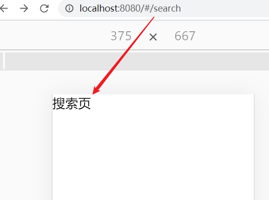

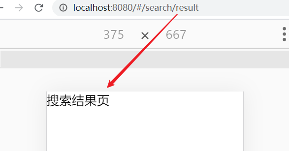


## 搜索页面布局

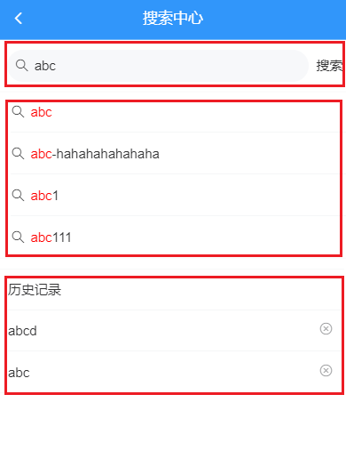

>  views/search/index.vue

从上到下，页面结构可以分成三部分

- 输入区。 
  - 使用[search组件](https://youzan.github.io/vant/#/zh-CN/search#zi-ding-yi-an-niu)
- 智能提示区。联想建议
  - 使用[cell组件]( https://youzan.github.io/vant/#/zh-CN/cell#zhan-shi-tu-biao )
- 历史建议区。


涉及vant中的组件

- [search组件]( https://youzan.github.io/vant/#/zh-CN/search#zi-ding-yi-an-niu )  https://youzan.github.io/vant/#/zh-CN/search#zi-ding-yi-an-niu

  

在view/search/index.vue文件中

```html
<template>
  <div>
    <!-- nav-bar
      this.$router.push() : 路由跳转
      this.$router.back() : 路由后退  ===== 页面中的后退按钮
    -->
    <van-nav-bar title="搜索中心" left-arrow @click-left="$router.back()"></van-nav-bar>
    <!-- 1. 搜索区域 输入框 -->
    <van-search
      v-model.trim="keyword"
      show-action
      placeholder="请输入搜索关键词"
    >
    <!-- #action  ==== slot="action" -->
      <!-- <template slot="action">
        <div>搜索</div>
      </template> -->
      <div slot="action">搜索</div>
    </van-search>

    <!-- 2. 搜索建议 -->
    <van-cell-group>
      <van-cell title="单元格" icon="search"/>
      <van-cell title="单元格" icon="search"/>
      <van-cell title="单元格" icon="search"/>
    </van-cell-group>

    <!-- 3. 历史记录 -->
    <van-cell-group>
      <van-cell title="历史记录"/>

      <van-cell title="单元格">
        <van-icon name="close"></van-icon>
      </van-cell>

      <van-cell title="单元格">
        <van-icon name="close"></van-icon>
      </van-cell>
    </van-cell-group>
  </div>
</template>

<script>
export default {
  name: 'Search',
  data () {
    return {
      keyword: ''
    }
  }
}
</script>
```


## 搜索联想建议

目标：

- 在输入框中写入内容
- 发请求到后端，根据这个内容给出建议，显示在联想建议区


步骤：

- 封装请求函数
- 当搜索输入变化的时候（search组件已经封装），请求加载联想建议的数据
- 将请求得到的结果绑定到模板中

### 封装数据接口

创建 `api/search.js` 并写入

```js
// 搜索相关的操作全封装在这里

import ajax from '@/utils/request'

/**
 * 根据搜索关键字获取搜索建议
 * @param {*} keyword 关键字
 */
export const getSuggestion = keyword => {
  return ajax({
    method: 'GET',
    url: '/app/v1_0/suggestion',
    params: {
      q: keyword
    }
  })
}
```

### 当搜索内容变化时请求获取数据

在 `search/index.vue` 中请求获取数据。

当搜索输入变化的时候（ van-search组件已经封装好，只需要加对@input的事件响应即可），请求加载联想建议的数据

步骤：

- 在模板中添加事件响应

- 在响应函数中调用接口

- 添加数据项，以保存搜索结果

  

#### 模板中添加事件响应

```html
<!-- 1. 搜索区域 输入框
      https://youzan.github.io/vant/#/zh-CN/search
      input: 当输入内容变化时，它会触发

      clearable: 只在移动端生效
    -->
    <van-search
      v-model.trim="keyword"
      clearable
      show-action
      placeholder="请输入搜索关键词"
      @input="hGetSuggestion"
    >
    <!-- #action  ==== slot="action" -->
      <!-- <template slot="action">
        <div>搜索</div>
      </template> -->
      <div slot="action">搜索</div>
    </van-search>
```

@input是由van-search组件提供的。


#### 引入api

```
import { getSuggestion } from '@/api/search.js'
```

#### 补充数据项

```
    return {
+     suggestion: [], // 当前的搜索建议
      keyword: '' // 搜索关键字
    }
```


#### 在响应函数中调用接口

```js
// 当用户输入内容变化时，就会执行
    async hGetSuggestion () {
      console.log(this.keyword)
      if (this.keyword === '') {
        this.suggestion = []
        return
      }
      // 1. 调用接口
      const result = await getSuggestion(this.keyword)
      // 2. 将获取的数据显示在建议区
      console.log(result)
      this.suggestion = result.data.data.options
    }
  }
```


### 显示建议结果

只需要修改模板即可

```html
<!-- 2. 搜索建议 -->
    <van-cell-group>
      <van-cell v-for="(item,idx) in suggestion"
      :title="item"
      :key="idx"
      icon="search"></van-cell>
    </van-cell-group>
```

### 效果

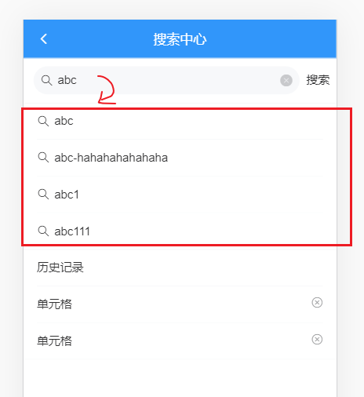

## 高亮搜索关键字

目标：在显示结果中把关键字高亮


思路：要在一段字符串中把其中一部分高亮，可需要做**替换**即可。例如，如果你需要把"我爱我家"中的`我`字高亮,相当于是把“我”改在一小段特殊的字符串，如下：

```
我爱我家 ----> <span style="color:red">我</span>爱<span style="color:red">我</span>家
```

### 原理：字符串替换

所以，基本想法就是字符串替换。现在的问题简化成了：如何把一段字符串中的指定的内容替换成另一个内容：

```
var str = "abcdefgbefab"
// 目标: 把str中的b全部换成<span>b</span>
// 普通字符串替换：str.replace(目标字符串，要替换的字符串)，它的返回值是替换之后的字符串，注意它不会修改原字符串。
// 它的问题是，它只能替换一次。如上，我们有两个b需要替换，那又该怎么办呢？
// - 循环
// - 正则
```

突破难点

- 正则
- str.replace(正则，函数)

```javascript
<!DOCTYPE html>
<html lang="en">
<head>
  <meta charset="UTF-8">
  <meta name="viewport" content="width=device-width, initial-scale=1.0">
  <title>Document</title>
</head>
<body>
  <h1>字符串替换</h1>
  <div>
    <span style="color:red">ab</span>cdefgbef<span style="color:red">AB</span>
  </div>
  <script>
    var str = "abcdefgbefAB"
    // 目标: 把str中的b全部换成<span style="color:red">b</span>
    // https://developer.mozilla.org/zh-CN/docs/Web/JavaScript/Reference/Global_Objects/String/replace
    // 普通字符串替换：str.replace(目标字符串，要替换的字符串)，它的返回值是替换之后的字符串，注意它不会修改原字符串。
    // 它的问题是，它只能替换一次。如上，我们有两个b需要替换，那又该怎么办呢？
    // - 循环
    // - 正则
    var target = 'ab'
    var reg = new RegExp(target, 'gi') // 定义一个正则表达式 
    // g：全局匹配(可以多次匹配), i:忽略大小写（无论大小写都可以匹配）

    var m = '<span style="color:red">' + target + '</span>'

    // str.replace(目标字符串，要替换的字符串)： 只能替换一次
    // console.log( str.replace(target, m) )
  
    // str.replace(正则/g，要替换的字符串)： 设置了正则的全局匹配之后，就可以替换多次
    // console.log( str.replace(target, m) )
    // console.log( str.replace(reg, m) ) // 不能正确对大小写进行正确的显示
  
    // str.replace(正则/g，fucntion(s){ return XXXX })
    // 函数执行的逻辑:
    // s: 表示当前匹配到的内容
    // return: 表示要替换的内容
    console.log( str.replace(reg, function(s){
      console.log(s)
      return '<span style="color:red">' + s + '</span>'
    }) )
</script>
</body>
</html>
```


### 实现

- 使用一个**计算属性**来保存高亮之后的值
  - 原来直接获取的数据要做一次加工：用正则+replace对内容进行高亮处理---字符串替换
- 用v-html显示数据


计算属性

```javascript
computed: {
    // 用计算属性来去suggestion中保存内容做高亮
    cSuggestion () {
      const reg = new RegExp(this.keyword, 'gi')
      // 对suggestion中的每一项进行正则替换，得到具备高亮效果的字符串
      const arr = this.suggestion.map(str => {
        return str.replace(reg, function (s) {
          return `<span style="color:red;">${s}</span>`
        })
      })
      return arr
    }
  },
```

结构

```html
<!-- 2. 搜索建议 -->
    <van-cell-group>
      <van-cell v-for="(item,idx) in cSuggestion"
      :key="idx"
      icon="search">
        <div v-html="item"></div>
      </van-cell>
    </van-cell-group>
```


注意

- v-html的用法
- str.replace(正则，函数)

### 效果

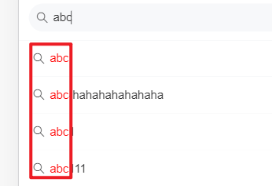

## 搜索历史记录

百度搜索

JD买商品

......

### 历史记录的意义

用户点击搜索有两种情况：

- 在搜索框上的按钮上点击。
- 在系统给出的建议搜索项上点击。

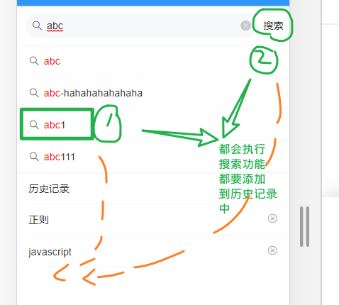

这两种情况下，都应该去进行搜索操作：跳入具体的搜索页面。但在此之前，可以把它们搜索的内容添加到历史记录中，以便下次快速搜索。

### 历史搜索记录的保存方式及格式

有两种方式来保存用户搜索：

- 把搜索记录放在服务器
- 把搜索记录放在本地

这里我们把搜索记录保存在localstorage中。


保存格式：把**搜索结果放在一个数组**中。

- 最近的搜索结果在最前面
- 搜索历史中不要有重复的项

```
['a','手机','javascript']
```

### 补充一个数据项

```diff
data () {
	return {
      // str: '<span style="color:red;">ab</span>',
      keyword: '', // 搜索关键字
+      history: ['正则', 'javascript'], // 保存历史记录
      suggestion: [] // 当前的搜索建议
    }
  }
```

### 封装一个添加历史记录的方法

```
methods:{ 
	// 用来向搜索记录中添加新项
    // 搜索记录的基本规则
    // - 不能有重复的项
    // - 最近搜索记录应该放在最前面
    addHistory (str) {
      this.history.push(str)
    }
}
```

上面这个方法在后面还要改进的。


### 在两种情况下去调用这个方法


搜索内容的第一种方式： 点击联想建议

```diff
<!-- 2. 搜索建议 -->
    <van-cell-group>
      <van-cell v-for="(item,idx) in cSuggestion"
      :key="idx"
+      @click="hSearchSuggestion(idx)"
      icon="search">
        <div v-html="item"></div>
      </van-cell>
    </van-cell-group>
```

点击 搜索按钮

```diff
    <van-search
      show-action
      placeholder="请输入搜索关键词"
      shape="round"
      v-model.trim="keyword"
      @input="hGetSuggestion"
      >
+      <div slot="action" @click="hSearch">搜索</div>
    </van-search>
```

下面是对应的两个方法:

```javascript
// 搜索的第1种方法：用户在搜索建议上点击了
    hSearchSuggestion (idx) {
      console.log(idx)
      // 1. 把当前的搜索建议 添加到搜索历史记录中去
      this.addHistory(this.suggestion[idx])
      // 2. todo 跳转到搜索结果页
    },
    // 搜索的第2种方法：用户在搜索按钮上点击了
    hSearch () {
      if (this.keyword === '') {
        return
      }
      // 1. 把当前的搜索内容 添加到搜索历史记录中去
      this.addHistory(this.keyword)
      // 2. todo 跳转到搜索结果页
    },
```


### 显示历史记录

只需修改视图，在searchSuggestion中循环显示即可。

```
<!-- 搜索历史记录 -->
    <van-cell-group>
      <van-cell title="历史记录"></van-cell>
      <van-cell v-for="(item,idx) in history"
        :key="idx"
        :title="item">
         <van-icon name="close" />
      </van-cell>
    </van-cell-group>
    <!-- /搜索历史记录 -->
```


### 效果

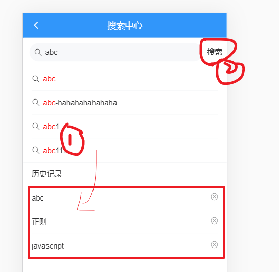

### 改进添加历史记录的方法

```
// 用来向搜索记录中添加新项
    //   1. 不能有重复
    //   2. 后加的在前面
    addHistory (str) {
      // 如果在history中已经存在，则可以先删除
      // findIndex如果找到了符合条件的元素，则下标不会是-1
      const idx = this.history.findIndex(item => item === str)
      if (idx !== -1) {
        // 有重复项, 删除它
        this.history.splice(idx, 1)
      }
      // 在数组的头部去添加
      this.history.unshift(str)
    },
```


### 删除历史记录

给X添加点击事件

```html
<!-- 搜索历史记录 -->
    <van-cell-group>
      <van-cell title="历史记录"></van-cell>
      <van-cell v-for="(item,idx) in history"
        :key="idx"
        :title="item">
+         <van-icon name="close" @click="hDeleteHistory(idx)"/>
      </van-cell>
    </van-cell-group>
    <!-- /搜索历史记录 -->
```

添加一个方法hDeleteHistory

```
// 用户点击了删除历史记录
    hDeleteHistory (idx) {
      this.history.splice(idx, 1)
    }
```


### 保存搜索历史记录到本地

目标：

​	不要在刷新页面时就不见了（和前面的vux一样，要做持久化）。刷新，退出系统这个搜索历史应该一直存在。

思路：

- 引入前面封装好的持久化工具
- 当搜索历史变化 (添加，删除)时保存一次
-  在初始时使用引入本地数据

步骤：

1. 引入持久化模块

```
import { setItem, getItem } from '@/utils/storage'
```

2. 初始化

```
data () {
    return {
      keyword: '', // 搜索关键字
      // 初始化，先从本地存储中取值，取不到，则用[]
      history: getItem('searchHistory') || [], // 保存历史记录  ['正则', 'javascript']
      suggestion: [] // 当前的搜索建议
    }
  }
```


3. 保存到本地

​	在添加和删除历史记录时均做一次保存

```diff
// 用户点击了 删除历史记录
    hDeleteHistory (idx) {
      this.history.splice(idx, 1)

      // 做持久化
+      setItem('searchHistory', this.history)
    },
addHistory (str) {
      // 如果在history中已经存在，则可以先删除
      // findIndex如果找到了符合条件的元素，则下标不会是-1
      const idx = this.history.findIndex(item => item === str)
      if (idx !== -1) {
        // 有重复项, 删除它
        this.history.splice(idx, 1)
      }
      // 在数组的头部去添加
      this.history.unshift(str)

      // 做持久化
+      setItem('searchHistory', this.history)
    },
```

### 优化： 消除魔术数/魔术字符串

```
// 消除魔术数
const SEARCHHISTORY_KEY = 'searchHistory'
// 用这个常量值来代替魔术字符串
setItem(SEARCHHISTORY_KEY, this.history)
```


### 联想建议和历史记录的切换显示

联想建议 和 搜索历史 这两个区域是互斥的：

- 如果当前开始去搜索内容，则不显示搜索历史，而显示联想建议。 
- 如果当前并没有搜索内容，则显示搜索搜索历史，不显示联想建议。

```html
<!-- 联想建议
    v-html来正常显示html字符串效果-->
<van-cell-group v-if="keyword">
    ... 
</van-cell-group>
<!-- /联想建议 -->

<!-- 搜索历史记录 -->
<van-cell-group v-else>
    ... 
</van-cell-group>
<!-- /搜索历史记录 -->
```

##  搜索优化

现状：

   在输入框中字符变化会立刻去发请求获取搜索建议。


这个搜索的频率太高了（太灵敏，它对用户来说，是好的，因为可以及时收到搜索建议，对服务器有坏处，调用这个接口的频率太高了，给服务器添加了负担。同时用户不会得到更多的好处：在搜索的过程，你录入的单词并没有写完，你得到的搜索建议多半是无用）。


解决思路：

- **降**低发请求的**频**率。

### 防抖处理

防抖：抖:高频的运动。不要让你抖，抖也没有用。
    思路：
     当这个函数被调用时，不立刻执行，而是延迟10秒执行。
    如果在这10秒内再次调用了这个函数，则从当前被调用的时间开始算，
      再延迟10秒。 (整个10秒内，不能被打断,一旦打断，就要重新计时)。
    如果在这10秒内没有再次调用这个函数，10秒后执行代码。

> 生活中例子：等电梯


```
<van-search
      show-action
      placeholder="请输入搜索关键词"
      shape="round"
      v-model.trim="keyword"
+     @input="hGetSuggestion_with_fang_dou"
      >
      <div slot="action" @click="hSearch">搜索</div>
    </van-search>
```


```
// 当用户输入内容变化时，就会执行
    async hGetSuggestion () {
      console.log(this.keyword)
      if (this.keyword === '') {
        this.suggestion = []
        return
      }
      // 1. 调用接口
      const result = await getSuggestion(this.keyword)
      // 2. 将获取的数据显示在建议区
      console.log(result)
      this.suggestion = result.data.data.options
    },

    // 当用户输入内容变化时，就会执行 --- 防抖处理
    // 防抖（10秒）: 目标就是降频。一件事如果执行的频率非常快，抖动：没有意义的， 不要让你抖...
    //    思路：
    //      当这个函数被调用时，不是立即执行的时，而是延迟 10 秒再执行.
    //      如果在10秒之内，再次调用这个函数，则从当前被调用的时间开始算，再延迟 10 秒(10秒内不能再次调用函数，
    //       一旦打断，就要重新计时)。
    //       如果10秒内没有再次调用这个函数，则10秒达了之后，执行代码。
    // 生活中： 等电梯
    // 游戏中： 英雄回城

    hGetSuggestion_with_fang_dou () {
      console.log('当前用户的输入', this.keyword)
      // 以防抖5s为例： (值越大，越不灵敏)
      // 用户第一次输入第一个字符，代码不会立即去执行（ajax不是立即发出去）
      // 再是等5s之后再发ajax.如果在这5s内，用户输入第二个字符，再向后再延迟5s.

      if (this.timer) {
        clearTimeout(this.timer)
      }
      this.timer = setTimeout(() => {
        this.hGetSuggestion()
      }, 5 * 1000)
    },

    
```

### 节流处理

节流：水龙头。把水龙头关到最小，让它一滴一滴向下滴水。效果就是降低了水流的频率。


```
// 当用户输入内容变化时，就会执行 --- 节流处理
    // 节流（10秒）: 目标就是降频。一件事如果执行的频率非常快，节流就是把频率降至指定的值
    //    思路：
    //      当这个函数被调用时，不是立即执行的时，而是检查本次执行距离上一次执行中间是否相隔10秒。
    //      如果相隔时间不足10s，则不执行；否则就执行
    // 生活中： 你女朋友每小时都要你发定位；节流处理（5小时）：如果早上8点发了定位，则下一次发定位时
    //         时间是：下午1点。中间其它时间不发定位

    // 游戏中： 射击游戏，点一次鼠标发一颗子弹，你是否可能按下鼠标不放，就不间断发子弹？

    hGetSuggestion_with_jie_liu () {
      console.log('当前用户的输入', this.keyword, (new Date()).toLocaleTimeString())
      // 以节流3s为例： (值越大，越不灵敏)
      // 对于本次调用，检查本次执行距离上一次执行中间是否相隔5秒
      // 是：执行，否：不执行

      if (this.timer) {
        return
      }
      this.timer = setTimeout(() => {
        this.timer = null
        this.hGetSuggestion()
      }, 100) //  3 * 1000
    }
  }
```


### 对比

采用上面的两种优化方案和不做优化的方案，按下键盘上的1，保持不动，观察network的结果如下：

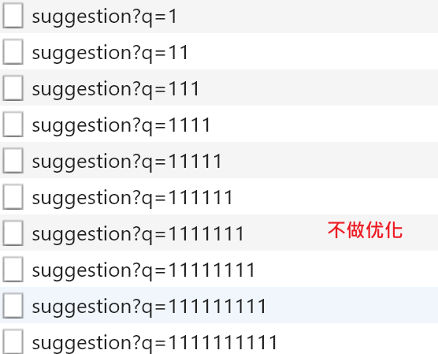

防抖：可能就执行第一次调用和最后一次调用（防抖的策略有很多种）

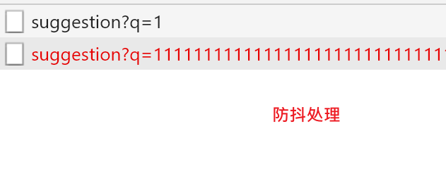。

节流：会执行多次，只是频率降低了。

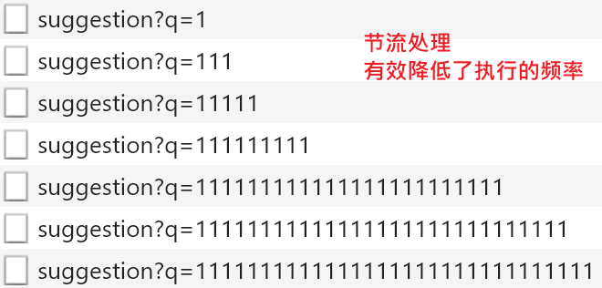

关键字搜索：建议采用节流的方式来做优化。一方向减少服务器压力（请求次数变少了），用户体验要比防抖要一些。


前端界面上的常见的高频操作（事件会触发多次）：

- 鼠标移动。
- 窗口缩放。
- **input。文本框输入。**
- scroll。

业务：

- 不能频繁发验证码请求
- 不能不停地登陆
- .......


参考： 


debounce防抖: https://www.lodashjs.com/docs/latest#_debouncefunc-wait0-options

throttle:节流：https://www.lodashjs.com/docs/latest#_throttlefunc-wait0-options


### 扩展：在vue中使用lodash提供的防抖和节流

第一步：安装lodash

```
npm i lodash
```

第二步：引入lodash

```
import  _  from 'lodash'
```

第三步：调用lodash的方法进行节流或防抖处理

```javascript
hGetSuggestion_with_debounce: _.debounce(function () {
      console.log(this.keyword)
      this.hGetSuggestion()
    }, 500),
    hGetSuggestion_with_throttle: _.throttle(function () {
      console.log(this.keyword)
      this.hGetSuggestion()
    }, 500),
```


```javascript
<van-search
      show-action
      placeholder="请输入搜索关键词"
      shape="round"
      v-model.trim="keyword"
      @input="hGetSuggestion_with_debounce"
      >
      <div slot="action" @click="hSearch">搜索</div>
    </van-search>
```


## 搜索结果页

搜索结果是单独在另一个页面显示的，其基本思路是传入你要搜索的关键字，调接口，取回查询结果，并显示。

步骤：

- 注册搜索表单的提交事件处理函数
- 跳转到搜索结果页
  - 根据搜索关键字获取搜索结果
  - 展示到列表中


### 页面布局

views/search/result.vue的结构

```html
<template>
  <div class="serach-result">
    <!-- 导航栏 -->
    <van-nav-bar
      title="xxx 的搜索结果"
      left-arrow
      fixed
      @click-left="$router.back()"
    />
    <!-- /导航栏 -->

    <!-- 文章列表 -->
    <van-list
      class="article-list"
      v-model="loading"
      :finished="finished"
      finished-text="没有更多了"
      @load="onLoad"
    >
      <van-cell
        v-for="item in list"
        :key="item"
        :title="item"
      />
    </van-list>
    <!-- /文章列表 -->
  </div>
</template>

<script>
export default {
  name: 'SearchResult',
  data () {
    return {
      list: [],
      loading: false,
      finished: false
    }
  },

  methods: {
    onLoad () {
      // 异步更新数据
      setTimeout(() => {
        for (let i = 0; i < 10; i++) {
          this.list.push(this.list.length + 1)
        }
        // 加载状态结束
        this.loading = false

        // 数据全部加载完成
        if (this.list.length >= 40) {
          this.finished = true
        }
      }, 500)
    }
  }
}
</script>

<style lang="less" scoped>
.serach-result {
  height: 100%;
  overflow: auto;
  .article-list {
    margin-top: 39px;
  }
}
</style>
```

路由

```
  import Result from '@/views/search/result.vue' //
  // 搜索中心
  {
    path: '/search',
    name: 'search',
    component: Search
  },
  // 搜索结果页
  {
    path: '/search/result',
    name: 'searchResult',
    component: Result
  }
```


### 路由跳转传参

#### 补充路由配置

在src/router/index.vue中补充路由配置：

```
// 这个路由是打算以查询字符串的方式来传入查询关键字
{ path: '/search/result', component: () => import('@/views/search/result') }
```

#### 测试结果

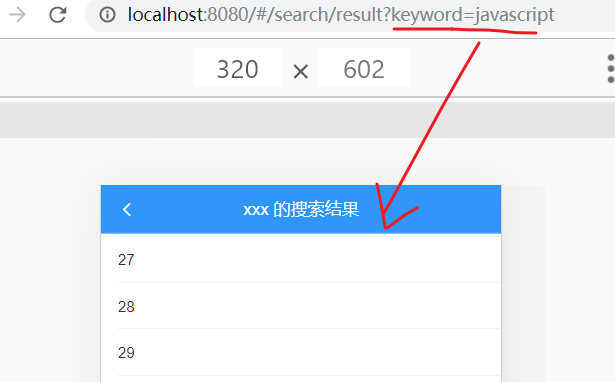

#### 添加跳转

有三个地方要跳入结果页，并传参:

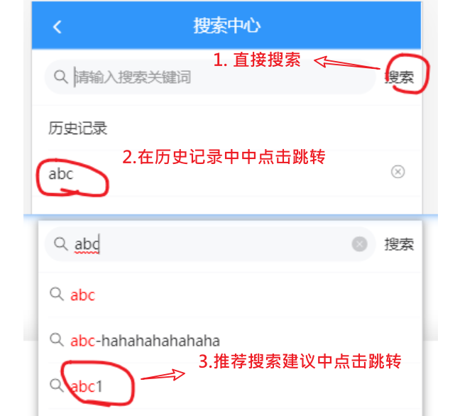


在 `views/search/index.vue` 中：

**历史记录**

```diff
<van-cell-group v-else>
      <van-cell title="历史记录"/>

      <van-cell
      v-for="(item,idx) in history"
      :title="item"
      :key="idx"
+      @click="$router.push('/search/result?keyword='+ item)"
      >
      <!-- @click.stop 为了阻止冒泡 -->
+        <van-icon name="close" @click.stop="hDeleteHistory(idx)"></van-icon>
      </van-cell>
    </van-cell-group>
```

```diff
// 搜索的第1种方法：用户在搜索建议上点击了
    hSearchSuggestion: function (idx) {
      console.log(idx)
      const keyword = this.suggestion[idx]
      // 1. 把当前的搜索建议 添加到搜索历史记录中去
      this.addHistory(keyword)
      // 2. 跳转到搜索结果页
+      this.$router.push({
        path: '/search/result',
        query: {
          keyword
        }
      })
    },
    // 搜索的第2种方法：用户在搜索按钮上点击了
    hSearch: function () {
      if (this.keyword === '') {
        return
      }
      // 1. 把当前的搜索内容 添加到搜索历史记录中去
      this.addHistory(this.keyword)
      // 2. 跳转到搜索结果页
+      this.$router.push({
        path: '/search/result',
        query: {
          keyword: this.keyword
        }
      })
    },
```


路由跳转，并传入query来携带参数：两种方式：

    跳转到结果页：路由跳转并传入参数
    // 方式一：最朴素的拼接的方式
    // this.$router.push('/search/result?keyword=' + this.keyword)
    
    // 方式二：对象格式
      this.$router.push({
         path: '/search/result',
         query: {
              keyword: this.keyword
         }
    })


### 在result.vue获取参数

获取参数：

在vue的调试工具中去查看：

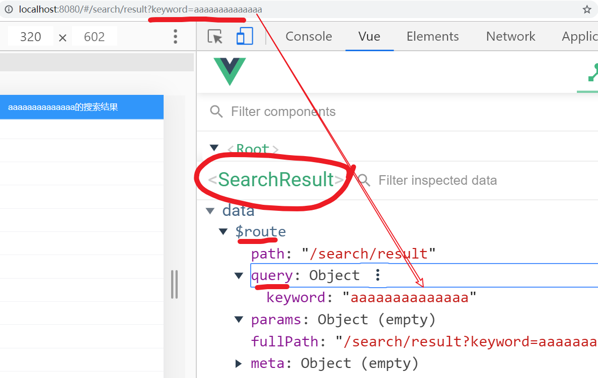

```
this.$route.query.keyword
```


步骤：

- 封装接口
- 发请求，获取结果
- 模板绑定

search/result.vue

在页面内部，我们可以通过this.$route.query.keyword来获取传入的查询关键字

```javascript
created () {
    var keyword = this.$route.query.keyword
    alert(keyword)
}
```


### 封装接口

在 `api/serach.js` 封装请求方法

```js
/**
 * 根据查询关键字和页码，获取搜索结果
 * @param {*} q 搜索关键字
 * @param {*} page 页码
 */
export const getSearch = (q, page = 1) => {
  return ajax({
    method: 'GET',
    url: '/app/v1_0/search',
    params: {
      q,
      page
    }
  })
}

```

### 调用接口获取数据

然后在 `views/search-result/index.vue` 中

```js
import { getSearch } from '@/api/search'

export default {
  name: 'SearchResult',
  data () {
    return {
      list: [],
      page: 1, // 当前是第几页
      loading: false, // 正在加载
      finished: false // 是否所有的数据全部加载完成
    }
  },
  methods: {
    async onLoad () {
      // 1. 调用api, 获取数据
      const result = await getSearch(this.$route.query.keyword, this.page)
      console.log(result)
      const arr = result.data.data.results
      // 2. 把数据填充到list
      this.list.push(...arr)
      this.page++ // 页面自增

      // 3. 修改loading为false
      this.loading = false
      // 4. 判断是否加载完了所有的数据
      if (arr.length === 0) {
        this.finished = true
      }
    }
  }
}
```

### 数据渲染

模板绑定

```html
<!-- 文章列表 -->
    <van-list
      class="article-list"
      v-model="loading"
      :finished="finished"
      finished-text="没有更多了"
      @load="onLoad"
    >
      <van-cell
        v-for="item in list"
        :key="item.art_id"
        :title="item.title"
      />
    </van-list>
    <!-- /文章列表 -->
```


