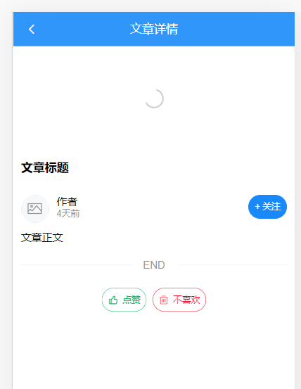
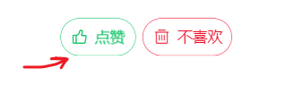
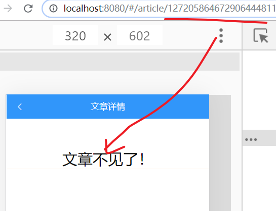

文章详情页

## 目标


## 基本结构

创建 `views/article/index.vue` 并写入以下内容。一共分成如下3个基本的部分。

```html
<template>
  <div class="article-container">
    <!-- 导航栏 -->
    <van-nav-bar
      fixed
      left-arrow
      @click-left="$router.back()"
      title="文章详情"
    ></van-nav-bar>
    <!-- /导航栏 -->

    <!-- 加载中 loading -->
    <van-loading class="article-loading" />
    <!-- /加载中 loading -->

    <!-- 文章详情 -->
    <div class="detail">
      <h3 class="title">标题</h3>
      <div class="author">
        <van-image round width="1rem" height="1rem" fit="fill" />
        <div class="text">
          <p class="name">作者</p>
          <p class="time">4天前</p>
        </div>
        <van-button
          round
          size="small"
          type="info"
        >+ 关注</van-button>
      </div>
      <div class="content">
        <div>正文</div>
      </div>
      <van-divider>END</van-divider>
      <div class="zan">
        <van-button round size="small" hairline type="primary" plain icon="good-job-o">点赞</van-button>
        &nbsp;&nbsp;&nbsp;&nbsp;
        <van-button round size="small" hairline type="danger" plain icon="delete">不喜欢</van-button>
      </div>
    </div>
    <!-- /文章详情 -->

  </div>
</template>

<script>
export default {
  name: 'ArticleIndex',
  data () {
    return {
      loading: true, // 控制加载中的 loading 状态
      article: { }
    }
  }
}
</script>

<style scoped lang='less'>
.article-container{
  position: absolute;
  left: 0;
  top: 0;
  overflow-y: scroll;
  width: 100%;
  height: 100%;
}
.article-loading {
  padding-top: 100px;
  text-align: center;
}
.error{
  padding-top: 100px;
  text-align: center;
}
.detail {
  padding: 50px 10px;
  .title {
    font-size: 16px;
  }
  .zan{
    text-align: center;
  }
  .author {
    padding: 10px 0;
    display: flex;
    .text {
      flex: 1;
      padding-left: 10px;
      line-height: 1.3;
      .name {
        font-size: 14px;
        margin: 0;
      }
      .time {
        margin: 0;
        font-size: 12px;
        color: #999;
      }
    }
  }
  .content {
    font-size:14px;
    overflow: hidden;
    white-space: pre-wrap;
    word-break: break-all;
    /deep/ img{
      max-width:100%;
      background: #f9f9f9;
    }
  }
}
</style>

```

## 路由配置

然后在 `router/index.js` 中新增路由配置项， 这里采用的是动态

```js
import Article from '@/views/article' //

const router = new VueRouter({
  // 配置路由表
  routes: [
    ......
// 这个路由是打算以动态路由的方式来传入文章编号
      {
        path: '/article/:id',
        name: 'article',
        component: Article
      }
  ]
})

export default router
```

在地址栏中直接输入http://localhost:8080/#/article/111来测试一下。




## 路由跳转

在如下两处可以跳转详情页

- 文章列表
- 搜索结果页

views/home/articleList.vue中，点击文章列表项的时候，传递文章id跳转到文章详情页：

```html
<van-cell
          v-for="(item,idx) in list"
          :key="idx"
          :title="item.title"
+         @click="$router.push('/article/' + item.art_id.toString())"
          >
```


src\views\search\result.vue中，点击文章列表项的时候，传递文章id跳转到文章详情页：

```html
      <van-cell
        v-for="(item, idx) in list"
        :key="idx"
        :title="item.title"
+        @click="$router.push('/article/' + item.art_id.toString())"
      />
```


## 获取数据并显示

这里我们主要实现两个功能：

- 获取展示文章详情
- 处理加载中 loading


步骤：

- 封装接口
- 发送请求获取数据
- 模板绑定

下面是具体实现：

### 封装接口

1、在 `api/article.js` 中新增一个方法

```js
/**
 * 根据文章编号来获取文章详情
 * @param {*} id 文章编号
 */
export const getArticle = id => {
  return ajax({
    method: 'GET',
    url: '/app/v1_0/articles/' + id
  })
}

```

### 调用接口

在views/article/index.vue组件中调用接口，获取文章详情

```js
import { getArticle } from '@/api/article.js'
export default {
  name: 'ArticleIndex',
  data () {
    return {
      loading: true, // 控制加载中的 loading 状态
      article: { } // 当前文章
    }
  },
  created () {
    this.loadArticle()
  },
  methods: {
    async loadArticle () {
      const id = this.$route.params.id
      const result = await getArticle(id)
      this.article = result.data.data
      this.loading = false
    }
  }
}
```

### 模板绑定

```html
<div class="article-container">
    <!-- 导航栏 -->
    <van-nav-bar
      fixed
      left-arrow
      @click-left="$router.back()"
      :title="article.title"
    ></van-nav-bar>
    <!-- /导航栏 -->

    <!-- 加载中 loading -->
    <van-loading v-if="loading" class="article-loading" />
    <!-- /加载中 loading -->

    <!-- 文章详情 -->
    <div class="detail" v-else>
      <h3 class="title">{{article.title}}</h3>
      <!-- 作者 -->
      <div class="author">
        <van-image round width="1rem" height="1rem" fit="fill"
        :src="article.aut_photo"/>
        <div class="text">
          <p class="name">{{article.aut_name}}</p>
          <p class="time">{{article.pubdate | relativeTime}}</p>
        </div>
        <van-button
          round
          size="small"
          type="info"
        >+ 关注</van-button>
      </div>
      <!-- 作者 end-->

      <div class="content">
        <div v-html="article.content"></div>
      </div>
      <van-divider>END</van-divider>
      <div class="zan">
        <van-button round size="small" hairline type="primary" plain icon="good-job-o">点赞</van-button>
        &nbsp;&nbsp;&nbsp;&nbsp;
        <van-button round size="small" hairline type="danger" plain icon="delete">不喜欢</van-button>
      </div>
    </div>
    <!-- /文章详情 -->

  </div>
```

- 文章正文是html格式字符串，需要用**v-html**才能正确显示
- 相对时间处理：直接使用我们在前面定义的**全局过滤器**即可。

效果：


## 文章操作

目标：

- 对作者进行 关注 或者 取消关注
- 对文章进行 点赞 或者 取消点赞
- 对文章进行 不喜欢 或者取消不喜欢

### 关注&取关

细节：

 在获取当前文章详情时，会带回一个` is_followed `来标记你是否已经关注了这篇文章的作者。


- 如果is_followed为 false 表示当前登陆用户并没有关注过本文章的作者。
- 如果is_followed为true 表示当前登陆用户已经关注过本文章的作者

步骤：

- 封装接口
- 请求调用
- 模板处理


下面是具体实现过程：

#### 封装接口

在 `api/user.js` 中新增两个方法：

```js
/**
 * 关注用户
 * @param {*} userId 作者的id
 */
export const followUser = (userId) => {
  return ajax({
    method: 'POST',
    url: '/app/v1_0/user/followings',
    data: {
      target: userId
    }
  })
}
/**
 * 取消关注用户
 * @param {*} userId 作者的id
 */
export const unFollowUser = (userId) => {
  return ajax({
    method: 'DELETE',
    url: '/app/v1_0/user/followings/' + userId
  })
}

```

#### 调用接口

然后在\views\article\index.vue模板中

```html
<van-button
          round
          size="small"
          type="info"
+          @click="hSwitchFollow"
+        >{{article.is_followed ? '取关' : '+ 关注'}}</van-button>
```

代码：

```
// 导入方法
import { unFollowUser, followUser } from '@/api/user'

async hSwitchFollow () {
      try {
        // 根据当前is_followed的值来决定调用什么方法
        if (this.article.is_followed) {
          // 目前是ture,点击按钮 是要做取消关注
          const result = await unFollowUser(this.article.aut_id)
          console.log(result)
        } else {
          const result = await followUser(this.article.aut_id)
          console.log(result)
        }
        // 1. 更新视图
        //  方式一：再发一次获取文章详情的请求。 这个成本高。
        //  方式二：只需修改本地数据。如果上面的操作没有报错，则说明后端接口工作是正常的。
        this.article.is_followed = !this.article.is_followed

        // 2. 给一个提示
        this.$toast.success('操作成功')
      } catch (e) {
        console.log(e)
        this.$toast.fail('操作失败')
      }
    }
```


### 点赞|取消点赞



细节：

这里唯一的难点是对接口属性的使用。从后端取回来的文章详情中有一个attitude属性：用户对文章的态度

- -1 无态度
- 0  不喜欢
- 1  点赞


>  如果是做点赞，就是把attitude改成1 。
>
> 取消点赞，就是把 attiude改成-1


视图上有两个地方要修改：

- 文字
- 图标

步骤：

- 封装接口
- 请求调用
- 模板处理

#### 封装接口

在 `api/article.js` 中封装数据接口

```js

/**
 * 取消点赞
 * @param {*} id 文章编号
 */
export const deleteLike = id => {
  return ajax({
    method: 'DELETE',
    url: '/app/v1_0/article/likings/' + id
  })
}

/**
 * 添加点赞
 * @param {*} id 文章编号
 */
export const addLike = id => {
  return ajax({
    method: 'POST',
    url: '/app/v1_0/article/likings',
    data: {
      target: id
    }
  })
}

```

#### 调用接口

然后在 `views/article/index.vue` 组件中

```html
<template>

    <van-button round size="small"
        hairline
        type="primary"
        plain
        :icon="article.attitude === 1 ? 'good-job': 'good-job-o'"
        @click="hSwitchLike">{{article.attitude === 1 ? '取消点赞' : '点赞'}}     </van-button>
      
</template>

<script>
import { getArticle, addLike, deleteLike } from '@/api/article'

export default {
  ...
  methods: {
      
      async hSwitchLike () {
      // 根据当前attitude来决定调用哪一个方法：
      // 如果attitude是1，即当前给文章点赞的，则点击动作就是要 取消点赞
      if (this.article.attitude === 1) {
        await deleteLike(this.article.art_id.toString())
      } else {
        await addLike(this.article.art_id.toString())
      }
      this.$toast.success('操作成功')
      // 更新视图
      // 1. 重新获取整个页面 （不采用，成本太高）
      // 2. 只更新本地的数据项（就是取反: -1 <-------> 1）
      //    采用。原因如果这个请求接口操作并没有报错，则说明后端已经把数据更改了
      //          这里视图上，直接修改就行了。
      this.article.attitude = this.article.attitude * -1


  }
}
</script>
```


### 不喜欢|取消不喜欢


步骤

- 封装接口
- 请求调用
- 模板处理

下面是具体实现流程：


#### 封装接口

1、在 `api/article.js` 中封装两个请求方法

```js

/**
 * 取消不喜欢
 * @param {*} id 文章编号
 */
export const deleteDisLike = id => {
  return ajax({
    method: 'DELETE',
    url: '/app/v1_0/article/dislikes/' + id
  })
}

/**
 * 添加不喜欢
 * @param {*} id 文章编号
 */
export const addDisLike = id => {
  return ajax({
    method: 'POST',
    url: '/app/v1_0/article/dislikes',
    data: {
      target: id
    }
  })
}
```

#### 调用接口

然后在 `views/article/index.vue` 组件中

```html
<van-button round size="small"
        hairline
        type="danger"
        plain
        icon="delete"
        @click="hSwitchDisLike">{{article.attitude === 0 ? '取消不喜欢' : '不喜欢'}}</van-button>
      


<script>
+ import { addLike, deleteLike, addDislike, deleteDislike } from '@/api/article'


// 切换 是否 不喜欢
    async hSwitchDisLike () {
      // 根据当前attitude来决定调用哪一个方法：
      // 如果attitude是0，即当前给文章 添加了 不喜欢，则点击动作就是要 取消 不喜欢
      if (this.article.attitude === 0) {
        await deleteDisLike(this.article.art_id.toString())
        this.article.attitude = -1
      } else {
        await addDisLike(this.article.art_id.toString())
        this.article.attitude = 0
      }
      this.$toast.success('操作成功')
    }

```


## 补充：404

由于文章详情是根据地址栏中的文章编号来去做查询的，很可能这个编号会出错：找到这不到这个文文章。

此时，就需要给用户明确提示。


### 思路

准备一个额外的数据项，标记当前是否能找到这个文章，在ajax时，更新这个值。


### 代码

```
    <!-- 加载中 loading -->
    <van-loading class="article-loading" v-show="loading" />
    <!-- /加载中 loading -->

    <div v-if="is404" class="error">
      文章不见了！
    </div>
    <div v-else class="detail">...</div>
  
// 数据项  
  return {
+      is404: false,
      loading: true, // 控制加载中的 loading 状态
      article: {}
    }

// 代码
async loadAritcle () {
      try {
        const result = await getArticle(this.$route.params.id)
        console.log(result)
        // 保存文章详情
        this.article = result.data.data
        // 取消加载状态
        this.loading = false
      } catch (err) {
        // console.dir(err)
        // 取消加载状态
        this.loading = false
        if (err && err.response && err.response.status === 404) {
          // 确定文章没有找到
          this.is404 = true
        } else {
          this.$toast.fail('文章加载失败')
        }
      }
    }
```


### 效果



