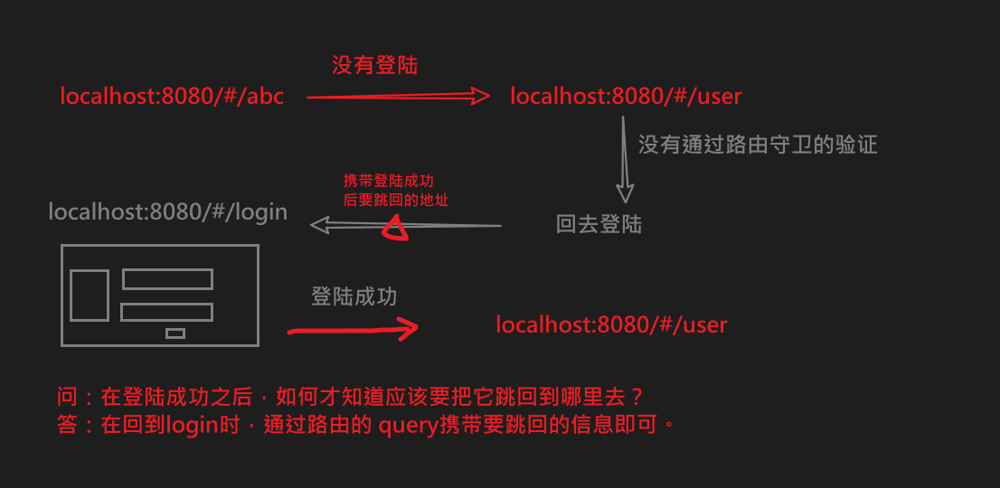
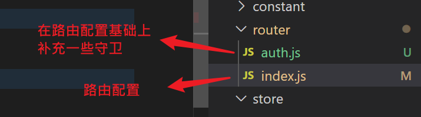
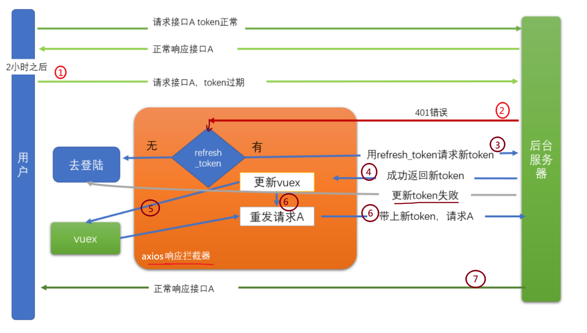
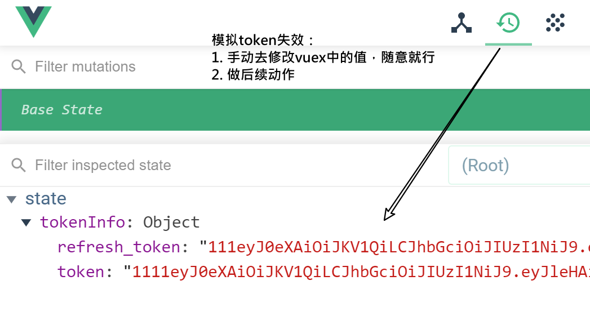

一个项目有很多个页面，有些页面是需要有**权限**的用户才有访问的。例如：修改密码这个页面，肯定只能是登陆用户才能访问。


当我们发现一个没有登陆的用户试图去访问一个需权根的页面时，我们应该把它引导到登陆界面，当用户完成登陆操作之后，再跳回到他之间访问的页面。


## 全局前置路由守卫

路由守卫: 是一个函数。在路由切换时，会经过它（它会被调用），它就可以用来去检查凭证。


在router/index.js中补充一个前置路由守卫

```javascript
import store from '@/store/index.js'

// 路由守卫
// 当路由变化时，这个函数就会执行。
// localhost:8080/#/a   ---->  localhost:8080/#/b
router.beforeEach(function (to, from, next) {
  console.log('路由变化了', to, from, next)

  // to:   去到哪里？ /b
  // from: 从哪里来？ /a
  // next: 是一个函数，用来自定义路由的跳转
  //  (1) next() 表示放行，让路由从from进入到to
  //  (2) next(其它路由),表示不去to，而进入指定的路由
  // next()

  // 如果你要去的页面是需要登陆才能访问的，则先去检查一下你是否登陆：
  //  - 没有登陆，转到登陆页
  //  - 正常放行

  // fullPath: 包含了path及查询字符串的内容
  if (to.path === '/user') {
    // 检查是否登陆
    if (store.state.tokenInfo.token) {
      console.log('你有身份证，可以访问')
      next()
    } else {
      console.log('没有身份证，转到login')
      next('/login?backto=' + to.fullPath)
    }
  } else {
    next()
  }
})
```

- to     ，表示在当前路由变化时，你进入哪个路由。
- from，表示在当前路由变化时，你要离开哪个路由。
- next。必须要调用这个next()来结束对当前的动作的处置。不管你决定这个路由跳转应该如何处理，但一定要给一个处理结果。（这个过程就像是express框架中的res.end()一样）
  - next() // 放行
  - next(false) // 不让跳，回到from
  - next(路由) 进入指定路由
    - next({path:, name:, ....})



在login/index.vue 中要改进一下跳转的目标

```
// 用户跳转
// 根据当前路由参数，决定跳到哪里去
const backto = this.$route.query.backto || '/'
this.$router.push(backto)
```


### 代码结构调整




index.js

正常写路由的配置

```
import Vue from 'vue'
import VueRouter from 'vue-router'
Vue.use(VueRouter)

const routes = [
....
]

const router = new VueRouter({
  routes
})

export default router

```

auth.js

引入路由配置，补充守卫

```
import router from './index.js'

import store from '@/store/index.js'
// console.log(store)
// console.log('store.state.tokeInfo.token', store.state.tokenInfo.token)

// 路由守卫
// 当路由变化时，这个函数就会执行。
// localhost:8080/#/a   ---->  localhost:8080/#/b
router.beforeEach(function (to, from, next) {
  console.log('路由变化了', to, from, next)

  // to:   去到哪里？ /b
  // from: 从哪里来？ /a
  // next: 是一个函数，用来自定义路由的跳转
  //  (1) next() 表示放行，让路由从from进入到to
  //  (2) next(其它路由),表示不去to，而进入指定的路由
  // next()

  // 如果你要去的页面是需要登陆才能访问的，则先去检查一下你是否登陆：
  //  - 没有登陆，转到登陆页
  //  - 正常放行

  // fullPath: 包含了path及查询字符串的内容
  if (to.path === '/user') {
    // 检查是否登陆
    if (store.state.tokenInfo.token) {
      console.log('你有身份证，可以访问')
      next()
    } else {
      console.log('没有身份证，转到login')
      next('/login?backto=' + to.fullPath)
    }
  } else {
    next()
  }
})

export default router
```


main.js

```diff
- import router from './router'
+ import router from './router/auth.js'
```


## token过期处理

### 目标

解决如下两个问题：

1. 通过axios响应拦截器来处理token过期的问题，让整个过程，用户无感（用户根本就不会感知到token失效的问题）。

2. 未登陆用户，在一些需登陆之后才能做的操作时，会报出401错误，此时应该让用户跳回登陆页。（你没有登陆，就在taobao买东西，直接点击付款时，会让你回到登陆去做登陆！）

### token过期

你登陆成功之后，接口会返回一个token值，这个值在后续请求时带上（就像是开门钥匙）。但是，这个值一般会有**有效期**（具体是多长，是由后端决定），在我们的项目中，这个有效期是2小时。

如果，上午8点登陆成功，到了10：01分，则token就会失效，再去发请求时，就会报**401**错误。


### 思路

当用户登陆成功之后，返回的token中有两个值，说明如下：


- token:
  - 作用：在访问一些接口时，需要传入token，就是它。
  - 有效期：2小时（安全）。

- refresh_token
  - 作用:  当token的有效期过了之后，可以使用它去请求一个特殊接口（这个接口也是后端指定的，明确需要传入refresh_token），并返回一个新的token回来（有效期还是2小时），以替换过期的那个token。
  - 有效期：14天。（最理想的情况下，一次登陆可以持续14天。）


---



request的[响应拦截器](https://www.npmjs.com/package/axios#interceptors)中：

- 对于某次请求A，如果是401错误 （2）
  - 有refresh_token，用refresh_token去请求回新的token （3）
    - 新token请求成功 （4）
      - 更新本地token （5）
      - 再发一次请求A   （6）
    - 新token请求失败
      - 携带请求地址，跳转到登陆页
  - 没有refresh_token
    - 携带请求地址，跳转到登陆页


### 代码

在src\utils\request.js中，补充响应拦截器

```javascript
// 引入路由，需要用它来做路由跳转
import router from '@/router/index.js'

// 添加一个响应拦截器 -- 所有的请求在发回来之后，都会到这里来
instance1.interceptors.response.use(function (response) {
  // Any status code that lie within the range of 2xx cause this function to trigger
  // Do something with response data
  return response;
}, async function (error) {
  console.log('响应拦截器，拦截到了错误')
  if (error.response && error.response.status === 401) {
    // 2.遇到了401错误
    const refreshToken = store.state.tokenInfo.refresh_token
    if (refreshToken) {
      // 3. 用resfreshToken再发请求
      try {
        const result = await axios({
          method: 'PUT',
          url: 'http://ttapi.research.itcast.cn/app/v1_0/authorizations',
          headers: {
            Authorization: `Bearer ${refreshToken}`
          }
        })
        // 4. 成功获取新token
        console.log('用refresh_token取回来的新的token', result)
        const newToken = result.data.data.token
        // 5. 保存新token到vuex
        store.commit('mSetTokenInfo', {
          token: newToken,
          refresh_token: refreshToken
        })

        // 6. 重新发请求
        // error.表示401错误。error.config表示出这个错误时，所要发出的请求的配置
        return instance1(error.config) // 重新去发一次请求
      } catch {
        console.log('用refresh_token更新token失败, 只能去做一次登陆')
        // 路由跳转
        // currentRoute: 当前路由
        router.push('/login?backto=' + router.currentRoute.fullPath)
      }
    } else {
      // 回到登陆页
      console.log('没有refresh_token, 只能去做一次登陆')
      // 路由跳转
      // currentRoute: 当前路由
      router.push('/login?backto=' + router.currentRoute.fullPath)
    }
  }
  return Promise.reject(error);
})

```

注意：

1. 响应拦截器要加在axios实例 instance1上。
2. 用refresh_token请求新token时，要用axios，不要用实例instance1
3. 得到新token之后，再发请求时，要用 instance1实例

### 调试技巧

手动修改vuex中的token,模拟过期效果



## 特殊跳转处理

背景描述：

1. 用户在没有登录的情况下，查看某个文章详情页

2. 在详情页中点击**关注**，会出401错误，被拦截器处理，回到登录页

3. 在登陆页正常登陆，成功之后，会再次进入详情页。


问题：

​	如果此时，点击详情页中后页按钮，则会回到： 登陆页。再次从登陆页，登陆时，又回到详情页。如此反复，无法回到主页！


解决方案：

在/article/:id中，当出现路由跳转时，如果发现你现在是登陆状态，则要从article/:id离开进入login，则更改去向，让你去到主页。

在article/index.vue中，添加路由的钩子函数：

```
beforeRouteLeave (to, from, next) {
    console.log('你现在在文章详情页，你将要离开这个页面')
    console.log(to, from)
    if (to.path === '/login' && this.$store.state.tokenInfo.token) {
      next({ path: '/' })
    } else {
      next()
    }
  },
```

