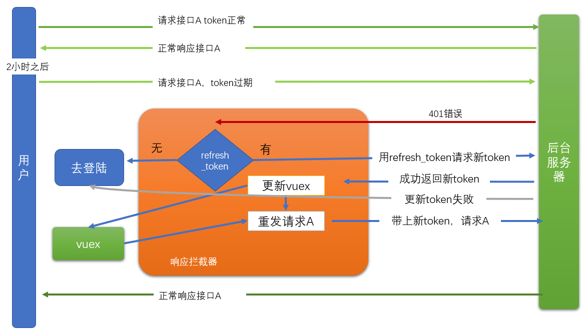

一个项目有很多个页面，有些页面是需要有**权限**的用户才有访问的。例如：修改密码这个页面，肯定只能是登陆用户才能访问。


当我们发现一个没有登陆的用户试图去访问一个需权根的页面时，我们应该把它引导到登陆界面，当用户完成登陆操作之后，再跳回到他之间访问的页面。


## 全局前置路由守卫

在router/index.js中补充一个前置路由守卫

```javascript
// 路由守卫
// 在路由变化时，这个回调函数就会执行
// localhost:8080/#/a   ----------->  localhost:8080/#/b
router.beforeEach(function (to, from, next) {
  console.log('路由变化了', to, from, next)
  // to: 去到哪里？ /b
  // from: 从哪里来？ /a
  // next: 是一个函数，用来自定义路由的跳转
  //  (1) next() 表示放行，让路由从from进入到to
  //  (2) next(其它路由),表示不去to，而进入指定的路由
  next()

  // 如果要去到的页面(/user, /user/chat, /user/profile) 是需要验证身份的，则先检查一下
  // startsWith检查字符串是否以某个子串开头
  if (to.path.startsWith('/user')) {
    // 这里需要先登陆才能访问
    console.log(store.state)
    if (store.state.tokenInfo.token) {
      next() // 正常放行
    } else {
      // next(登陆页)
      // 跳回login，并指定从login登陆成功之后
      // 应该进入的页面backto
      // fullPath:是路由对象的一个属性值，与path的区别在于，fullPath包含查询字符串的内容，它的信息更全一些
      // query:是一个路由对象的特殊属性，它用来指定当前查询字符串
      next({
        path: '/login',
        query: {
          backto: to.fullPath
        }
      })
    }
  }
})
```

- to     ，表示在当前路由变化时，你进入哪个路由。
- from，表示在当前路由变化时，你要离开哪个路由。
- next。必须要调用这个next()来结束对当前的动作的处置。不管你决定这个路由跳转应该如何处理，但一定要给一个处理结果。（这个过程就像是express框架中的res.end()一样）
  - next() // 放行
  - next(false) // 不让跳，回到from
  - next(路由) 进入指定路由
    - next({path:, name:, ....})


在login/index.vue 中要改进一下跳转的目标

```
// 用户跳转
// 根据当前路由参数，决定跳到哪里去
const backto = this.$route.query.backto || '/'
this.$router.push(backto)
```


## token过期处理

### token过期

你登陆成功之后，接口会返回一个token值，这个值在后续请求时带上（就像是开门钥匙）。但是，这个值一般会有有效期（具体是多长，是由后端决定），在我们的项目中，这个有效期是2小时。

如果，上午8点登陆成功，到了10：01分，则token就会失效，再去发请求时，就会报401错误。


### 目标

 通过axios响应拦截器来处理token过期的问题，让整个过程，用户无感（用户根本就不会感知到token失效的问题）。

### 思路

当用户登陆成功之后，返回的token中有两个值，说明如下：


- token:
  - 作用：在访问一些接口时，需要传入token，就是它。
  - 有效期：2小时。

- refresh_token
  - 作用: 当token的有效期过了之后，可以使用它去请求一个特殊接口（这个接口也是后端指定的，明确需要传入refresh_token），并返回一个新的token回来（有效期还是2小时），以替换过期的那个token。
  - 有效期：14天。（最理想的情况下，一次登陆可以持续14天。）




request的[响应拦截器](https://www.npmjs.com/package/axios#interceptors)中：

- 对于某次请求A，如果是401错误
  - 有refresh_token，用refresh_token去请求回新的token
    - 新token请求成功
      - 更新本地token
      - 再发一次请求A
    - 新token请求失败
      - 清空vuex中的token
      - 携带请求地址，跳转到登陆页
  - 没有refresh_token
    - 清空vuex中的token
    - 携带请求地址，跳转到登陆页


### 代码

在src\utils\request.js中，补充响应拦截器

```javascript
// 引入路由，需要用它来做路由跳转
import router from '@/router/index.js'


// 从后端回来的响应，到先到响应拦截器 --- 统一处理401，token过期问题
instance.interceptors.response.use(function (response) {
  return response
}, async function (error) {
  console.dir('响应拦截器的：error')
  if (error.response && error.response.status === 401) {
    // 发生了token失效（或者是没有传入）
    const refreshToken = store.state.tokenInfo.refresh_token
    // 1. 检查是否有 refresh_token
    if (refreshToken) {
      try {
        // 1） 用refresh_token再发请求，重新取一个新的有效期为2小时的token
        const result = await axios({
          method: 'PUT',
          url: 'http://ttapi.research.itcast.cn/app/v1_0/authorizations',
          headers: {
            Authorization: `Bearer ${refreshToken}`
          }
        })
        console.log('用refresh_token取回来的新token', result)
        const newToken = result.data.data.token
        // 2） 更新vuex
        store.commit('mSetTokenInfo', {
          refresh_token: refreshToken,
          token: newToken
        })

        // 使用新token,重发请求
        // 3） 重新使用我们之间创建的axios实例，用本次错误请求中的配置项，再发一次
        return instance(error.config)
      } catch {
        console.log('使用refresh_token获取新token失败')

        // 路由跳转，进入登陆页
        router.push({
          path: '/login',
          query: {
            // currentRoute：表示当前路由
            backto: router.currentRoute.fullPath
          }
        })
      }
    } else {
      console.log('router.currentRoute', router.currentRoute)
      // 路由跳转，进入登陆页
      router.push({
        path: '/login',
        query: {
          // currentRoute：表示当前路由
          backto: router.currentRoute.fullPath
        }
      })
    }
  }
  return Promise.reject(error)
})

```

注意：

1. 响应拦截器要加在axios实例 instance上。
2. 用refresh_token请求新token时，要用axios，不要用实例intance
3. 得到新token之后，再发请求时，要用 instance实例

### 调试技巧


## 特殊跳转处理

背景描述：

1. 用户在没有登录的情况下，查看某个文章详情页

2. 在详情页中点击**关注**，会出401错误，被拦截器处理，回到登录页

3. 在登陆页正常登陆，成功之后，会再次进入详情页。


问题：

​	如果此时，点击详情页中后页按钮，则会回到： 登陆页。再次从登陆页，登陆时，又回到详情页。如此反复，无法回到主页！


解决方案：

在/article/:id中，当出现路由跳转时，如果发现你现在是登陆状态，则要从article/:id离开进入login，则更改去向，让你去到主页。

在article/index.vue中，添加路由的钩子函数：

```
beforeRouteLeave (to, from, next) {
    console.log('你现在在文章详情页，你将要离开这个页面')
    console.log(to, from)
    if (to.path === '/login' && this.$store.state.tokenInfo.token) {
      next({ path: '/' })
    } else {
      next()
    }
  },
```

