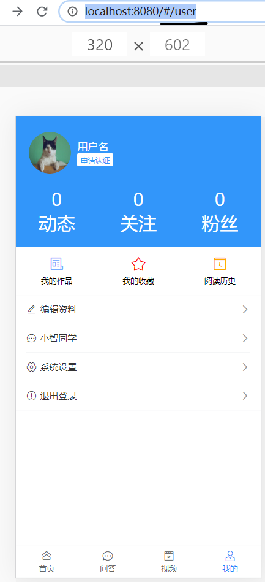
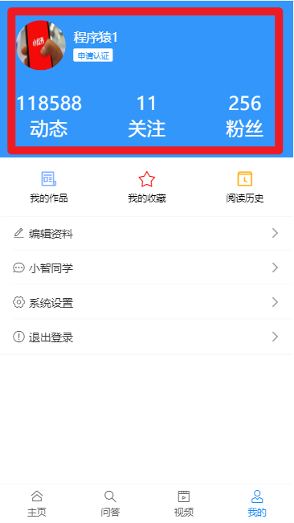
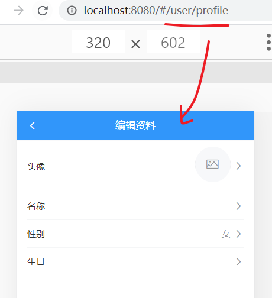
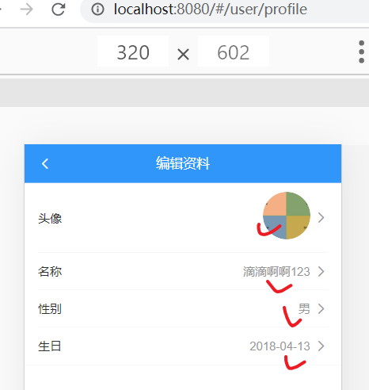

个人中心

## 基础布局

src/views/user/index.vue

### 结构

```html
<template>
  <div class="container">
    <!-- 用户个人资料 -->
    <div class="user-profile">
      <div class="info">
        <van-image round src="https://img.yzcdn.cn/vant/cat.jpeg" />
        <h3 class="name">
          用户名
          <br />
          <van-tag size="mini">申请认证</van-tag>
        </h3>
      </div>
      <van-row>
        <van-col span="8">
          <p>0</p>
          <p>动态</p>
        </van-col>
        <van-col span="8">
          <p>0</p>
          <p>关注</p>
        </van-col>
        <van-col span="8">
          <p>0</p>
          <p>粉丝</p>
        </van-col>
      </van-row>
    </div>

    <!-- 操作链接 -->
    <van-row class="user-links">
      <van-col span="8">
        <van-icon name="newspaper-o" color="#7af" />我的作品
      </van-col>
      <van-col span="8">
        <van-icon name="star-o" color="#f00" />我的收藏
      </van-col>
      <van-col span="8">
        <van-icon name="tosend" color="#fa0" />阅读历史
      </van-col>
    </van-row>

    <!-- 编辑入口 -->
    <van-cell-group class="user-group">
      <van-cell icon="edit" title="编辑资料" to="/user/profile" is-link />
      <van-cell icon="chat-o" title="小智同学" to="/user/chat" is-link />
      <van-cell icon="setting-o" title="系统设置" is-link />
      <van-cell icon="warning-o" title="退出登录" to="/login" is-link />
    </van-cell-group>
  </div>
</template>

<script>
export default {
  name: 'UserIndex',
  data () {
    return {

    }
  }
}
</script>

<style lang="less" scoped>
.user {
  &-profile {
    width: 100%;
    height: 200px;
    display: block;
    background: #3296fa;
    color: #fff;
    .info {
      display: flex;
      padding: 20px;
      align-items: center;
      .van-image{
        width: 64px;
        height: 64px;
      }
      .name {
        font-size: 16px;
        font-weight: normal;
        margin-left: 10px;
      }
      .van-tag {
        background: #fff;
        color: #3296fa;
      }
    }
    p{
      margin: 0;
      text-align: center;
    }
  }
  &-group {
    margin-bottom: 15px;
  }
  &-links {
    padding: 15px 0;
    font-size: 12px;
    text-align: center;
    background-color: #fff;
    .van-icon {
      display: block;
      font-size: 24px;
      padding-bottom: 5px;
    }
  }
}
</style>

```

### 修改layout.vue

修改layout.vue中的nav-bar的显示 ： 如果在/user页面中， 则隐藏搜索导航区域。

```
<!-- 顶部logo搜索导航区域
    如果当前是在"我的" 页面，则不要出现搜索导航区域
    只有当前页面不是“我的”，它才显示出来
    -->
    <van-nav-bar
      fixed
      v-show="$route.path !== '/user'"
     >
```

### 效果



## 数据渲染

目标：从接口中取出数据来，显示在页面上。

步骤：

- 封装接口方法

- 调用 方法

- 数据绑定

  

定义API `src/api/user.js`

```js
/**
 * 获取用户自已的信息
 */
export const getInfo = () => {
  return ajax({
    method: 'GET',
    url: '/app/v1_0/user'
  })
}

```

调用 方法获取个人信息

src\views\user\index.vue中

- 引入方法
- 定义数据项
- 在created时，调用方法，保存数据

```js
import { getInfo } from '@/api/user.js'
export default {
  name: 'UserIndex',
  data () {
    return {
      user: {}
    }
  },
  created () {
    this.loadInfo()
  },
  methods: {
    async loadInfo () {
      const result = await getInfo()
      console.log(result)
      this.user = result.data.data
    }
  }
}
```

渲染组件：

```html
<!-- 用户个人资料 -->
<div class="user-profile">
      <div class="info">
        <van-image round :src="user.photo" />
        <h3 class="name">
          {{user.name}}
          <br />
          <van-tag size="mini">申请认证</van-tag>
        </h3>
      </div>
      <van-row>
        <van-col span="8">
          <p>{{user.art_count}}</p>
          <p>动态</p>
        </van-col>
        <van-col span="8">
          <p>{{user.follow_count}}</p>
          <p>关注</p>
        </van-col>
        <van-col span="8">
          <p>{{user.fans_count}}</p>
          <p>粉丝</p>
        </van-col>
      </van-row>
    </div>
```

### 效果



## 退出登录

**绑定事件**

```html
 <!-- 你再玩一会吧，大爷-->
 <van-cell icon="warning-o" title="退出登录" @click="hLogout" is-link />
```

**补充vuex中的mutation**

在src\store\index.js中, 添加一个mutations

```
import { setItem, getItem, removeItem } from '@/utils/storage.js'

// 清除token
    mClearTokenInfo (state) {
      state.tokenInfo = {}
      // 把token信息持久化到localstorage中
      removeItem('tokenInfo')
    }
```

**在组件中view/user/index.vue**

通过map的方式来调用mutation。

```js
import { mapMutations } from 'vuex'
```

```js
methods: {
    ...mapMutations(['mClearTokenInfo']),
    hLogout () {
      // 确认退出吗？
      // vant组件库提供的功能
      this.$dialog.confirm({
        title: '系统提示',
        message: '确定要退出吗？'
      })
        .then(() => {
          // 确定
          // 1. 清除token信息。保存在vuex中，要修改vuex中的数据，我们应该要通过mutation来操作
          this.mClearTokenInfo()
          // 2. 回去登陆页
          this.$router.push('/login')
        })
        .catch(() => {
          // 就算你对取消操作不做任何处理，也需要保留catch。
          // 如果删除了catch，则点击确认对话框中的取消时，会抛出promise的错误
        })
    }
  }
```


## 编辑个人资料

由于编辑工作比较麻烦，所以单独设置一个页面级的组件。它是一个新的一级路由

```
user/index.vue
+user/profile.vue #个人资料
```


### 创建组件

src/views/user/profile.vue

### 添加路由

```
  {
    path: '/user/profile',
    name: 'userProfile',
    component: () => import('@/views/user/profile.vue')
  }
```


### 基础布局

静态结构：

```html
<template>
  <div class="container">
    <!-- 导航条 -->
    <van-nav-bar left-arrow @click-left="$router.back()" title="编辑资料"></van-nav-bar>

    <!-- 编辑区 -->
    <van-cell-group>
      <van-cell is-link title="头像"  center>
        <van-image
          slot="default"
          width="1.5rem"
          height="1.5rem"
          fit="cover"
          round
          :src="user.photo"
        />
      </van-cell>

      <van-cell is-link title="名称" :value="user.name" @click="showName=true"/>

      <van-cell is-link title="性别" :value="user.gender === 1?'男':'女'" @click="showGender=true"/>

      <van-cell is-link title="生日" :value="user.birthday" @click="showBirthday=true"/>
    </van-cell-group>
  </div>
</template>

<script>
export default {
  name: 'userProfile',
  data () {
    return {
      // 控制弹层
      showName: false,
      showGender: false,
      showBirthday: false,

      // 当前用户的信息
      user: {},

      // 修改后的新名字
      newName: '',
      // 修改后新生日
      newDate: new Date(),
      minDate: new Date(1965, 0, 10), // dateTime-picker中最小时间
      maxDate: new Date() // 当前时间
    }
  }
}
</script>

```

### 测试效果



### 获取数据并渲染

准备api，在api/user.js中，添加一个如下 的接口

```javascript
/**
 * 获取用户个人信息
 */
export const userGetInfo = () => {
  return ajax({
    method: 'get',
    url: '/app/v1_0/user/profile'
  })
}

```

在user/profile.vue中

**引入api**

```
import { userGetInfo } from '@/api/user.js'
```

**调用api**

```
created () {
    this.loadProfile()
  },
  methods: {
    async loadProfile () {
      const result = await getProfile()
      console.log(result)
      this.user = result.data.data
    }
  }
```

渲染数据

```
<van-cell-group>
      <van-cell is-link title="头像"  center>
        <van-image
          slot="default"
          width="1.5rem"
          height="1.5rem"
          fit="cover"
          round
          :src="user.photo"
        />
      </van-cell>

      <van-cell is-link title="名称" :value="user.name" @click="showName=true"/>

      <van-cell is-link title="性别" :value="user.gender === 1?'男':'女'" @click="showGender=true"/>

      <van-cell is-link title="生日" :value="user.birthday" @click="showBirthday=true"/>
    </van-cell-group>
```

### 效果



## 编辑个人资料-姓名


### 思路

在点击了名字项后，在van-dialog弹层出来，进行修改。

### 添加弹层结构

- 添加popup
- 添加数据项控制弹层显示
- 添加click，实现基本效果

```html
<!-- 修改名字  -->
      <van-dialog
        v-model="showName"
        title="修改名字"
        show-cancel-button
        @confirm="hSaveName">
        <van-field v-model.trim="newName" />
      </van-dialog>
    </van-cell-group>
```


### 准备api

api/user.js,添加接口

```javascript

/**
 * 修改个人信息
 * @param {*} obj
 * obj {
 *   name: 名字
 *   gender： 性别: 男(0), 女(1)
 *   birthday: 2018-12-20
 * }
 */
export const updateUserInfo = obj => {
  return ajax({
    method: 'PATCH',
    url: '/app/v1_0/user/profile',
    data: obj
  })
}
```

### 调用

在view/user/profile.vue中，调用上面的接口，实现功能。

引入方法 

```
import { getInfo, updateUserInfo } from '@/api/user'
```

完成确认修改的函数

```javascript
// 保存用户的新名字
    async hSaveName () {
      // 1. 判断不能为空
      if (this.newName === '') {
        return
      }

      if (this.newName.length > 7) {
        this.$toast.fail('名字长度不能超过7个字符')
        return
      }

      this.$toast.loading({
        duration: 0, // 持续展示 toast,永远不会关闭
        overlay: true, // 整体添加一个遮罩
        message: '操作中...'
      })

      try {
        // 2. 调用api,更新名字
        const result = await updateUserInfo({
          name: this.newName
        })
        console.log(result)
        // 3. 更新视图
        this.user.name = this.newName
        this.newName = ''
        this.$toast.success('修改成功')
      } catch {
        this.$toast.fail('修改失败')
      }
    }
```


## 编辑个人资料-性别

弹层

```html
<!-- 修改性别 -->
      <van-popup v-model="showGender" position="bottom">
        <van-nav-bar title="修改性别" left-text="取消" @click-left="showGender=false">
        </van-nav-bar>
        <van-cell title="男" @click="hSaveGender(0)" is-link></van-cell>
        <van-cell title="女" @click="hSaveGender(1)" is-link></van-cell>
      </van-popup>
```

> 后端的接口有问题，在修改性别时，它不能正确保存

```
async hSaveGender (val) {
      this.$toast.loading({
        duration: 0, // 持续展示 toast,永远不会关闭
        overlay: true, // 整体添加一个遮罩
        message: '操作中...'
      })

      try {
        // 2. 调用api,更新性别
        const result = await updateUserInfo({
          gender: val
        })
        console.log(result)
        // 3. 更新视图
        this.user.gender = val
        this.showGender = false
        this.$toast.success('修改成功')
      } catch {
        this.$toast.fail('修改失败')
        this.showGender = false
      }
    }
```


## 编辑个人资料-生日

使用[datetime-picker](https://youzan.github.io/vant/#/zh-CN/datetime-picker#xuan-ze-ri-qi-nian-yue)组件来提供用户选择新的日期时间。

-        @cancel = "isShowBirthday=false"
        @confirm="hChangeBirthday"


日期组件中的格式是日期格式的，而接口中要的日期格式是字符串格式的'YYYY-MM-DD'，可以引入dayjs 来做个格式化。

```html
<!-- 修改生日 -->
      <van-popup v-model="showBirthday" position="bottom">
        <van-nav-bar title="修改生日">
        </van-nav-bar>
        <!-- min-date：  dateTime-picker中最小时间 -->
        <van-datetime-picker
          v-model="newDate"
          type="date"
          title="选择年月日"           
          @cancel="showBirthday=false"
          @confirm="hSaveBirthday"
          :min-date="minDate"
          :max-date="maxDate"
        />
      </van-popup>
```

准备数据项

```
newDate: new Date(), // 修改后新生日
minDate: new Date(1990, 0, 10), // dateTime-picker中最小时间
maxDate: new Date() // 当前时间
```


代码

- 引入dayjs来做格式化。

  `import dayjs from 'dayjs'`

```
async hSaveBirthday (val) {
      // console.log(val)
      // https://day.js.org/docs/zh-CN/display/format
      // console.log(dayjs(val).format('YYYY-MM-DD'))

      // 现在拿到的格式是：2020-06-14T16:00:00.000Z

      // 接口中需要的格式是： 2018-12-20
      // 需进行日期时间的格式转换
      val = dayjs(val).format('YYYY-MM-DD')
      this.$toast.loading({
        duration: 0, // 持续展示 toast,永远不会关闭
        overlay: true, // 整体添加一个遮罩
        message: '操作中...'
      })

      try {
        // 2. 调用api,更新生日
        const result = await updateUserInfo({
          birthday: val
        })
        console.log(result)
        // 3. 更新视图
        this.user.birthday = val
        this.showBirthday = false
        this.$toast.success('修改成功')
      } catch {
        this.$toast.fail('修改失败')
        this.showBirthday = false
      }
    }
```


## 编辑个人资料-头像

> 本质就是上传一张新的图片到服务器，以替换之前头像文件。
>
> 调用接口，上传头像文件

思路：

- 移花接木。创建一个隐藏的文件域： input type="file"  hidden 。当用户点击图像时，主动去调用文件域的click，呼出选择文件的对话框。
- 创建接口，注意接口的格式是formData。


### 结构

补充一个`input type="file"`,让它隐藏起来。

```diff
<van-cell-group>
      <!-- 当用户在文件域中进行选择时，会触发change事件
       hidden: 隐藏。它用来隐藏input元素。元素将不可见，也不占用页面的空间
       ref="refPhoto": 添加ref为了通过引用来访问这个dom元素  -->

+      <input type="file" hidden @change="hPhotoChange" ref="refPhoto"/>
      <!-- 在头像上的点击操作：打开input文件域的弹窗。其实就相当于在 input type="file" 上点击 -->
      <van-cell is-link title="头像"  center @click="hShowSelectImage">
        <van-image
          slot="default"
          width="1.5rem"
          height="1.5rem"
          fit="cover"
          round
          :src="user.photo"
        />
      </van-cell>
```


### 封装API

查询接口文档(编辑用户照片资料（头像、身份证照片）)，在 src/api/user.js中添加接口：

```js
/**
 * 修改用户头像
 * @param {*} obj 以formData格式保存参数
 */
export const updatePhoto = obj => {
  return ajax({
    method: 'PATCH',
    url: '/app/v1_0/user/photo',
    data: obj
  })
}
```


### 代码

- 在头像点击时，去模拟input type="file" 的点击
- input type="file" 去监听change事件
- 在回调中去上传头像

```
<van-cell is-link title="头像"  center @click="hShowSelectImage">
```


```javascript
hShowSelectImage () {
    // 用户在头像上点击，就相当于要在input上点击
    this.$refs.refPhoto.click()
}

async hPhotoChange () {
    // 1. 获取当前用户选中的图片文件
    // this.$refs.refPhoto就是页面上的input文件域。
    // 它有一个属性files，是一个集合，其中就放置着当前用户选中的文件
    const file = this.$refs.refPhoto.files[0]
    if (!file) {
        // 表示用户没有弹出的选择框中选中任何文件： 用户点击了取消
        return
    }
    this.$toast.loading({
        duration: 0, // 持续展示 toast,永远不会关闭
        overlay: true, // 整体添加一个遮罩
        message: '操作中...'
    })
    try {
        // 1. 组装参数
        const fd = new FormData()
        fd.append('photo', file)
        // 2. 调用接口
        const result = await updatePhoto(fd)
        // 调用接口成功时，它会返回这张图在服务器上的绝对地址
        // 3. 更新视图
        this.user.photo = result.data.data.photo

        this.$toast.success('修改成功')
    } catch {
        this.$toast.fail('修改失败')
    }
}
```


