小智同学

目标

- 掌握webscoket的基本使用
- 完成小智同学的功能


## 功能演示

小智同学：与机器人聊天的功能

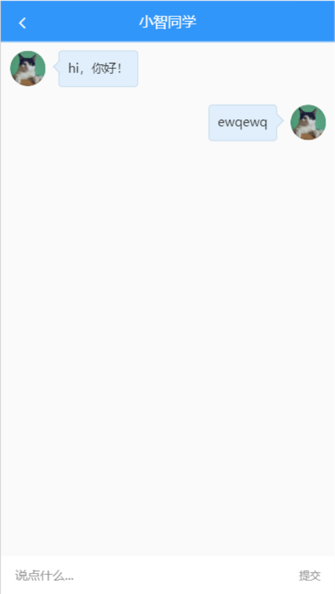


## 组件及路由配置

### 创建组件

单独创建一个组件（chat.vue）及对应的路由来实现与小智的聊天功能。

```bash
user/index.vue
user/profile.vue
user/chat.vue ##
```

内容只先写入最简单的信息。

```
<template>
	<div>
		XXX聊天室
	</div>
</template>
```


### 配置路由

在router/index.js中添加路由：

```
import Chat from '@/views/user/chat'

[
  //...
    {
    path: '/user/chat',
    name: 'chat',
    component: Chat
  }
]
```

### 测试

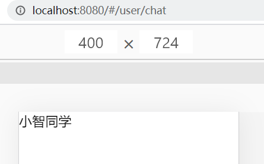

## 组件结构及样式

```html
<template>
  <div class="container">
    <!-- 固定导航 -->
    <van-nav-bar fixed left-arrow @click-left="$router.back()" title="小智同学"></van-nav-bar>

    <!-- 聊天主体区域 -->
    <div class="chat-list">
      <!-- 左侧是机器人小智 -->
      <div class="chat-item left">
        <van-image fit="cover" round src="https://img.yzcdn.cn/vant/cat.jpeg" />
        <div class="chat-pao">hi，你好！我是小智</div>
      </div>

      <!-- 右侧是当前用户 -->
      <div class="chat-item right">
        <div class="chat-pao">我是编程小王子</div>
        <van-image  fit="cover" round src="https://img.yzcdn.cn/vant/cat.jpeg" />
      </div>
    </div>

    <!-- 对话区域 -->
    <div class="reply-container van-hairline--top">
      <van-field v-model.trim="word" placeholder="说点什么...">
        <span  @click="send()" slot="button" style="font-size:12px;color:#999">提交</span>
      </van-field>
    </div>
  </div>
</template>

<script>
export default {
  name: 'UserChat',
  data () {
    return {
      word: ''
    }
  },
  methods: {
    send () {
      console.log(this.word)
    }
  }
}
</script>

<style lang="less" scoped>
.container {
  height: 100%;
  width: 100%;
  position: absolute;
  left: 0;
  top: 0;
  box-sizing: border-box;
  background:#fafafa;
  padding: 46px 0 50px 0;
  .chat-list {
    height: 100%;
    overflow-y: scroll;
    .chat-item{
      padding: 10px;
      .van-image{
        vertical-align: top;
        width: 40px;
        height: 40px;
      }
      .chat-pao{
        vertical-align: top;
        display: inline-block;
        min-width: 40px;
        max-width: 70%;
        min-height: 40px;
        line-height: 38px;
        border: 0.5px solid #c2d9ea;
        border-radius: 4px;
        position: relative;
        padding: 0 10px;
        background-color: #e0effb;
        word-break: break-all;
        font-size: 14px;
        color: #333;
        &::before{
          content: "";
          width: 10px;
          height: 10px;
          position: absolute;
          top: 12px;
          border-top:0.5px solid #c2d9ea;
          border-right:0.5px solid #c2d9ea;
          background: #e0effb;
        }
      }
    }
  }
}
.chat-item.right{
  text-align: right;
  .chat-pao{
    margin-left: 0;
    margin-right: 15px;
    &::before{
      right: -6px;
      transform: rotate(45deg);
    }
  }
}
.chat-item.left{
  text-align: left;
  .chat-pao{
    margin-left: 15px;
    margin-right: 0;
    &::before{
      left: -5px;
      transform: rotate(-135deg);
    }
  }
}
.reply-container {
  position: fixed;
  left: 0;
  bottom: 0;
  height: 44px;
  width: 100%;
  background: #f5f5f5;
  z-index: 9999;
}
</style>

```

### 效果

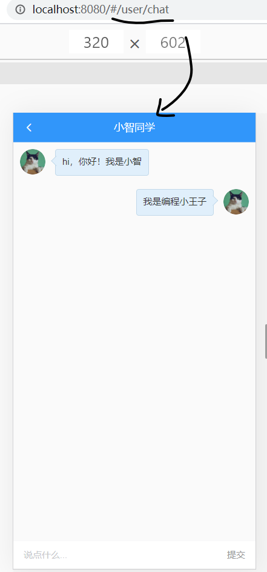


## 正确显示用户头像

目标：

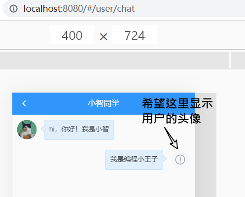

	- 在聊天界面中正确显示当前用户的头像

思路：

​	在进入本页面之前，用户肯定已经成功登陆过的，所以，我们可以在之前某个时刻把用户的信息（姓名，头像地址,id...）提前保存在vuex中，然后在这里从vuex中取出即可。

步骤：

- 在vuex中补充一个mutation用于保存用户信息
- 在登陆系统（或者是进入个人主页）时调用这个mutation来保存信息
- 在本页面中引用


### 设置vuex-提供mutation 

在src/store/index.js中，做两件事：

- 添加state
- 添加mutation

```diff
// 保存公共数据
  state: {
    // tokenInfo的值是先从本地存储中取，取不到就用{}
    tokenInfo: getItem('tokenInfo') || {},
    // 保存用户的三个信息：id, name, photo
+    userInfo: getItem('userInfo') || {}
  },
  mutations: {
    // 设置mutation来更新userInfo
+    mSetUserInfo (state, userObj) {
      // 1. 保存到vuex
      state.userInfo = userObj
      // 2. 做持久化 -- 保存到localstorage
      setItem('userInfo', userObj)
    },

    // 设置mutation来更新userInfo中的头像信息
+    mSetUserPhoto (state, photo) {
      // 1. 保存到vuex
      state.userInfo.photo = photo
      // 2. 做持久化 -- 保存到localstorage
      setItem('userInfo', state.userInfo)
    }
  }
```

### 调用mutation

有如下三个场合需要去保存用户信息到vuex：

- 登陆成功
- 进入个人主页
- 修改头像

**登陆成功**

```diff
async hLogin () {
      console.log(this.mobile, this.code)
      // 1. 检验
      // 验证用户输入数据的有效性。
      //  (1) 自己写判断
      if (!this.check()) {
        console.log('没有通过验证')
        return
      }
      //  (2) 可以采用vant中的form组件，自带的检验（作业）
      //   参考：https://vant-contrib.gitee.io/vant/#/zh-CN/form#xiao-yan-gui-ze

      // 提示登陆中
      this.$toast.loading({
        duration: 0, // 永远不会关闭
        mask: true,
        message: '登陆中....'
      });
      // 2. 发请求.根据接口文档说明
      try {
        const result = await login(this.mobile, this.code)
        // 登陆成功之后，后端返回的数据
        // 1. 保存token 到vuex (所有的组件都可以访问这个数据)
        //    在组件中如何去调用mutation?(1) mapMutations,(2)$store.commit
        // console.log(result.data.data)
        this.$store.commit('mSetTokenInfo', result.data.data)

        // 2. 再发请求获取个人信息
+        const res = await getInfo()
+        console.log(res)
+        const user = res.data.data
        // 保存到vuex
+        this.$store.commit('mSetUserInfo', {
          id: user.id,
          name: user.name,
          photo: user.photo
        })

        // 覆盖上一个toast提示
        // 会在3s之后关闭
        this.$toast.success('登陆成功')
        // todo 登陆成功，跳转
        const backto = this.$route.query.backto || '/'
        this.$router.push(backto)
      } catch (err) {
        console.log(err)
        this.$toast.fail('登陆失败')
      }
    }
```


**进入个人主页**

在user/index.vue中，当成功获取数据之后，把头像地址保存起来：

```javascript
async loadInfo () {
      this.$toast.loading({
        duration: 0, // 永远不会关闭
        mask: true,
        message: '加载中....'
      })
      try {
        const result = await getInfo()
        console.log(result)
        this.user = result.data.data

        // 保存到vuex
+       this.$store.commit('mSetUserInfo', {
+          id: this.user.id,
+          name: this.user.name,
+          photo: this.user.photo
        })

        this.$toast.success('获取成功')
      } catch {
        this.$toast.fail('获取失败')
      }
    }
```

**修改头像**

在user/profile.vue中修改头像时，也去更新一下

```diff
// 用户选择头像
    async hPhotoChange () {
      // 1. 获取当前的头像文件
      // console.dir(this.$refs.refPhoto)
      // this.$refs.refPhoto 获取当前的dom对象。
      // files: 这个input文件域有一个属性名是files，其中保存是的当前
      // 用户选择的所有的文件。由于这里只是一个单选，则选中的文件一定放在下
      // 标为0的位置
      const file = this.$refs.refPhoto.files[0]
      if (!file) {
        return
      }
      this.$toast.loading({
        duration: 0, // 永远不会关闭
        mask: true,
        message: '操作中....'
      })
      try {
        // 2. 调用接口向服务器传
        // (1) 由于上传是文件，需要用FormData动态构建参数
        const fd = new FormData()
        fd.append('photo', file)
        // (2) 调用接口发请求
        const result = await updatePhoto(fd)
        // const result = await updatePhoto({ photo: file })  // 错误的写法
        // 3. 更新视图
        this.user.photo = result.data.data.photo

        // 4. 保存到vuex
+        this.$store.commit('mSetUserPhoto', this.user.photo)

        this.$toast.success('修改头像成功')
      } catch {
        this.$toast.fail('修改头像失败')
      }
    }
```

### 获取state中的头像

第三步：在user/chat.vue中使用vuex中的photo

```diff
<!-- 右侧是当前用户 -->
      <div class="chat-item right">
        <div class="chat-pao">我是编程小王子</div>
        <van-image  fit="cover" round
+        :src="$store.state.userInfo.photo"
        />
      </div>
```


效果：

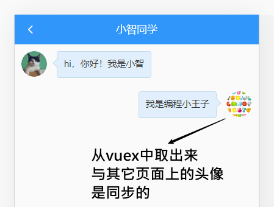

## 约定聊天数据并渲染

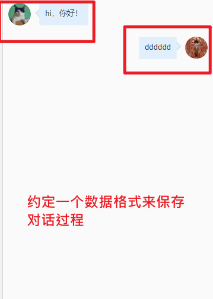

### 聊天对话数据

```
return {
      list: [ // 对话记录
        { name: 'xz', msg: '你好，我是无所不知的小智同学！', timestamp: Date.now() },
        { name: 'me', msg: '小智同学, 请问你知道你不知道什么吗？', timestamp: Date.now() },
        { name: 'xz', msg: '我有点晕了', timestamp: Date.now() }
      ],
      word: ''
    }
```

name:xz: 表示是机器人。

name:me 表示当前用户。


### 用list渲染视图

左侧是小智，右侧是用户

```
<!-- 聊天主体区域 -->
    <div class="chat-list">
      <div class="chat-item"
        v-for="item in list"
        :key="item.timestamp"
        :class="item.name==='xz' ? 'left':'right'"
      >
        <!-- template这个组件的作用：是在逻辑上形成一个整体，在实际渲染时，它并不会呈现为任意的dom元素 -->
        <!-- 充当一个想象的div -->
        <template v-if="item.name==='xz'">
          <van-image fit="cover" round src="https://img.yzcdn.cn/vant/cat.jpeg" />
          <div class="chat-pao">{{item.msg}}</div>
        </template>
        <template v-else>
          <div class="chat-pao">{{item.msg}}</div>
          <van-image fit="cover" round :src="$store.state.userInfo.photo"/>
        </template>
      </div>
    </div>
```

效果：

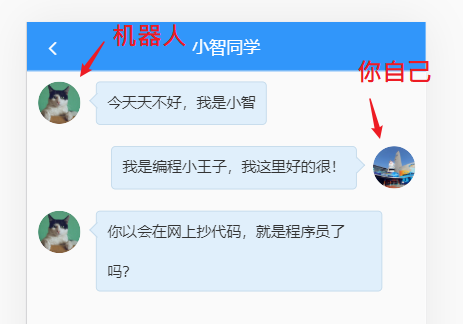

到此为止，我们已经实现了整个功能页面的静态效果。接下来的事情就是去把静态页面做活:

- 调用接口去获取数据
- 1. 向小智同学发消息
- 2. 从小智同学处获取回复

- 3. 重复1,2。


## 为什么ajax不方便实现这类实时聊天效果

ajax是遵守http协议的，而http协议有一个典型的特点是：通信只能是由客户端发起，服务器端收到请求后，给予响应。这就是我们常说的，请求响应。

但是，它有不足之处： 服务器不能通过http协议主动向客户端发信息。


假定你是客户端，你和一个妹子通过http协议交往。那你们的对话可能是这样：

```
你：你吃饭了吗？
                                                          妹子： 吃了。
你：今天过的好不？	
																											    妹子： 好。
你：你在哪里？
                                                          妹子： 我在家
```

妹子是服务器，你是客户端，所有的对话过程全**由你发起**，一问一答，一次请求对应一响应。


举个例子：你要开发一个网站，在这个网页上和女神聊天。

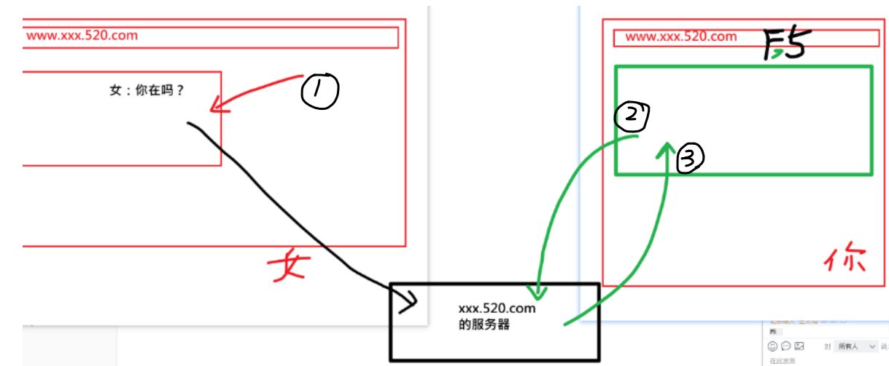


由于http只能由客户端发起请求，所以，如果你希望及时接到对方给你的留言，则必须不断去请求是否有新数据：

- 不断手动刷新页面，重新发ajax请求。

- **轮询**（用一个定时器，去不断发ajax请求，取最新的数据....）

  ```
  setInterval(()=>{
    // 每隔0.1秒去发ajax
    ajax({
        // ....... 
    }})
  
  },100)
  ```

## webSocket 介绍

web:网页

socket: 套接字

>  WebSocket 协议在2008年诞生，2011年成为国际标准。
>
>  WebSocket 是一种数据通信协议，类似于我们常见的 http 协议。它的最大特点就是，服务器可以**`主动向客户端推送信息`**，客户端也可以主动向服务器发送信息，是真正的双向平等对话。


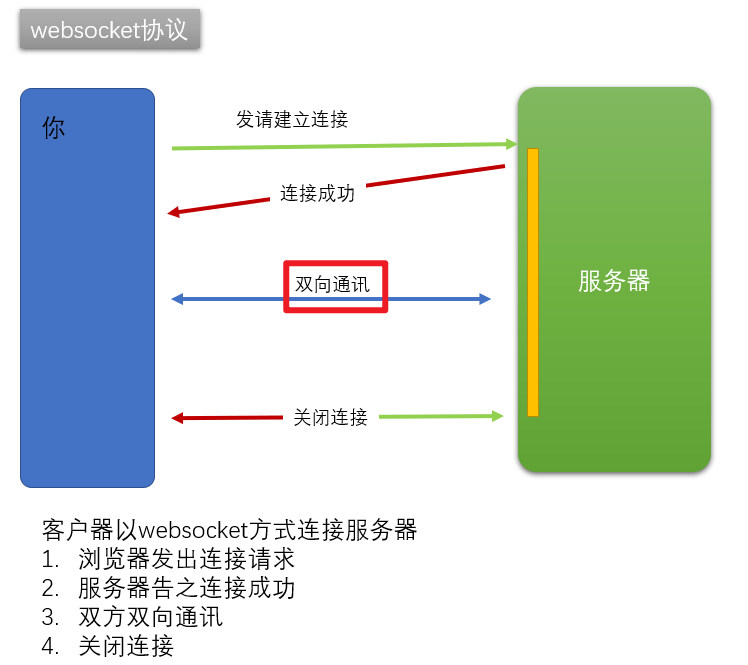


## WebSocket-使用原生对象

浏览器为 HTTP 通信提供了 XMLHttpRequest 对象，同样的，也为 WebSocket 通信提供了一个操作内置对象：WebSocket，我们可以通过WebSocket对象来与服务器建立连接。

通信模型：

- 拨号（建立连接）  
  - 建立与服务器(**`连接地址`**)的连接  
- 通话（双向通信)
  - 相互通话
- 结束通话（关闭连接）


**核心api**

|      | ajax                  | websocke                      |
| ---- | --------------------- | ----------------------------- |
| 实例 | new XMLHttpRequest()  | new WebSocket                 |
|      | xhr.open()            | xhr.onopen=function(){}       |
|      | xhr.send()            | ws.send()                     |
|      | xhr.onload=function() | ws.onmessage = function () {} |
|      |                       | ws.onclose=function(){}       |


```bash
# 打开websocket连接
// WebSocket 是浏览器的内置对象
var ws = new WebSocket('wss://echo.websocket.org') // 建立与服务端地址的连接

# 如果与服务器建立连接成功, 调用 websocket实例的 回调函数 onopen
ws.onopen = function () {
    // 如果执行此函数 表示与服务器建立关系成功
}

# 发送消息
ws.send('消息')

# 接收消息
ws.onmessage = function (event) {
    // event中的data就是服务器发过来的消息
}

# 关闭连接成功
ws.onclose = function () {
    // 关闭连接成功
}
ws.close() // 关闭
```


代码体验：

```html
<!DOCTYPE html>
<html lang="en">
<head>
    <meta charset="UTF-8">
    <meta name="viewport" content="width=device-width, initial-scale=1.0">
    <title>体验websocket</title>
    <style>
        #contanier {
            width: 500px;
            height: 400px;
            border: 2px dashed #7575e7;
            overflow-y: auto;
        }
    </style>
</head>
<body>
    <div id="contanier"></div>
    <!-- 1  建立连接 (拨号) -->
    <!-- 2  发消息 接消息 -->
    <!-- 3  关闭连接 -->
    <input type="text" id="message">
    <button onclick="openWS()">建立连接</button>
    <button onclick="sendMessage()">发送消息</button>
    <button onclick="closeWS()">关闭连接</button>
     
    <script>
        var dom = document.getElementById("contanier")
        var inputDom = document.getElementById("message")
        var isOpen = false  // 表示是否已经建立了拨号
        var ws;  // 别的方法 也需要使用ws
           // 打开websocket连接
          var  openWS = function (){
              /// 网络上提供的一个测试websocket功能的服务器地址。
              /// 它的效果是，你向服务器发什么消息 ，它就完全回复还给你。
              ws =  new WebSocket('wss://echo.websocket.org')  // 建立与服务器的连接

              // onopen是webSocket约定事件名
              // 当本地客户端浏览器与服务器建立连接之后，就会执行onopen的回调
              ws.onopen = function (event) {
                isOpen = true
                // 建立成功
                dom.innerHTML = dom.innerHTML + `<p>与服务器成功建立连接</p>`
              }
              //   接收消息
              // onmessage是webSocket约定事件名
              // 如果从服务器上发过来了消息，则会进入onmessage的回调
              ws.onmessage = function (event) {
                  // 由于 我们先给服务器发了消息 服务器给我们回了消息
                  dom.innerHTML = dom.innerHTML + `<p style='color: blue'>服务器说:${event.data}</p>`
              }
              // onclose是webSocket约定事件名
              ws.onclose = function () {
                   // 此函数表示 关闭连接成功
                   isOpen = false // 把状态关闭掉
                   dom.innerHTML = dom.innerHTML + `<p>与服务器连接关闭</p>`
              }
          }
        //   发送消息 接收消息
          var sendMessage = function () {
            if(inputDom.value && isOpen)   {
             // 发消息 要等到 连接成功才能发 而且内容不为空

             // 发消息就是send
             ws.send(inputDom.value) // 发送消息
            //   发完之后 添加到 当前视图上
             dom.innerHTML = dom.innerHTML + `<p style='color: red'>我说:${inputDom.value}</p>`
             inputDom.value = ''
            }

          }
          // 关闭连接
          var  closeWS = function () {
              ws.close() // 关闭连接
          }
    </script>
</body>
</html>
```

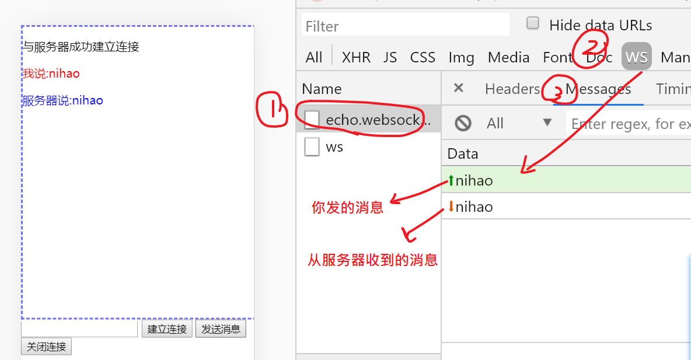

小结

- 与服务器进行通讯有两种方式：
  - 1. ajax: 请求与相应。 客户端只能是“求"， 服务器端就是"应"
    2. **w**eb**s**ocket:允许双向通信。

- WebSocket是浏览器内置一个对象（与XMLHttpRequest一样）
- 它的核心步骤：
  - 创建连接： ws = new WebSocket(''服务器的地址“)
  - 向服务器发消息：ws.send()
  - 接收服务器的消息：ws.onmessage = function(){}

## webSocket-使用socket.io框架

目标：

- 了解socket.io
- 感受一下，服务器主动给客户器发消息

> 原生的 WebSocket 使用比较麻烦，所以推荐使用一个**`封装好的解决方案`**：socket.io 。
>
> 类似于：原生的ajax使用比较麻烦，所以推荐使用jquery中的$.ajax或者是axios
>

socket.io 提供了**`服务端 + 客户端`**的实现

- 客户端：浏览器
- 服务端：Java、Python、PHP、.... Node.js

参考：

- 官网：https://socket.io/

- 代码：https://github.com/socketio/socket.io

- 官网的DEMO：https://socket.io/get-started/chat/


### 初始化

建立一个空文件夹expressSocketIO(其它名也ok)，在这个文件夹下，初始化一个项目

```bash
npm init -y # -y的目的是 快速生成一个package.json
```

​	然后安装对应的依赖

```bash
npm i express socket.io  # 安装对应的两个依赖
```

### 创建服务器代码

根目录下 创建 **`app.js`**

```bash
-package.json
-node_modules
-app.js # 服务器端代码
```

写入下方的代码

```js
var app = require('express')();
var http = require('http').createServer(app);
var io = require('socket.io')(http);

app.get('/', function(req, res){
  res.sendFile(__dirname + '/index.html');
});

io.on('connection', function(socket){
  // 主动向客户端发消息
  setInterval(() => {
    io.emit('chat message', Date.now());
  }, 1000);


  socket.on('disconnect', function(){
    console.log('user disconnected');
  });

  // 在服务器收到客户端的消息，on
  // chat message 是消息名，可以自定义
  socket.on('chat message', function(msg){
    // 一行价值100万美元的代码，可以用来实现搞笑有趣的人工智能对话
    msg =  msg.replace("你","我").replace("吗","").replace("？","!")

    // 发消息给客户端是emit
    io.emit('chat message', msg);
    
  });
});

http.listen(3000, '0.0.0.0', function(){
  console.log('listening on *:3000');
});
```

### 创建客户端代码

根目录 下 创建index.html 

```html
<!doctype html>
<html>
  <head>
    <title>Socket.IO chat</title>
    <meta charset="utf-8" >                  
    <style>
      * { margin: 0; padding: 0; box-sizing: border-box; }
      body { font: 13px Helvetica, Arial; }
      form { background: #000; padding: 3px; position: fixed; bottom: 0; width: 100%; }
      form input { border: 0; padding: 10px; width: 90%; margin-right: .5%; }
      form button { width: 9%; background: rgb(130, 224, 255); border: none; padding: 10px; }
      #messages { list-style-type: none; margin: 0; padding: 0; }
      #messages li { padding: 5px 10px; }
      #messages li:nth-child(odd) { background: #eee; }
    </style>
  </head>
  <body>
    <!-- 消息列表 -->
    <ul id="messages"></ul>

    <!-- 发送消息的表单 -->
    <form action="">
      <input id="m" autocomplete="off" /><button>Send</button>
    </form>

    <!-- SocketIO 提供了一个客户端实现：socket.io.js -->
    <script src="/socket.io/socket.io.js"></script>
    <script src="https://cdn.bootcdn.net/ajax/libs/jquery/3.5.1/jquery.min.js"></script>
    <script>
      // 建立连接，得到 socket 通信对象
      var socket = io()

      socket.on('connect', () => {
        console.log('建立连接成功了')
      })

      $('form').submit(function(e){
        e.preventDefault();
        // 用socket.io这个包发消息是emit
        // 原生的websocket是用send
        socket.emit('chat message', $('#m').val());
        $('#messages').append($('<li>').text('我说:'+$('#m').val()));
        $('#m').val('');
        return false;
      });
      // 收来服务器的消息：用on
      socket.on('chat message', function(msg){
        $('#messages').append($('<li>').text('服务器:'+msg));
      });
    </script>
  </body>
</html>
```

### 启动并测试项目 

```bash
$  node app.js  #启动创建好的项目
```

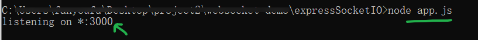

访问效果

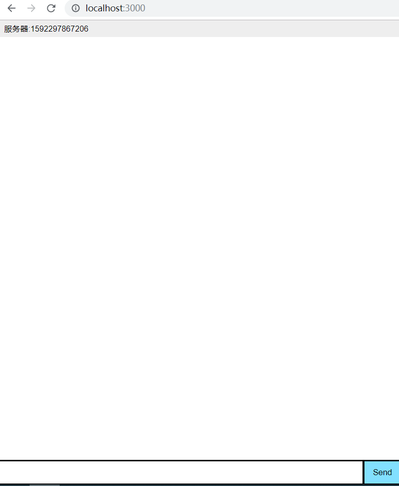

### 小结

- socket.io是一套解决方案：即有前端也有后端；对各种不同的语言都有支持。
- 在写前端代码时，只要引入它的客户端即可。


对于前端来说，我们关注的是**`客户端代码`**。

- 安装包  socket.io-client  
- 导入使用 `import io from 'socket.io-client'`
- 建立连接 `const socket = io('地址',{额外传参})`  等同于 原生websocket new WebSocket()
- 发消息：`socket.emit('自定义消息名', '内容');`
- 收消息：`socket.on('自定义消息名', function(msg){}`

## 个人中心-小智同学-实现小智同学

接口解读

- 固定地址，要加token
- 约定消息名为**message**


步骤：

- 安装包 `npm i socket.io-client`
  - 在本项目中，我们只要关注socket.io的前端即可，不需要安装socket.io（包含前后端全部的解决方案）
- 在创建组件时 
  - 创建websocket连接
  - 监听connect事件，连接成功，模拟小智打个招呼
  - 监听message事件，收到回复时，添加到聊天记录中
- 点击发送按钮后
  - 接接口要求，封装消息对象
  - 通过emit发出去
  - 清空说话内容


代码

```
// 提供websocket的功能
import io from 'socket.io-client'

created () {
    // 1. 创建webscoket连接
    // 格式：io(url, 参数)
    // http://47.114.163.79:3003
    // http://ttapi.research.itcast.cn
    this.socket = io('http://47.114.163.79:3003', {
      query: {
        token: this.$store.state.tokenInfo.token
      }
    })
    // 2. 连接成功，打个招呼
    this.socket.on('connect', () => {
      console.log('与webscoket服务器连接成功')
      // 填充到list中
      this.list.push({
        msg: '我是小智。你已经连上我了',
        timestamp: Date.now(),
        name: 'xz'
      })
    })
    // 3. 监听message。当有消息从服务器过来时，会执行这里的回调
    this.socket.on('message', obj => {
      console.log('收到服务器端的消息', obj)
      // 填充到list中
      this.list.push({
        msg: obj.msg,
        timestamp: obj.timestamp,
        name: 'xz'
      })
    })
  },
  // 用户点击了发送按钮
    send () {
      console.log(this.word)
      if (this.word === '') {
        return
      }
      if (this.socket) {
        // 1. 向websocket服务器发消息
        const info = {
          msg: this.word,
          timestamp: Date.now()
        }
        this.socket.emit('message', info)

        // 2. 把自已说的话，添加到list中去
        this.list.push({
          name: 'me',
          msg: this.word,
          timestamp: Date.now()
        })
        // 3. 清空留言区域
        this.word = ''
      }
    }
  },
  // 组件销毁时，关闭与服务器的连接
  destroyed () {
    // 组件销毁时，关闭与服务器的连接
    if (this.socket) {
      this.socket.close()
    }
  }
```


参考代码

```
// 引入socket.io-client这个包提供的websocket功能
import io from 'socket.io-client'

// 1. 建立与websocket接口的连接
// 2. 点击发送，向服务器发消息
//    emit('消息名',内容)
// 3. 接收服务器的消息
//    on('消息名',function(){
//
//    })
created () {
    // 1. 建立连接
    // this表示当前组件实例
    // 给当前组件添加一个属性，名为 socket。
    // 由于这个属性我们不需要响应式的效果，所以不需要写在data中成为一个数据项。
    // todo: 这里的接口目前有问题... 待后端修复
    const url = 'http://47.114.163.79:3003' // 我的个人服务器
    // const url = 'http://ttapi.research.itcast.cn'
    this.socket = io(url, {
      query: {
        token: this.$store.state.tokenInfo.token
      }
    })

    this.socket.on('connect', () => {
      console.log('与 websocket服务器建立连接成功')
    })

    this.socket.on('message', obj => {
      console.log('服务器端回来的数据', obj)
      // 1. 把消息添加到list中
      this.list.push({
        name: 'xz', msg: obj.msg, timestamp: Date.now()
      })
      // 2. 滚动条到达最底部
      this.moveToBottom()
    })
  }
 methods: {
    hSend () {
      if (this.word === '') {
        return
      }
      // 1. 向websocket服务器发消息
      // message是消息名，它是由后端服务器约定的。
      // info它的格式也是接口要求的。
      const info = {
        msg: this.word,
        timestamp: Date.now()
      }
      this.socket.emit('message', info)

      // 2. 把自已这句话，添加到list中去
      this.list.push({
        name: 'me',
        msg: this.word,
        timestamp: Date.now()
      })
      // 3. 滚动条到达最底部
      this.moveToBottom()
      // 4. 清空留言区域
      this.word = ''
    },
    moveToBottom () {
      // this.list.push()向列表中添加了数据，它会引起高度的增长，
      this.$refs.refList.scrollTop = this.$refs.refList.scrollHeight
    }
  }
  destroyed () {
    // 离开这个页面时，关闭和websocket服务器的连接
    this.socket.close()
  }
```


## 让滚动条到达底部

思路：

dom元素上的scrollTop 这个属性值可读也可写。

获取这个值时，它表示当前元素中滚动条距离元素顶部多少px

设置这个值时，就是移动滚动条让它距离元素顶部多少px

如果要想让滚动条滚动到底：

（1）给scrollTop设置一个超级大的值

（2）给scrollTop设置scrollHeight的值。document.querySelector('.chat-list').scrollTop = document.querySelector('.chat-list').scrollHeight


## bug：在对话时，内容区域滚动条不能自己到达底部

原因：vue异步更新

解决：

```
this.$nextTick(() => {
          document.querySelector('.chat-list').scrollTop = document.querySelector('.chat-list').scrollHeight
})
```


