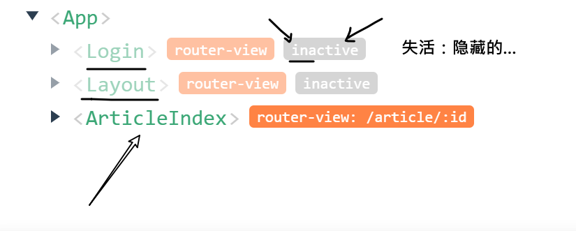
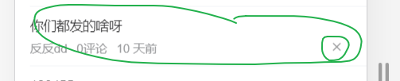
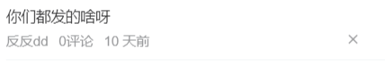

## 功能优化 解决从文章详情中返回时，主页要重新加载

### 现状

进入某个文章的详情页之后，再次退回到主页时，`layout/index.vue`这个组件会被再次重新加载一次。

### 原因

路由的跳转，会导致组件的销毁和重建。

### 优化思路

 通过keep-alive组件来进行对路由组件进行缓存。

什么是[keep-alive](https://cn.vuejs.org/v2/guide/components-dynamic-async.html#%E5%9C%A8%E5%8A%A8%E6%80%81%E7%BB%84%E4%BB%B6%E4%B8%8A%E4%BD%BF%E7%94%A8-keep-alive)? 它是一个容器，放在某中的组件并不会删除。


### 粗暴解决方案

```
<div id="app">
    <keep-alive>
      <router-view ></router-view>
    </keep-alive>
</div>
```

使用了keep-alive之后，路由在切换时，组件不会删除掉，只是隐藏！



> 如果缓存的组件过多，或者是把不必要的组件也缓存了，会造成内存占用过多。动态路由页面也会变成固定的内容-----文章详情页。
>
> 
>
> 策略：把那些重要,高频的（如主页），或者是不怎么变化的组件缓存下来。


### 按需缓存

思路：给要缓存的路由做个标记，然后在载入路由时，动态决定是否要缓存。更加精确控制要缓存的组件。

步骤：两步

- 在定义路由时，通过元信息来决定哪些要缓存

- 在app.vue的路由出口处，根据元信息来缓存路由组件

  

在定义路由时，额外添加路由[元信息](https://router.vuejs.org/zh/guide/advanced/meta.html)，来补充一些信息要素。

```
 { path: '', component: Home, meta: { isKeepAlive: true } },
```

元信息就是路由对象中的meta属性，它也是一个对象，它可以自定义一些属性，这些属性可以在使用路由时访问得到。

app.vue

```
<template>
  <div id="app">
    <!-- 路由出口
    keep-alive:是vue内置的组件。它的功能是 对 包在它里面的组件时行 缓存
    缓存：在切换路由时，不做删除。

    对于不同路由组件，可以有针对性进行缓存。
    -->

    <!-- 如果当前的路由对象上有 isKeepAlive 这个标识就缓存，否则就不缓存 -->
    <keep-alive>
      <router-view v-if="$route.meta.isKeepAlive"/>
    </keep-alive>

    <router-view v-if="!$route.meta.isKeepAlive"/>
  </div>
</template>
```


## 功能优化 文章列表的滚动条位置没有记忆

### 现状

从主页上的某个频道中改变一下滚动条的位置，然后点击进入文章详情，再次返回，发现滚动条的位置回到了起点。

### 原因

我们虽然对主页组件进行了缓存，但是这个缓存**并不能记录当前文章列表的滚动条的位置**。对组件缓存之后，只是缓存数据,虚拟dom，在切换路由，激活组件时，还是会重新生成dom，则滚动条就回到了起点。

### 解决思路

- 在每个articleList.vue组件上记录当前的滚动条位置
- 当它的状态变成激活时，去恢复滚动条位置。

### 步骤

在articleList.vue中，给根元素（类为scroll-wrapper）添加scroll事件监听

```
<template>
<!--
  为了达到从文章详情页回到列表时，能还原它的滚动条的位置：
  1. 在组件内监听scroll，实时记录这个位置
  2. 再次回到本组件（从文章详情页回来），去恢复滚动条的位置

  如果这个组件被缓存了，则它会多个两个特殊的钩子函数
   activated() {}    激活
   deactivated () {} 失活
-->
  <div class="scroll-wrapper" @scroll="hScroll" ref="refScroll">
  <van-pull-refresh v-model="isLoadingNew" @refresh="onRefresh">
  </van-pull-refresh>
</div>
```

hScroll的函数是：

```javascript
hScroll () {
      // 监听用户滚动条
      // 保存一下
      // TODO: 防抖处理
      console.log(this.$refs.refScroll.scrollTop)
      // 对象普通的属性， 不是响应式的数据
      this.scrollTop = this.$refs.refScroll.scrollTop
    }
```

它的作用是当用户在文章列表中滚动时，会记下滚动条的位置**scrollTop**。 


当articleList.vue激活时恢复

```
activated () {
    console.log('激活 activated...activated...activated...activated...')
    if (this.scrollTop) {
      // 恢复滚动条位置
      this.$refs.refScroll.scrollTop = this.scrollTop
    }
  },
```


> 如果对于组件(包含其下的子组件)采用了缓存 `<keep-alive>`，则它会多出两个生命周期钩子函数：[activated, deactivated](https://cn.vuejs.org/v2/api/#activated)。


## 其它优化细节

在文章列表组件中，有两处可以优化一下：



1. 去掉van-grid的边框线 :border="false"
2. 给关闭按钮添加阻止冒泡的功能。 @click.stop="hClose(item)"

 ```
<van-grid :column-num="item.cover.images.length" :border="false">
              <van-grid-item v-for="(img,idx) in item.cover.images" :key="idx">
                <van-image lazy-load :src="img" />
              </van-grid-item>
            </van-grid>

            <!-- 文字说明 -->
            <div class="meta">
              <span>{{item.aut_name}}</span>
              <span>{{item.comm_count}}评论</span>
              <span>{{item.pubdate | relativeTime}}</span>
              <!-- 只有是登陆用户，才能看见这个 X 按钮 -->
              <span class="close" @click.stop="hClose(item)" v-if="$store.state.tokenInfo.token">
                <van-icon name="cross"></van-icon>
              </span>
            </div>
 ```




