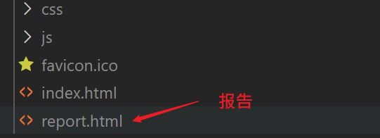
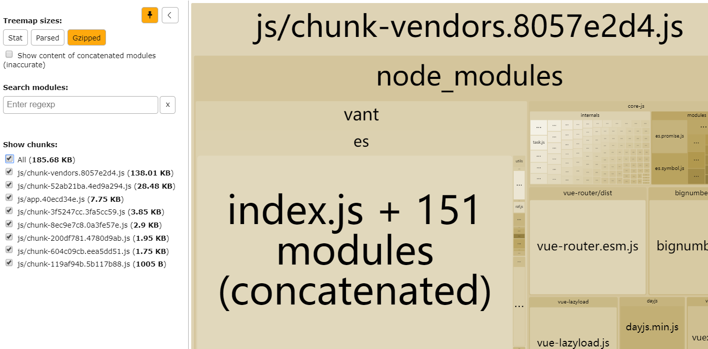
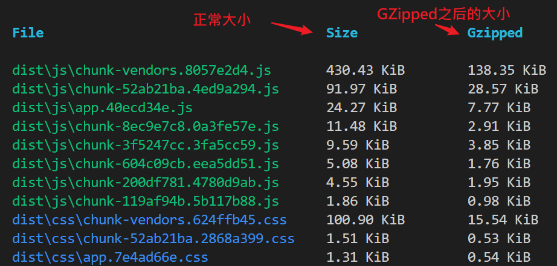
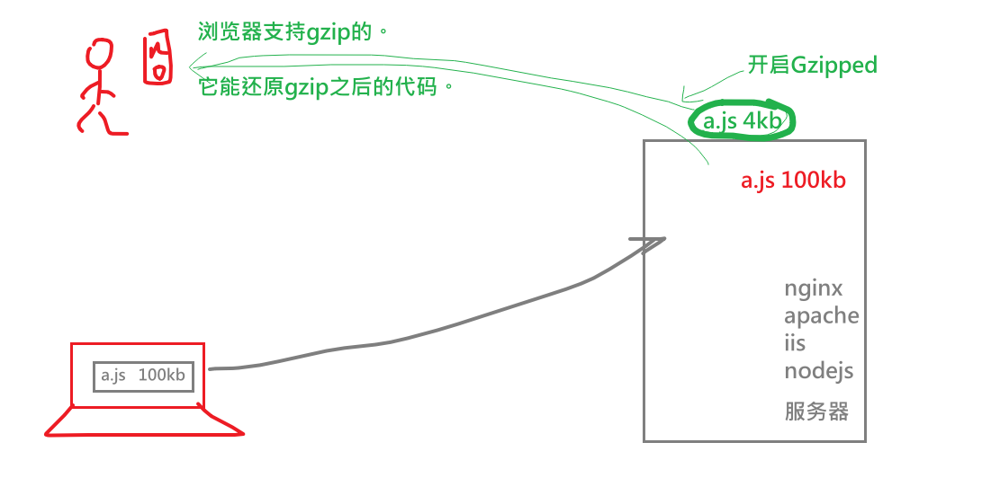
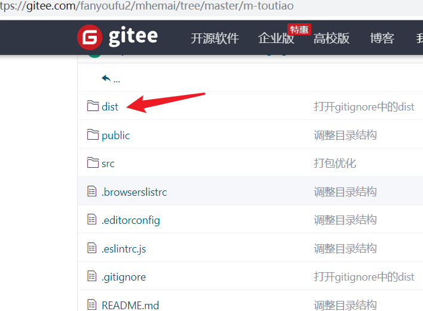
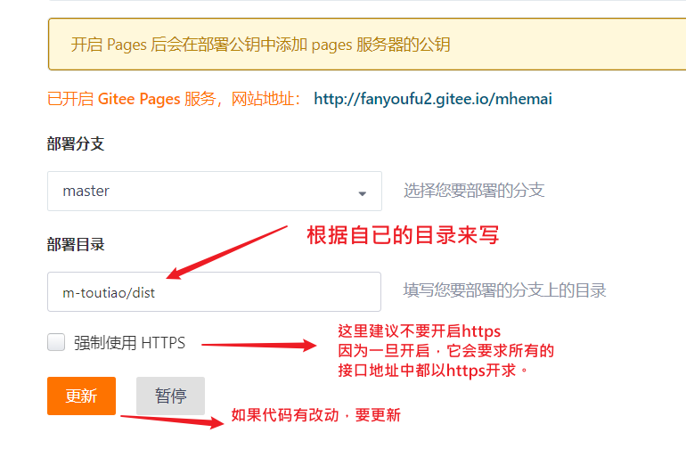
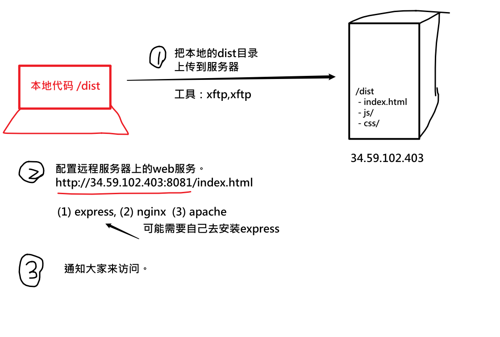

## 打包发布

### 理解打包

作用：用webpack把.vue,.less.js ----> 浏览器可直接执行的代码。

命令:  `npm run build`

结果：内部集成了webpack,会在根目录下创建 /dist，在这个目录下创建打包完成的结果。

>chunk:块  vendors代理商
>
>app-hash值.js 
>
>chunk-vendors：第三方包的代码统一放在这里（dayjs,vue,vuex,vue-router,vant）
>
>chunk-hash值.js 某个模块对应的js ,某个.vue文件编译之后的.js。
>
>chunk-hash.js.map ：它会记录当前的.js文件中包含了哪个模块，对应代码位置,有利于代码出错快速找到源代码的位置。


### 打包[结果分析](https://cli.vuejs.org/zh/guide/cli-service.html#vue-cli-service-build)

vuecli中提供一个打包分析的工具：`vue-cli-service build --report`

操作：在package.json 中的build项中，添加 `--report`

```
"scripts": {
    "serve": "vue-cli-service serve",
    "build": "vue-cli-service build --report",
    "lint": "vue-cli-service lint"
  },
```

运行：

```
npm run build
```

它会在dist目录下产生一个report.html文件，其中就有对打包结果的分析说明。



效果



### 查看导出默认配置

vuecli打包工具仍是webpack，只不过vuecli把webpack的配置封装起来了，我们不能直接看到，可通过如下命令来查看：

```bash
#导出当前生产模式下的webpack配置文件到config.json
vue inspect --mode=production > config.json 
```

## Gzip压缩




网站加载的速度很大程度取决于网站资源的大小，减少要传输的文件大小可以让加载更快。

HTTP协议上的GZIP编码是一种用来改进web应用程序性能的技术。它在服务器端器安装并使用，对纯文本文件的压缩可达原大小的40%。

如何开启？

不同的服务器软件配置不一样，大多数服务器都是默认开启的。

- Nginx
- Tomcat
- Apache
- IIS
- ....

如何判断是否开启了Gzip? 

```
Content-Encoding: gzip
```



## 修改打包配置

由于vuecli4集成了webpack的配置，所以可以直接在根目录下新建vue.config.js文件，其中输入内容如下：

```
module.exports = {
  // configureWebpack 配置是vuecli中提供的一个配置项
  // 用来对webpack打包做更加精细的控制
  // 后面的函数中，config就是当前打包时采用的webpack配置
  // 我们可以在这个函数中，对config进行修改
  configureWebpack: (config) => {
    console.log(config)
    config.mode = 'development'
  },
  // https://cli.vuejs.org/zh/config/#publicpath
  // 设置打包后访问资源方式，以是相对路径来访问
  // dist目录下的index.html就可以直接双击打开
  publicPath: './'
}

```

在vue.config.js 中去修改webpack的配置。

## 优化打包

优化打包的目标：让打包出来的文件尽可能的小一点。

### vant组件中的按需导入

> 如果我们开发时，只用到van中一部分组件，则我们在打包时，是否需要把整个van全部打包进来？
>
> 答，并不需要全部导入，只需要按需导入!

共三步：

1. 安装依赖包

```
npm i babel-plugin-import -D
```

2. 在项目根目录创建:babel.config.js

```
module.exports = {
  plugins: [
    ['import', {
      libraryName: 'vant',
      libraryDirectory: 'es',
      style: true
    }, 'vant']
  ],
  presets: [
    '@vue/cli-plugin-babel/preset'
  ]
}

```

3. 在main.js中，只引入需要的部分。

```
import {
  Button,
  Tabbar,
  TabbarItem,
  Form,
  Field,
  NavBar,
  Toast,
  Tabs,
  Tab,
  List,
  Lazyload,
  CellGroup,
  Cell,
  Icon,
  Grid,
  GridItem,
  Popup,
  Row,
  Col,
  Tag,
  Image,
  Divider,
  PullRefresh,
  ActionSheet,
  Loading,
  Search，
  Dialog
} from 'vant'
// Vue.use(Lazyload)

// Vue.use(Vant)
Vue.use(Button)
Vue.use(Tabbar)
Vue.use(TabbarItem)
Vue.use(Form)
Vue.use(Field)
Vue.use(NavBar)
Vue.use(Toast)
Vue.use(Tabs)
Vue.use(Tab)
Vue.use(List)
Vue.use(Lazyload)
Vue.use(CellGroup)
Vue.use(Cell)
Vue.use(Icon)
Vue.use(Grid)
Vue.use(GridItem)
Vue.use(Popup)
Vue.use(Row)
Vue.use(Col)
Vue.use(Tag)
Vue.use(Image)
Vue.use(PullRefresh)
Vue.use(ActionSheet)
Vue.use(Divider)
Vue.use(Loading)
Vue.use(Search)
Vue.use(Dialog)
```

再次去打包，对比观察本次打包之后chunk-vendors.js文件是否变小了。

如果代码报错，说某个组件没有注册，则在上面添加就可以了。

### 去掉打包后的console.log

目标：

​      在开发时可以随意写console.log，只要打包时，自动去掉它们。

步骤，共两步

1. 安装依赖

```
npm install terser-webpack-plugin --save-dev
```

2. 修改配置文件

```
module.exports = {
 
configureWebpack: (config) => {
    // console.log(config)
    // config.mode = 'development'
    // 如果当前是生产模式
    if (process.env.NODE_ENV === 'production') {
      // 在webpack的配置对象 config的 optimization属性的minimizer数组的第一个元素的options中设置....
      // 在打包之后的js中去掉console.log
     config.optimization.minimizer[0].options.terserOptions.compress.drop_console = true
    }
  },
  publicPath: './'
}
```

再次打包，检查打后之后的.js文件中，是否还有console的输出。


## 上线-gitee为例

1. 把dist目录中的内容推到仓库中；
2. 在gitee中开启pages服务

### dist目录中的内容推到仓库

1. 修改 .gitignore

   把/dist从忽略文件中删除。默认情况下，git会忽略dist目录，所以它不会被上传。

2. 正常提交代码

   git add。 把代码提交到库中。

   git commit -a -m  "你的打包信息" --no-verify

   由于dist目录下的js代码的格式不符合eslint的要求，所以在commit时，就会出现提交不去的情况。
   
   解决方案是：本次提交不要验证eslint。

   ```
   git commit -a -m "XXXX" --no-verify
   ```
   
3. git push

### 在gitee中开启pages服务

请到你的仓库中确认dist已经上传了。






**上面的部署目录中，如果你没有m-toutiao这一级，就不要写！**


如果你代码有改动：

在本地：

1. npm run build
2. git add .  
3. git commit -a -m "XXXX" --no-verify  
4. git push

去到pages服务下：

点 更新。


## 有自己的服务器




