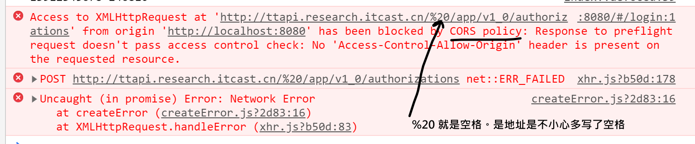
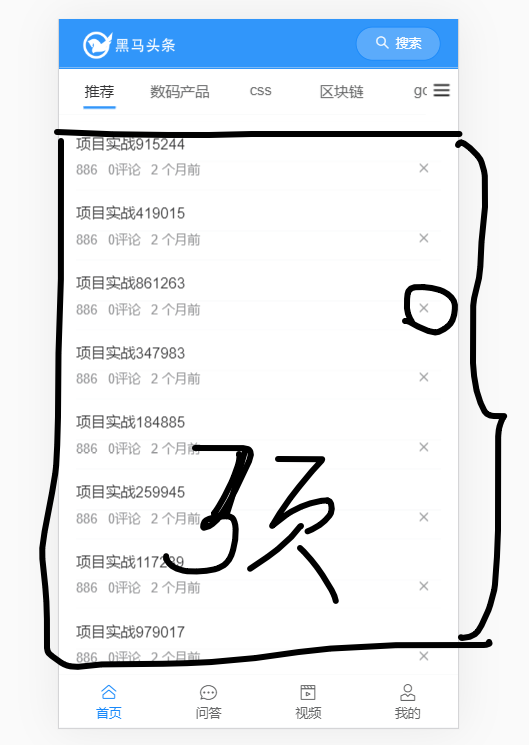

## 每日反馈中的专业问题

mapState作用： 提供另一种在组件中获取state中的数据的方式: 补充一个计算属性。

做法是： 

```
import  {mapState} from 'vuex'
computed:{
  ...mapState(['m1', 'm2'])
}
```


## eslint 波浪线不出来

解决：

- 重新安装vsocde

- 一次打开一个项目

## 常见问题

### ajax请求出错

#### 找到原因：查看后端返回的信息


#### 是否是地址写错了，404


#### 地址中写了空格，报跨域




文章列表中图片不能正常显示。


与前端无关。是因为后端回传的数据中图片地址本身就有问题。例如：有人发布文章时，引用第三方网站中的图；或者是他后面又删除了图片.....

1. 访问频道列表接口时报401错误。

   原因：token失效了（token的有效期只有2个小时）。

   解决方案：

   (1) 重新登陆一次，这样会保存新的token（暂时的解决方案）， 后面会专门去讲如何去处理token过期。

   (2)删除本地过期的token，以匿名的方式来访问接口。

2. 每个人登陆（或者是不登陆）后看到的文章列表不相同？

   我们每个人上淘宝时，看到的页面是否是一样的？不一样！ **千人千面，精准推送！**

   虽然我们写的前端的代码是一样的，但由于后端接口返回的数据不同，导致页面的内容显示不相同。

3. 文章列表中上拉加载更多时所传的时间戳那个参数有什么用处？

   帮助后端给们返回连续“分页”的数据。

   

4. 为什么我写的css不生效？

   写css与vue没有关系。只需要按css选择器的格式去写样式就行了。

   

5. 几种错误的写代码方式

   - 一次性写很多代码（抄很多代码；双屏对着抄，不抄注释）
     - 导致没有思路（因为思路在注释中，而你把注释删除了）
     - 出错了不好找。你写了100行代码了，其实第2行你就错了，错误就很难找.......

6. 推荐的方式

   - 先写中文注释，这样才有思路
   - 一步一步写代码，一边写一边查看效果.....

   


8. 数组方法的使用

   - forEach(item => { })
   - filter 过滤

   - map映射
   - find/findIndex
   - push,shift,unshift,pop,reverse, concat，join......

9. 更新视图的方式

   以添加某一项数据为例。

   1. 发ajax调用接口，添加数据。

   2. 更新视图

      方法一： 再一次请求接口，获取最新的数据，根据最新的数据再去更新视图

      方法二：不请求接口了，直接修改本地数据/视图


有些特殊的时候，通过方法一的方式去更新视图是非常困难的。例如，如下的带分页的删除功能。

